# Repeating Earthquake Activity at STAR
  
  

## Waveforms
[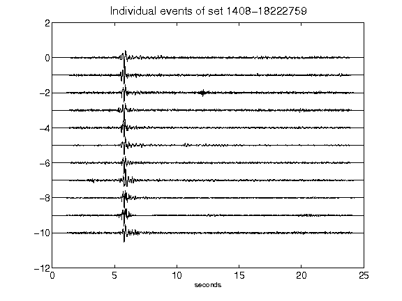](figures/1408-18222759_AllEv.png)[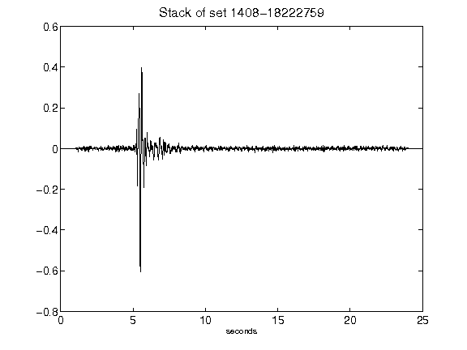](figures/1408-18222759_Stack.png)[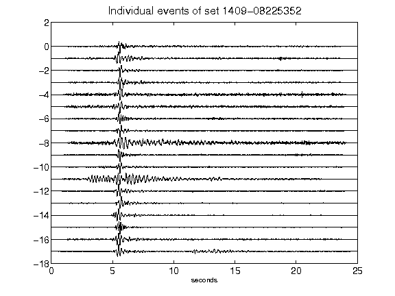](figures/1409-08225352_AllEv.png)[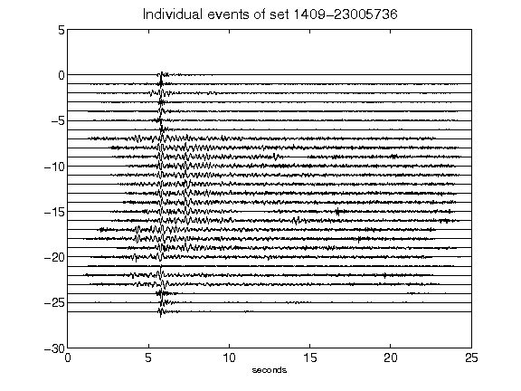](figures/1409-23005736_AllEv.png)[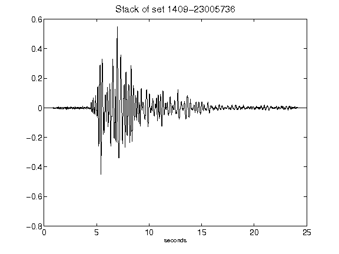](figures/1409-23005736_Stack.png)[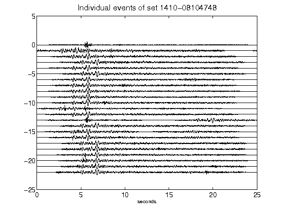](figures/1410-08104748_AllEv.png)[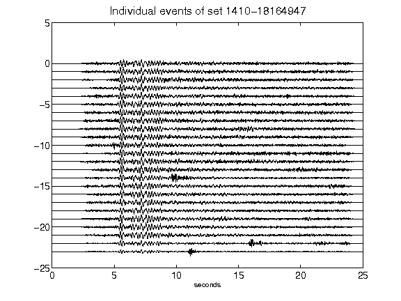](figures/1410-18164947_AllEv.png)[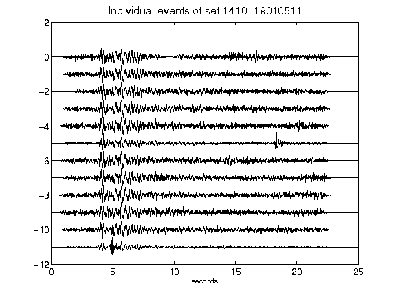](figures/1410-19010511_AllEv.png)[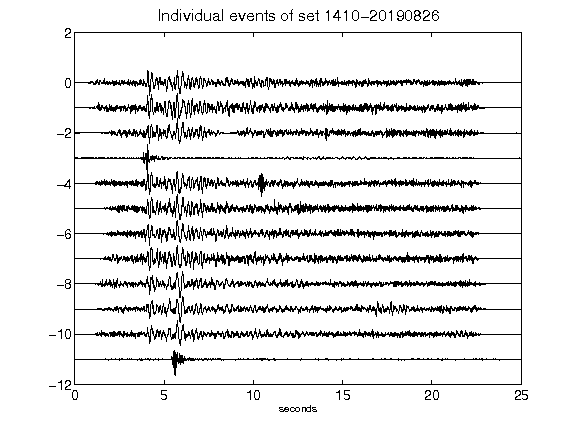](figures/1410-20190826_AllEv.png)[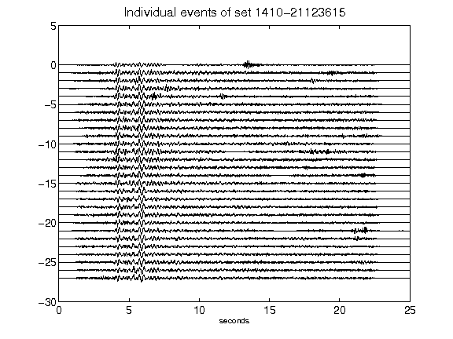](figures/1410-21123615_AllEv.png)[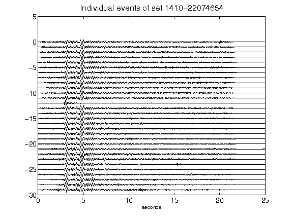](figures/1410-22074654_AllEv.png)[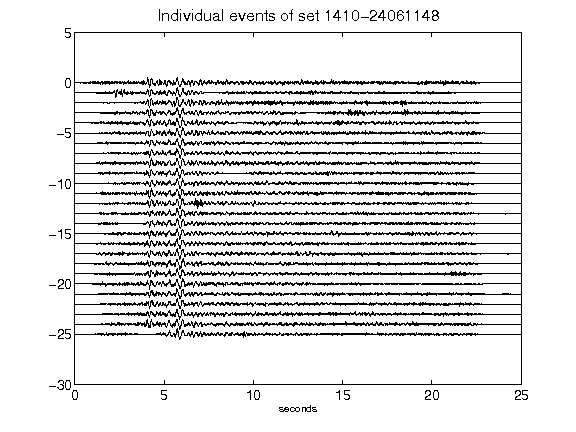](figures/1410-24061148_AllEv.png)