# Repeating Earthquake Activity at STAR

## Waveforms
[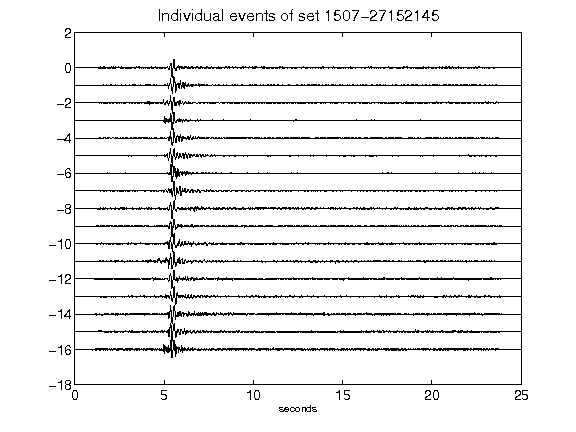](figures/1507-27152145_AllEv.png)[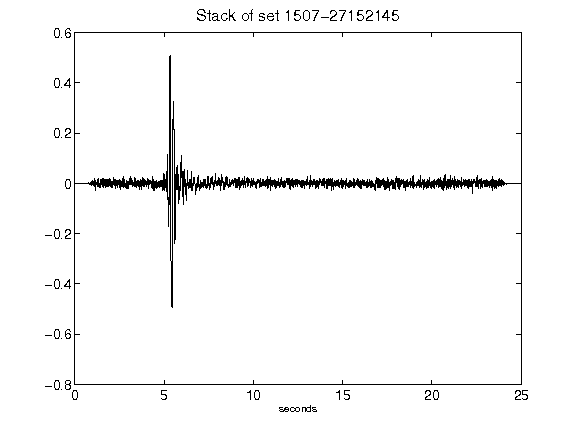](figures/1507-27152145_Stack.png)[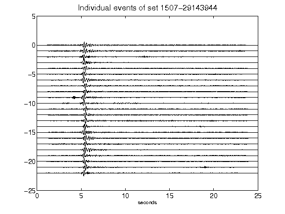](figures/1507-29143944_AllEv.png)[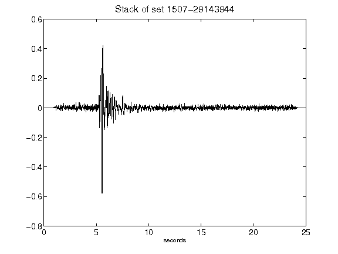](figures/1507-29143944_Stack.png)[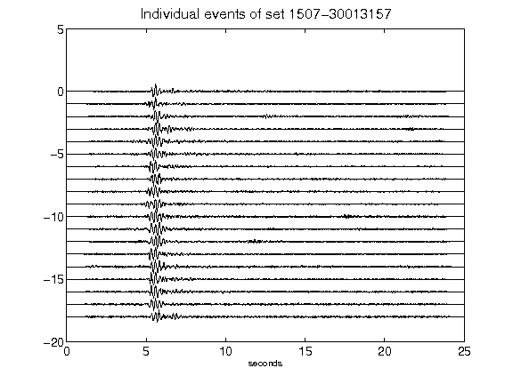](figures/1507-30013157_AllEv.png)[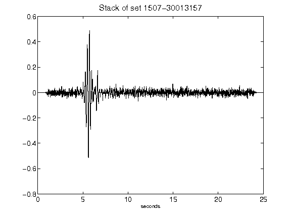](figures/1507-30013157_Stack.png)[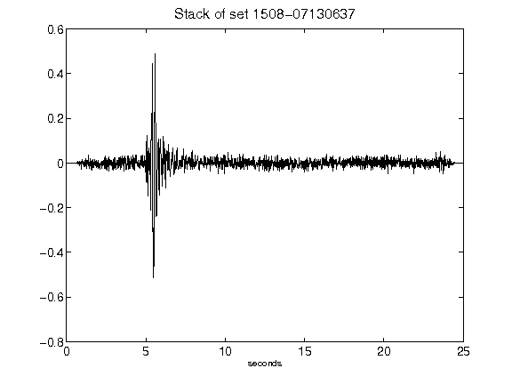](figures/1508-07130637_Stack.png)[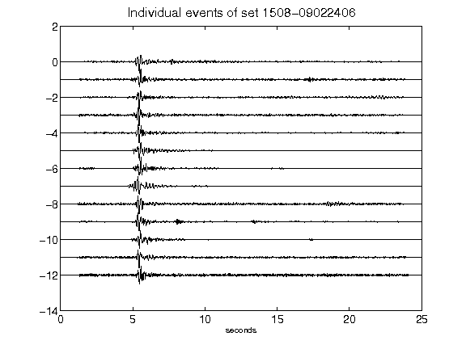](figures/1508-09022406_AllEv.png)[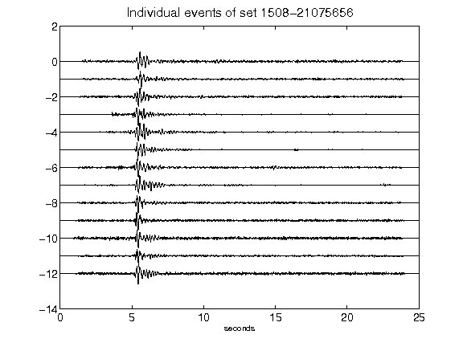](figures/1508-21075656_AllEv.png)[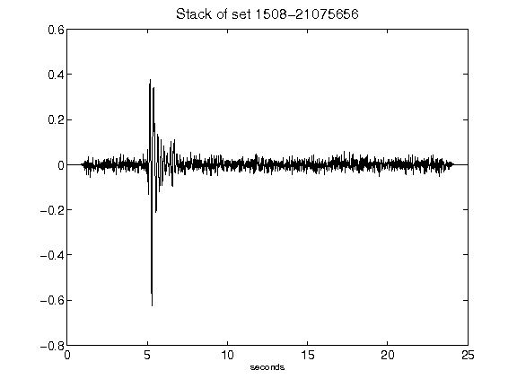](figures/1508-21075656_Stack.png)[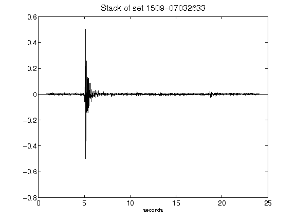](figures/1509-07032633_Stack.png)[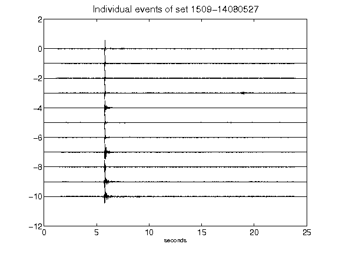](figures/1509-14080527_AllEv.png)[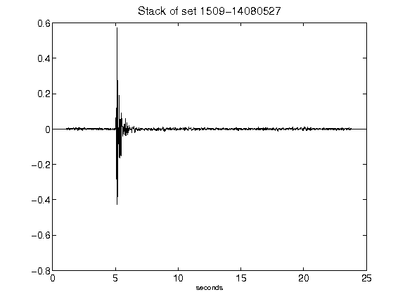](figures/1509-14080527_Stack.png)[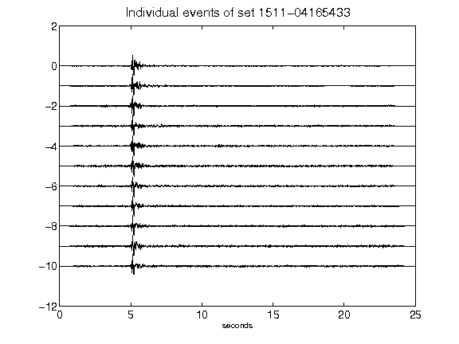](figures/1511-04165433_AllEv.png)