# Repeating Earthquake Activity at STAR

## Waveforms
[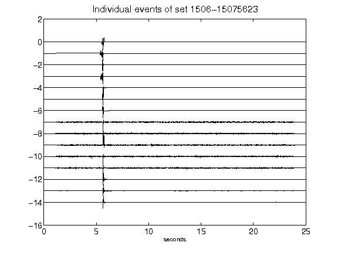](figures/1506-15075623_AllEv.png)[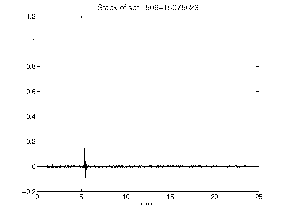](figures/1506-15075623_Stack.png)[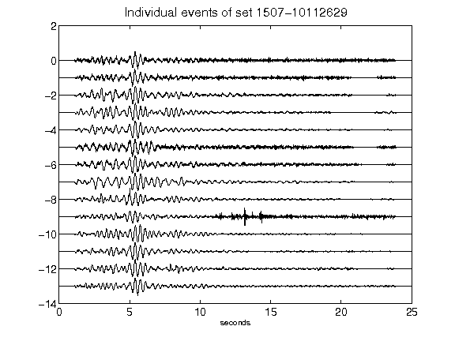](figures/1507-10112629_AllEv.png)[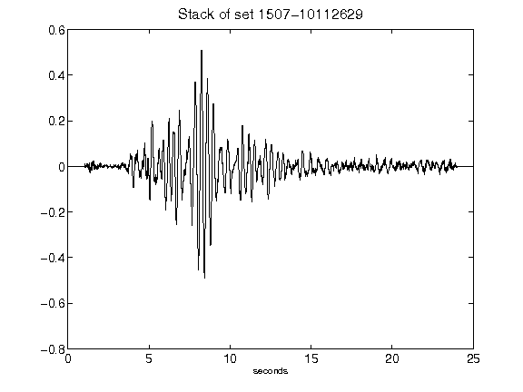](figures/1507-10112629_Stack.png)[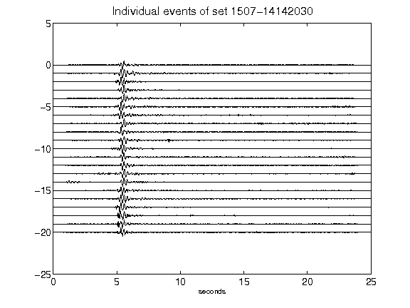](figures/1507-14142030_AllEv.png)[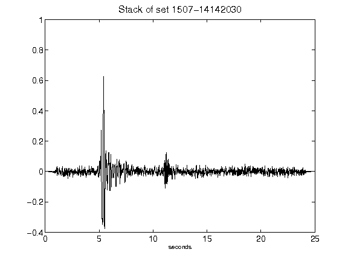](figures/1507-14142030_Stack.png)[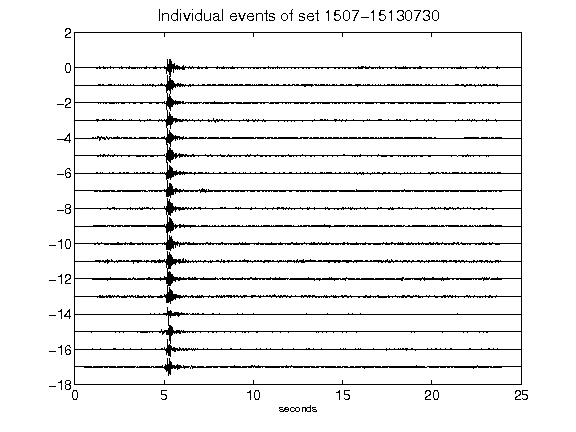](figures/1507-15130730_AllEv.png)[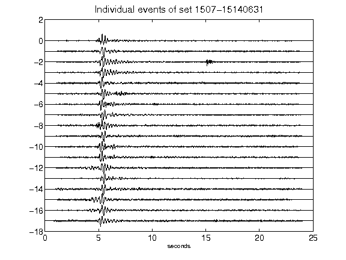](figures/1507-15140631_AllEv.png)[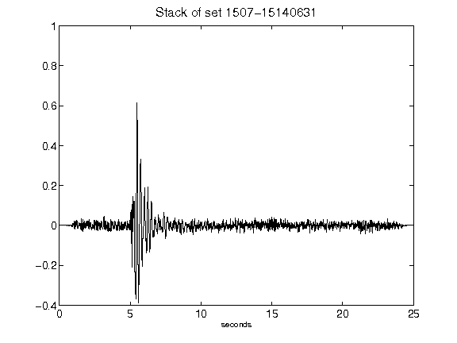](figures/1507-15140631_Stack.png)[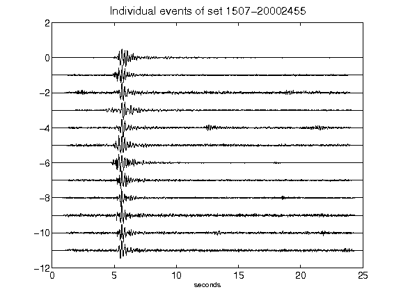](figures/1507-20002455_AllEv.png)[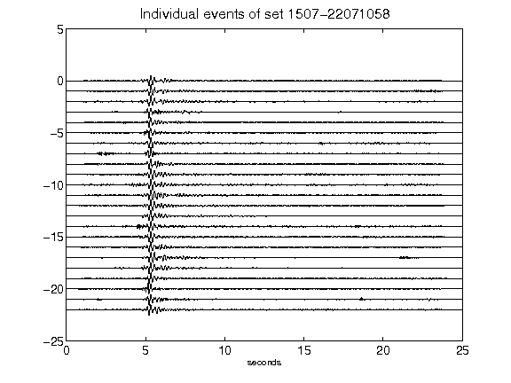](figures/1507-22071058_AllEv.png)[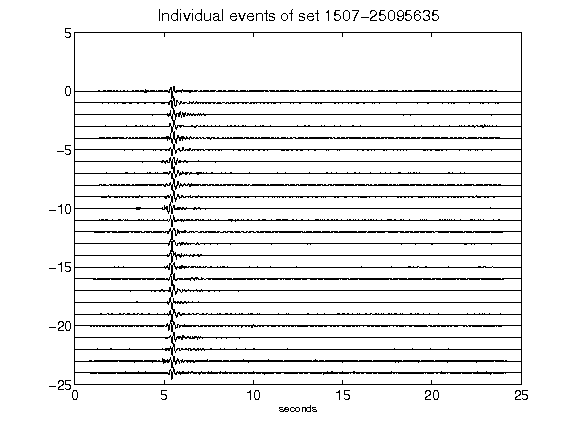](figures/1507-25095635_AllEv.png)