# Repeating Earthquake Activity at STAR

## Waveforms
[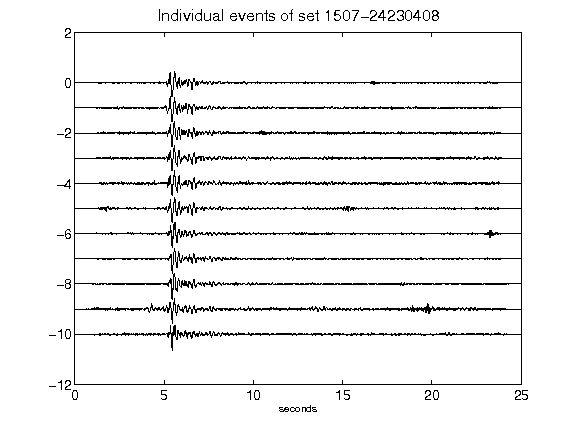](figures/1507-24230408_AllEv.png)[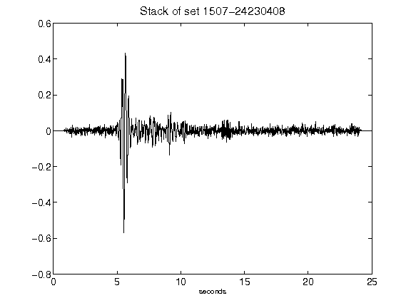](figures/1507-24230408_Stack.png)[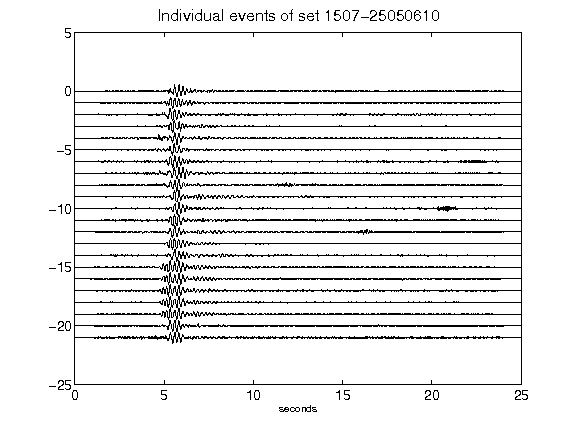](figures/1507-25050610_AllEv.png)[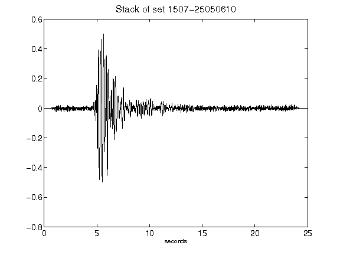](figures/1507-25050610_Stack.png)[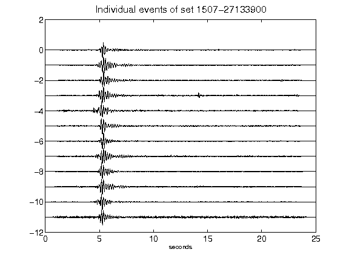](figures/1507-27133900_AllEv.png)[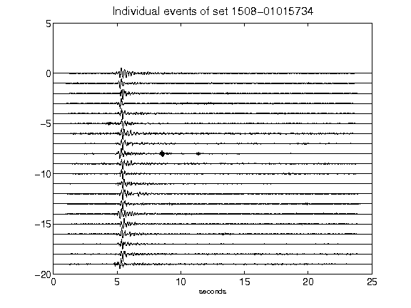](figures/1508-01015734_AllEv.png)[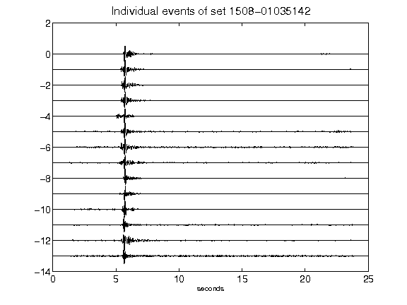](figures/1508-01035142_AllEv.png)[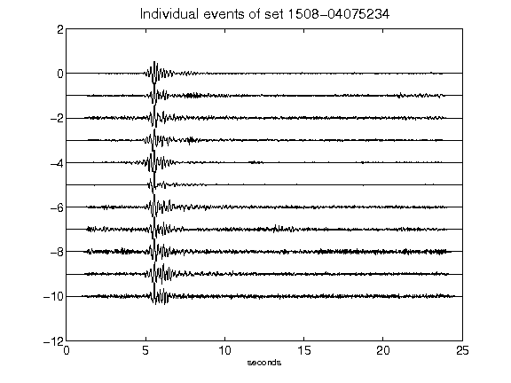](figures/1508-04075234_AllEv.png)[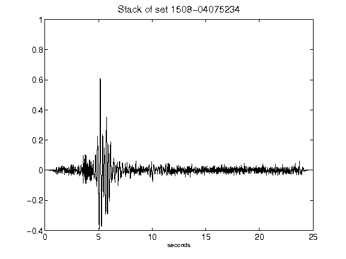](figures/1508-04075234_Stack.png)[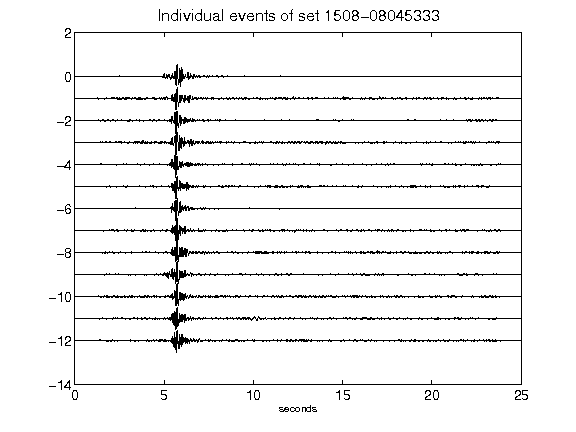](figures/1508-08045333_AllEv.png)[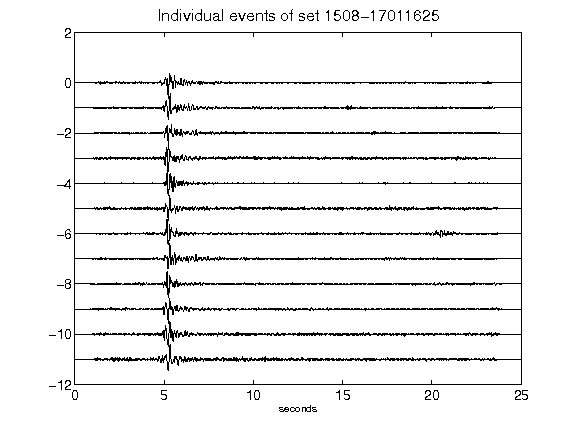](figures/1508-17011625_AllEv.png)[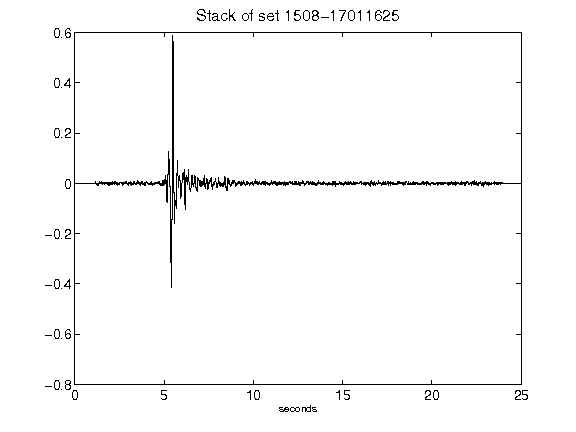](figures/1508-17011625_Stack.png)[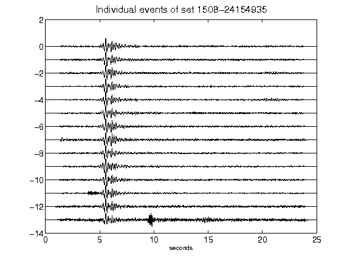](figures/1508-24154935_AllEv.png)[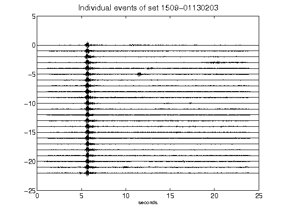](figures/1509-01130203_AllEv.png)[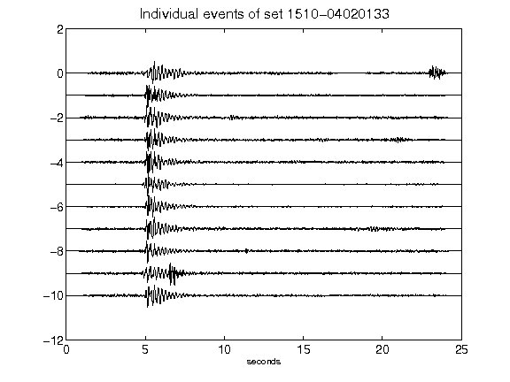](figures/1510-04020133_AllEv.png)