# Repeating Earthquake Activity at STAR

## Waveforms
[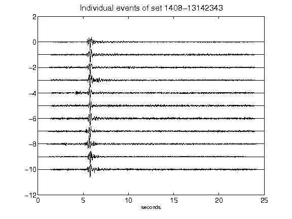](figures/1408-13142343_AllEv.png)[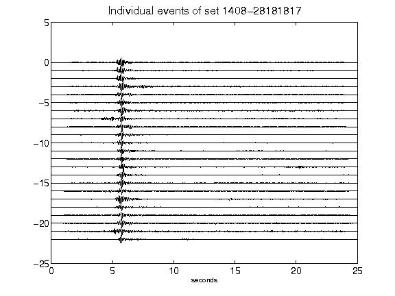](figures/1408-28181817_AllEv.png)[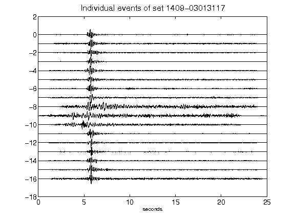](figures/1409-03013117_AllEv.png)[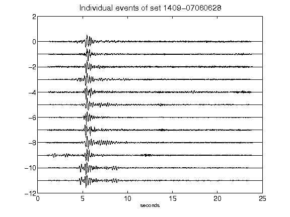](figures/1409-07060628_AllEv.png)[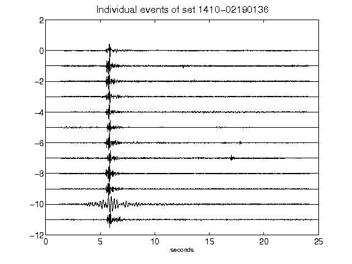](figures/1410-02190136_AllEv.png)[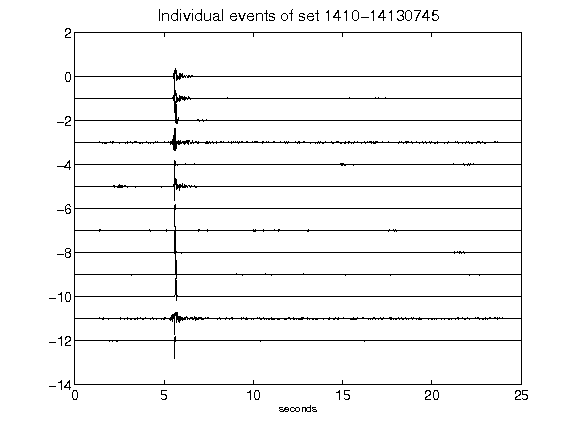](figures/1410-14130745_AllEv.png)[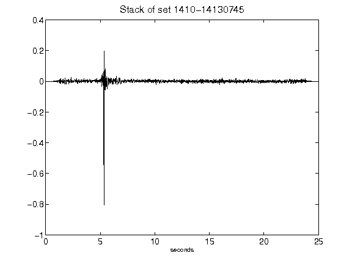](figures/1410-14130745_Stack.png)[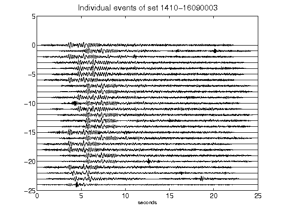](figures/1410-16090003_AllEv.png)[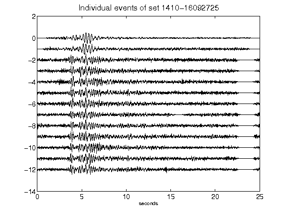](figures/1410-16092725_AllEv.png)[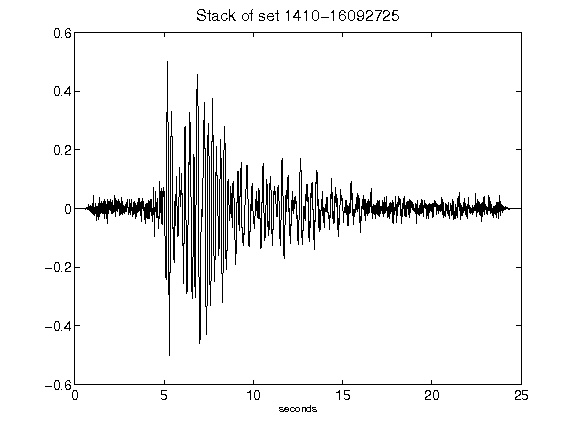](figures/1410-16092725_Stack.png)[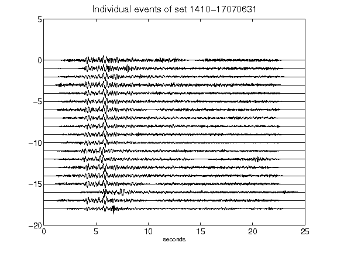](figures/1410-17070631_AllEv.png)[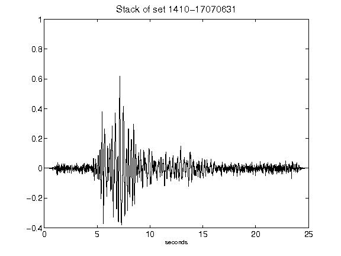](figures/1410-17070631_Stack.png)[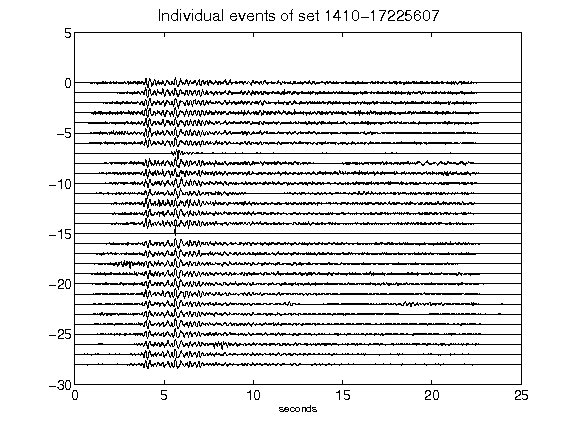](figures/1410-17225607_AllEv.png)[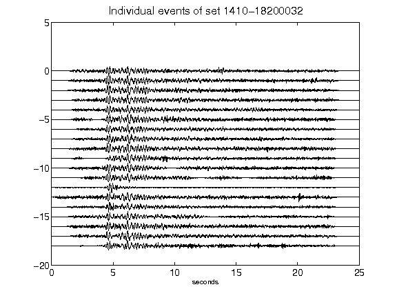](figures/1410-18200032_AllEv.png)[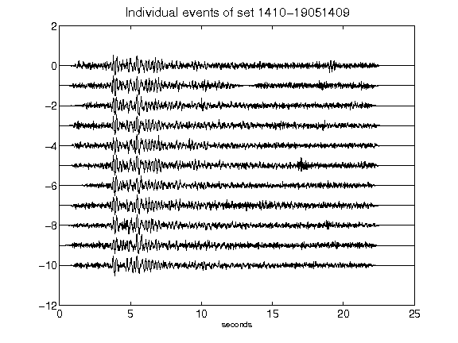](figures/1410-19051409_AllEv.png)[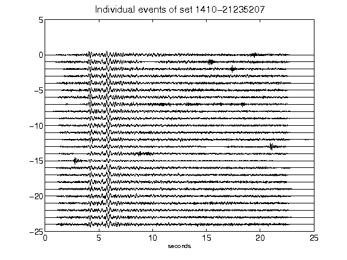](figures/1410-21235207_AllEv.png)[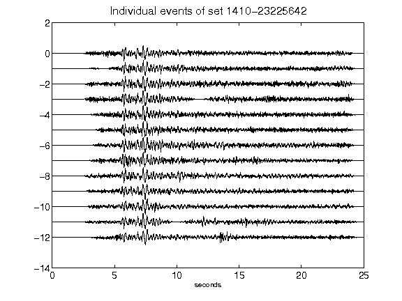](figures/1410-23225642_AllEv.png)[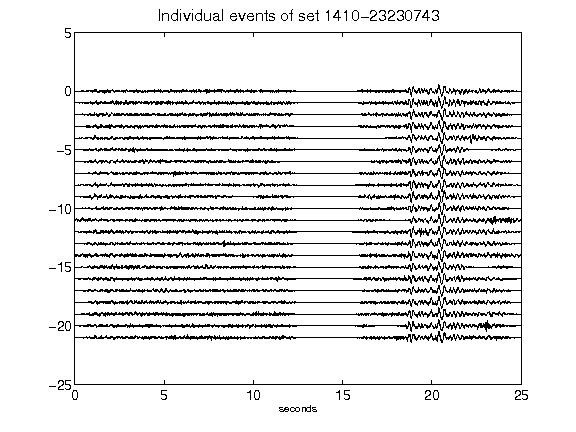](figures/1410-23230743_AllEv.png)[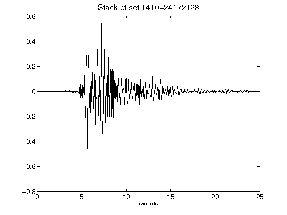](figures/1410-24172128_Stack.png)[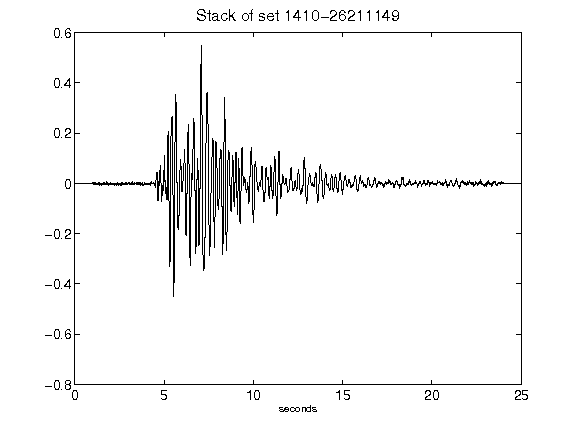](figures/1410-26211149_Stack.png)