# Repeating Earthquake Activity at STAR

## Waveforms
[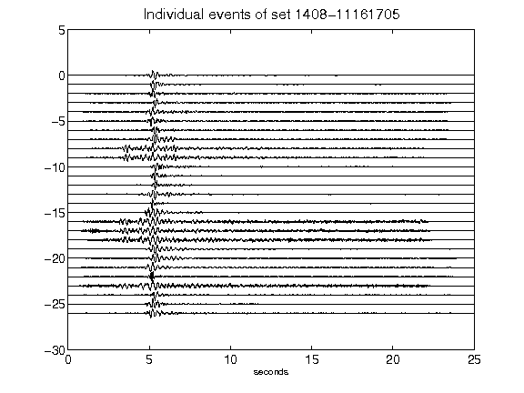](figures/1408-11161705_AllEv.png)[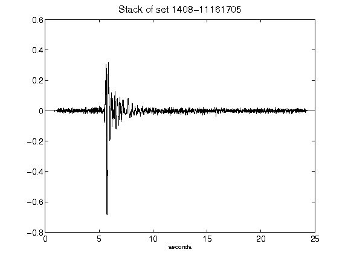](figures/1408-11161705_Stack.png)[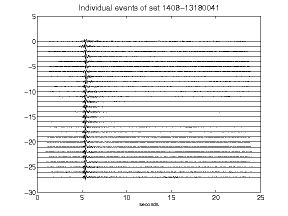](figures/1408-13180041_AllEv.png)[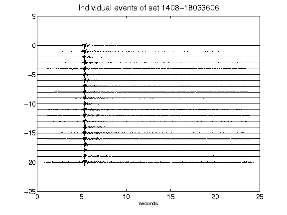](figures/1408-18033606_AllEv.png)[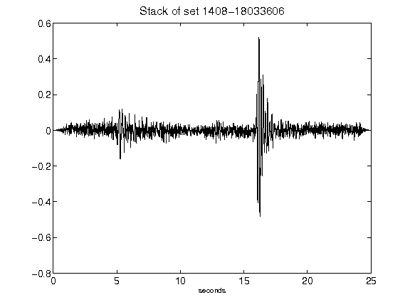](figures/1408-18033606_Stack.png)[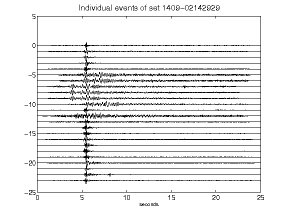](figures/1409-02142929_AllEv.png)[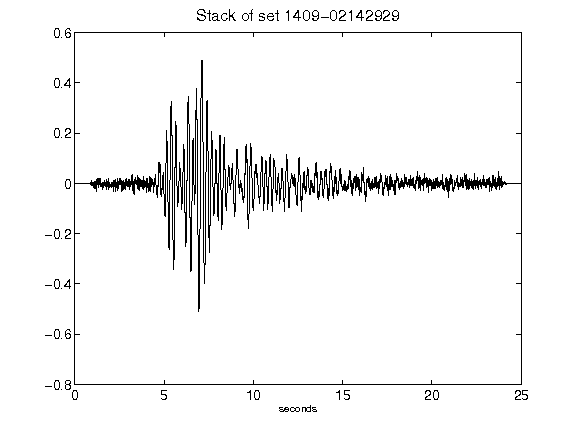](figures/1409-02142929_Stack.png)[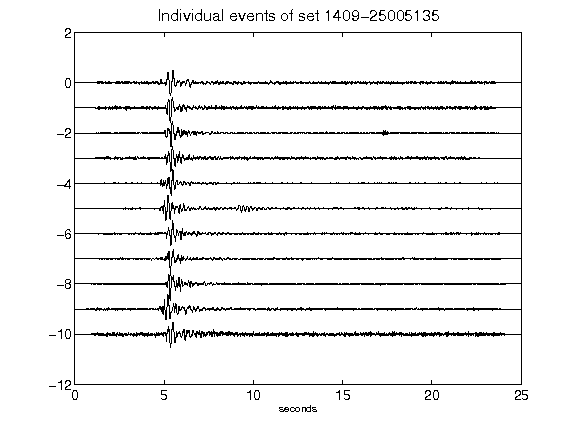](figures/1409-25005135_AllEv.png)[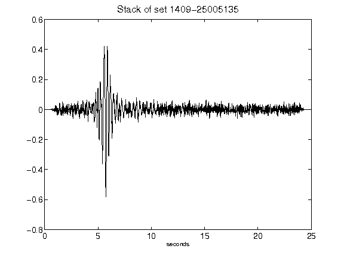](figures/1409-25005135_Stack.png)[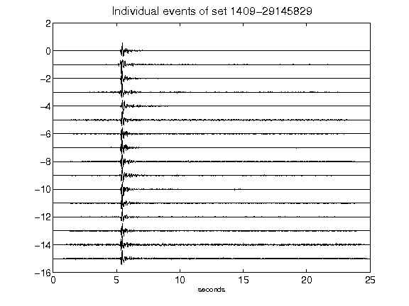](figures/1409-29145829_AllEv.png)[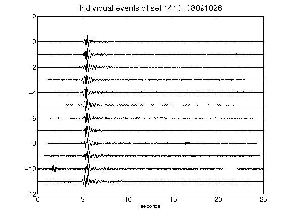](figures/1410-08091026_AllEv.png)[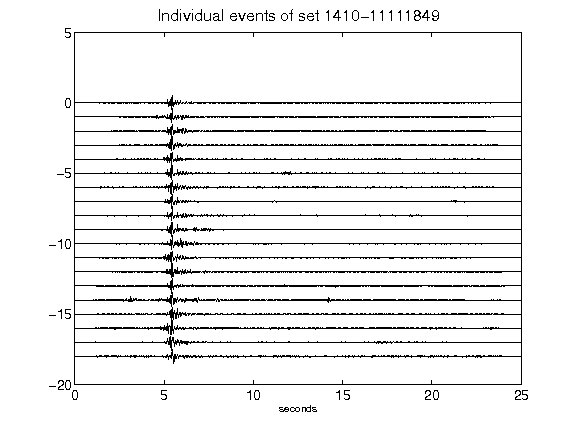](figures/1410-11111849_AllEv.png)[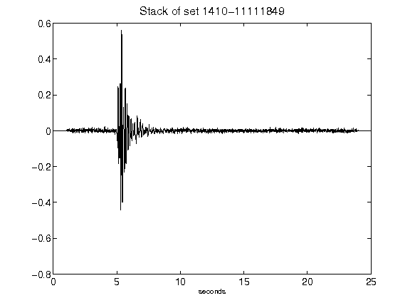](figures/1410-11111849_Stack.png)[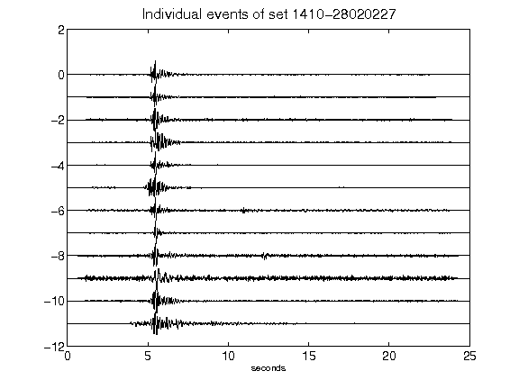](figures/1410-28020227_AllEv.png)[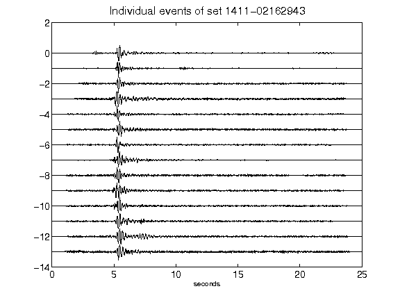](figures/1411-02162943_AllEv.png)[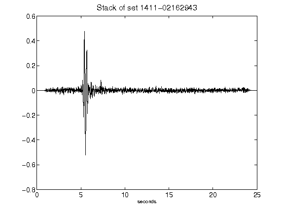](figures/1411-02162943_Stack.png)[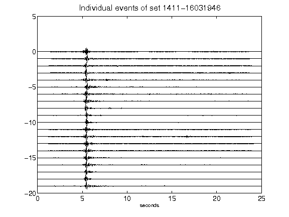](figures/1411-16031946_AllEv.png)[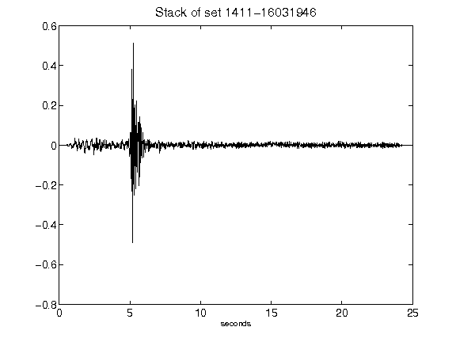](figures/1411-16031946_Stack.png)[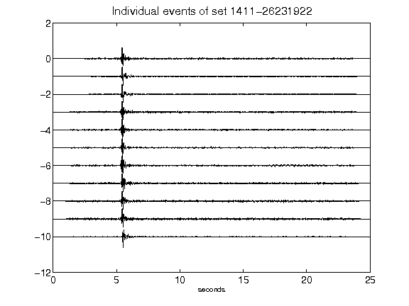](figures/1411-26231922_AllEv.png)[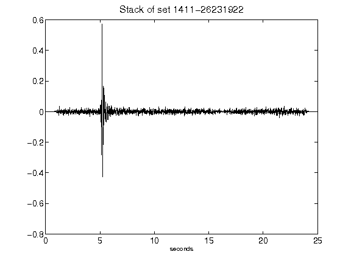](figures/1411-26231922_Stack.png)[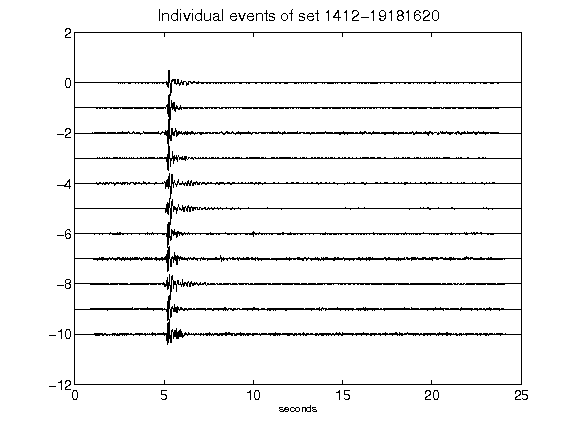](figures/1412-19181620_AllEv.png)[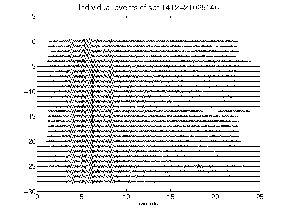](figures/1412-21025146_AllEv.png)[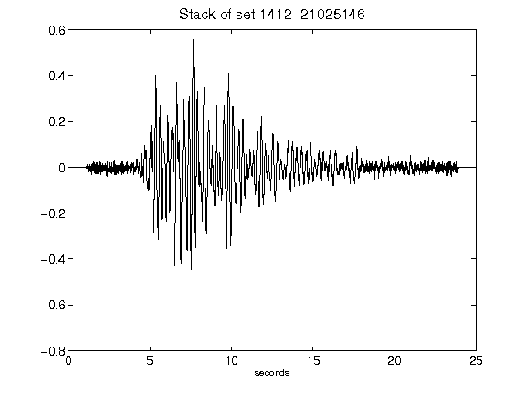](figures/1412-21025146_Stack.png)[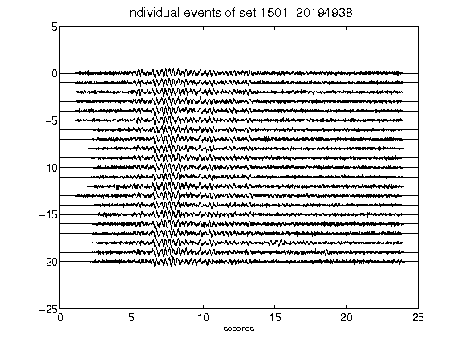](figures/1501-20194938_AllEv.png)[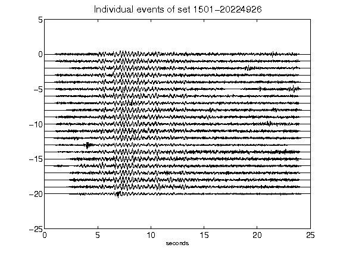](figures/1501-20224926_AllEv.png)[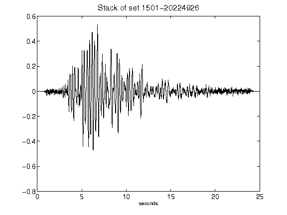](figures/1501-20224926_Stack.png)[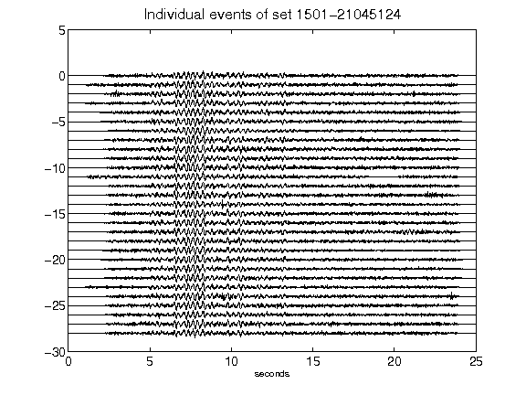](figures/1501-21045124_AllEv.png)[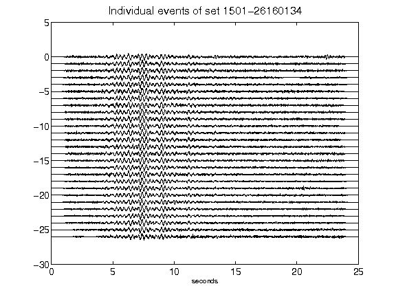](figures/1501-26160134_AllEv.png)[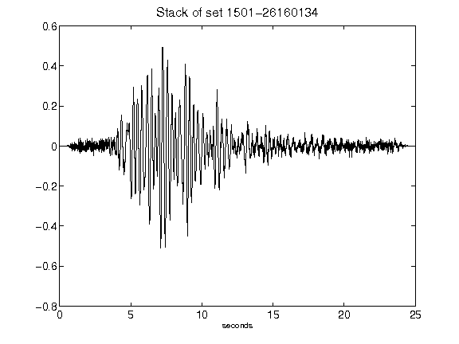](figures/1501-26160134_Stack.png)