# Repeating Earthquake Activity at STAR

## Waveforms
[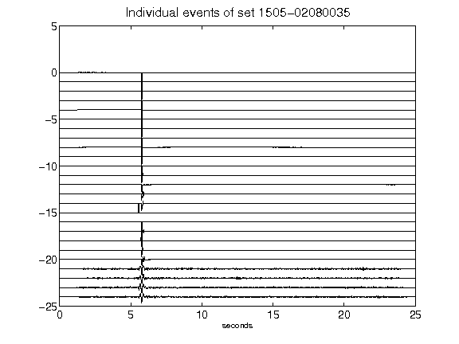](figures/1505-02080035_AllEv.png)[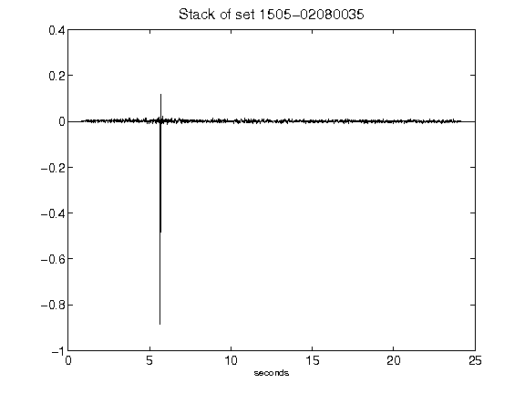](figures/1505-02080035_Stack.png)[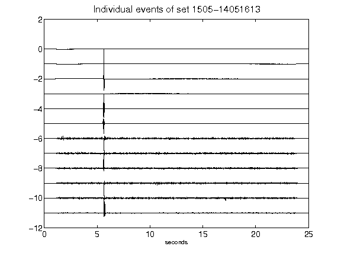](figures/1505-14051613_AllEv.png)[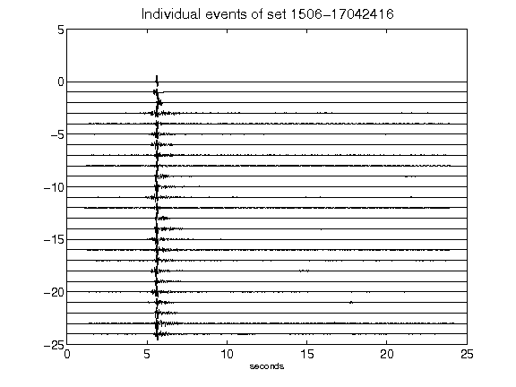](figures/1506-17042416_AllEv.png)[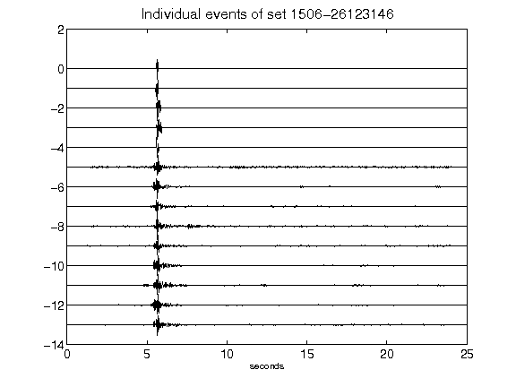](figures/1506-26123146_AllEv.png)[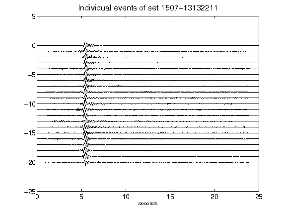](figures/1507-13132211_AllEv.png)[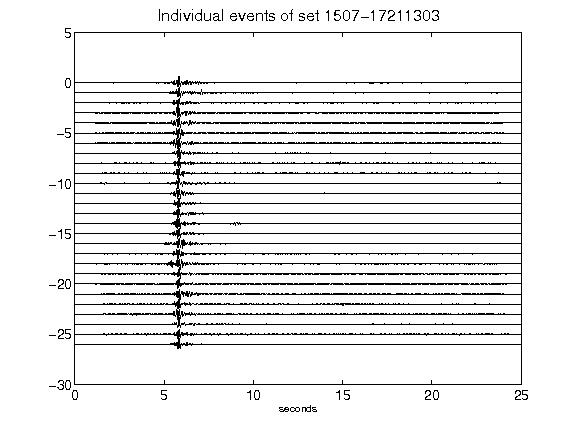](figures/1507-17211303_AllEv.png)[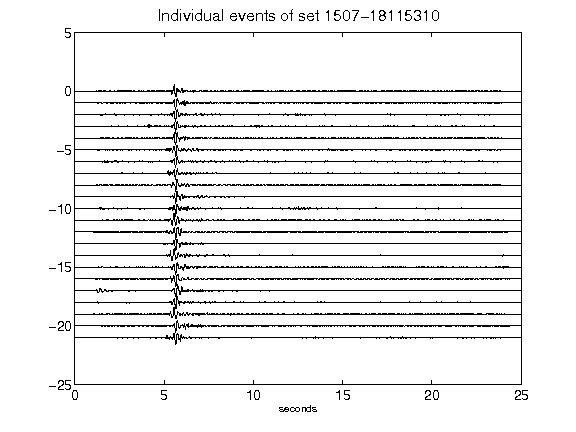](figures/1507-18115310_AllEv.png)[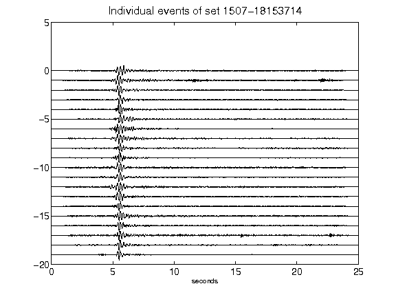](figures/1507-18153714_AllEv.png)[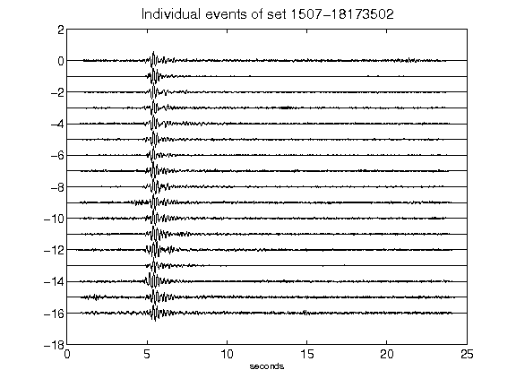](figures/1507-18173502_AllEv.png)[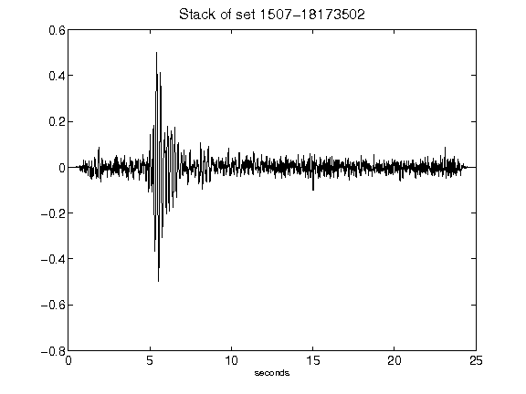](figures/1507-18173502_Stack.png)[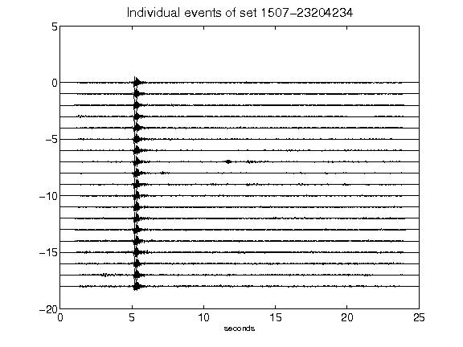](figures/1507-23204234_AllEv.png)[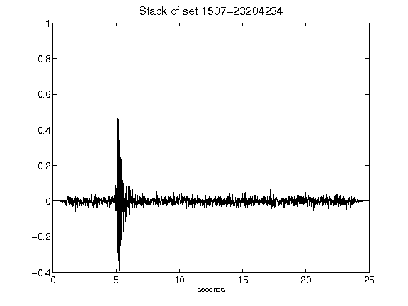](figures/1507-23204234_Stack.png)[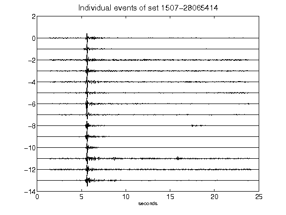](figures/1507-28065414_AllEv.png)[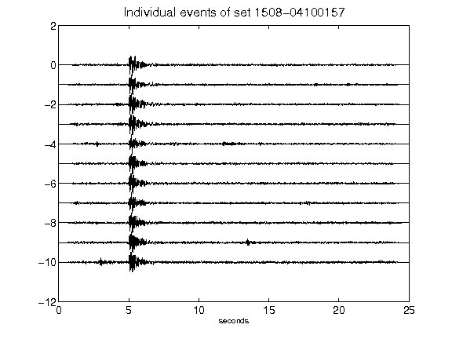](figures/1508-04100157_AllEv.png)