# Repeating Earthquake Activity at STAR

## Waveforms
[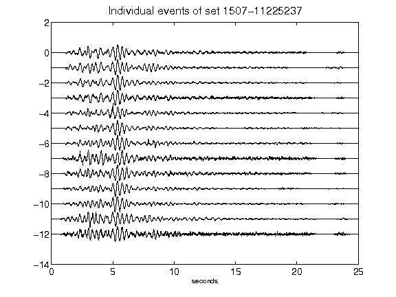](figures/1507-11225237_AllEv.png)[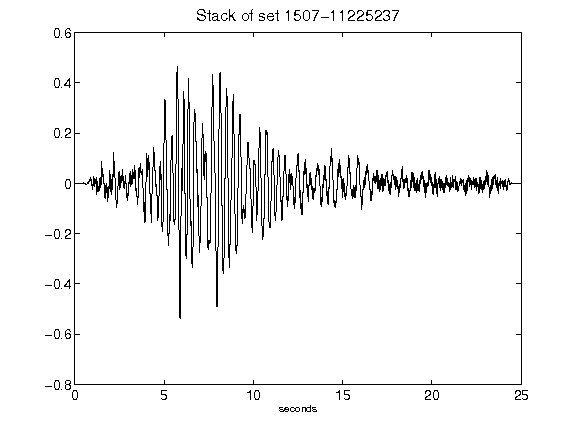](figures/1507-11225237_Stack.png)[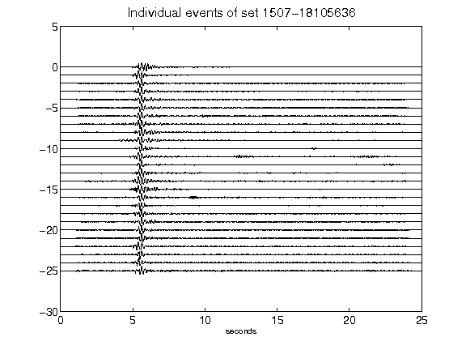](figures/1507-18105636_AllEv.png)[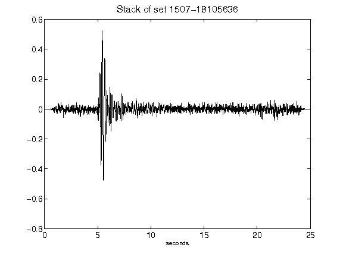](figures/1507-18105636_Stack.png)[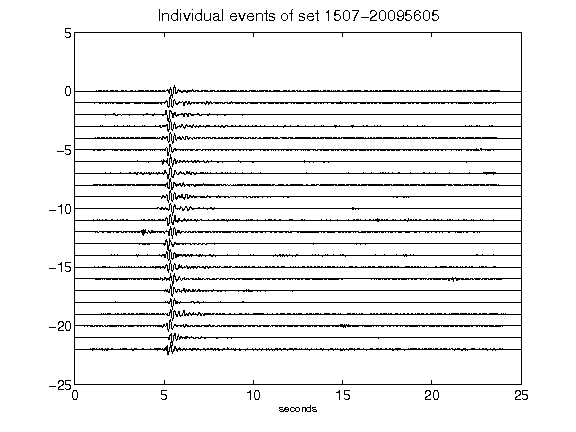](figures/1507-20095605_AllEv.png)[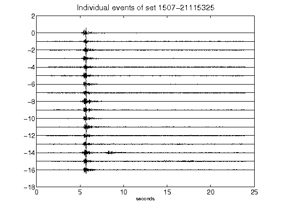](figures/1507-21115325_AllEv.png)[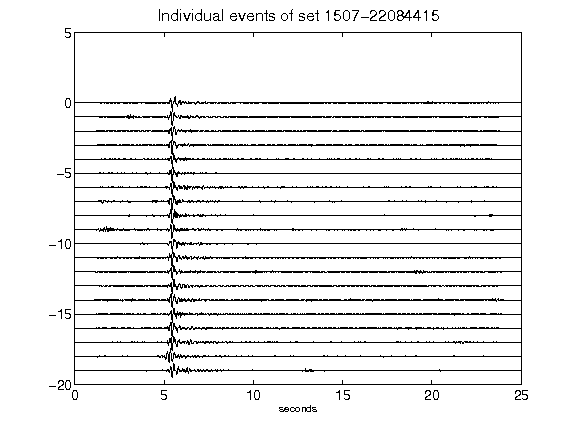](figures/1507-22084415_AllEv.png)[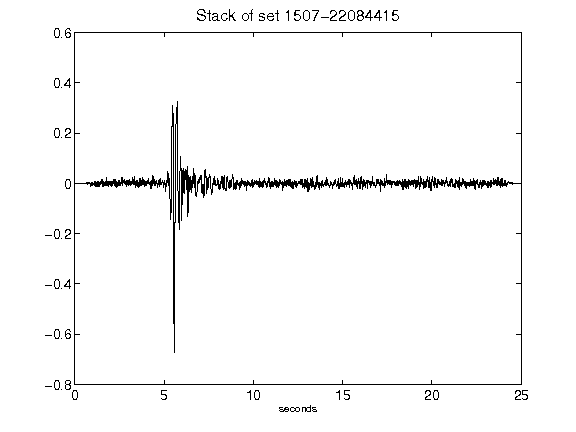](figures/1507-22084415_Stack.png)[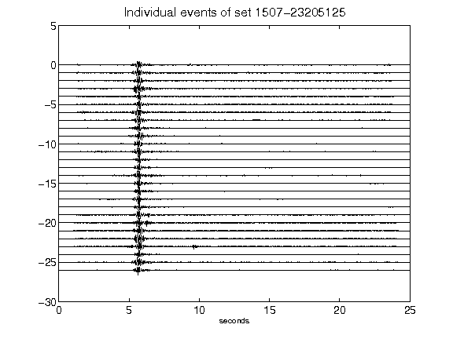](figures/1507-23205125_AllEv.png)[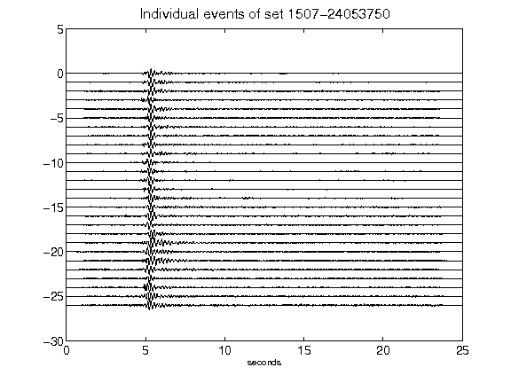](figures/1507-24053750_AllEv.png)[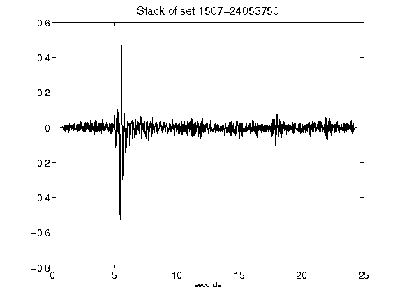](figures/1507-24053750_Stack.png)[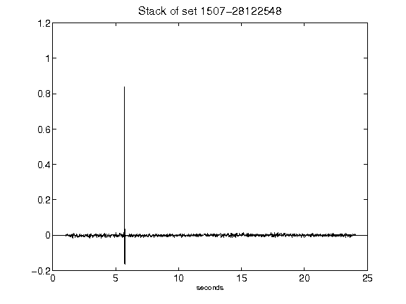](figures/1507-28122548_Stack.png)[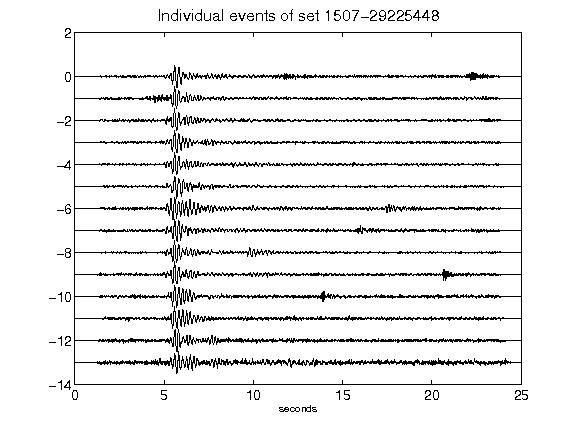](figures/1507-29225448_AllEv.png)[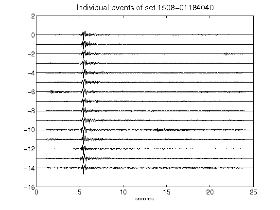](figures/1508-01184040_AllEv.png)[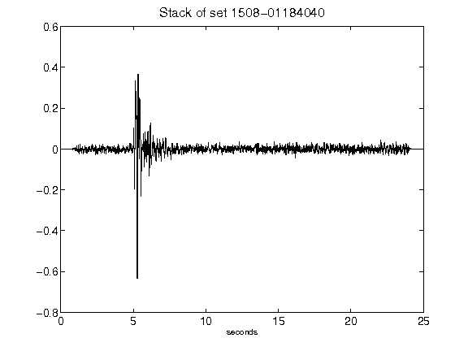](figures/1508-01184040_Stack.png)[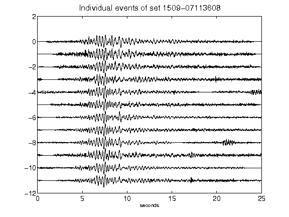](figures/1509-07113608_AllEv.png)[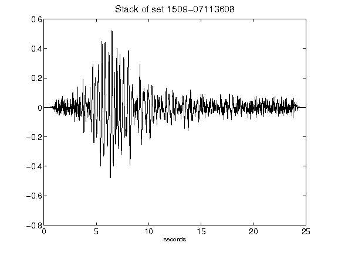](figures/1509-07113608_Stack.png)