# Repeating Earthquake Activity at STAR

## Waveforms
[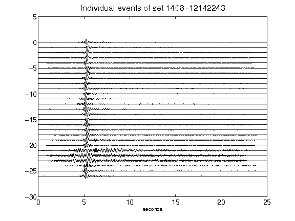](figures/1408-12142243_AllEv.png)[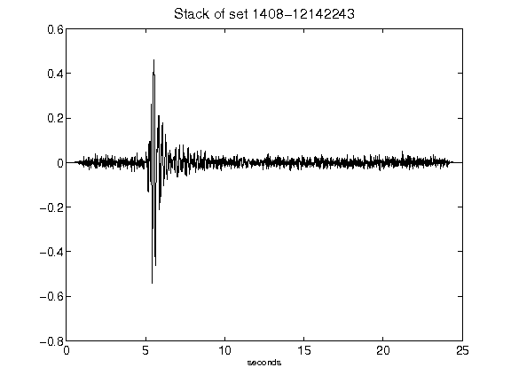](figures/1408-12142243_Stack.png)[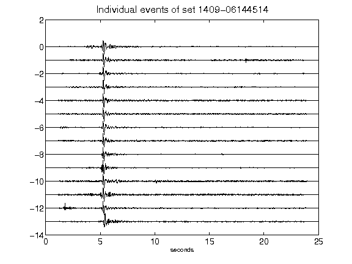](figures/1409-06144514_AllEv.png)[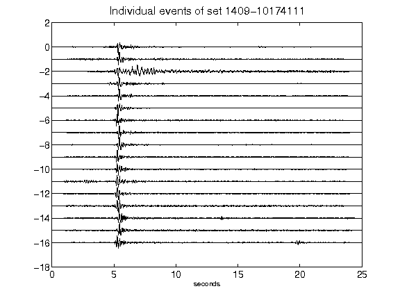](figures/1409-10174111_AllEv.png)[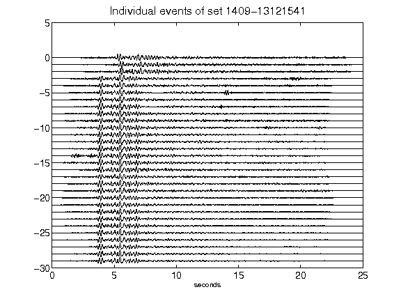](figures/1409-13121541_AllEv.png)[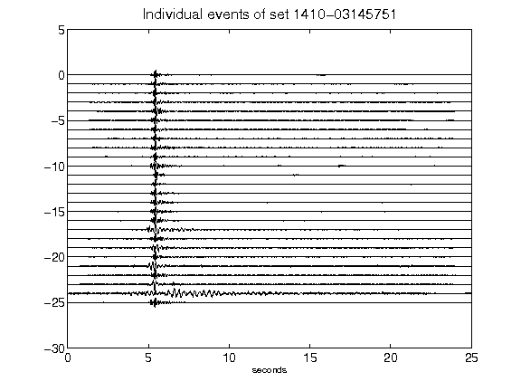](figures/1410-03145751_AllEv.png)[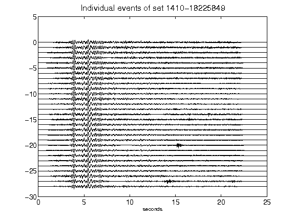](figures/1410-18225849_AllEv.png)[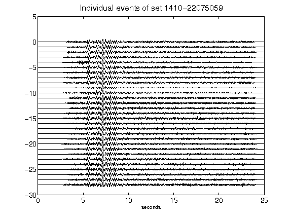](figures/1410-22075059_AllEv.png)[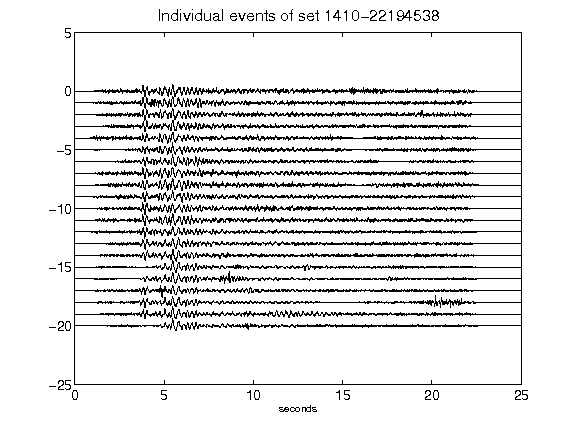](figures/1410-22194538_AllEv.png)[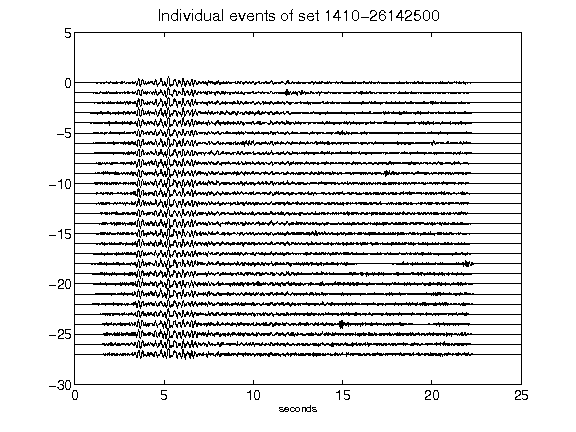](figures/1410-26142500_AllEv.png)[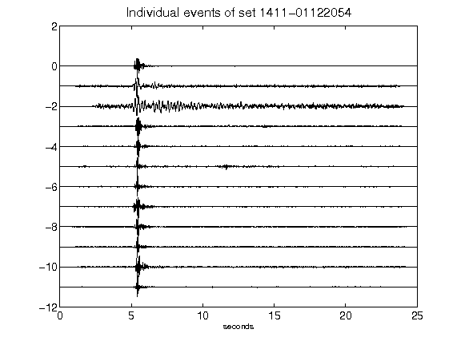](figures/1411-01122054_AllEv.png)[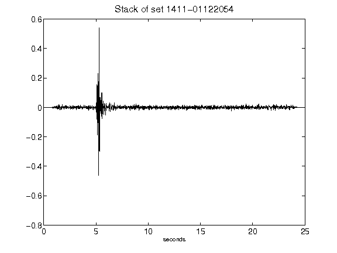](figures/1411-01122054_Stack.png)[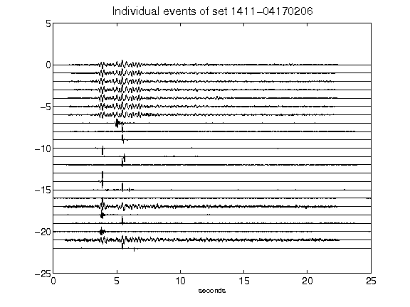](figures/1411-04170206_AllEv.png)[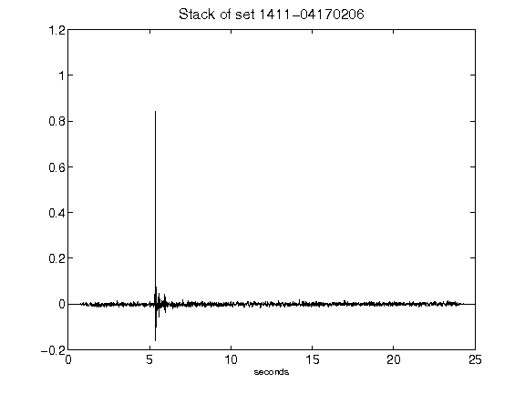](figures/1411-04170206_Stack.png)[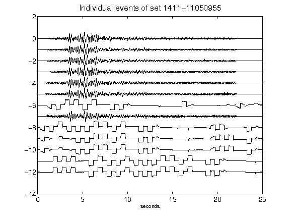](figures/1411-11050955_AllEv.png)[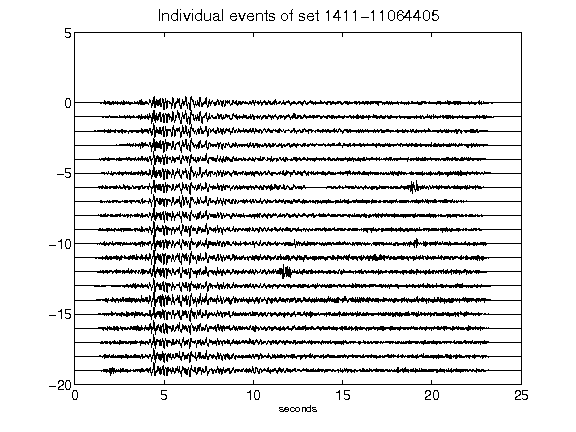](figures/1411-11064405_AllEv.png)[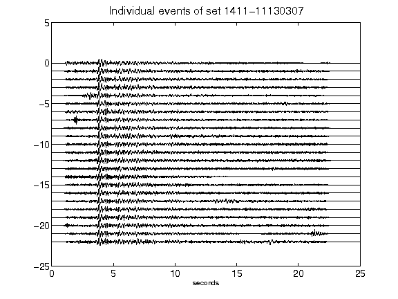](figures/1411-11130307_AllEv.png)[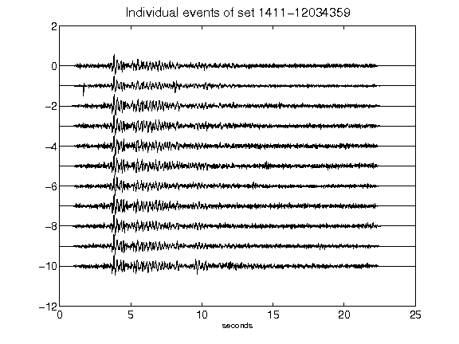](figures/1411-12034359_AllEv.png)[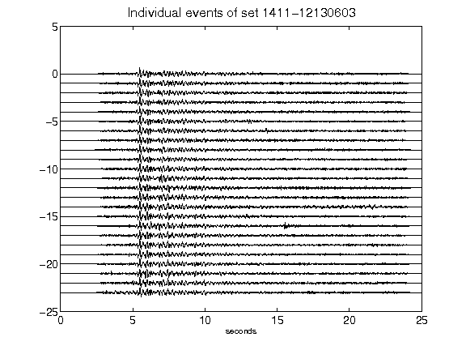](figures/1411-12130603_AllEv.png)[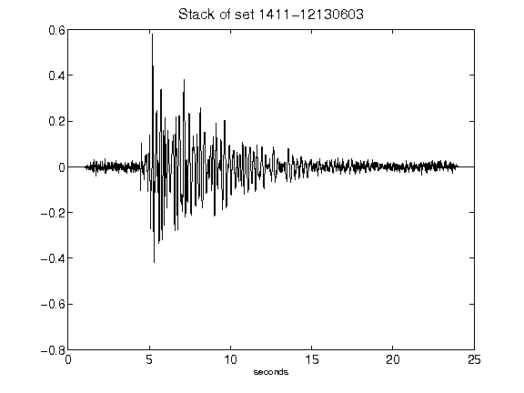](figures/1411-12130603_Stack.png)[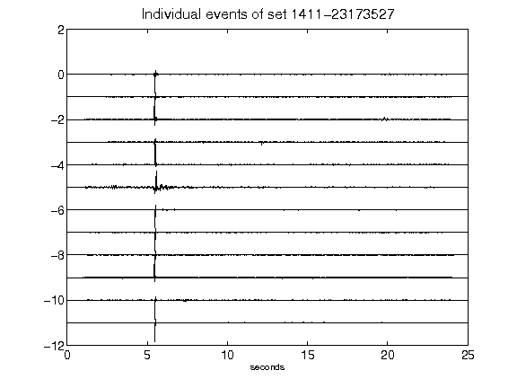](figures/1411-23173527_AllEv.png)[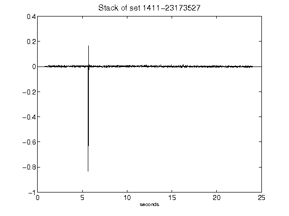](figures/1411-23173527_Stack.png)[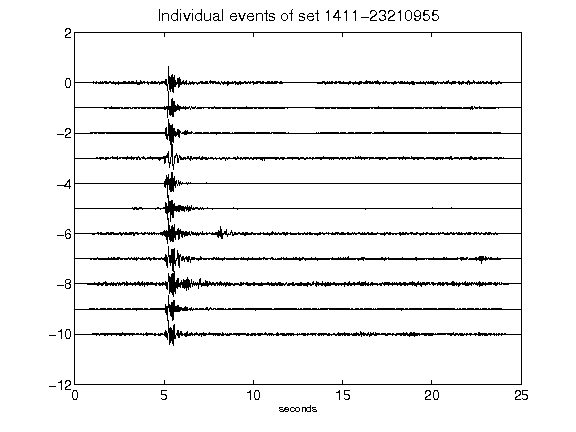](figures/1411-23210955_AllEv.png)