# Repeating Earthquake Activity at STAR

## Waveforms
[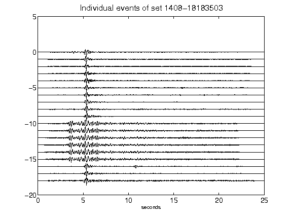](figures/1408-18183503_AllEv.png)[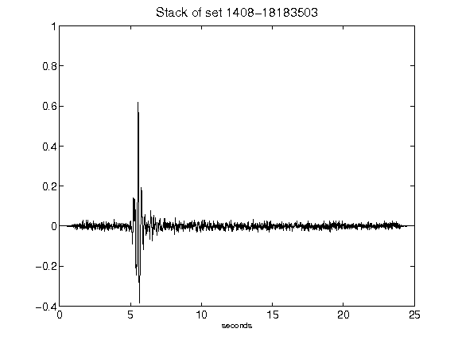](figures/1408-18183503_Stack.png)[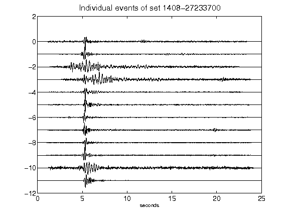](figures/1408-27233700_AllEv.png)[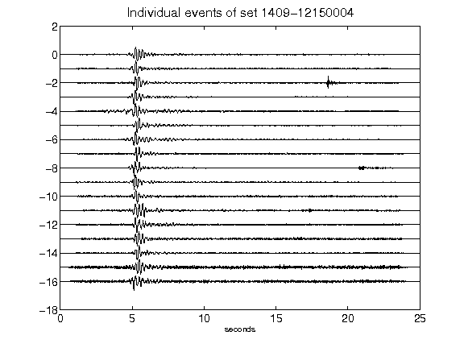](figures/1409-12150004_AllEv.png)[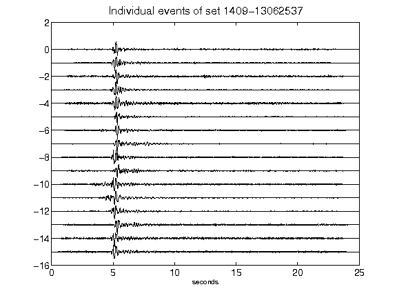](figures/1409-13062537_AllEv.png)[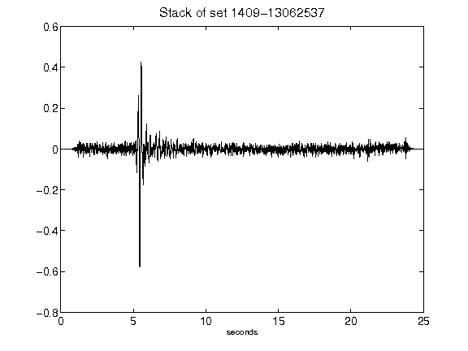](figures/1409-13062537_Stack.png)[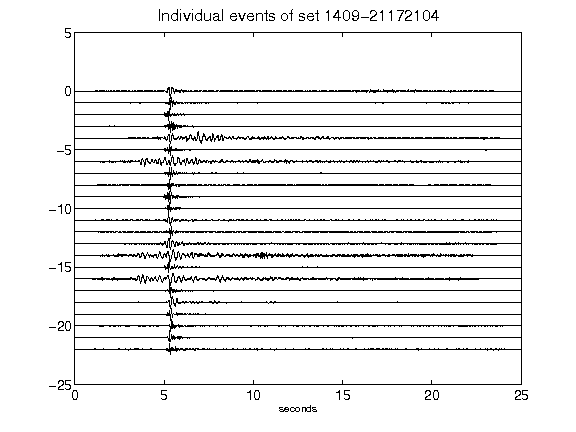](figures/1409-21172104_AllEv.png)[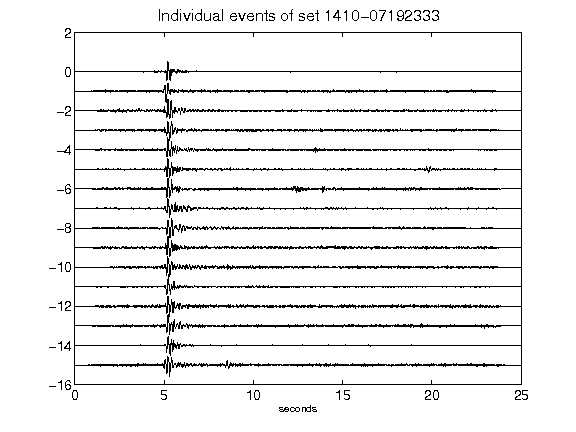](figures/1410-07192333_AllEv.png)[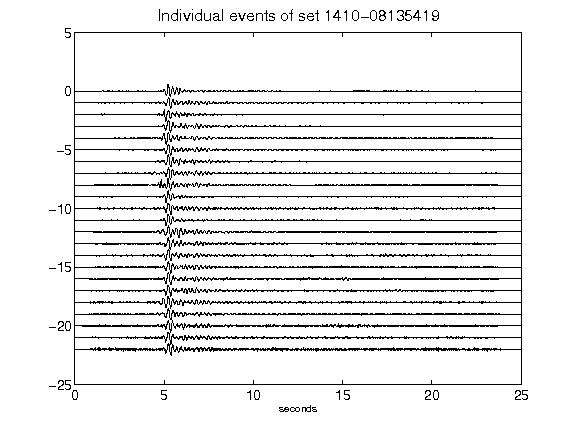](figures/1410-08135419_AllEv.png)[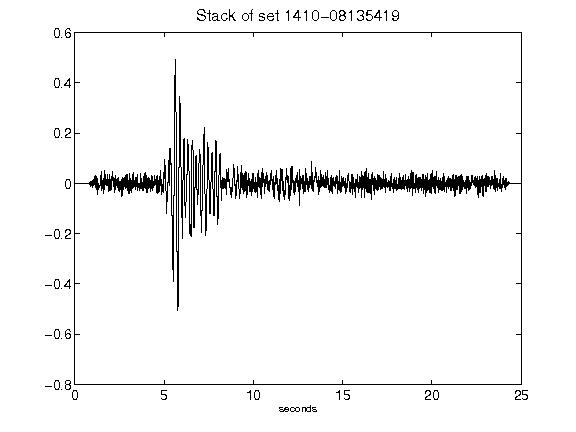](figures/1410-08135419_Stack.png)[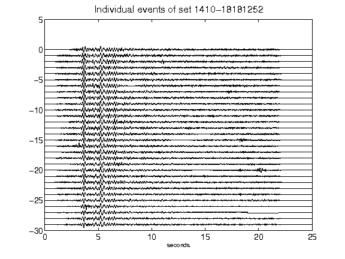](figures/1410-18181252_AllEv.png)[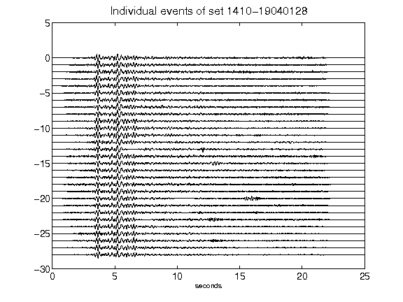](figures/1410-19040128_AllEv.png)[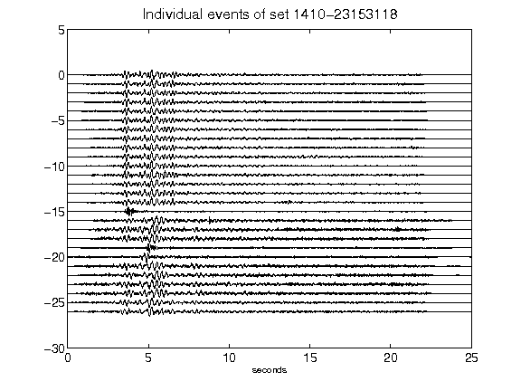](figures/1410-23153118_AllEv.png)[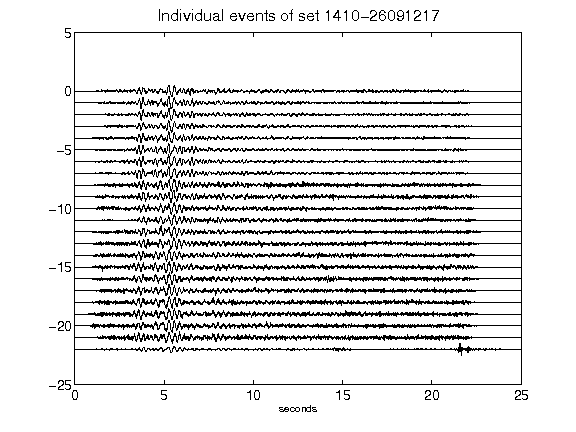](figures/1410-26091217_AllEv.png)[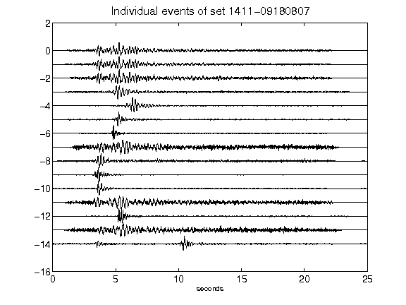](figures/1411-09180807_AllEv.png)[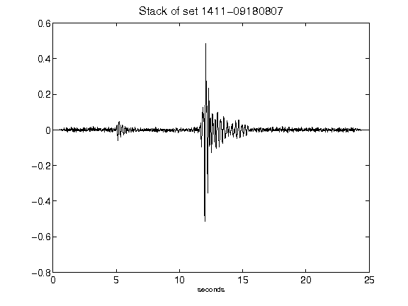](figures/1411-09180807_Stack.png)[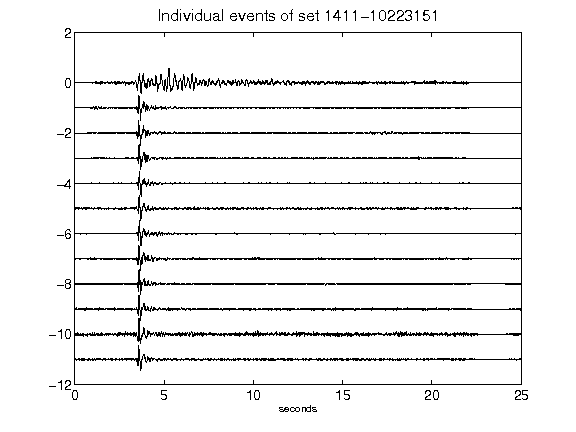](figures/1411-10223151_AllEv.png)[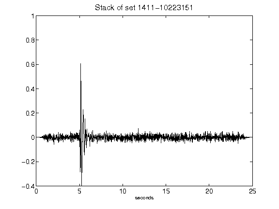](figures/1411-10223151_Stack.png)[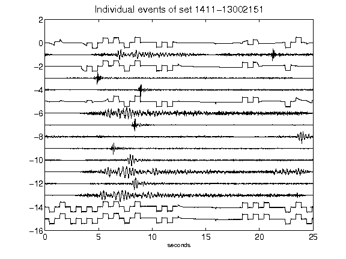](figures/1411-13002151_AllEv.png)[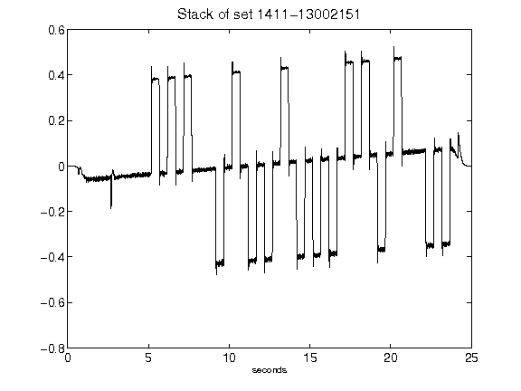](figures/1411-13002151_Stack.png)[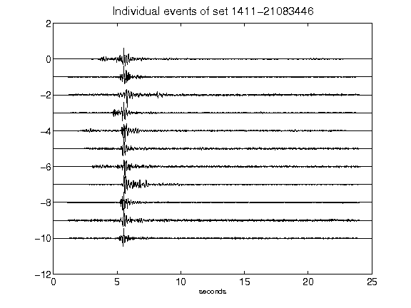](figures/1411-21083446_AllEv.png)[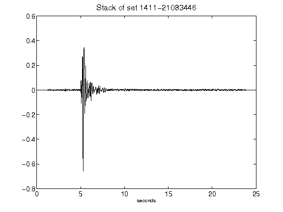](figures/1411-21083446_Stack.png)[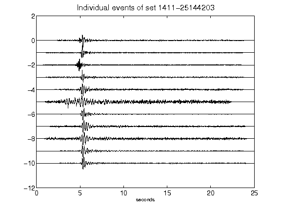](figures/1411-25144203_AllEv.png)[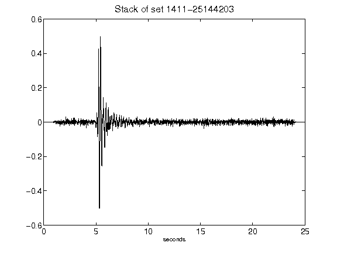](figures/1411-25144203_Stack.png)[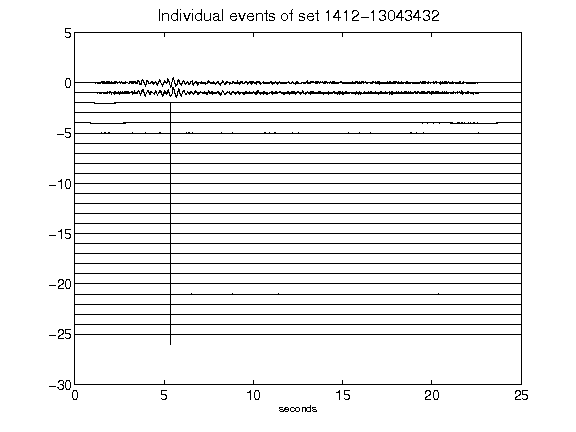](figures/1412-13043432_AllEv.png)[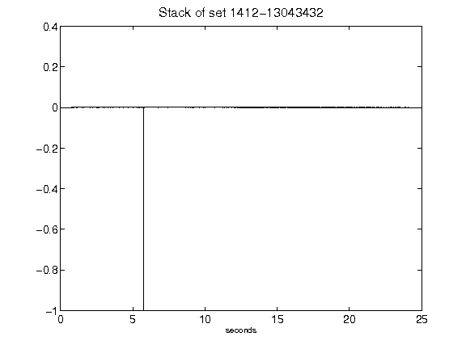](figures/1412-13043432_Stack.png)[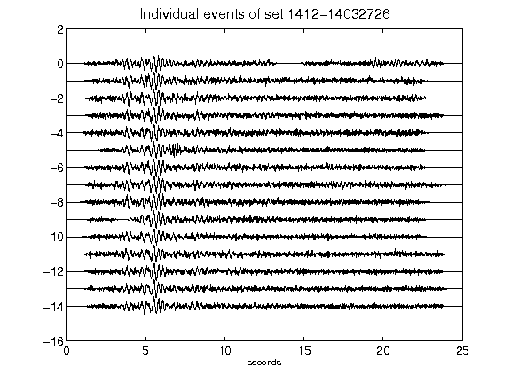](figures/1412-14032726_AllEv.png)