# Repeating Earthquake Activity at STAR

## Waveforms
[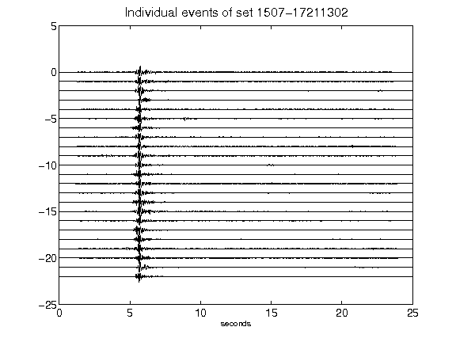](figures/1507-17211302_AllEv.png)[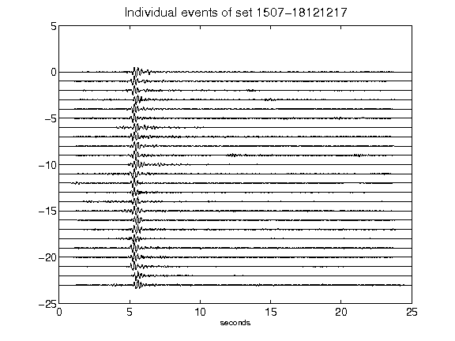](figures/1507-18121217_AllEv.png)[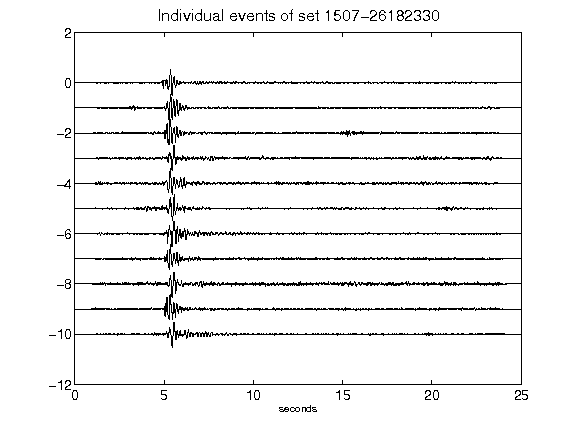](figures/1507-26182330_AllEv.png)[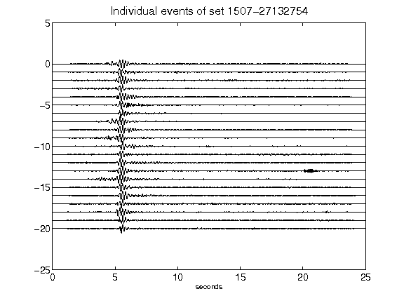](figures/1507-27132754_AllEv.png)[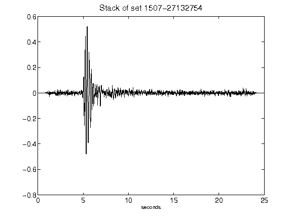](figures/1507-27132754_Stack.png)[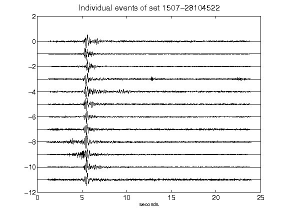](figures/1507-28104522_AllEv.png)[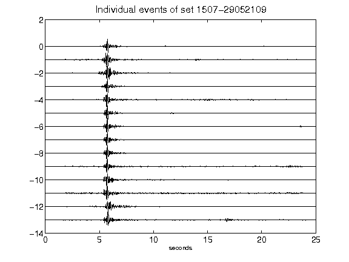](figures/1507-29052109_AllEv.png)[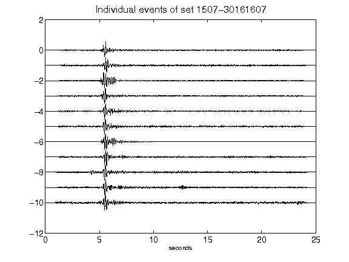](figures/1507-30161607_AllEv.png)[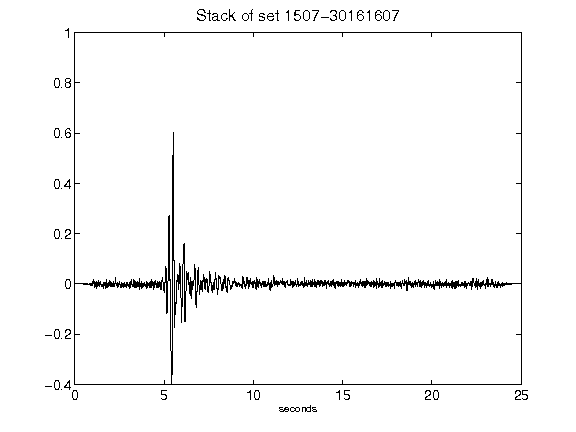](figures/1507-30161607_Stack.png)[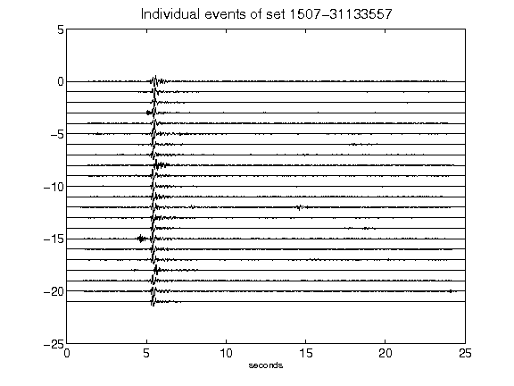](figures/1507-31133557_AllEv.png)[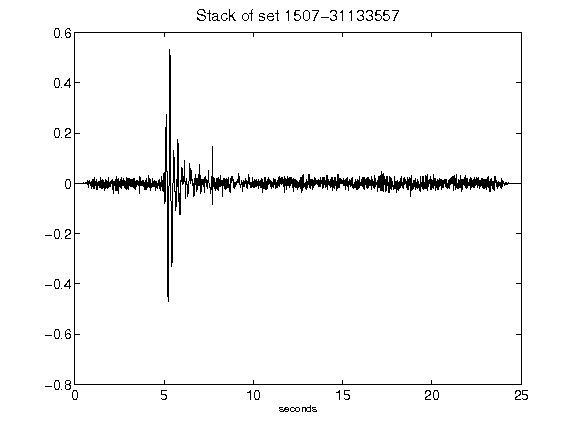](figures/1507-31133557_Stack.png)[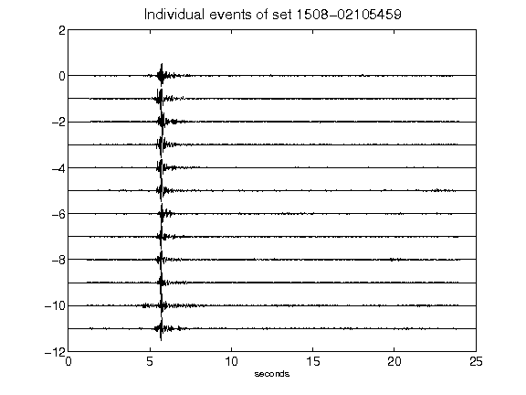](figures/1508-02105459_AllEv.png)[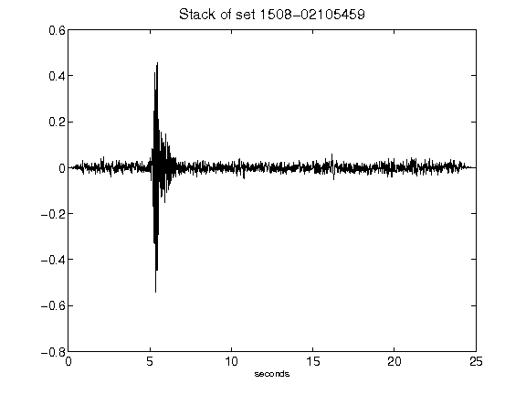](figures/1508-02105459_Stack.png)[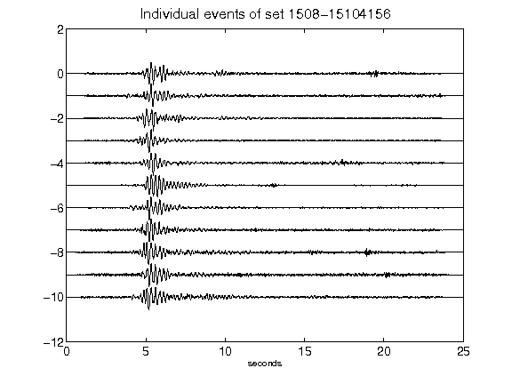](figures/1508-15104156_AllEv.png)[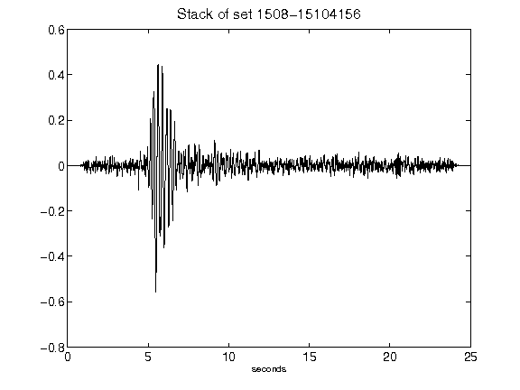](figures/1508-15104156_Stack.png)[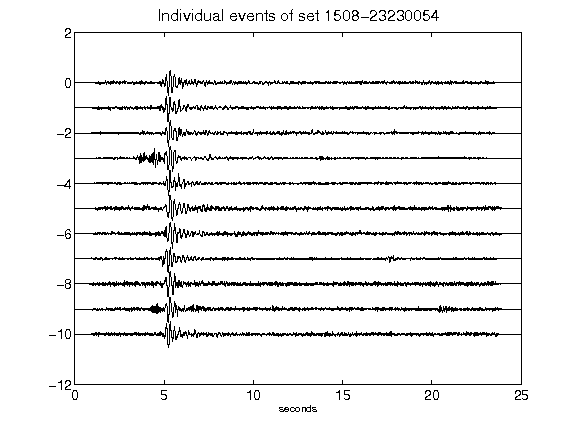](figures/1508-23230054_AllEv.png)[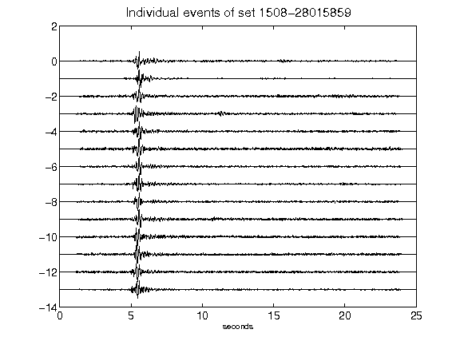](figures/1508-28015859_AllEv.png)[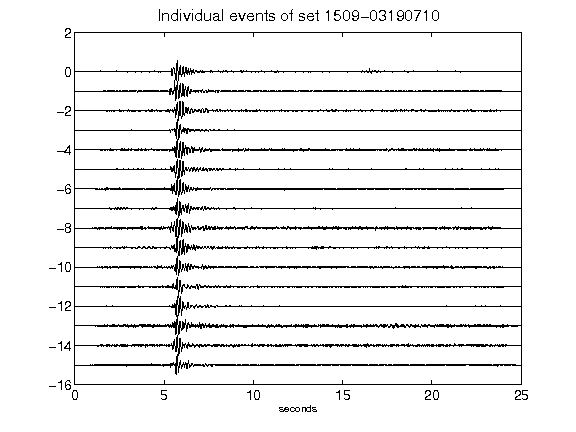](figures/1509-03190710_AllEv.png)[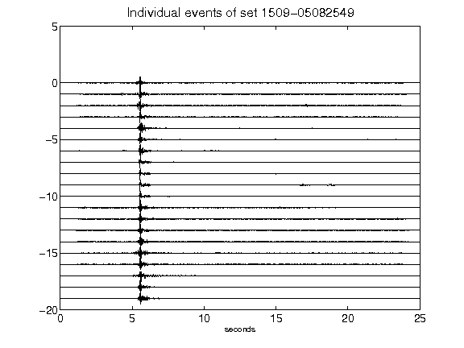](figures/1509-05082549_AllEv.png)[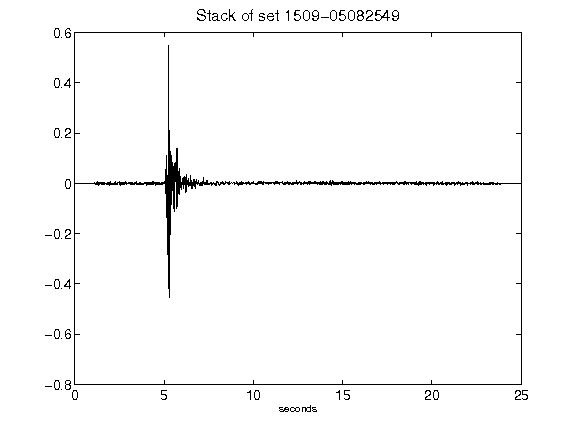](figures/1509-05082549_Stack.png)[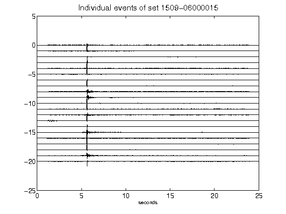](figures/1509-06000015_AllEv.png)[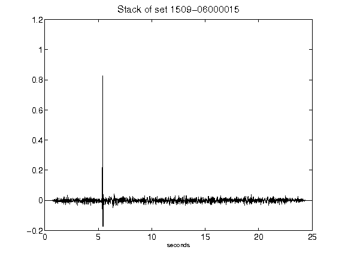](figures/1509-06000015_Stack.png)[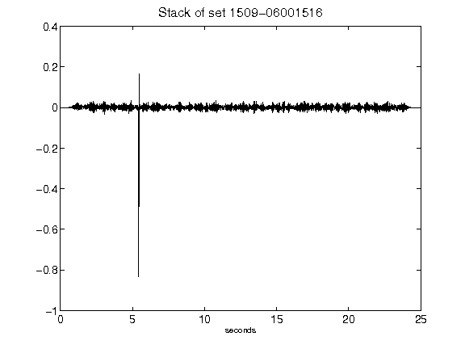](figures/1509-06001516_Stack.png)[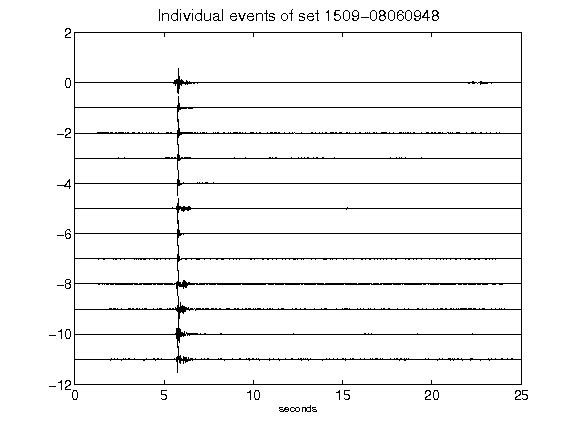](figures/1509-08060948_AllEv.png)[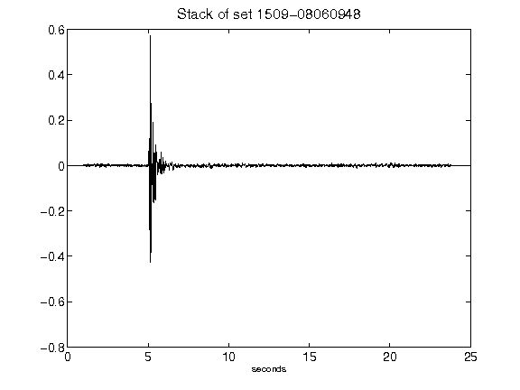](figures/1509-08060948_Stack.png)[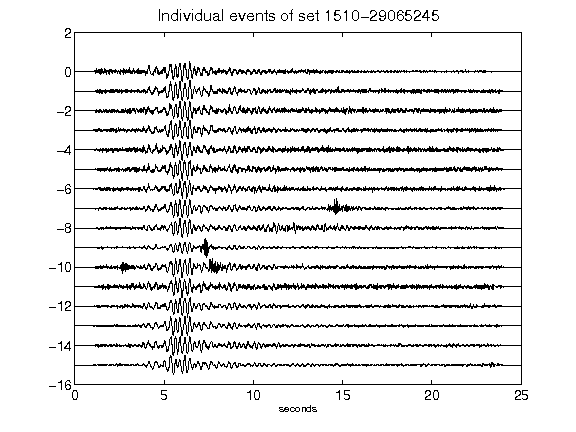](figures/1510-29065245_AllEv.png)[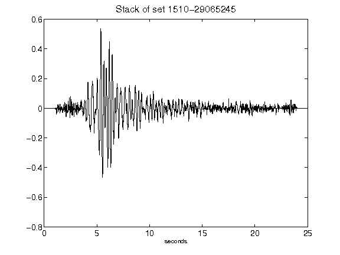](figures/1510-29065245_Stack.png)[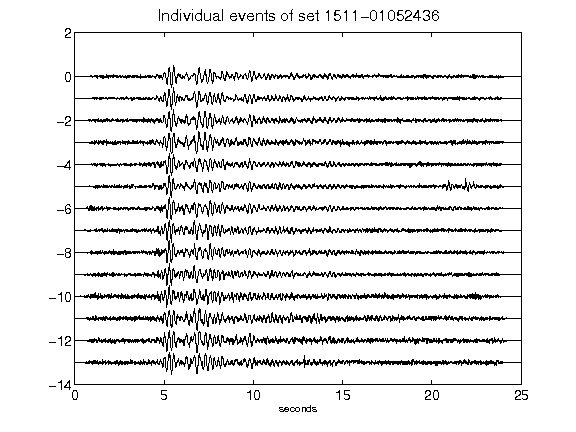](figures/1511-01052436_AllEv.png)[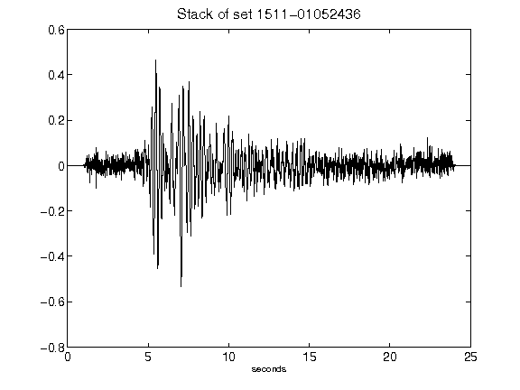](figures/1511-01052436_Stack.png)[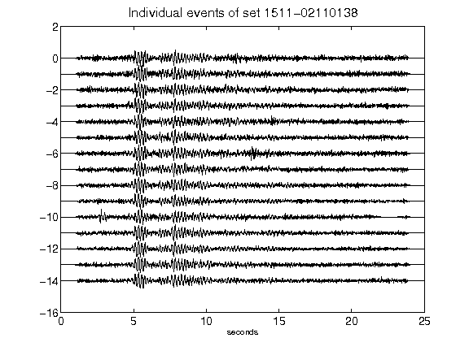](figures/1511-02110138_AllEv.png)[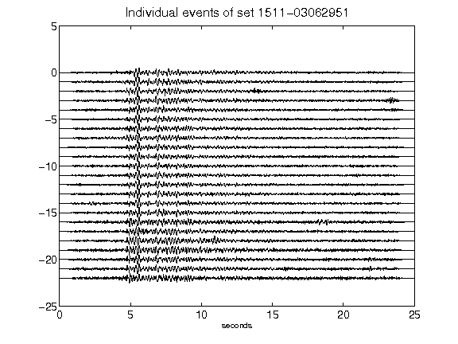](figures/1511-03062951_AllEv.png)[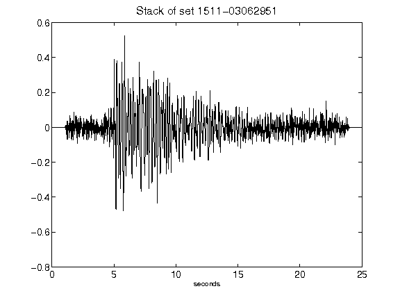](figures/1511-03062951_Stack.png)[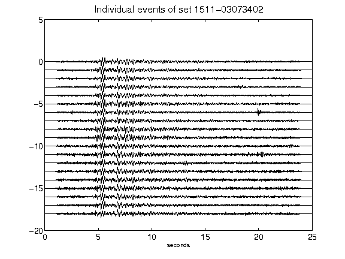](figures/1511-03073402_AllEv.png)[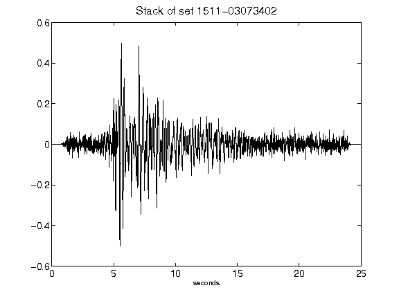](figures/1511-03073402_Stack.png)[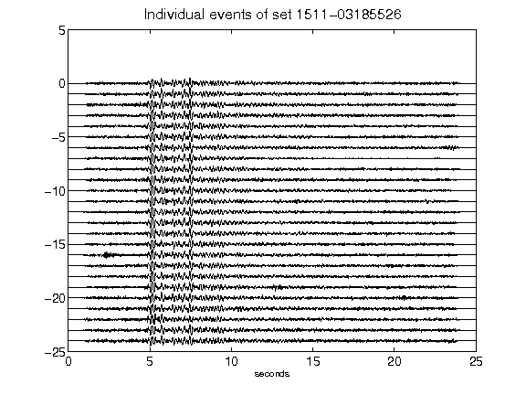](figures/1511-03185526_AllEv.png)[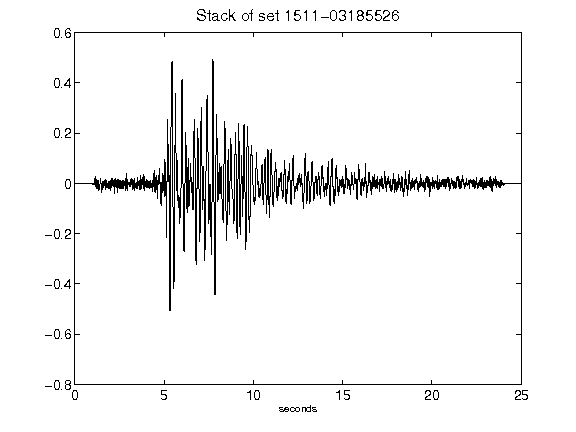](figures/1511-03185526_Stack.png)[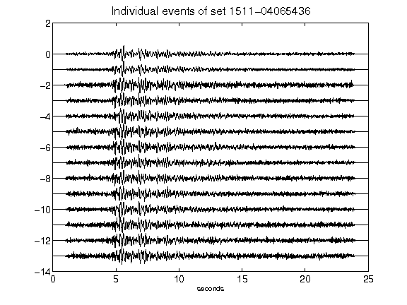](figures/1511-04065436_AllEv.png)[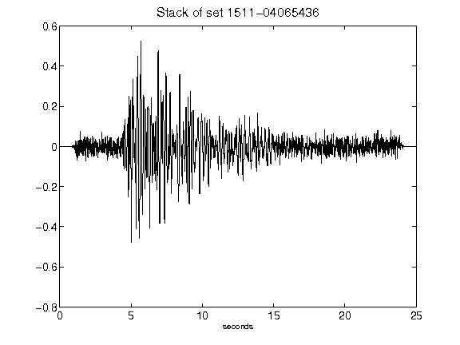](figures/1511-04065436_Stack.png)[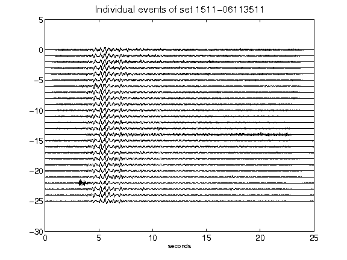](figures/1511-06113511_AllEv.png)[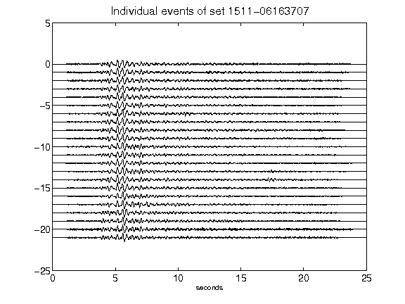](figures/1511-06163707_AllEv.png)[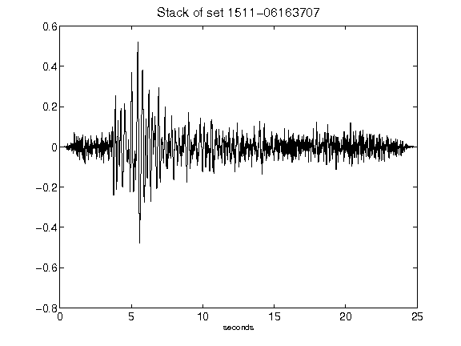](figures/1511-06163707_Stack.png)