# Repeating Earthquake Activity at STAR

## Waveforms
[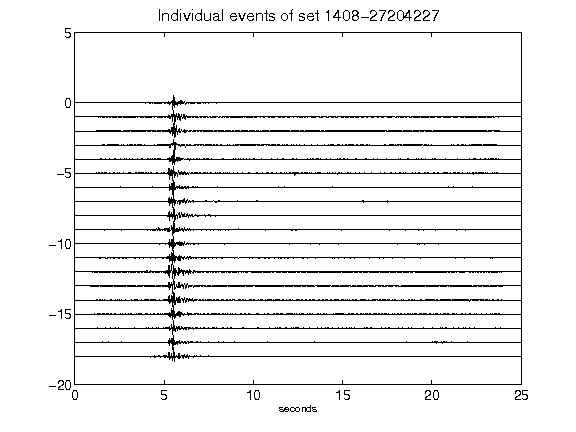](figures/1408-27204227_AllEv.png)[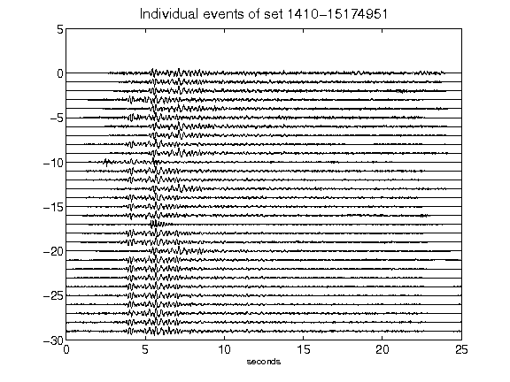](figures/1410-15174951_AllEv.png)[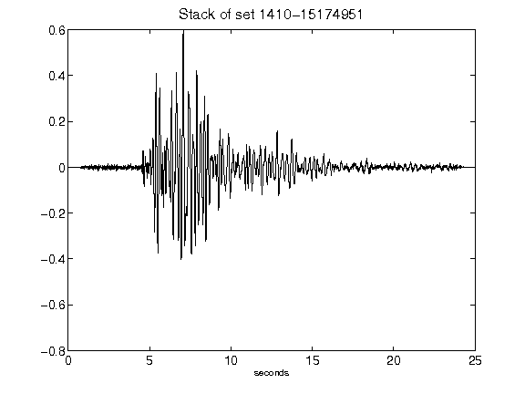](figures/1410-15174951_Stack.png)[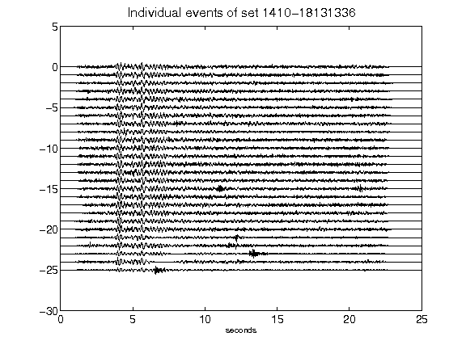](figures/1410-18131336_AllEv.png)[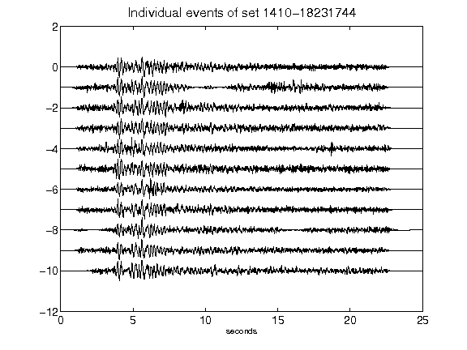](figures/1410-18231744_AllEv.png)[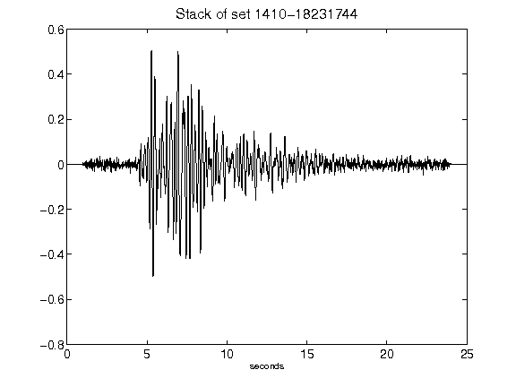](figures/1410-18231744_Stack.png)[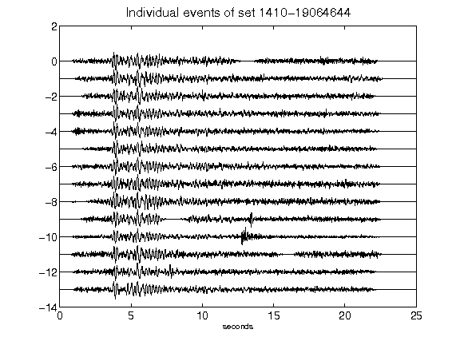](figures/1410-19064644_AllEv.png)[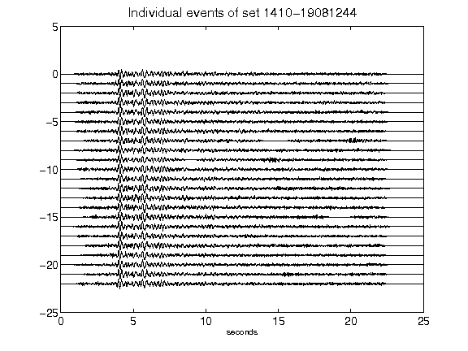](figures/1410-19081244_AllEv.png)[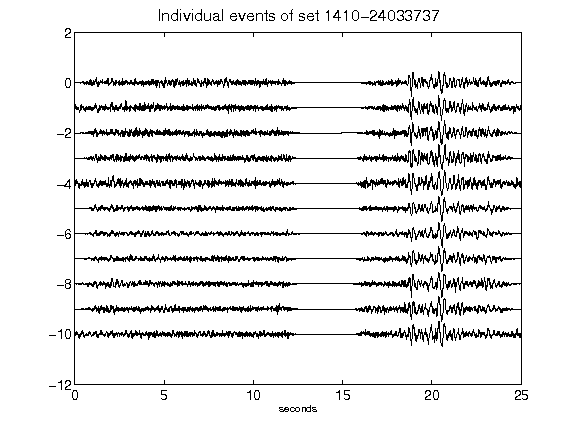](figures/1410-24033737_AllEv.png)[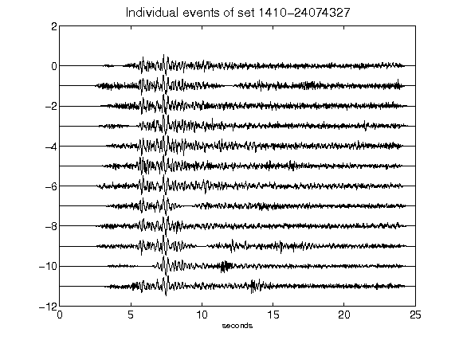](figures/1410-24074327_AllEv.png)[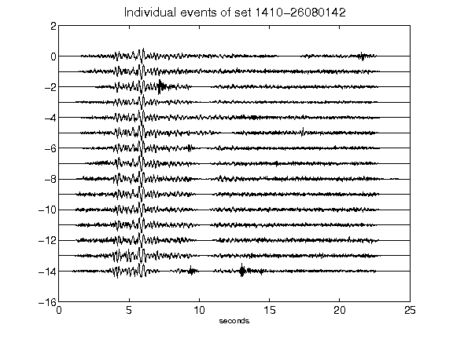](figures/1410-26080142_AllEv.png)[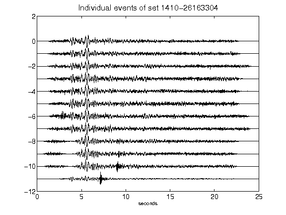](figures/1410-26163304_AllEv.png)[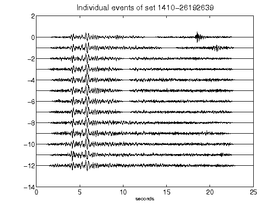](figures/1410-26192639_AllEv.png)[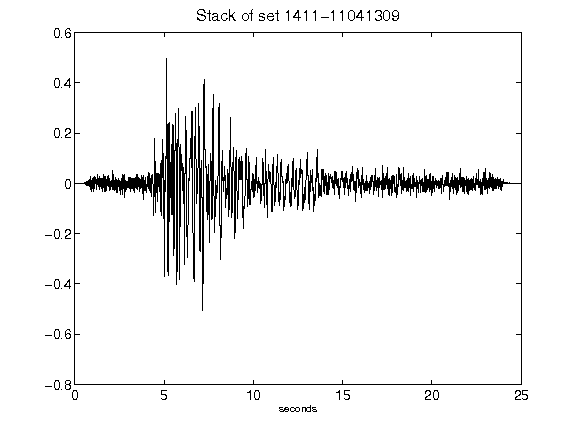](figures/1411-11041309_Stack.png)