# Repeating Earthquake Activity at STAR

## Waveforms
[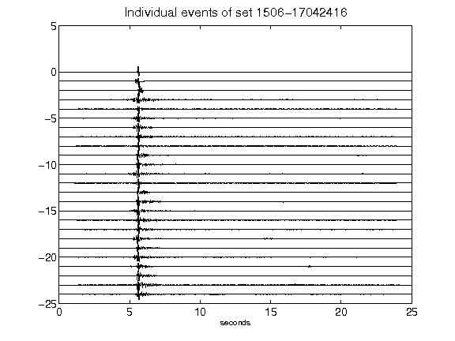](figures/1506-17042416_AllEv.png)[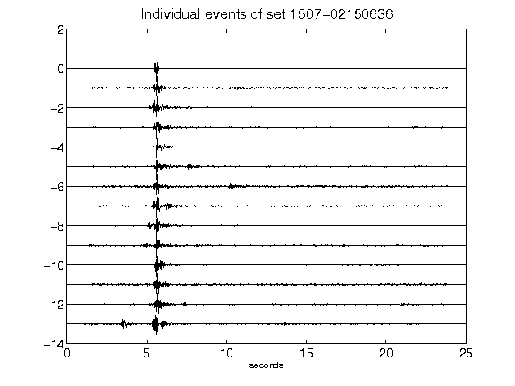](figures/1507-02150636_AllEv.png)[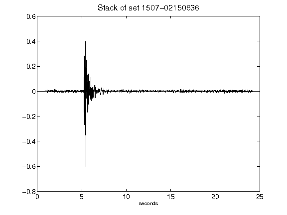](figures/1507-02150636_Stack.png)[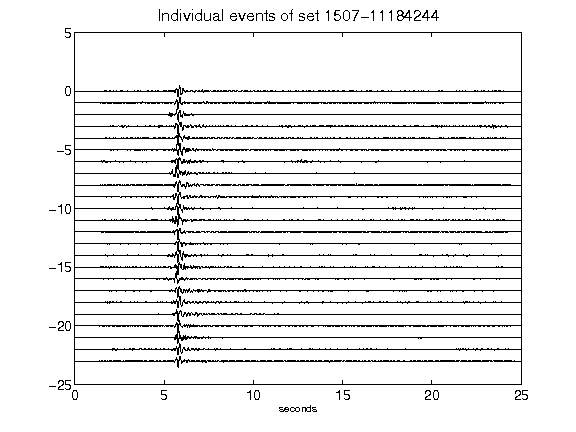](figures/1507-11184244_AllEv.png)[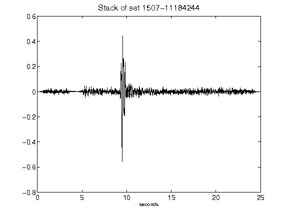](figures/1507-11184244_Stack.png)[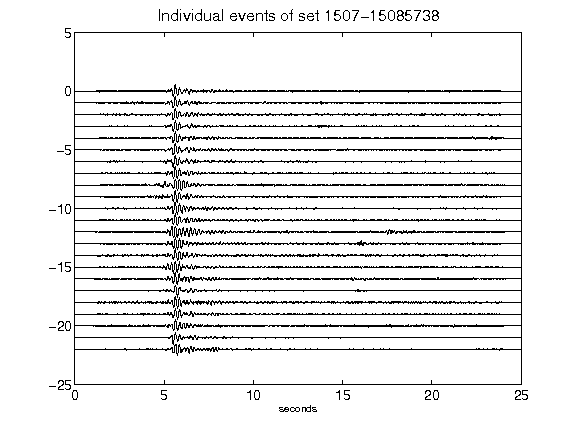](figures/1507-15085738_AllEv.png)[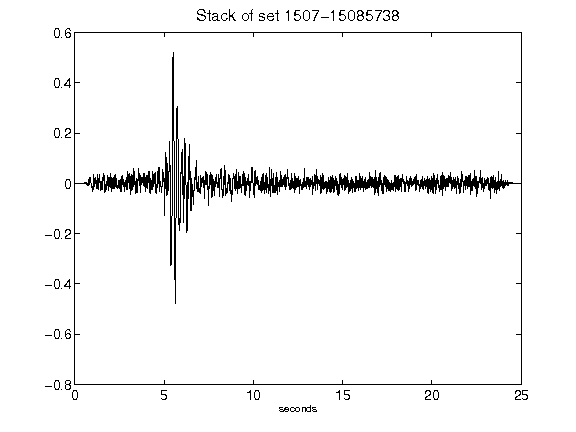](figures/1507-15085738_Stack.png)[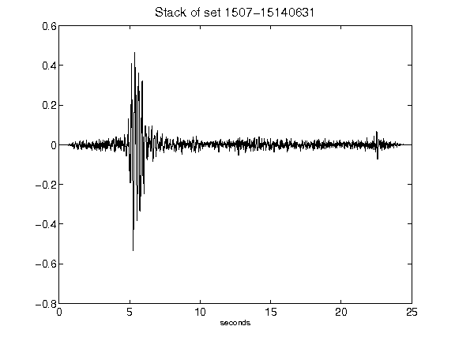](figures/1507-15140631_Stack.png)[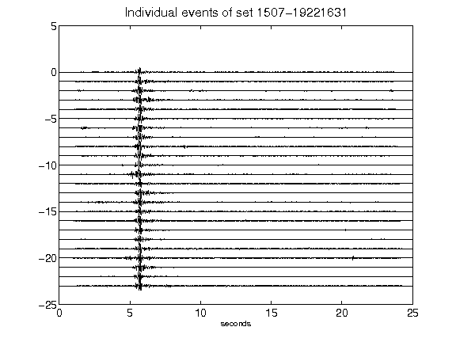](figures/1507-19221631_AllEv.png)[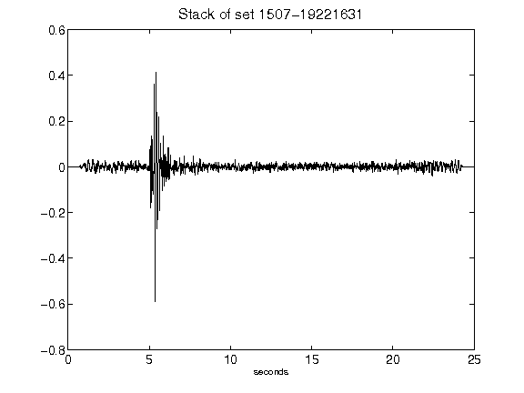](figures/1507-19221631_Stack.png)[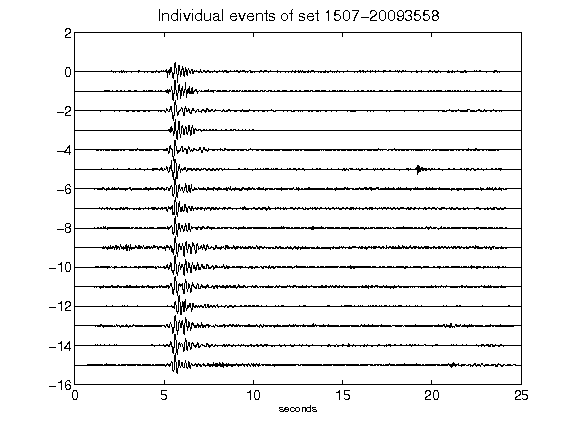](figures/1507-20093558_AllEv.png)[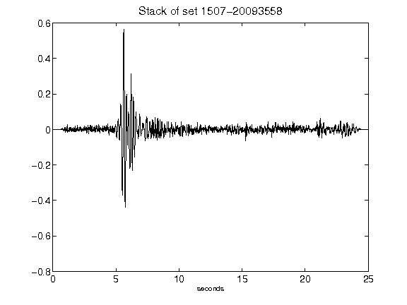](figures/1507-20093558_Stack.png)[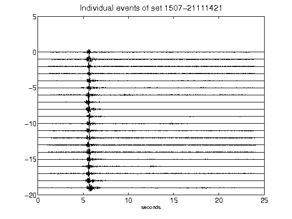](figures/1507-21111421_AllEv.png)[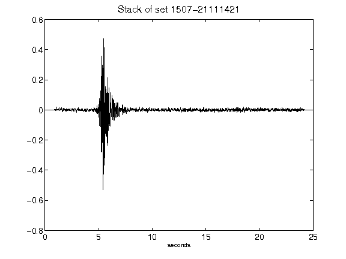](figures/1507-21111421_Stack.png)[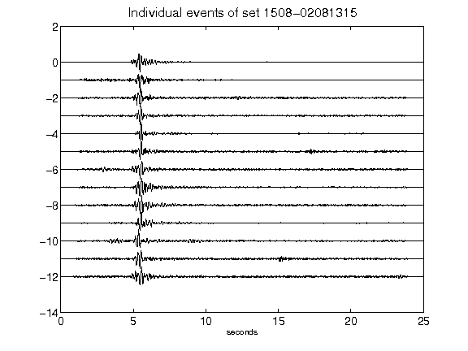](figures/1508-02081315_AllEv.png)[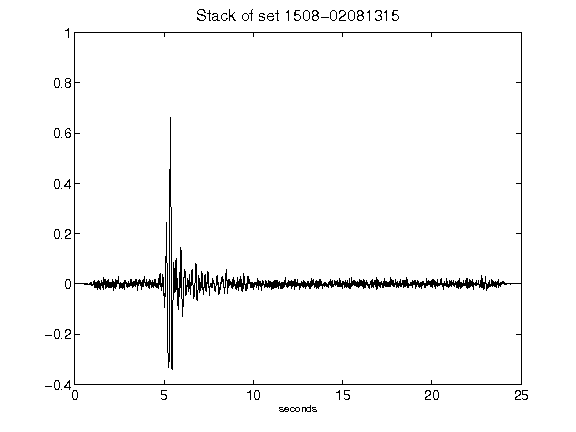](figures/1508-02081315_Stack.png)