# Repeating Earthquake Activity at STAR

## Waveforms
[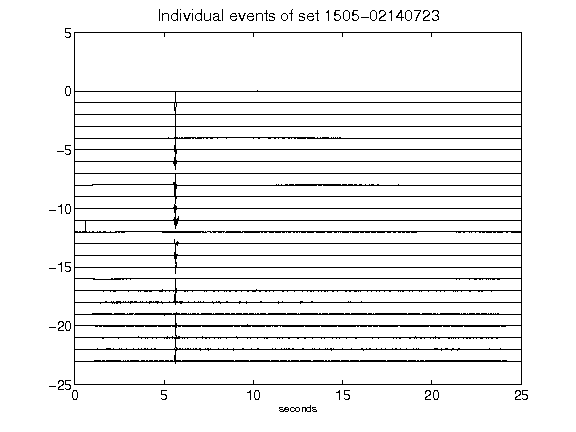](figures/1505-02140723_AllEv.png)[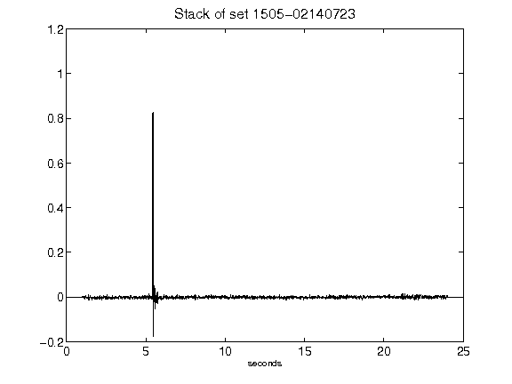](figures/1505-02140723_Stack.png)[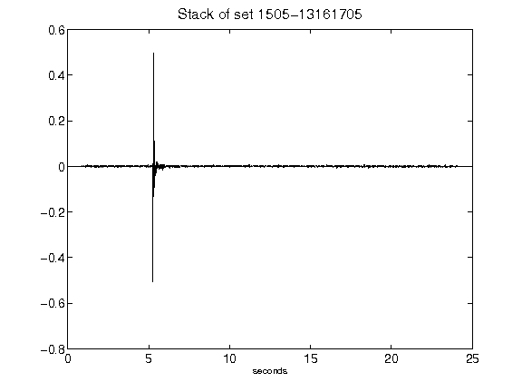](figures/1505-13161705_Stack.png)[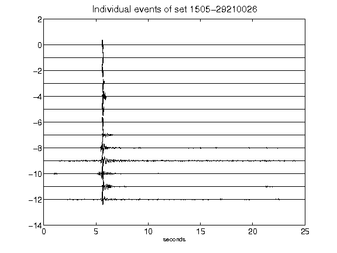](figures/1505-29210026_AllEv.png)[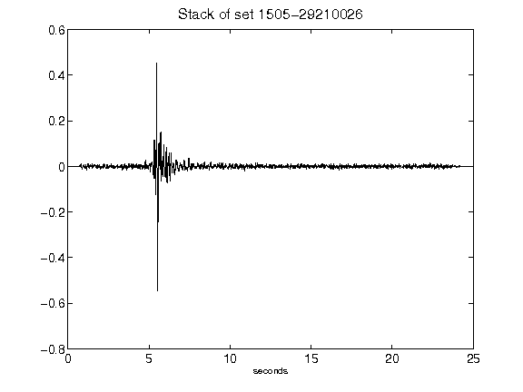](figures/1505-29210026_Stack.png)[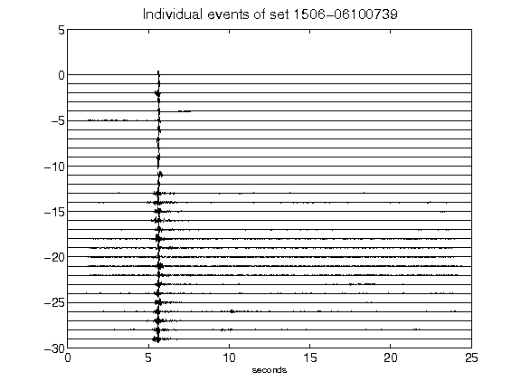](figures/1506-06100739_AllEv.png)[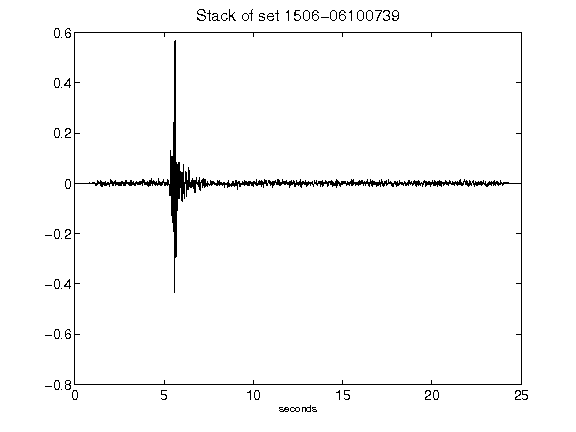](figures/1506-06100739_Stack.png)[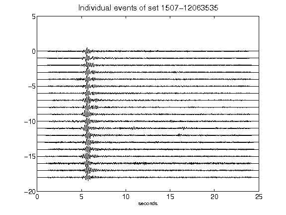](figures/1507-12063535_AllEv.png)[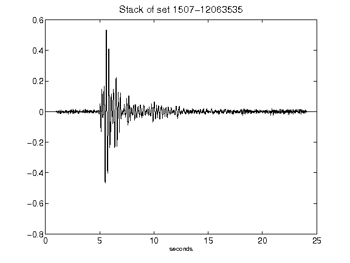](figures/1507-12063535_Stack.png)[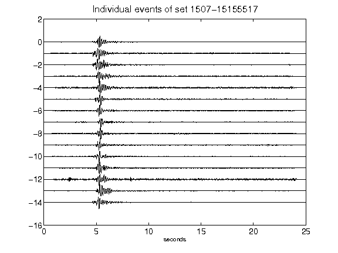](figures/1507-15155517_AllEv.png)[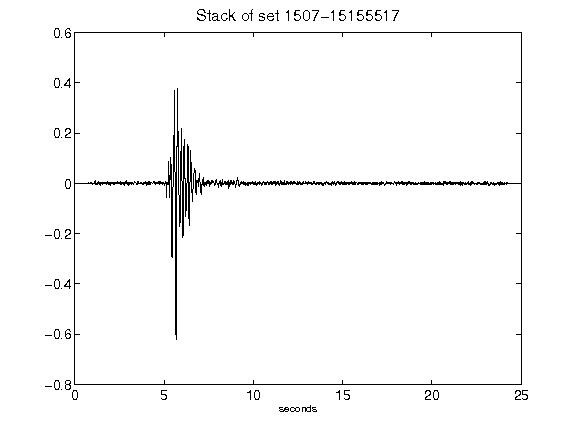](figures/1507-15155517_Stack.png)[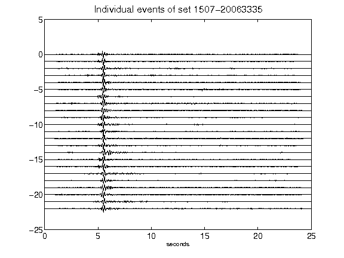](figures/1507-20063335_AllEv.png)[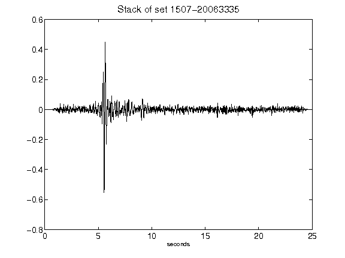](figures/1507-20063335_Stack.png)