# Repeating Earthquake Activity at STAR

## Waveforms
[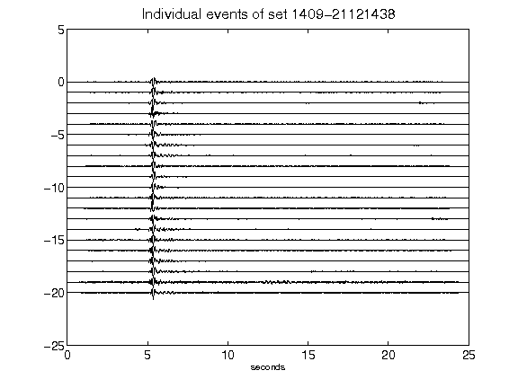](figures/1409-21121438_AllEv.png)[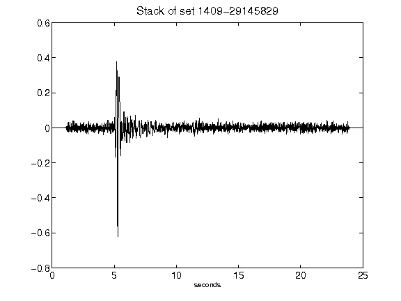](figures/1409-29145829_Stack.png)[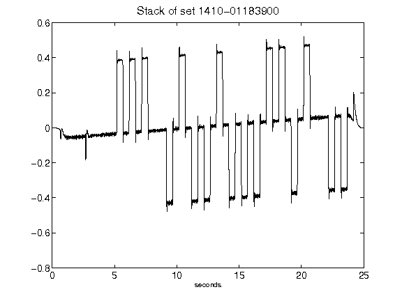](figures/1410-01183900_Stack.png)[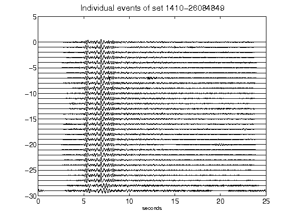](figures/1410-26084849_AllEv.png)[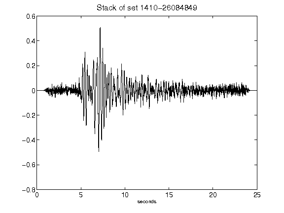](figures/1410-26084849_Stack.png)[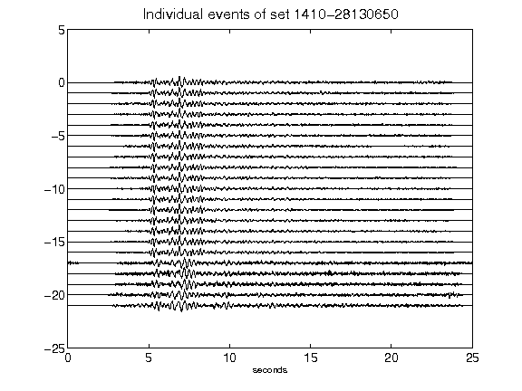](figures/1410-28130650_AllEv.png)[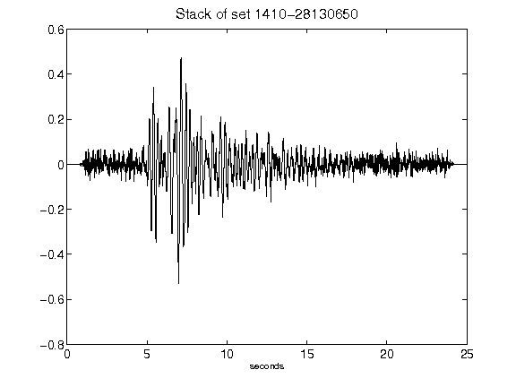](figures/1410-28130650_Stack.png)[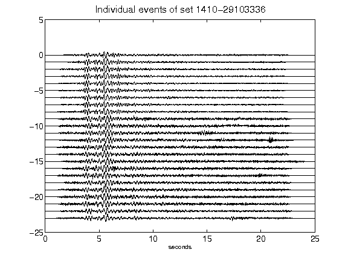](figures/1410-29103336_AllEv.png)[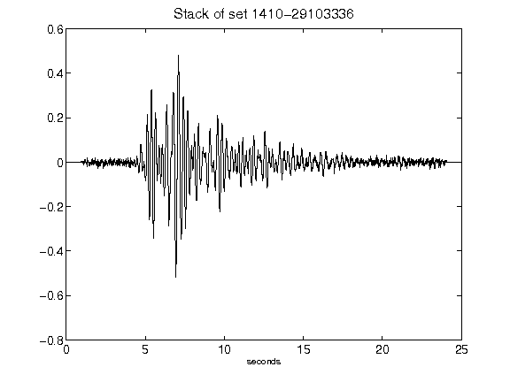](figures/1410-29103336_Stack.png)[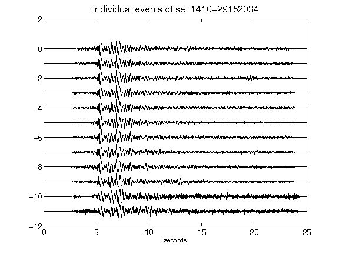](figures/1410-29152034_AllEv.png)[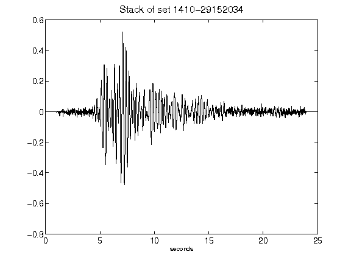](figures/1410-29152034_Stack.png)[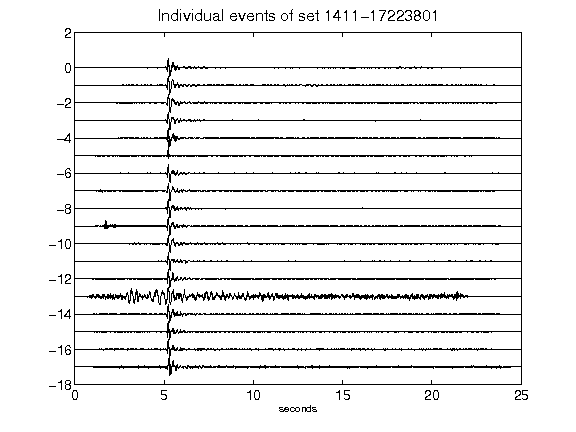](figures/1411-17223801_AllEv.png)[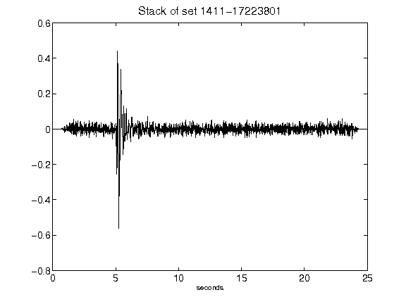](figures/1411-17223801_Stack.png)[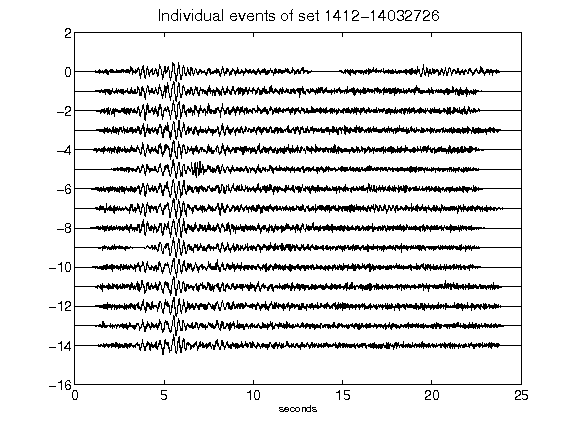](figures/1412-14032726_AllEv.png)