# Repeating Earthquake Activity at STAR

## Waveforms
[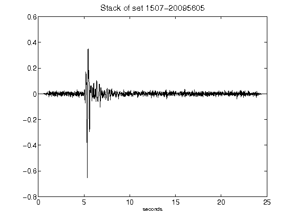](figures/1507-20095605_Stack.png)[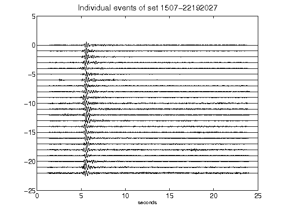](figures/1507-22192027_AllEv.png)[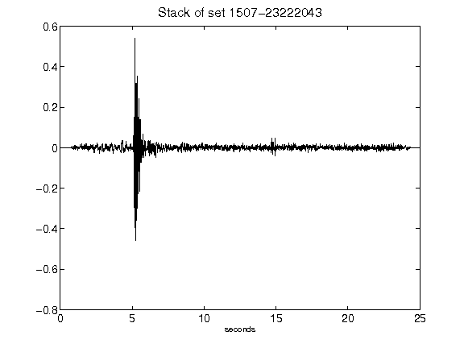](figures/1507-23222043_Stack.png)[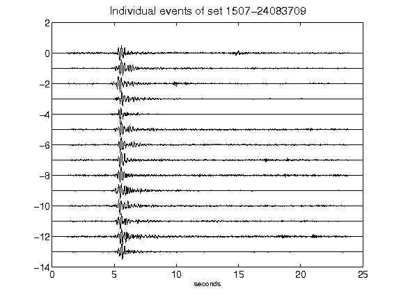](figures/1507-24083709_AllEv.png)[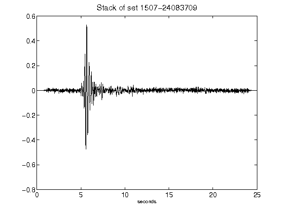](figures/1507-24083709_Stack.png)[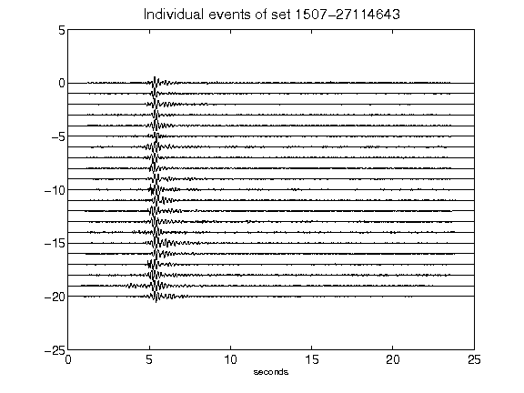](figures/1507-27114643_AllEv.png)[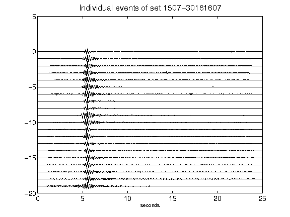](figures/1507-30161607_AllEv.png)[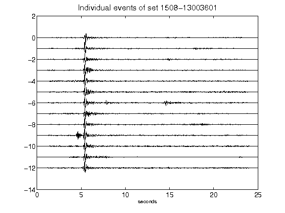](figures/1508-13003601_AllEv.png)[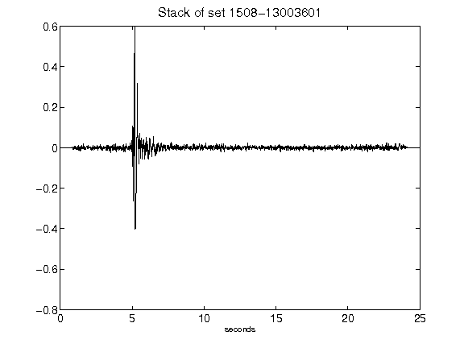](figures/1508-13003601_Stack.png)[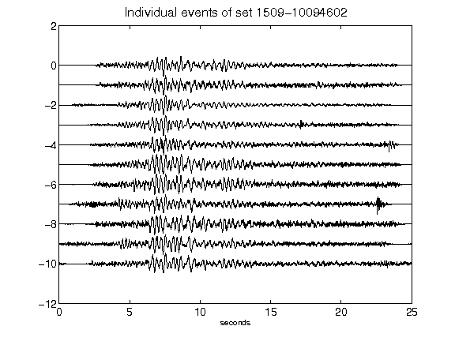](figures/1509-10094602_AllEv.png)[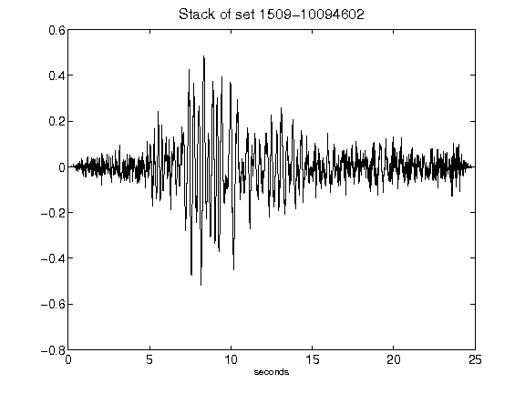](figures/1509-10094602_Stack.png)