# Repeating Earthquake Activity at STAR

## Waveforms
[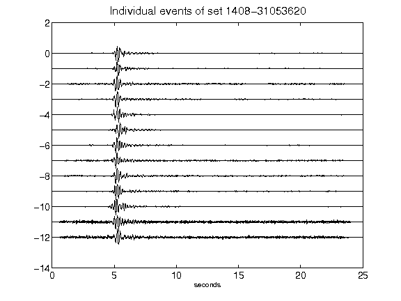](figures/1408-31053620_AllEv.png)[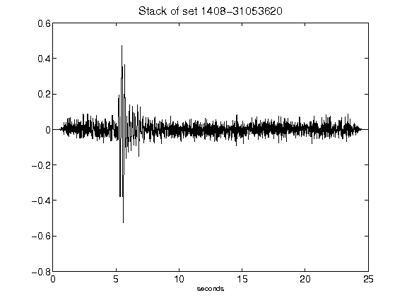](figures/1408-31053620_Stack.png)[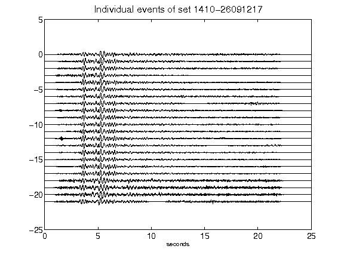](figures/1410-26091217_AllEv.png)[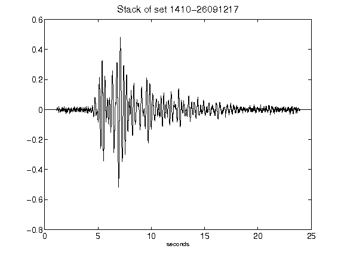](figures/1410-26091217_Stack.png)[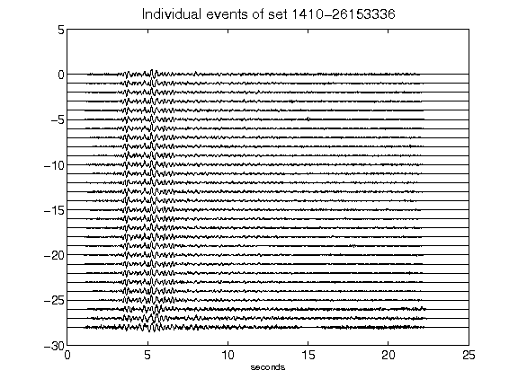](figures/1410-26153336_AllEv.png)[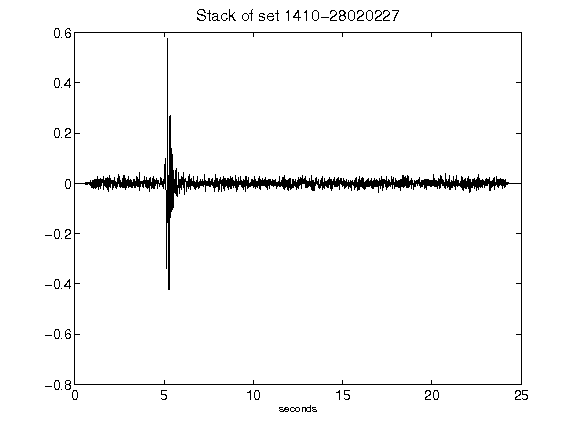](figures/1410-28020227_Stack.png)[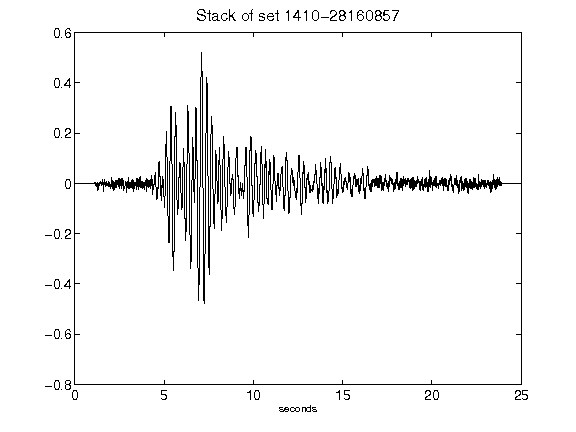](figures/1410-28160857_Stack.png)[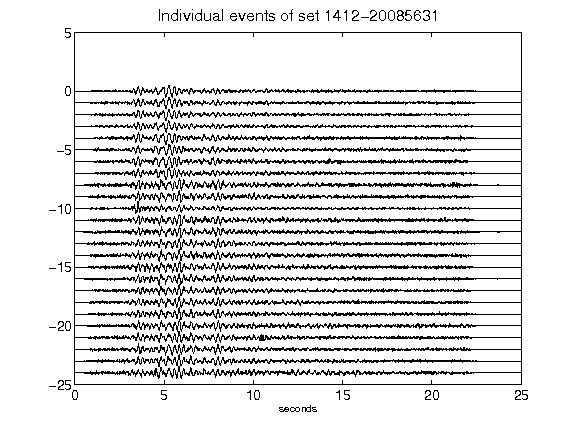](figures/1412-20085631_AllEv.png)[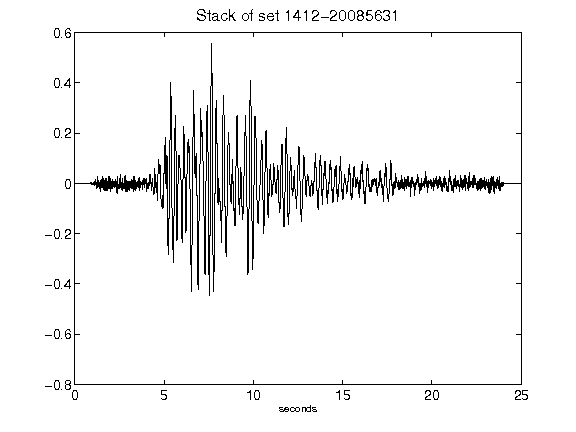](figures/1412-20085631_Stack.png)[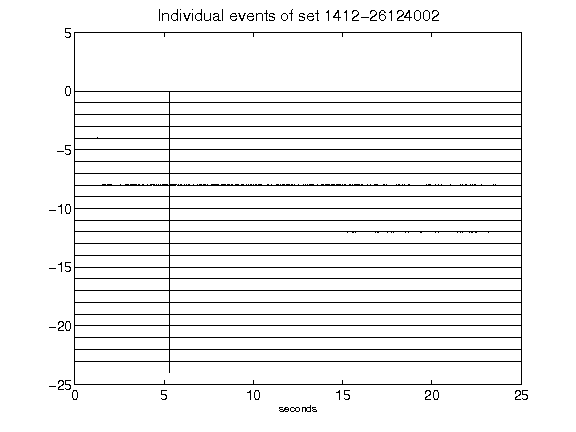](figures/1412-26124002_AllEv.png)[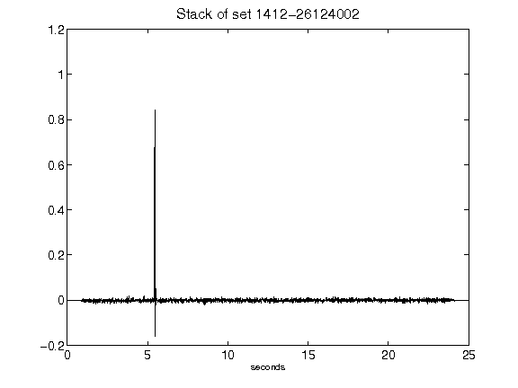](figures/1412-26124002_Stack.png)