# Repeating Earthquake Activity at STAR

## Waveforms
[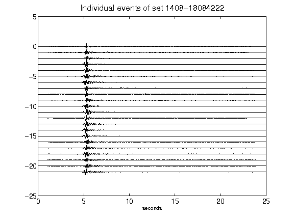](figures/1408-18084222_AllEv.png)[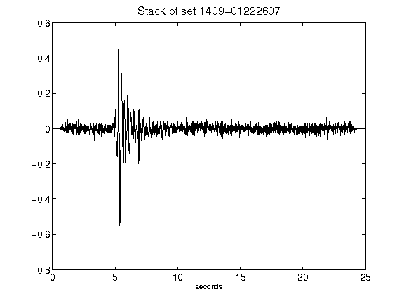](figures/1409-01222607_Stack.png)[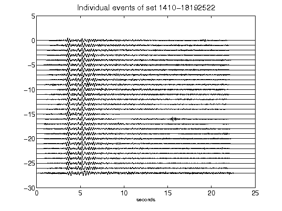](figures/1410-18192522_AllEv.png)[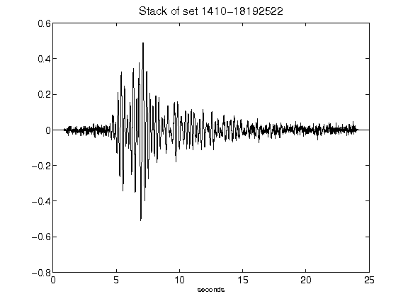](figures/1410-18192522_Stack.png)[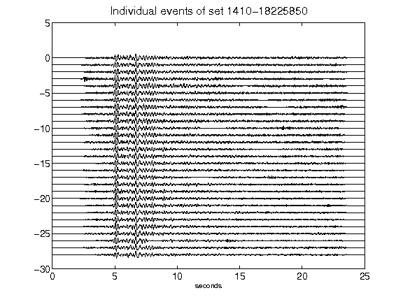](figures/1410-18225850_AllEv.png)[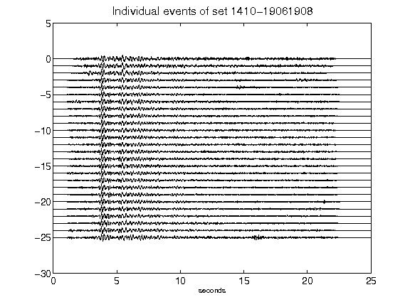](figures/1410-19061908_AllEv.png)[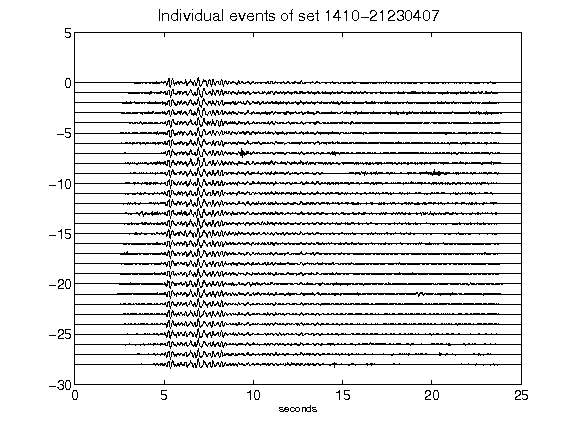](figures/1410-21230407_AllEv.png)[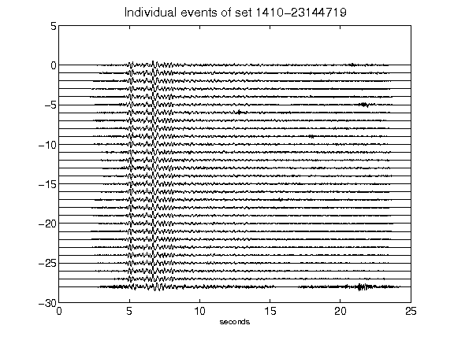](figures/1410-23144719_AllEv.png)[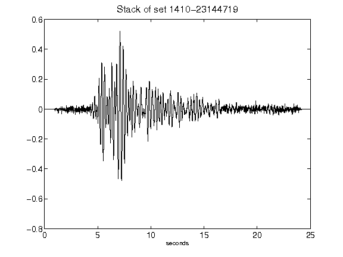](figures/1410-23144719_Stack.png)[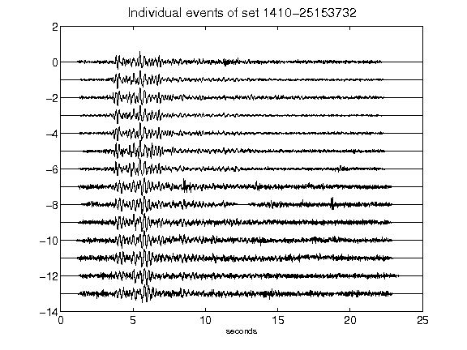](figures/1410-25153732_AllEv.png)[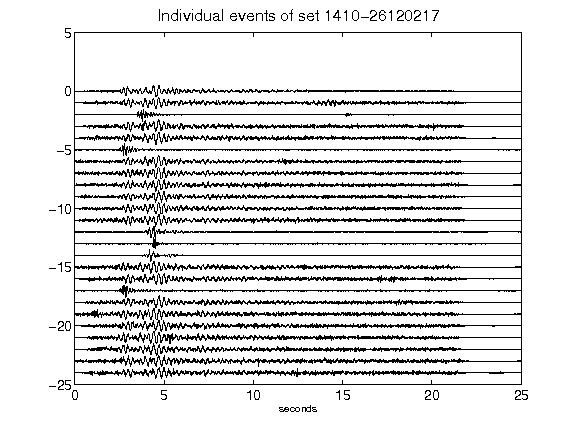](figures/1410-26120217_AllEv.png)[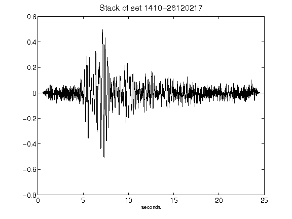](figures/1410-26120217_Stack.png)[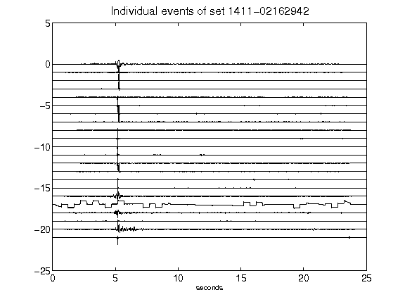](figures/1411-02162942_AllEv.png)[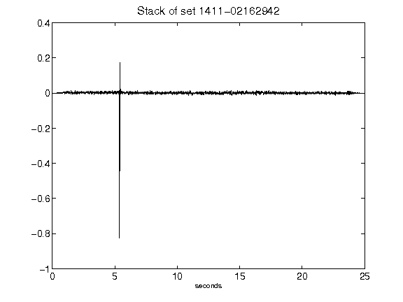](figures/1411-02162942_Stack.png)[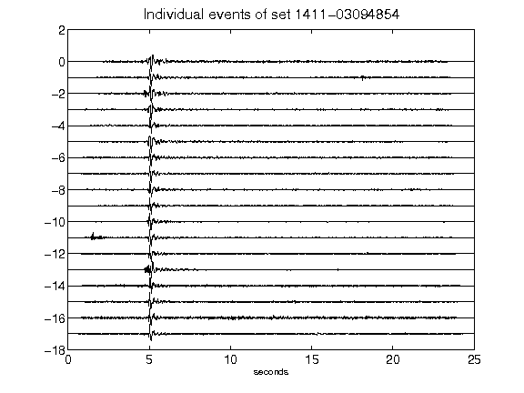](figures/1411-03094854_AllEv.png)[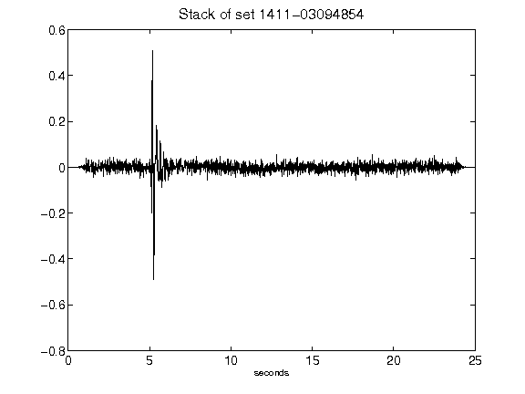](figures/1411-03094854_Stack.png)[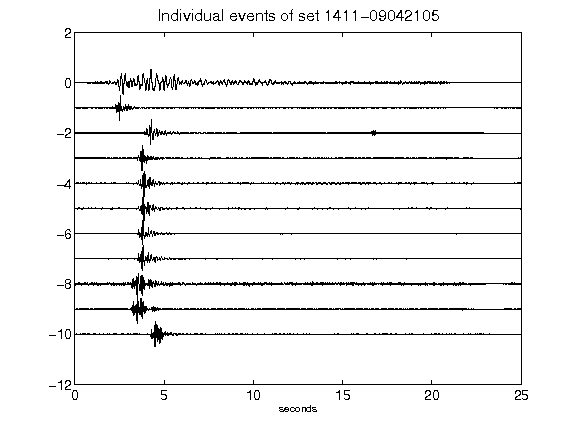](figures/1411-09042105_AllEv.png)[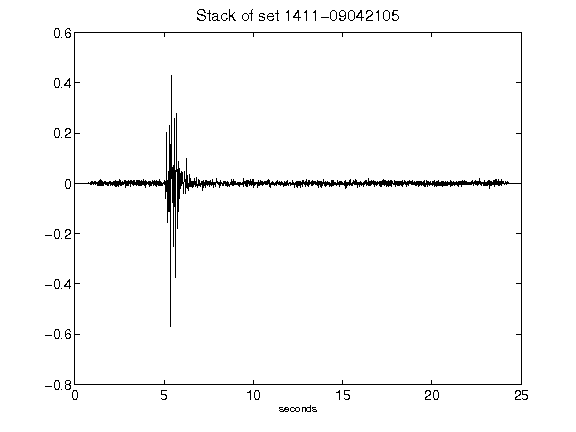](figures/1411-09042105_Stack.png)[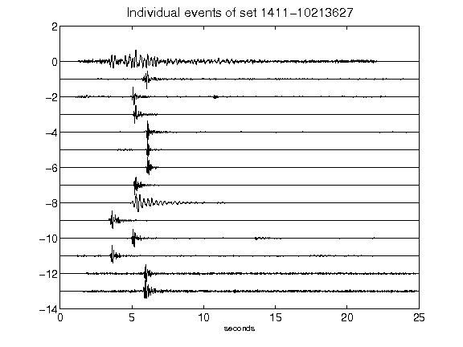](figures/1411-10213627_AllEv.png)[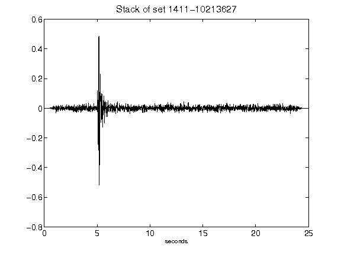](figures/1411-10213627_Stack.png)[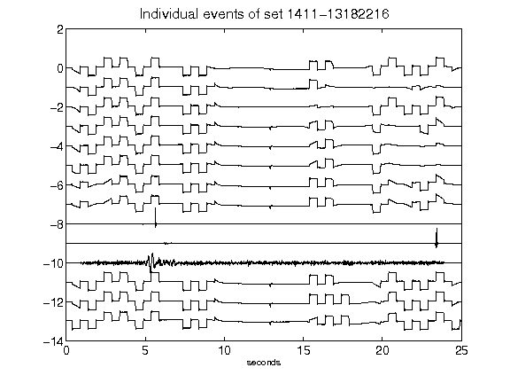](figures/1411-13182216_AllEv.png)[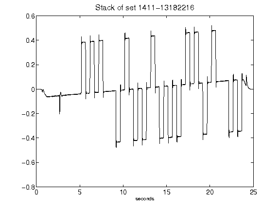](figures/1411-13182216_Stack.png)[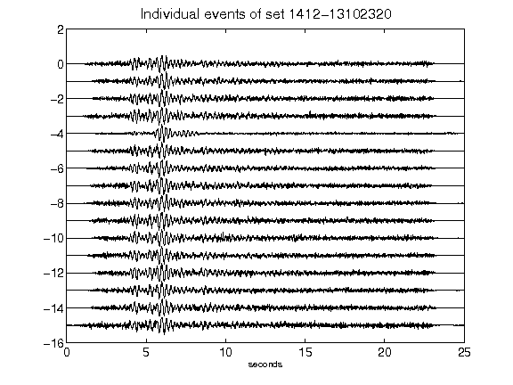](figures/1412-13102320_AllEv.png)[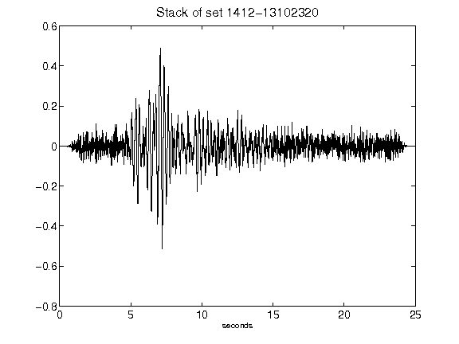](figures/1412-13102320_Stack.png)