# Repeating Earthquake Activity at STAR

## Waveforms
[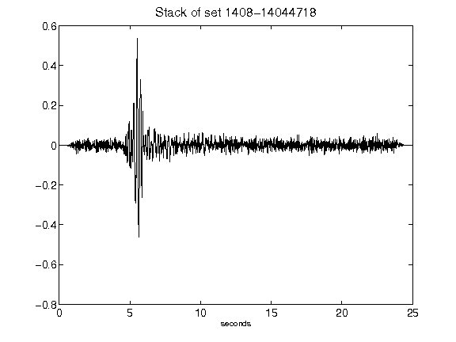](figures/1408-14044718_Stack.png)[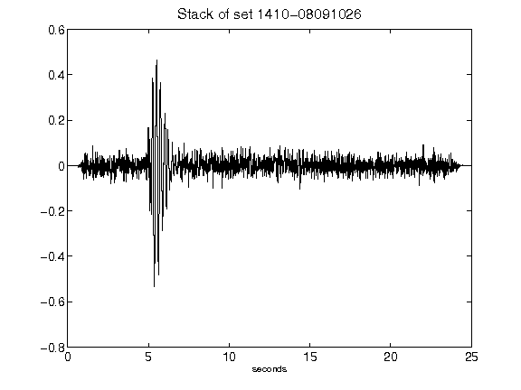](figures/1410-08091026_Stack.png)[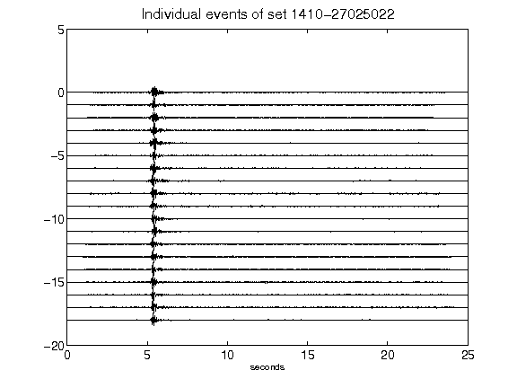](figures/1410-27025022_AllEv.png)[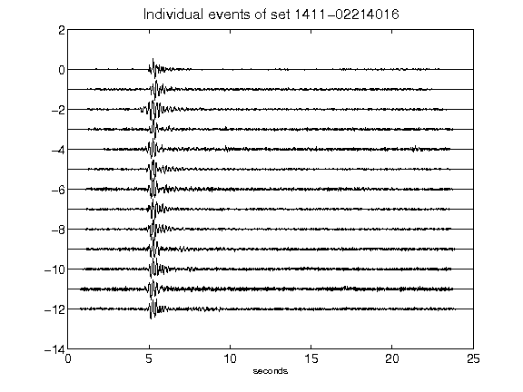](figures/1411-02214016_AllEv.png)[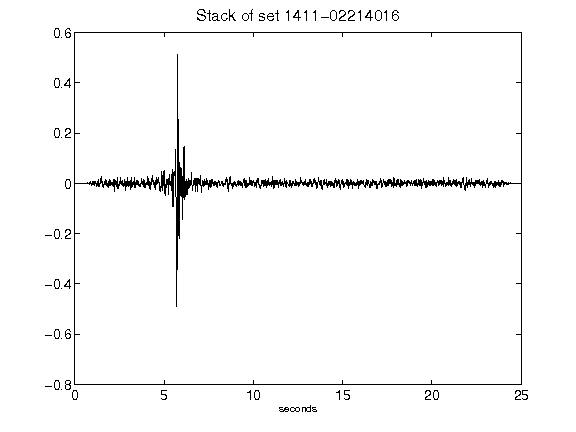](figures/1411-02214016_Stack.png)[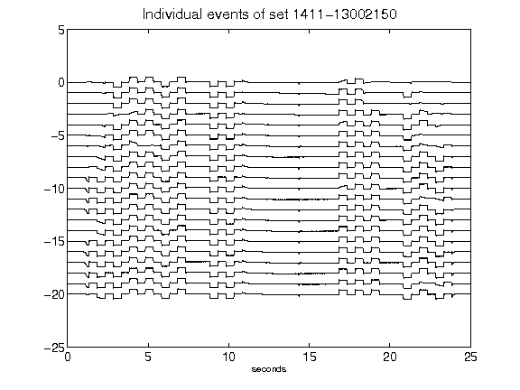](figures/1411-13002150_AllEv.png)[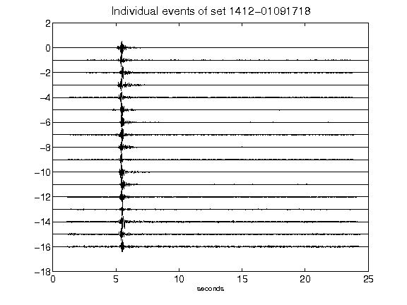](figures/1412-01091718_AllEv.png)[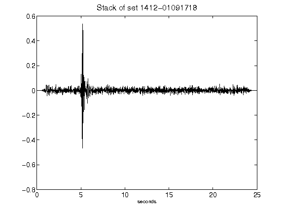](figures/1412-01091718_Stack.png)[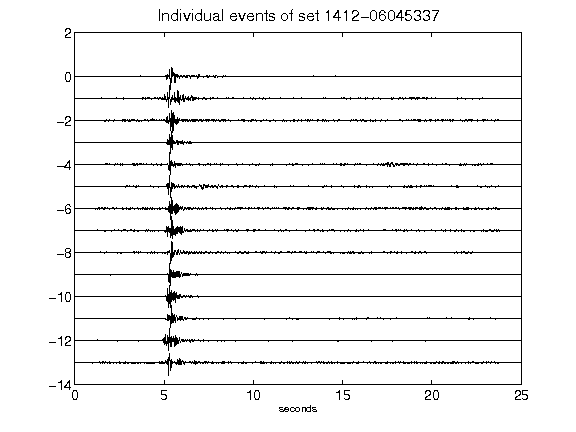](figures/1412-06045337_AllEv.png)[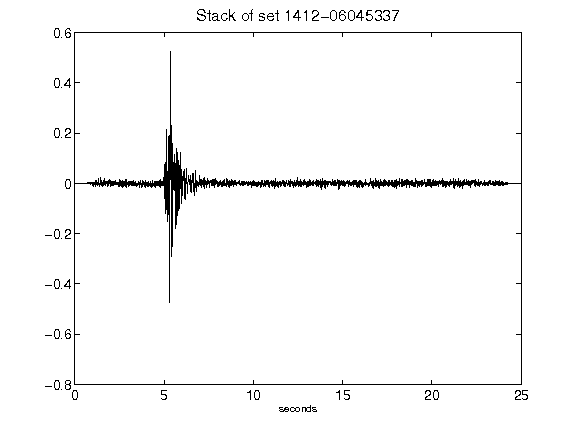](figures/1412-06045337_Stack.png)[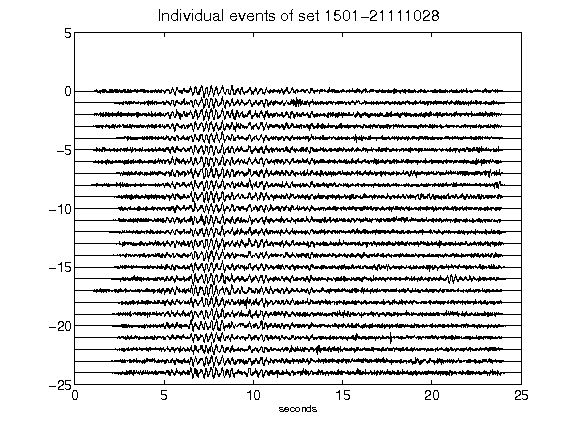](figures/1501-21111028_AllEv.png)[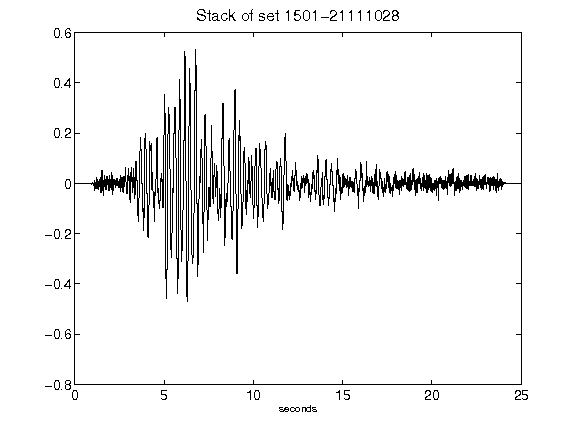](figures/1501-21111028_Stack.png)[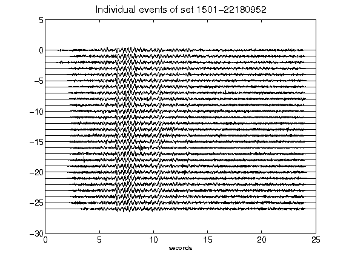](figures/1501-22180952_AllEv.png)[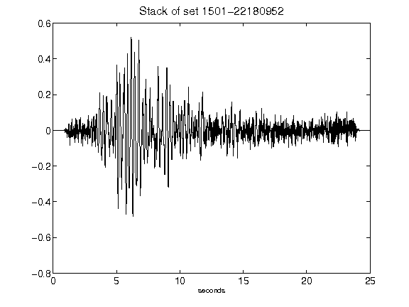](figures/1501-22180952_Stack.png)