# Repeating Earthquake Activity at STAR

## Waveforms
[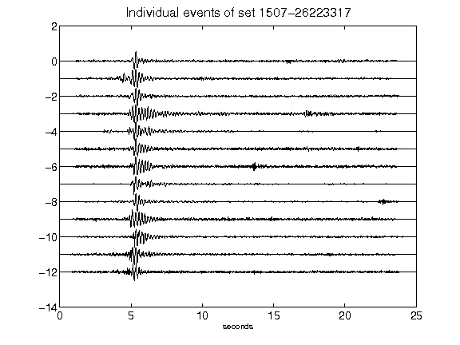](figures/1507-26223317_AllEv.png)[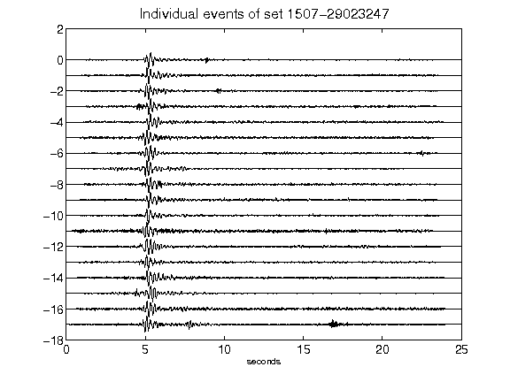](figures/1507-29023247_AllEv.png)[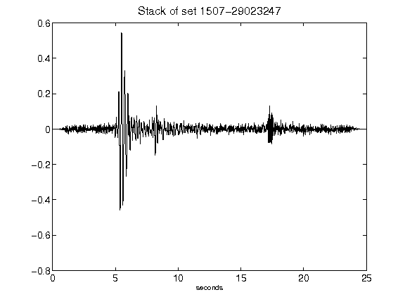](figures/1507-29023247_Stack.png)[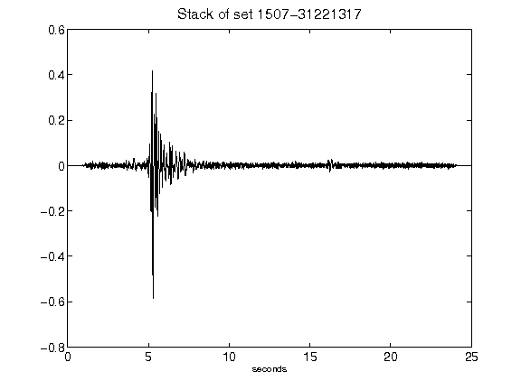](figures/1507-31221317_Stack.png)[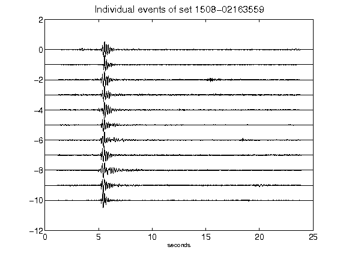](figures/1508-02163559_AllEv.png)[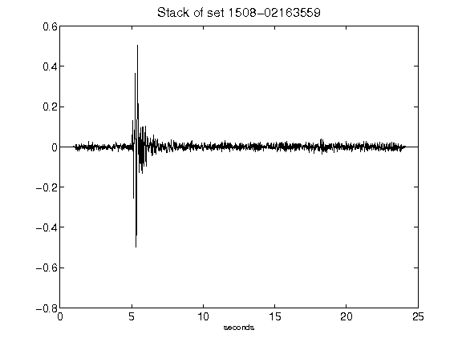](figures/1508-02163559_Stack.png)[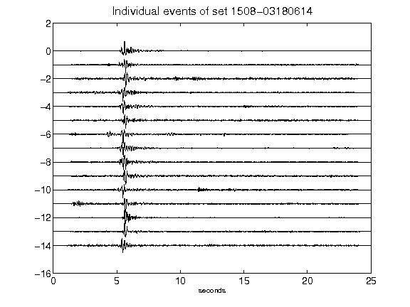](figures/1508-03180614_AllEv.png)[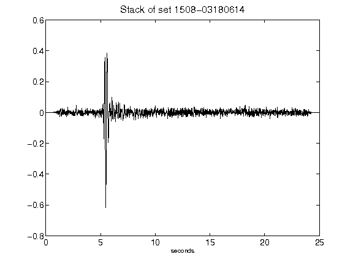](figures/1508-03180614_Stack.png)[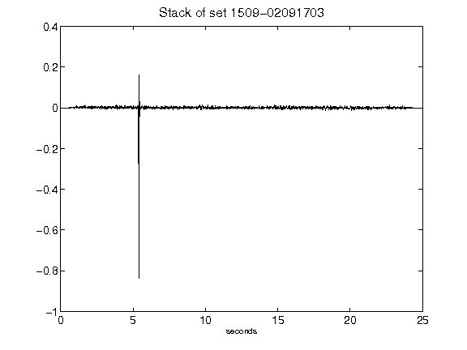](figures/1509-02091703_Stack.png)[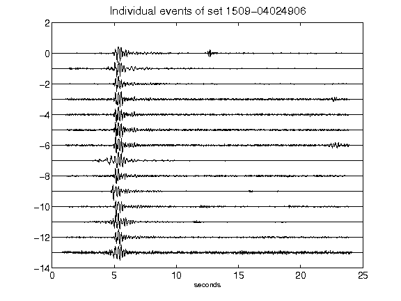](figures/1509-04024906_AllEv.png)[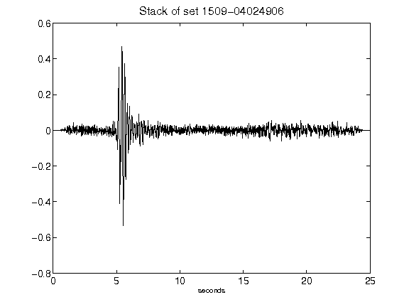](figures/1509-04024906_Stack.png)