# Repeating Earthquake Activity at STAR

## Waveforms
[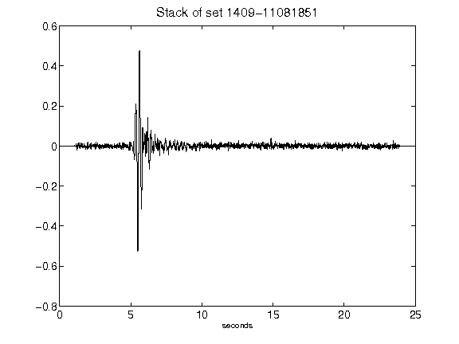](figures/1409-11081851_Stack.png)[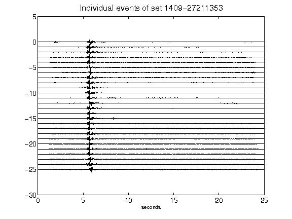](figures/1409-27211353_AllEv.png)[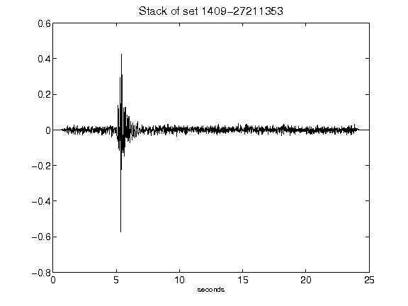](figures/1409-27211353_Stack.png)[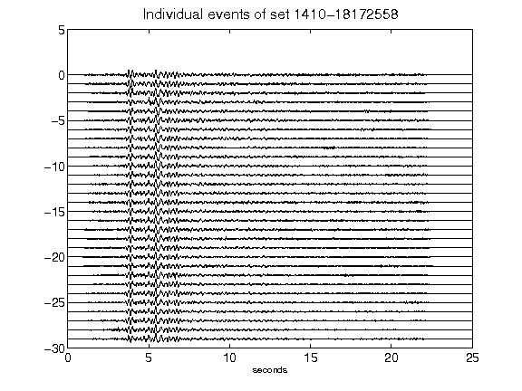](figures/1410-18172558_AllEv.png)[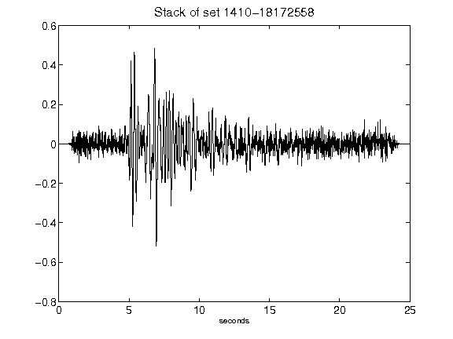](figures/1410-18172558_Stack.png)[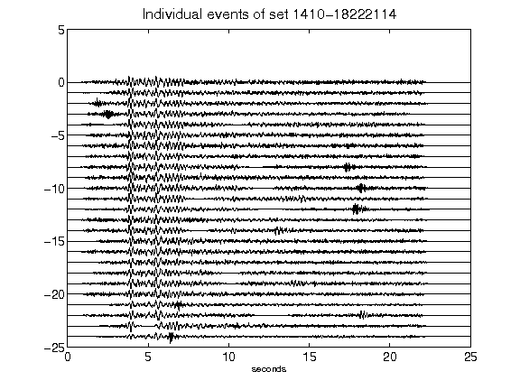](figures/1410-18222114_AllEv.png)[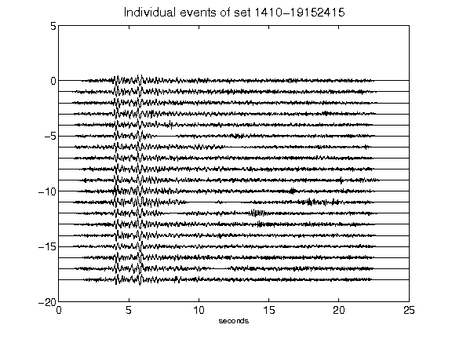](figures/1410-19152415_AllEv.png)[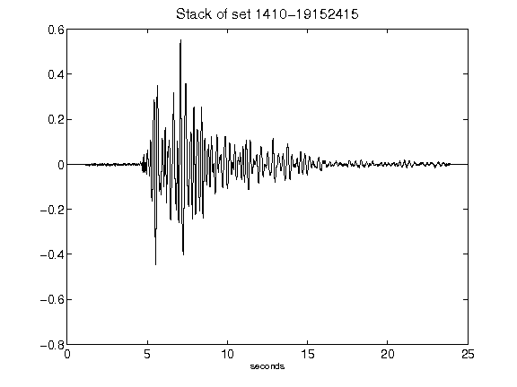](figures/1410-19152415_Stack.png)[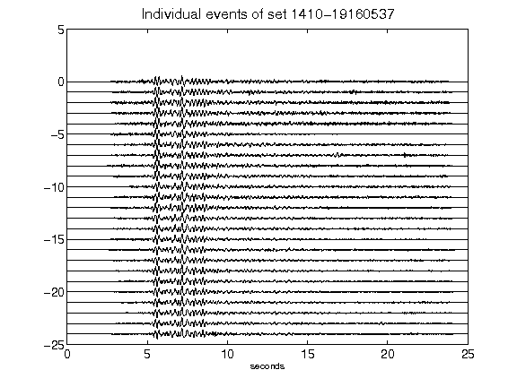](figures/1410-19160537_AllEv.png)[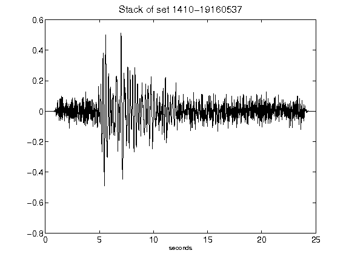](figures/1410-19160537_Stack.png)[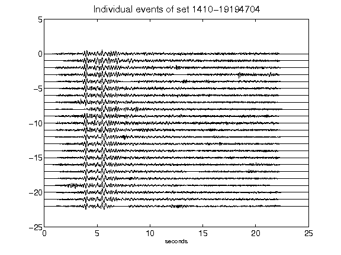](figures/1410-19194704_AllEv.png)[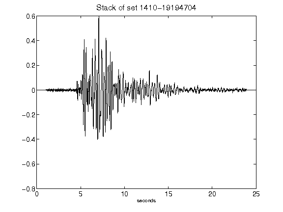](figures/1410-19194704_Stack.png)[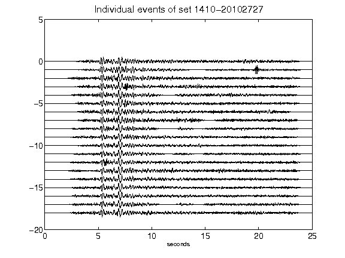](figures/1410-20102727_AllEv.png)[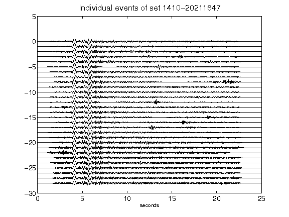](figures/1410-20211647_AllEv.png)[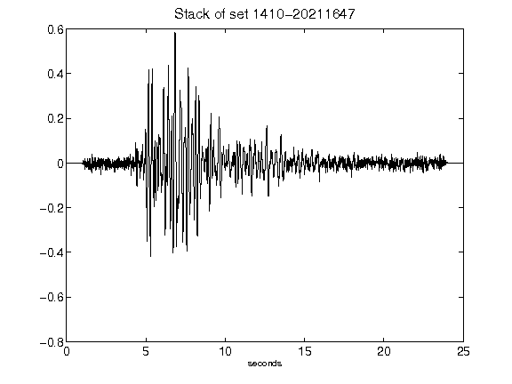](figures/1410-20211647_Stack.png)[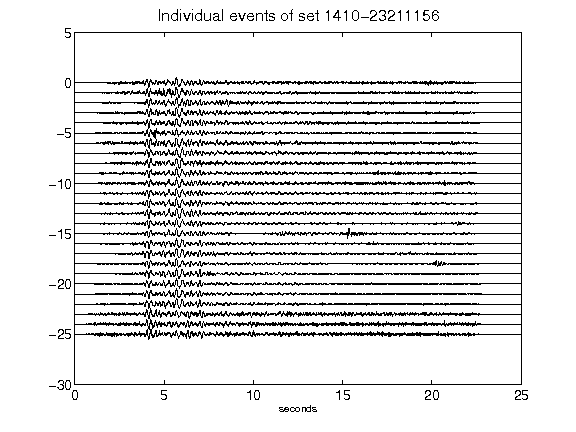](figures/1410-23211156_AllEv.png)[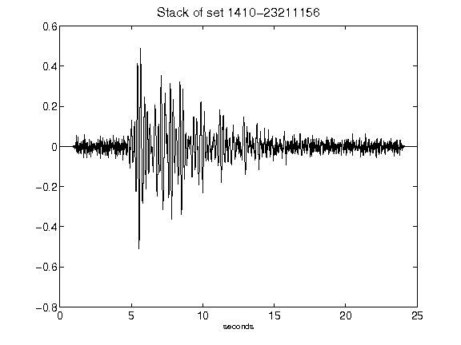](figures/1410-23211156_Stack.png)[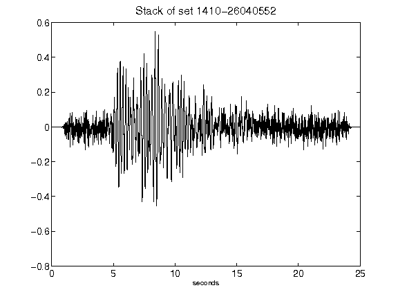](figures/1410-26040552_Stack.png)[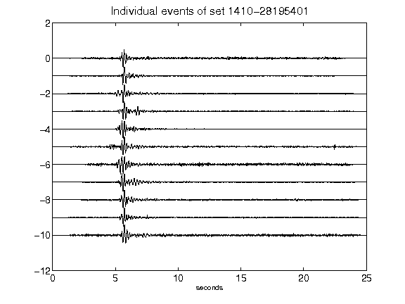](figures/1410-28195401_AllEv.png)[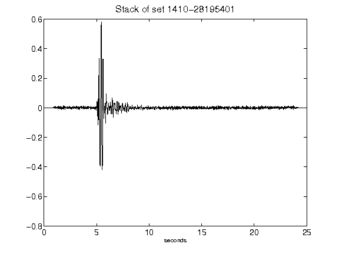](figures/1410-28195401_Stack.png)[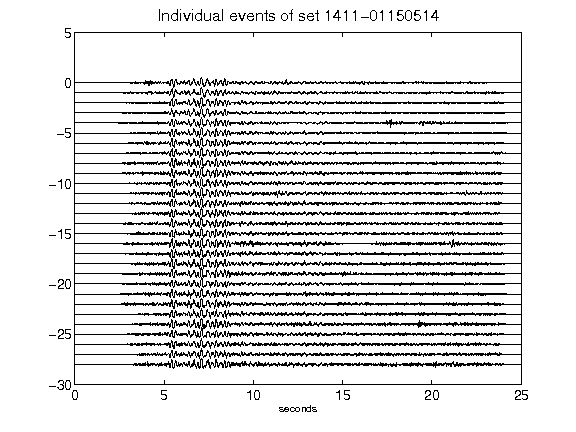](figures/1411-01150514_AllEv.png)[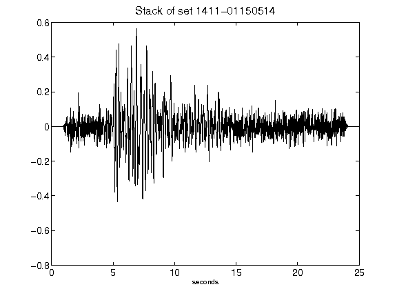](figures/1411-01150514_Stack.png)[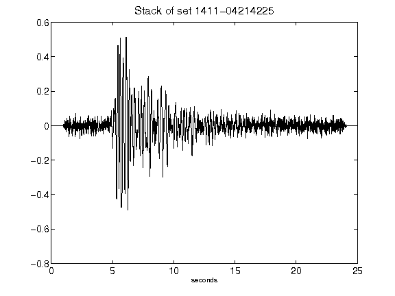](figures/1411-04214225_Stack.png)[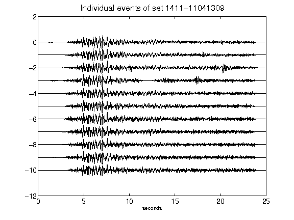](figures/1411-11041309_AllEv.png)[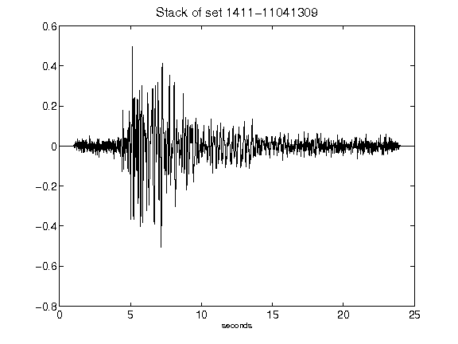](figures/1411-11041309_Stack.png)