# Repeating Earthquake Activity at STAR

## Waveforms
[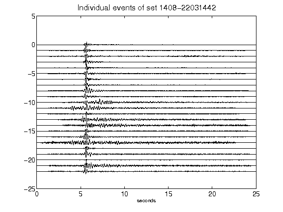](figures/1408-22031442_AllEv.png)[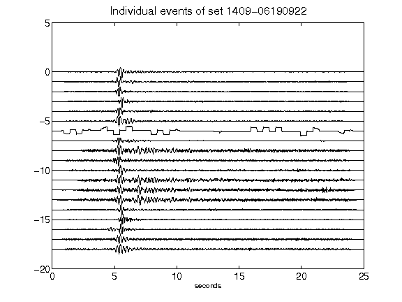](figures/1409-06190922_AllEv.png)[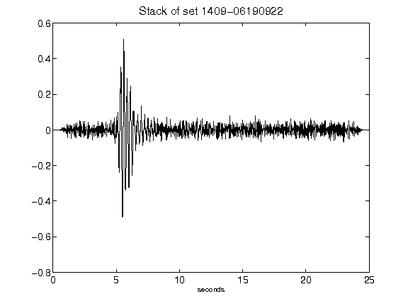](figures/1409-06190922_Stack.png)[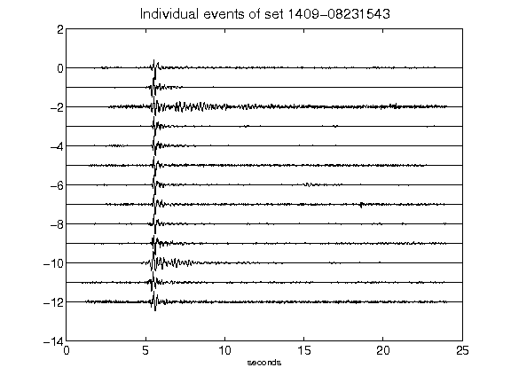](figures/1409-08231543_AllEv.png)[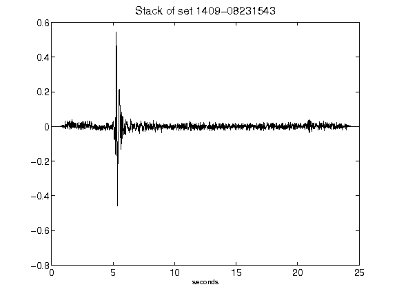](figures/1409-08231543_Stack.png)[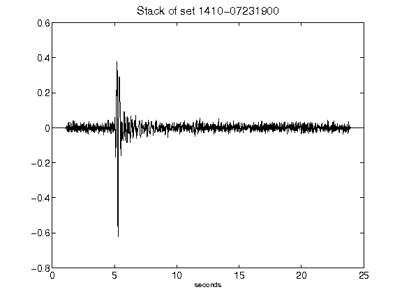](figures/1410-07231900_Stack.png)[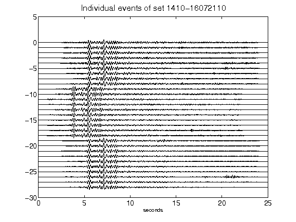](figures/1410-16072110_AllEv.png)[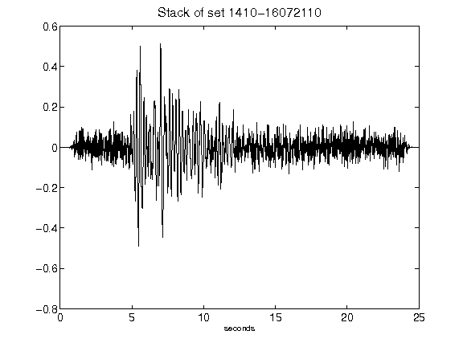](figures/1410-16072110_Stack.png)[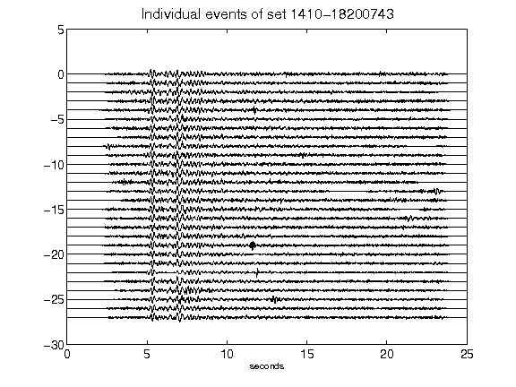](figures/1410-18200743_AllEv.png)[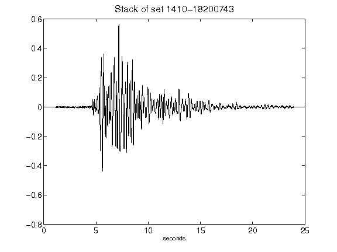](figures/1410-18200743_Stack.png)[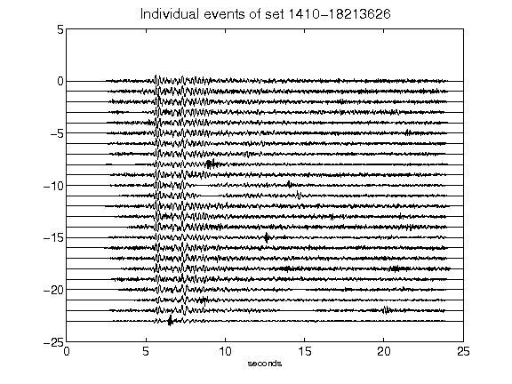](figures/1410-18213626_AllEv.png)[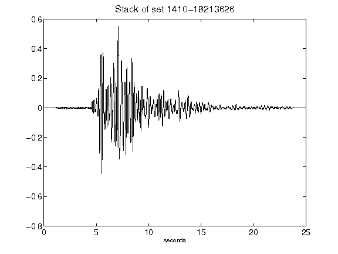](figures/1410-18213626_Stack.png)[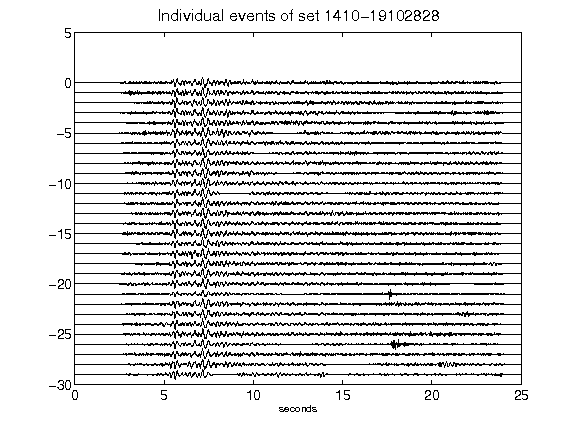](figures/1410-19102828_AllEv.png)[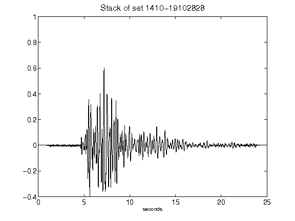](figures/1410-19102828_Stack.png)[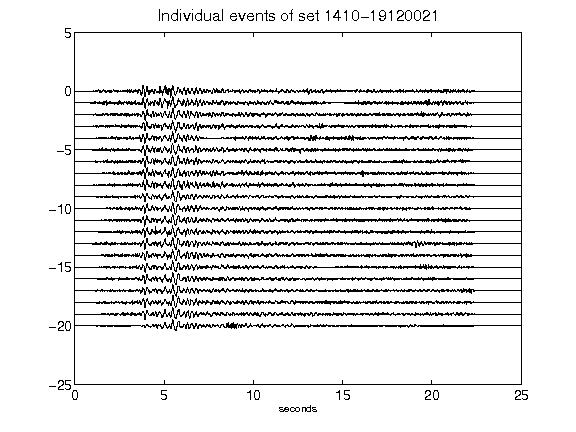](figures/1410-19120021_AllEv.png)[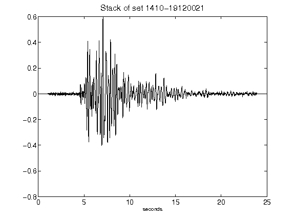](figures/1410-19120021_Stack.png)[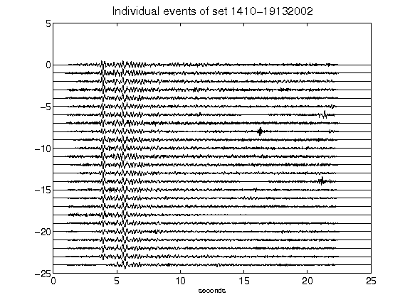](figures/1410-19132002_AllEv.png)[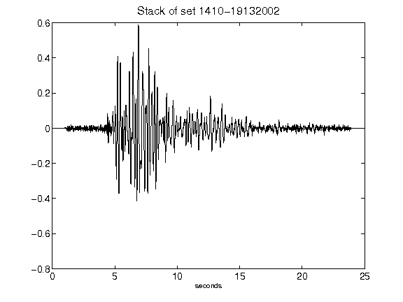](figures/1410-19132002_Stack.png)[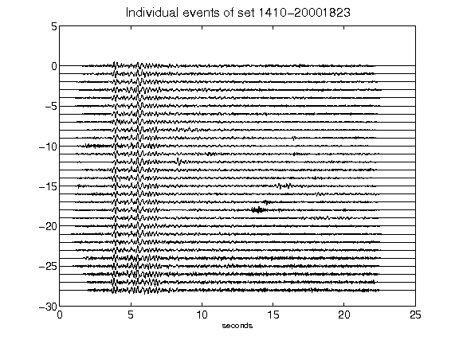](figures/1410-20001823_AllEv.png)[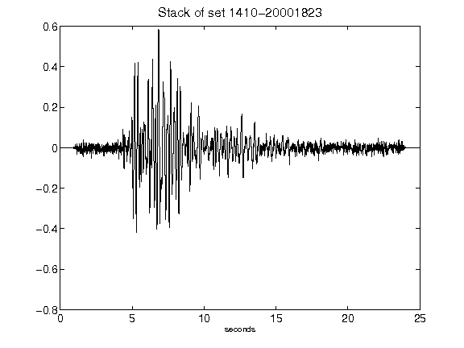](figures/1410-20001823_Stack.png)[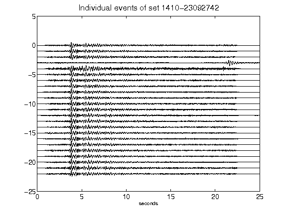](figures/1410-23092742_AllEv.png)[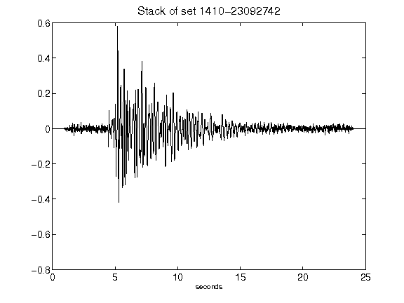](figures/1410-23092742_Stack.png)[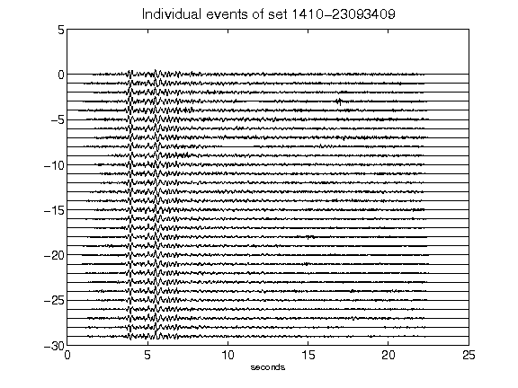](figures/1410-23093409_AllEv.png)[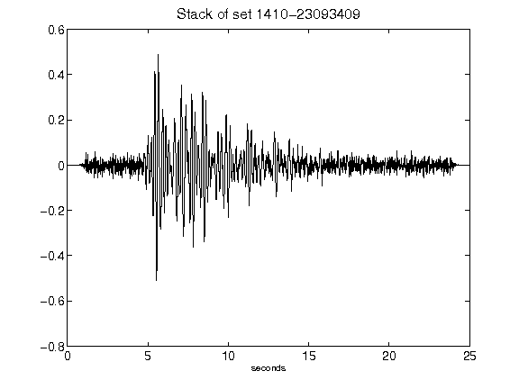](figures/1410-23093409_Stack.png)[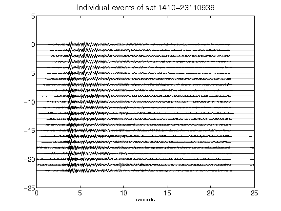](figures/1410-23110936_AllEv.png)[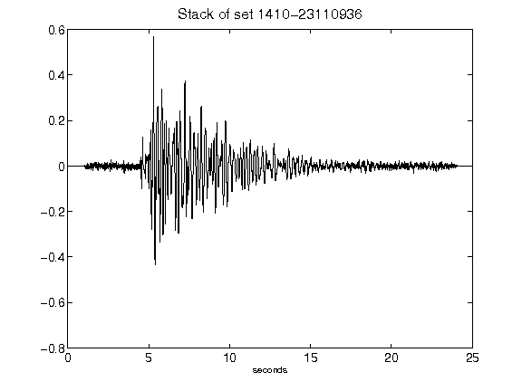](figures/1410-23110936_Stack.png)[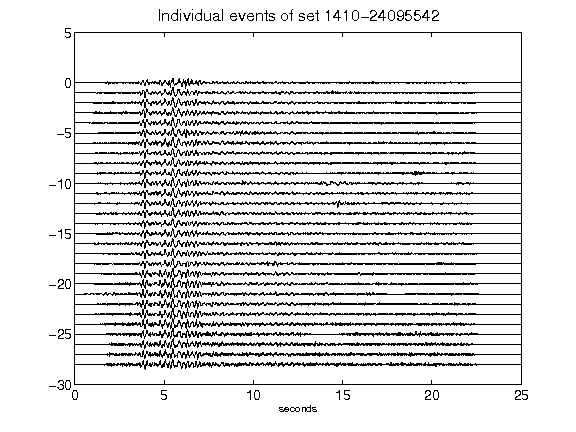](figures/1410-24095542_AllEv.png)[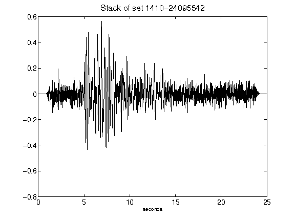](figures/1410-24095542_Stack.png)[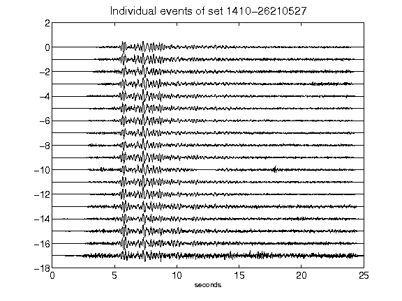](figures/1410-26210527_AllEv.png)[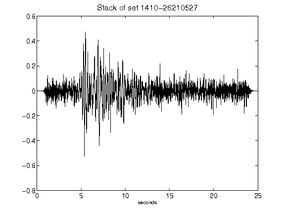](figures/1410-26210527_Stack.png)[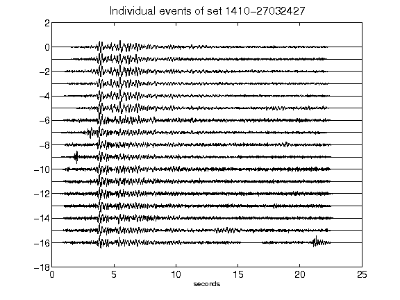](figures/1410-27032427_AllEv.png)[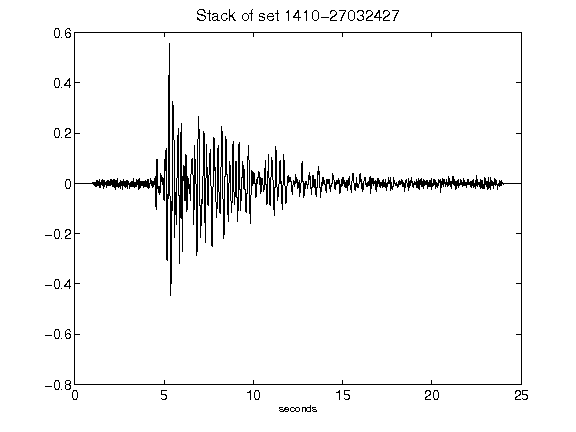](figures/1410-27032427_Stack.png)[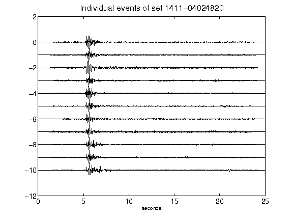](figures/1411-04024820_AllEv.png)[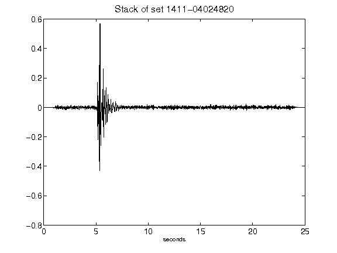](figures/1411-04024820_Stack.png)[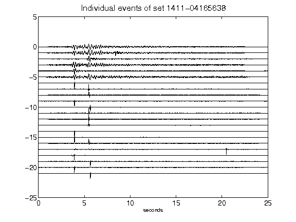](figures/1411-04165638_AllEv.png)[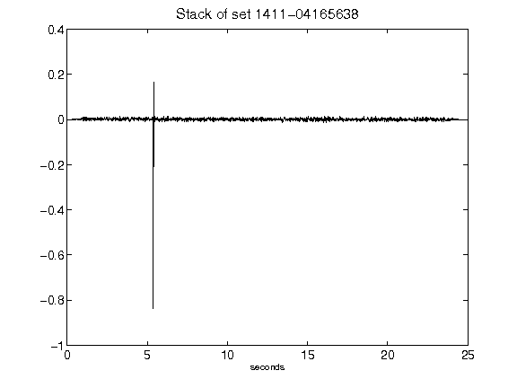](figures/1411-04165638_Stack.png)