# Repeating Earthquake Activity at STAR

## Waveforms
[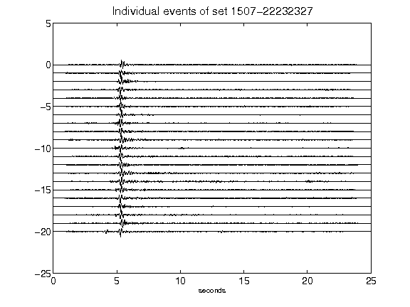](figures/1507-22232327_AllEv.png)[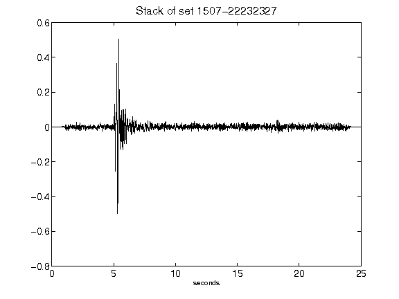](figures/1507-22232327_Stack.png)[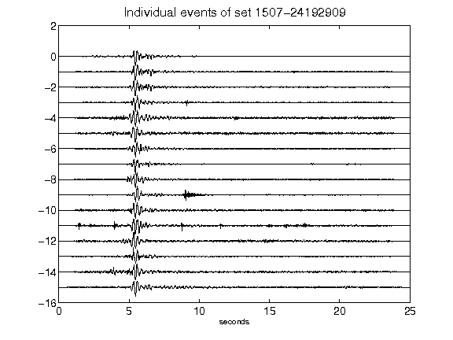](figures/1507-24192909_AllEv.png)[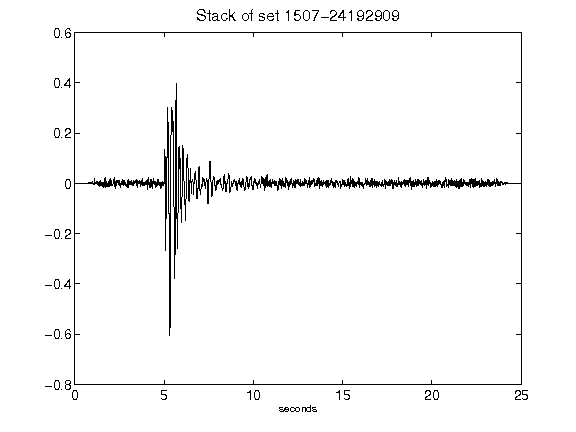](figures/1507-24192909_Stack.png)[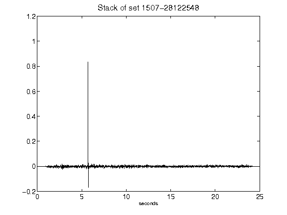](figures/1507-28122548_Stack.png)[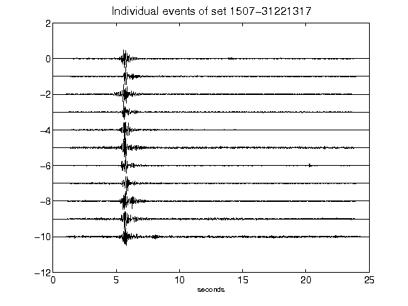](figures/1507-31221317_AllEv.png)[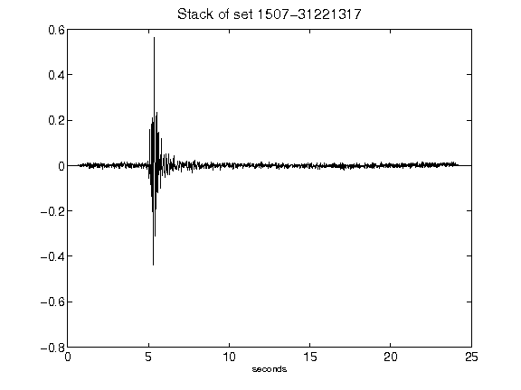](figures/1507-31221317_Stack.png)[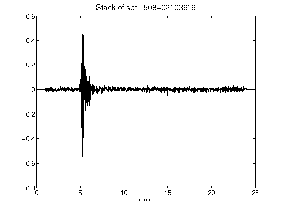](figures/1508-02103619_Stack.png)[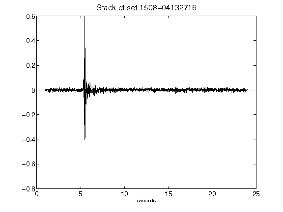](figures/1508-04132716_Stack.png)[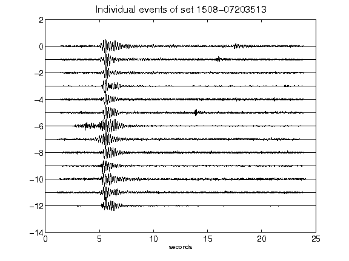](figures/1508-07203513_AllEv.png)[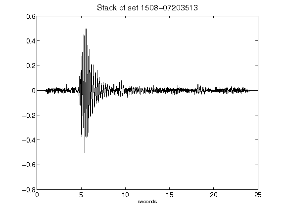](figures/1508-07203513_Stack.png)