# Repeating Earthquake Activity at STAR

## Waveforms
[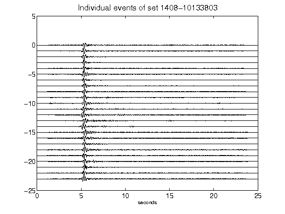](figures/1408-10133803_AllEv.png)[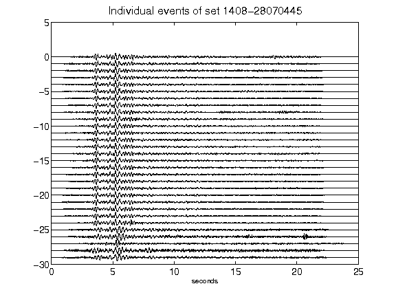](figures/1408-28070445_AllEv.png)[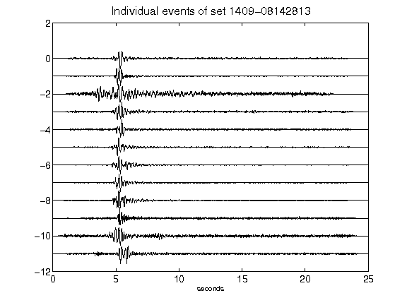](figures/1409-08142813_AllEv.png)[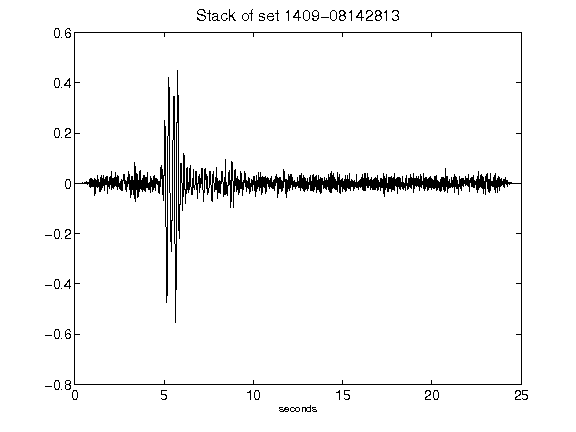](figures/1409-08142813_Stack.png)[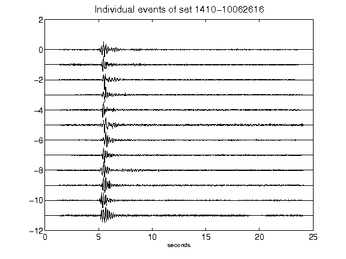](figures/1410-10062616_AllEv.png)[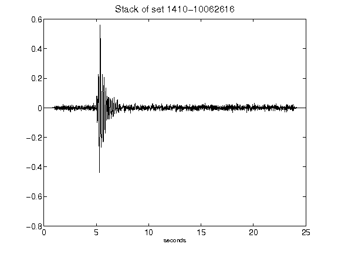](figures/1410-10062616_Stack.png)[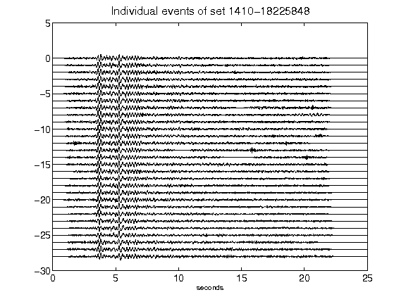](figures/1410-18225848_AllEv.png)[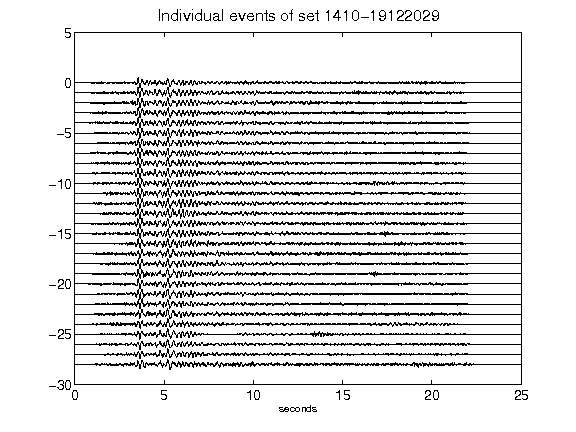](figures/1410-19122029_AllEv.png)[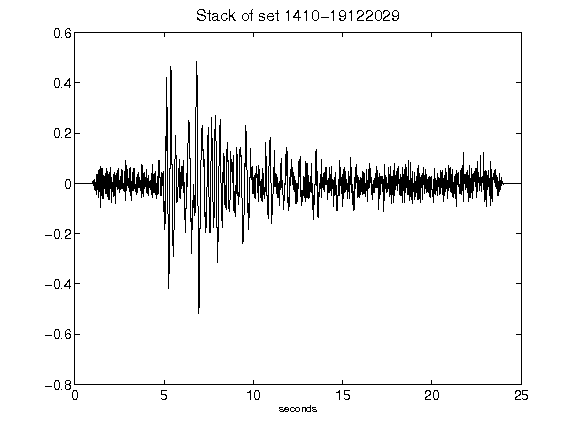](figures/1410-19122029_Stack.png)[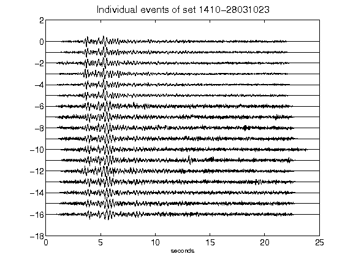](figures/1410-28031023_AllEv.png)[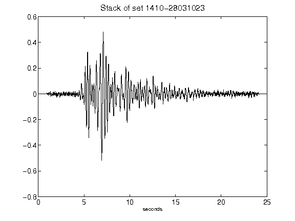](figures/1410-28031023_Stack.png)[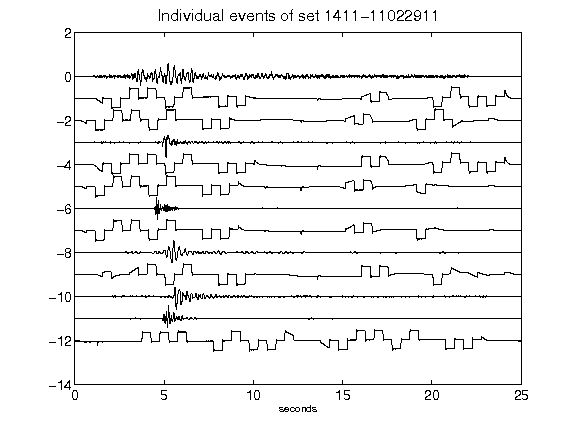](figures/1411-11022911_AllEv.png)[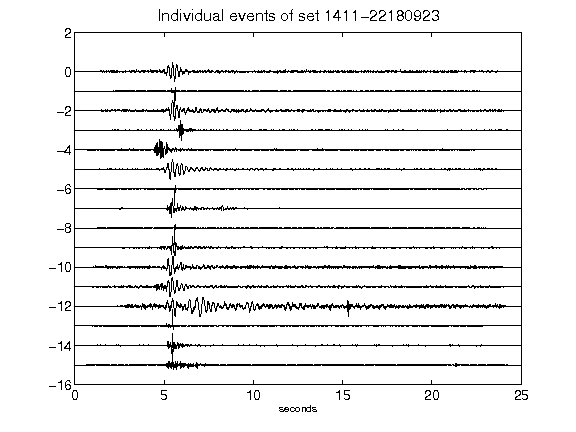](figures/1411-22180923_AllEv.png)[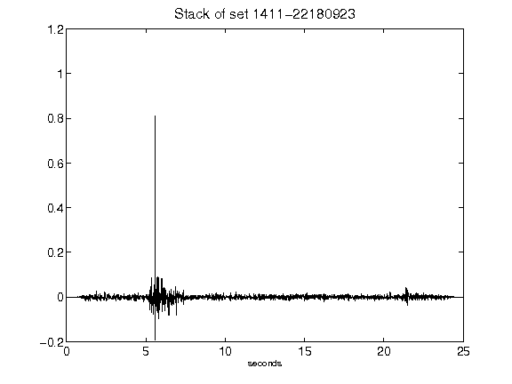](figures/1411-22180923_Stack.png)[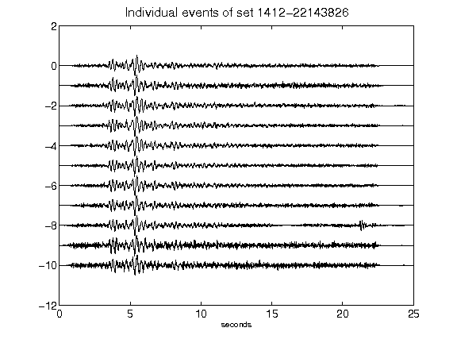](figures/1412-22143826_AllEv.png)[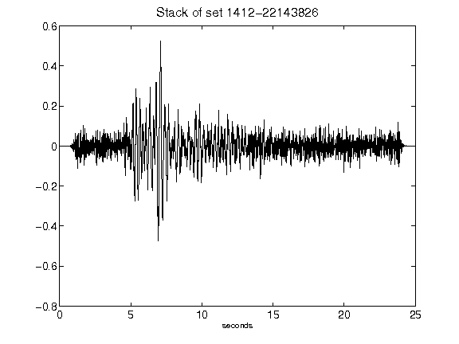](figures/1412-22143826_Stack.png)