# Repeating Earthquake Activity at STAR

## Waveforms
[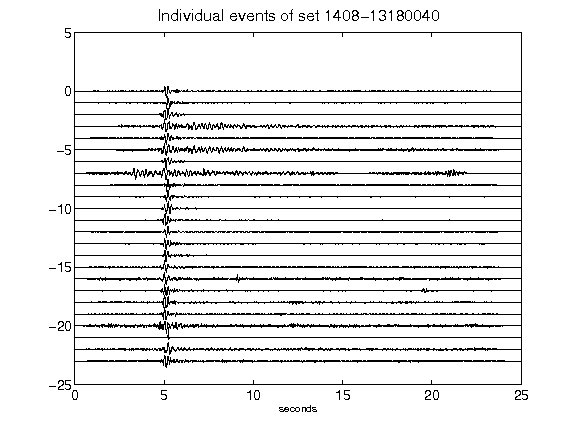](figures/1408-13180040_AllEv.png)[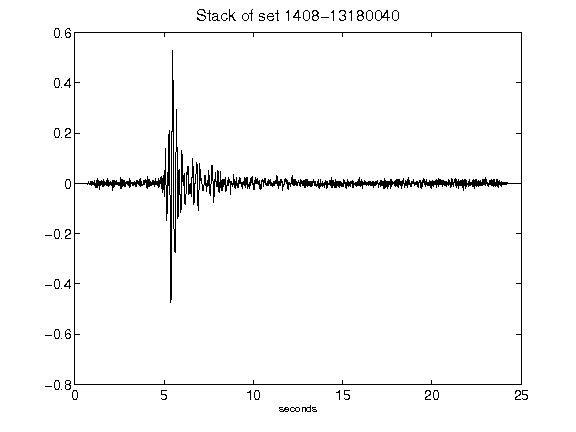](figures/1408-13180040_Stack.png)[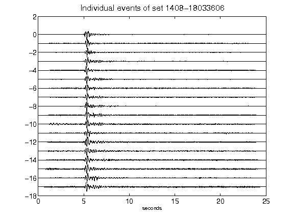](figures/1408-18033606_AllEv.png)[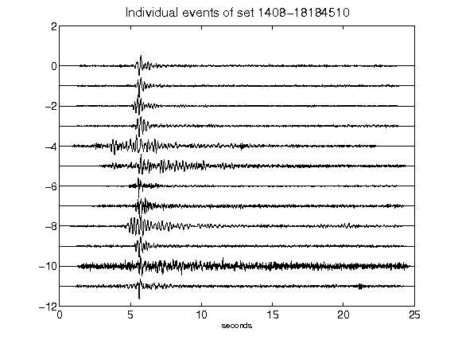](figures/1408-18184510_AllEv.png)[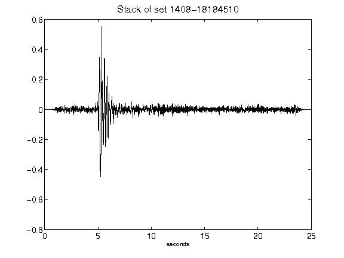](figures/1408-18184510_Stack.png)[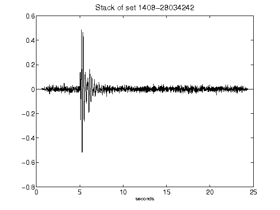](figures/1408-28034242_Stack.png)[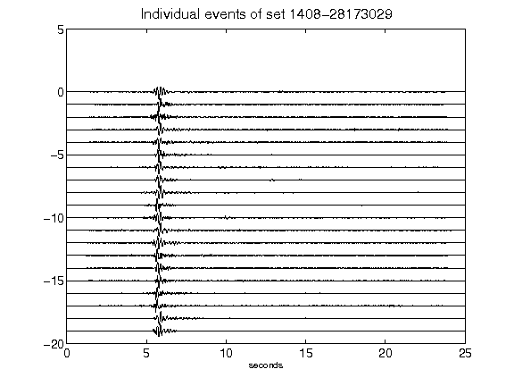](figures/1408-28173029_AllEv.png)[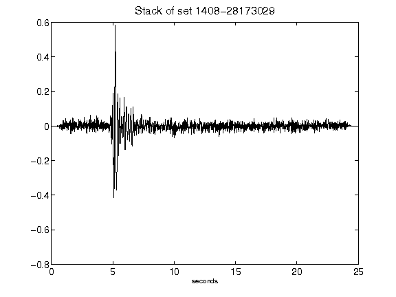](figures/1408-28173029_Stack.png)[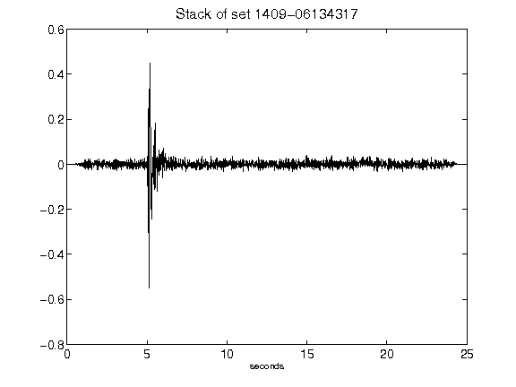](figures/1409-06134317_Stack.png)[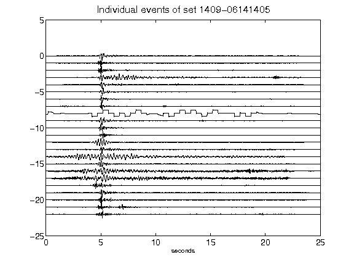](figures/1409-06141405_AllEv.png)[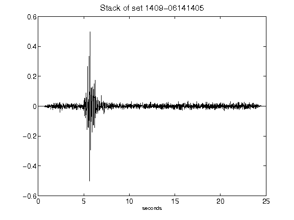](figures/1409-06141405_Stack.png)[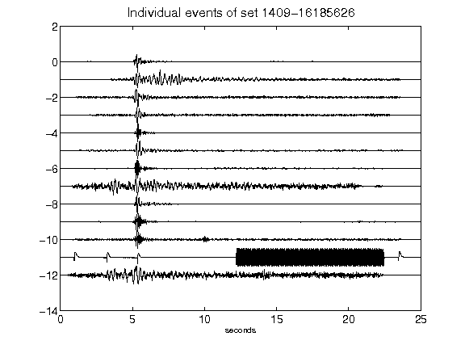](figures/1409-16185626_AllEv.png)[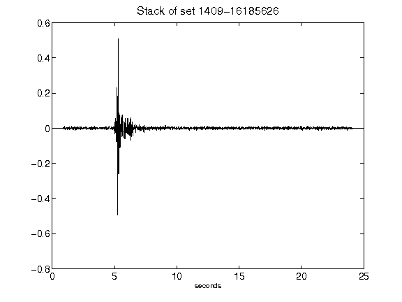](figures/1409-16185626_Stack.png)[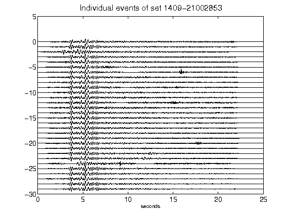](figures/1409-21002853_AllEv.png)[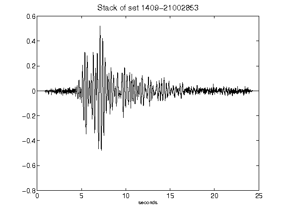](figures/1409-21002853_Stack.png)[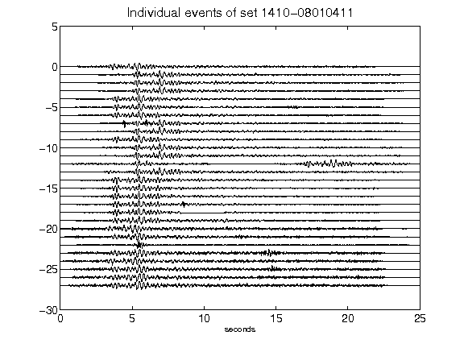](figures/1410-08010411_AllEv.png)[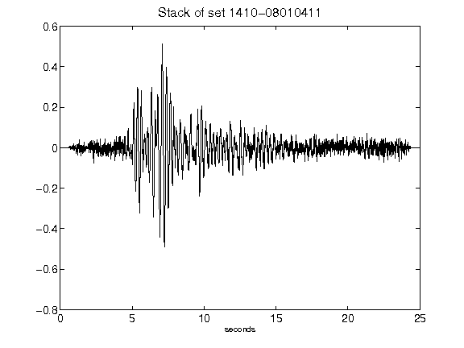](figures/1410-08010411_Stack.png)[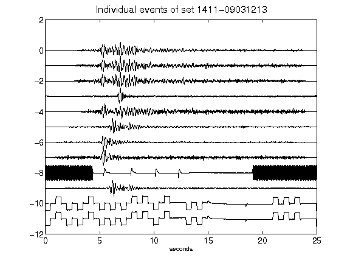](figures/1411-09031213_AllEv.png)[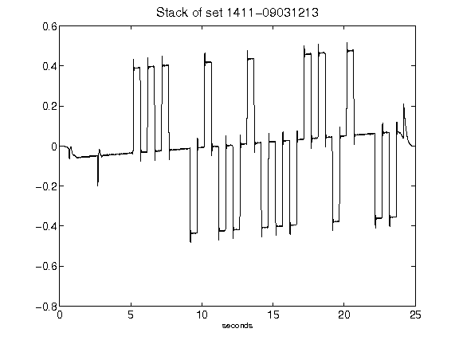](figures/1411-09031213_Stack.png)[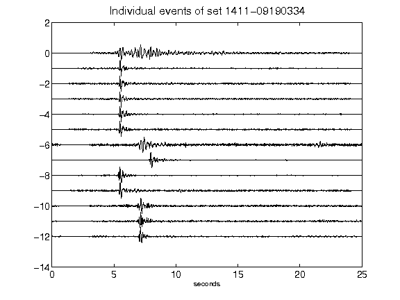](figures/1411-09190334_AllEv.png)[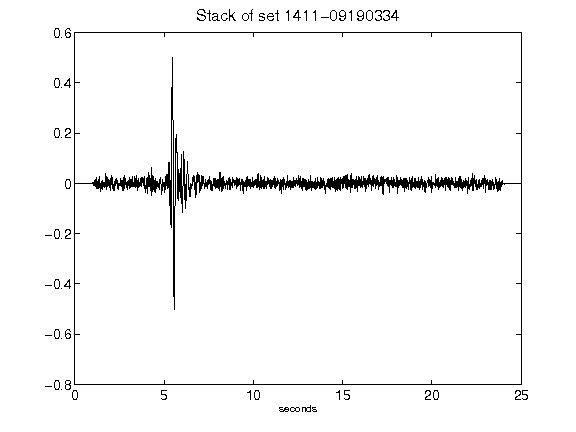](figures/1411-09190334_Stack.png)