# Repeating Earthquake Activity at STAR

## Waveforms
[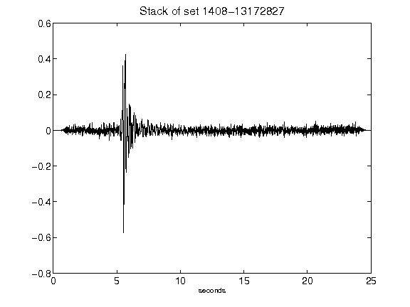](figures/1408-13172827_Stack.png)[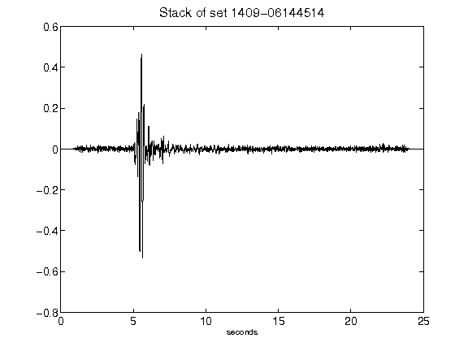](figures/1409-06144514_Stack.png)[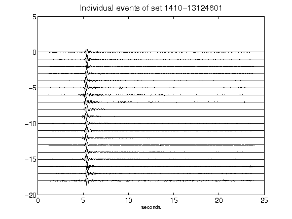](figures/1410-13124601_AllEv.png)[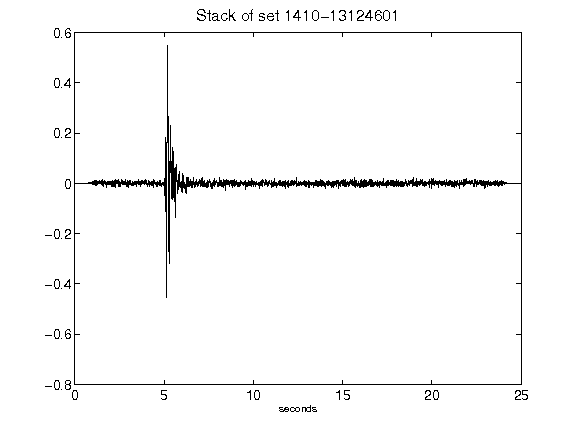](figures/1410-13124601_Stack.png)[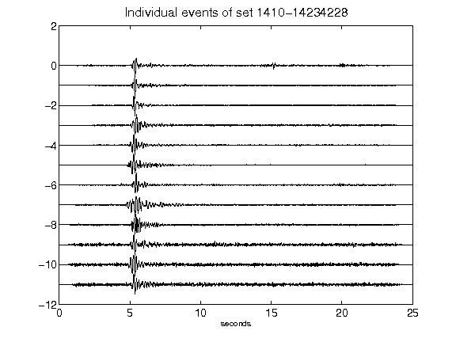](figures/1410-14234228_AllEv.png)[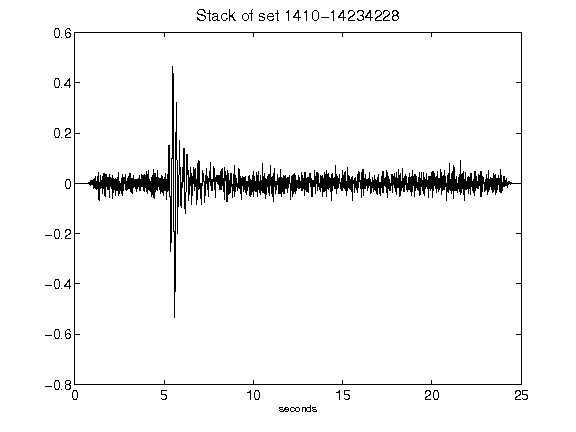](figures/1410-14234228_Stack.png)[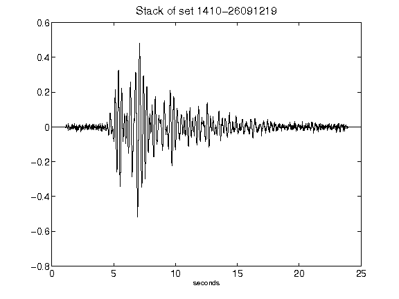](figures/1410-26091219_Stack.png)[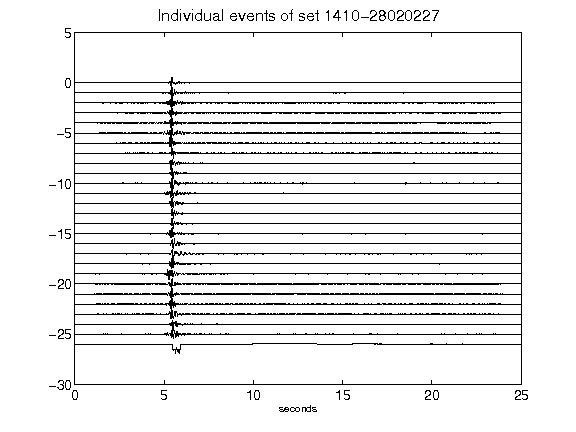](figures/1410-28020227_AllEv.png)[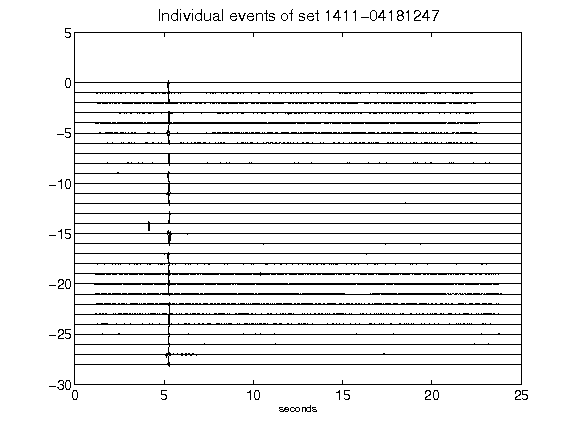](figures/1411-04181247_AllEv.png)[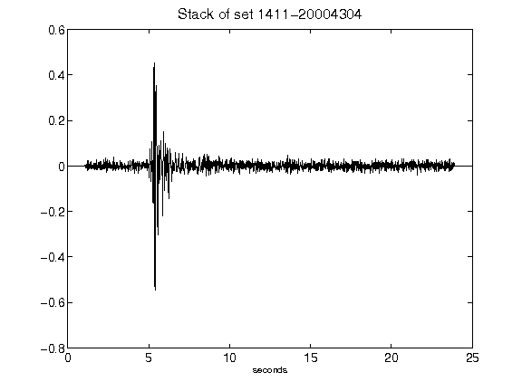](figures/1411-20004304_Stack.png)[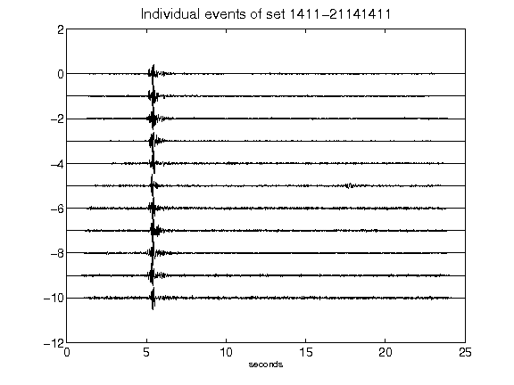](figures/1411-21141411_AllEv.png)[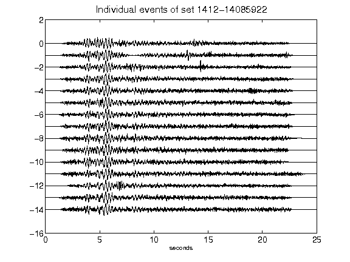](figures/1412-14085922_AllEv.png)[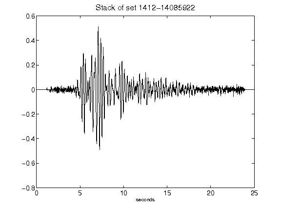](figures/1412-14085922_Stack.png)[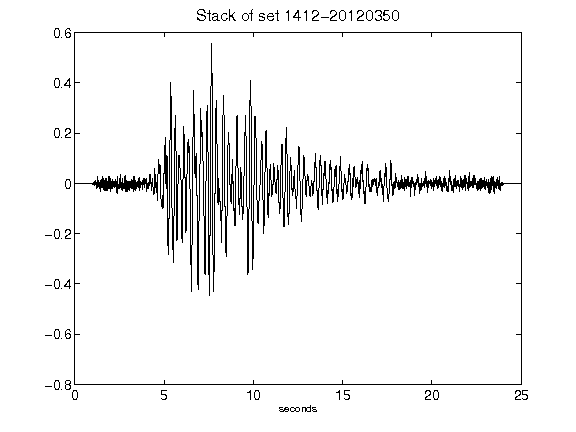](figures/1412-20120350_Stack.png)