# Repeating Earthquake Activity at STAR

## Waveforms
[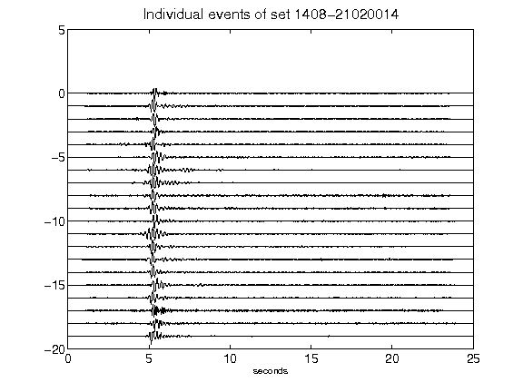](figures/1408-21020014_AllEv.png)[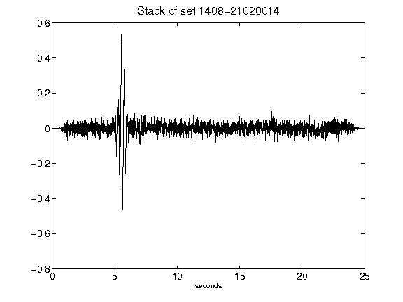](figures/1408-21020014_Stack.png)[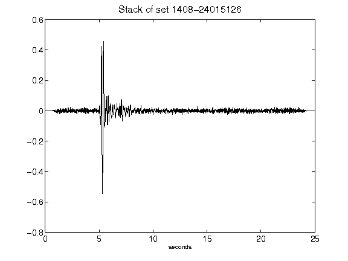](figures/1408-24015126_Stack.png)[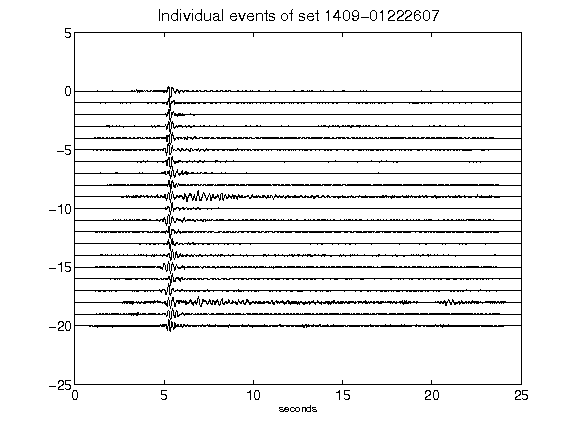](figures/1409-01222607_AllEv.png)[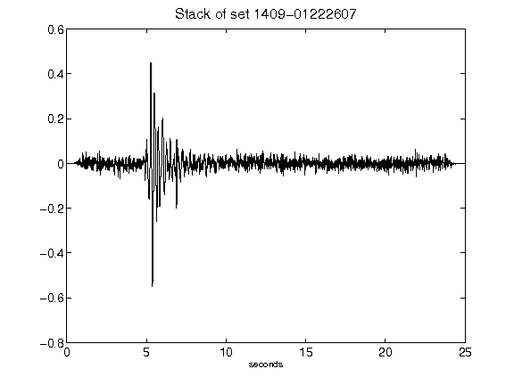](figures/1409-01222607_Stack.png)[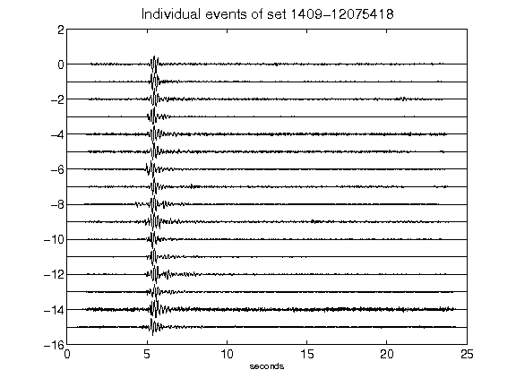](figures/1409-12075418_AllEv.png)[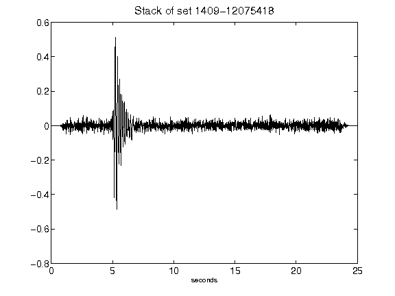](figures/1409-12075418_Stack.png)[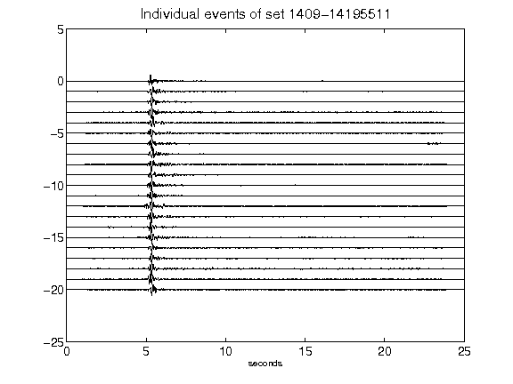](figures/1409-14195511_AllEv.png)[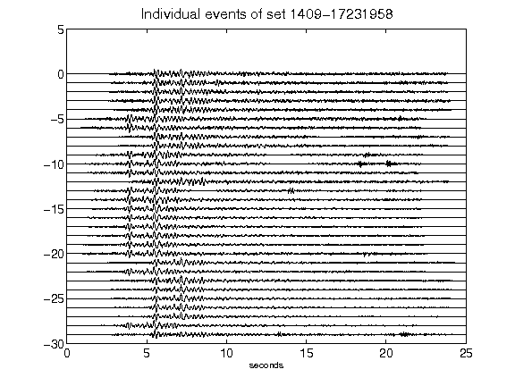](figures/1409-17231958_AllEv.png)[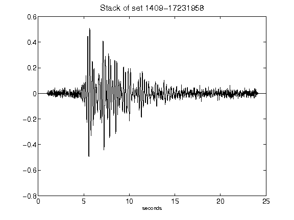](figures/1409-17231958_Stack.png)[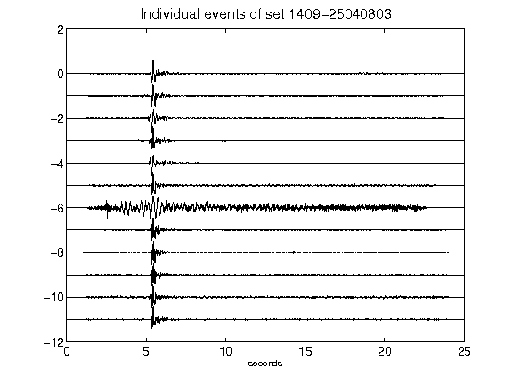](figures/1409-25040803_AllEv.png)[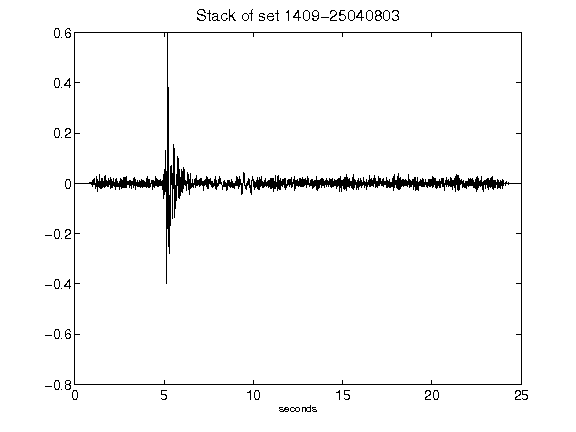](figures/1409-25040803_Stack.png)[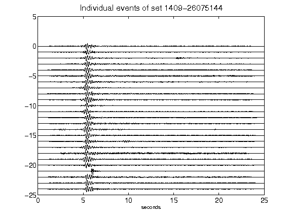](figures/1409-26075144_AllEv.png)[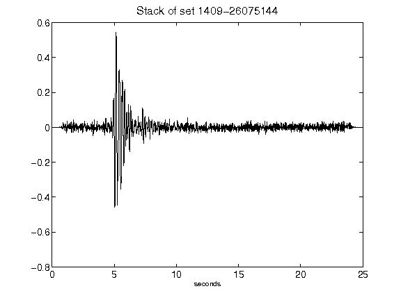](figures/1409-26075144_Stack.png)[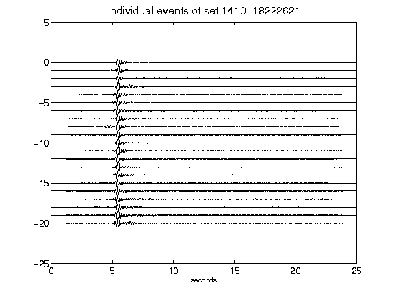](figures/1410-18222621_AllEv.png)[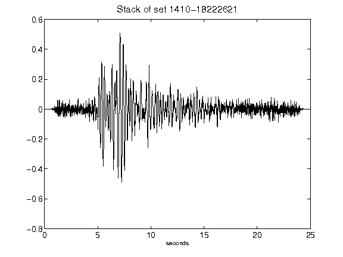](figures/1410-18222621_Stack.png)[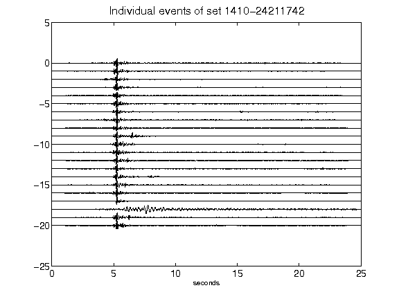](figures/1410-24211742_AllEv.png)[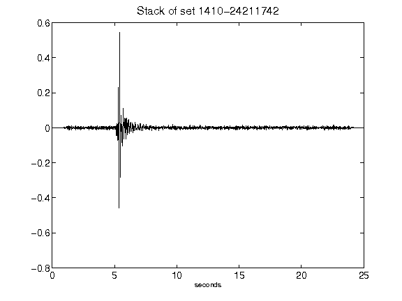](figures/1410-24211742_Stack.png)[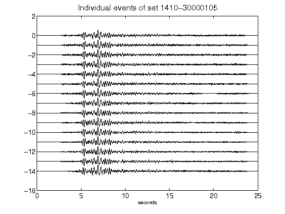](figures/1410-30000105_AllEv.png)[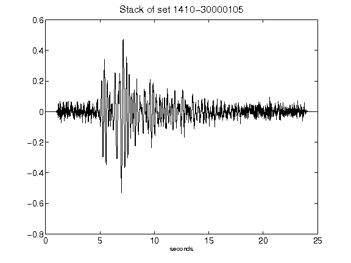](figures/1410-30000105_Stack.png)[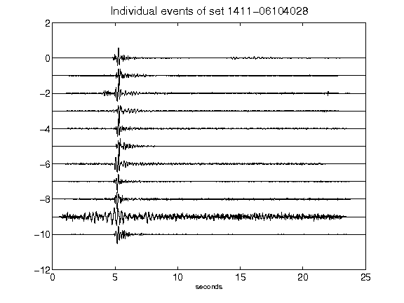](figures/1411-06104028_AllEv.png)[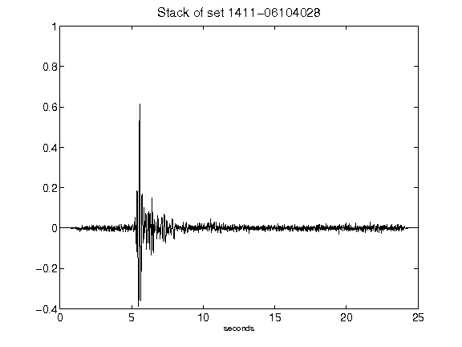](figures/1411-06104028_Stack.png)[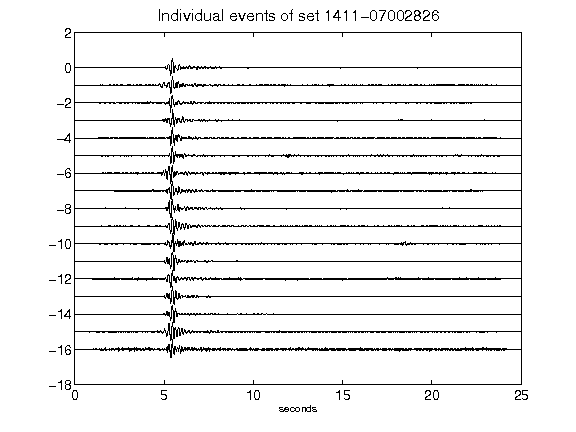](figures/1411-07002826_AllEv.png)[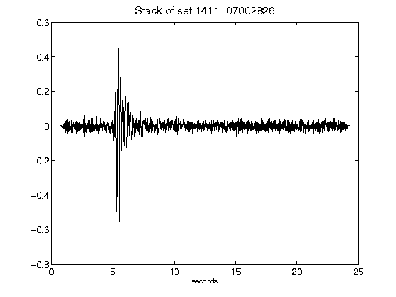](figures/1411-07002826_Stack.png)[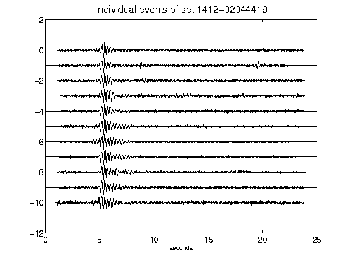](figures/1412-02044419_AllEv.png)[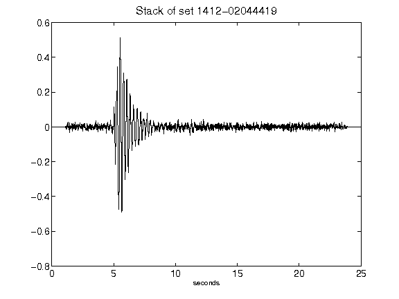](figures/1412-02044419_Stack.png)[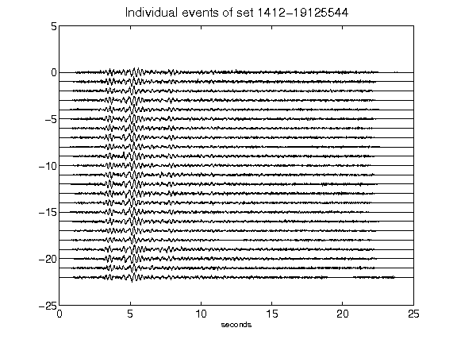](figures/1412-19125544_AllEv.png)[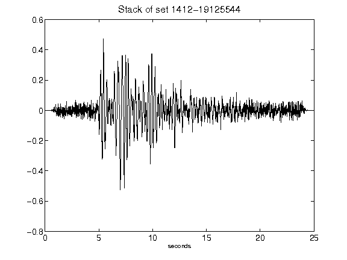](figures/1412-19125544_Stack.png)[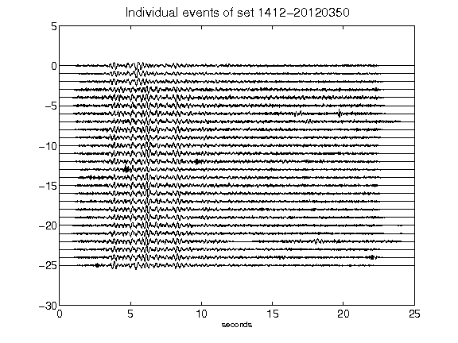](figures/1412-20120350_AllEv.png)[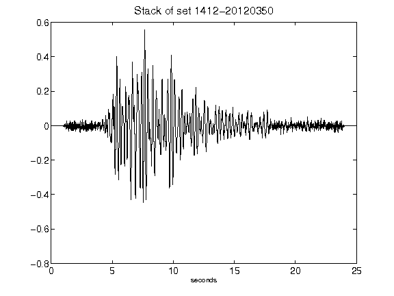](figures/1412-20120350_Stack.png)