# Repeating Earthquake Activity at STAR

## Waveforms
[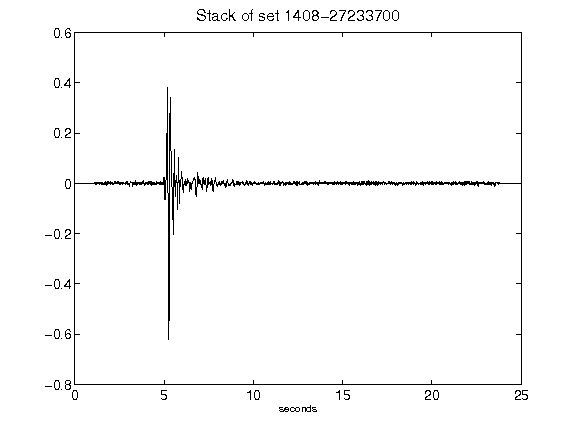](figures/1408-27233700_Stack.png)[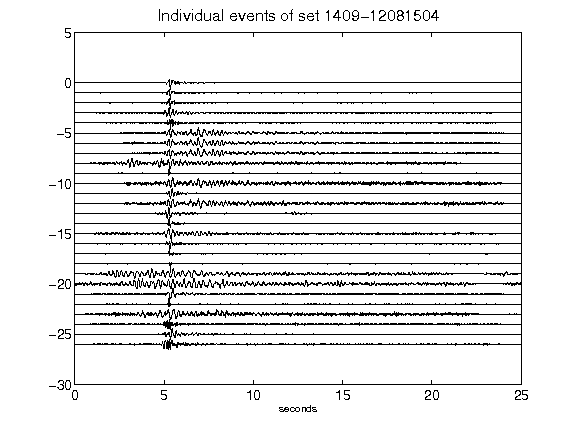](figures/1409-12081504_AllEv.png)[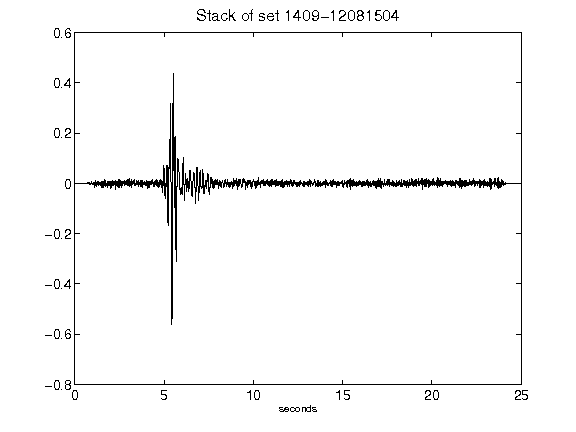](figures/1409-12081504_Stack.png)[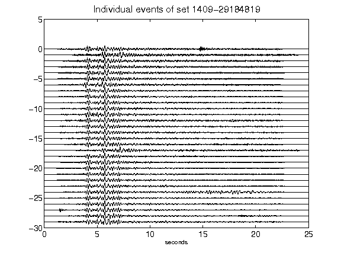](figures/1409-29184819_AllEv.png)[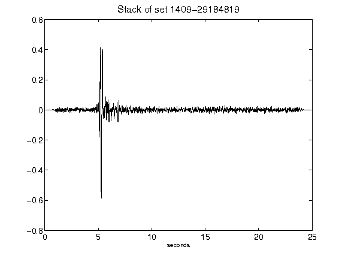](figures/1409-29184819_Stack.png)[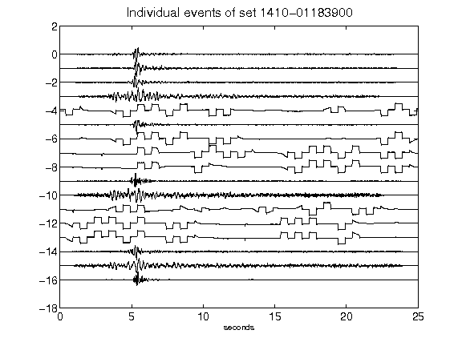](figures/1410-01183900_AllEv.png)[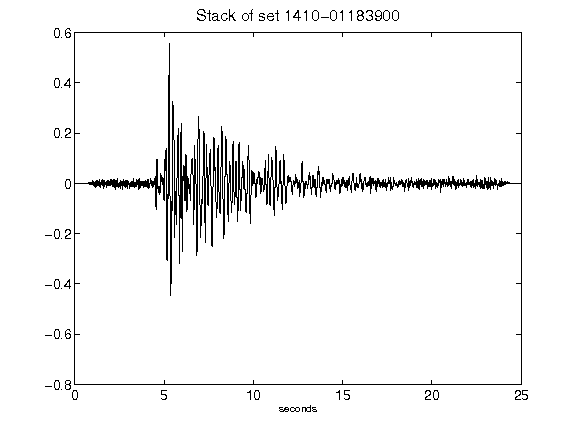](figures/1410-01183900_Stack.png)[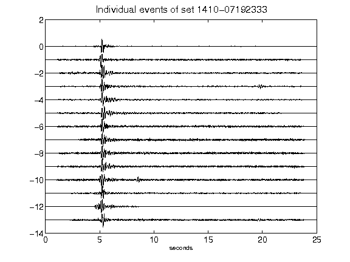](figures/1410-07192333_AllEv.png)[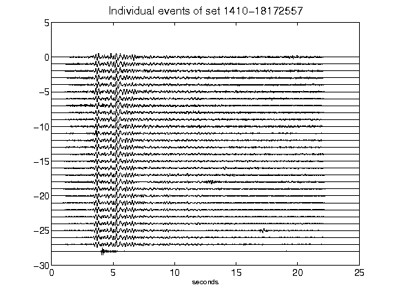](figures/1410-18172557_AllEv.png)[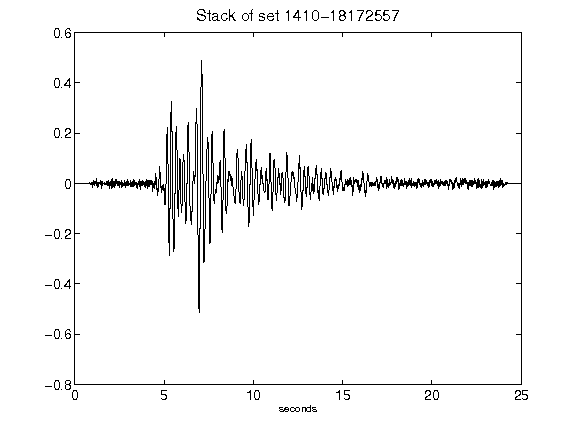](figures/1410-18172557_Stack.png)[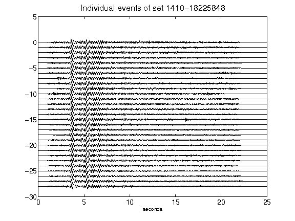](figures/1410-18225848_AllEv.png)[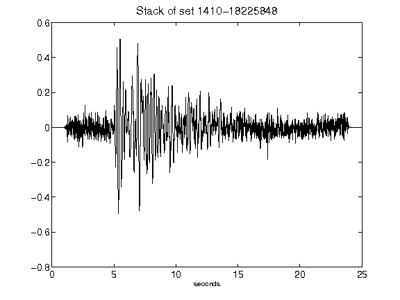](figures/1410-18225848_Stack.png)[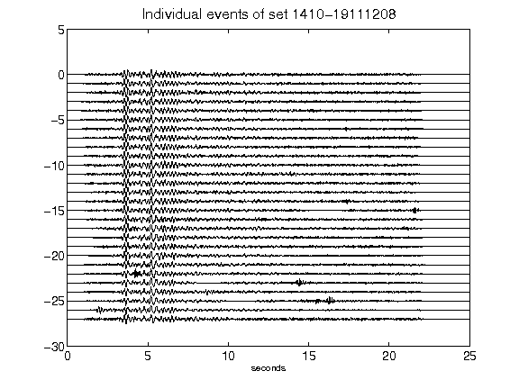](figures/1410-19111208_AllEv.png)[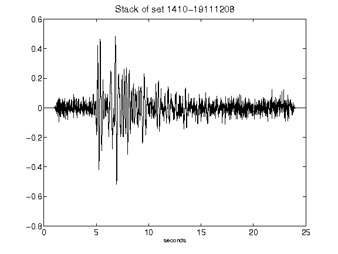](figures/1410-19111208_Stack.png)[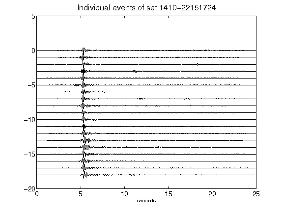](figures/1410-22151724_AllEv.png)[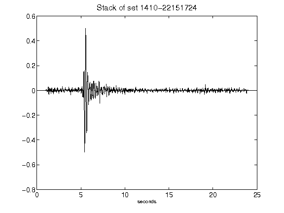](figures/1410-22151724_Stack.png)[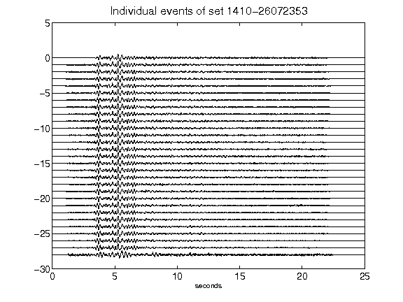](figures/1410-26072353_AllEv.png)[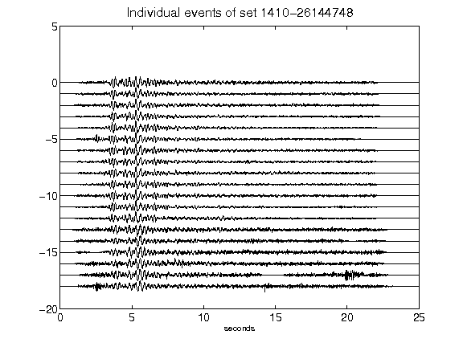](figures/1410-26144748_AllEv.png)[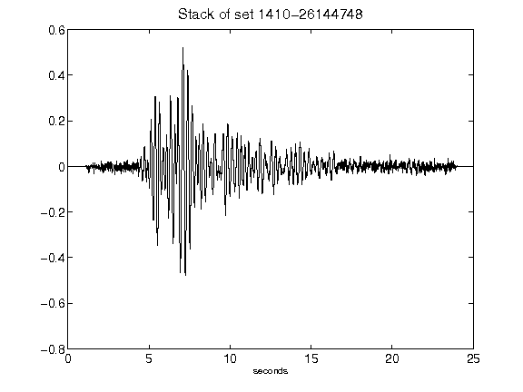](figures/1410-26144748_Stack.png)[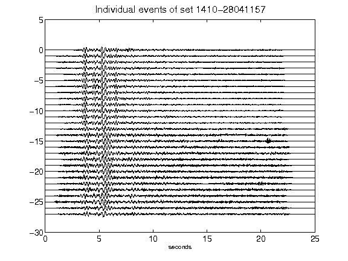](figures/1410-28041157_AllEv.png)[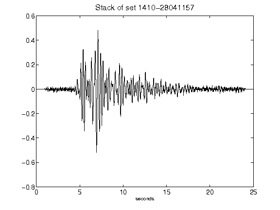](figures/1410-28041157_Stack.png)[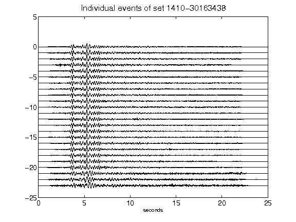](figures/1410-30163438_AllEv.png)[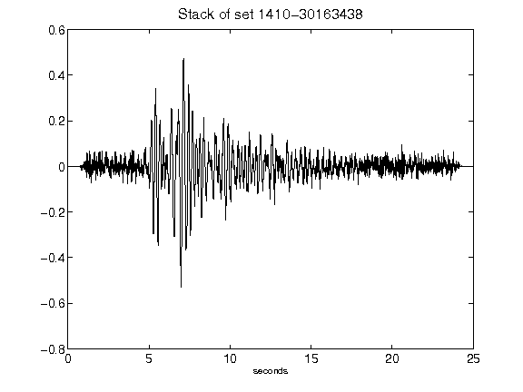](figures/1410-30163438_Stack.png)[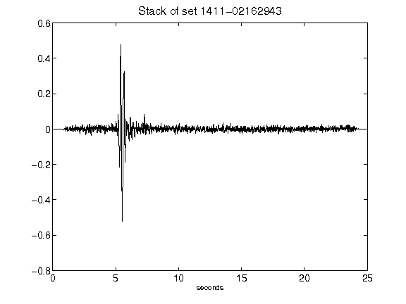](figures/1411-02162943_Stack.png)[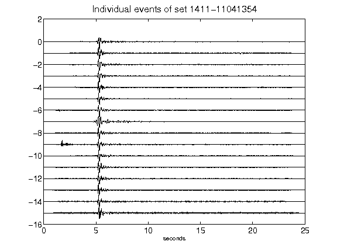](figures/1411-11041354_AllEv.png)[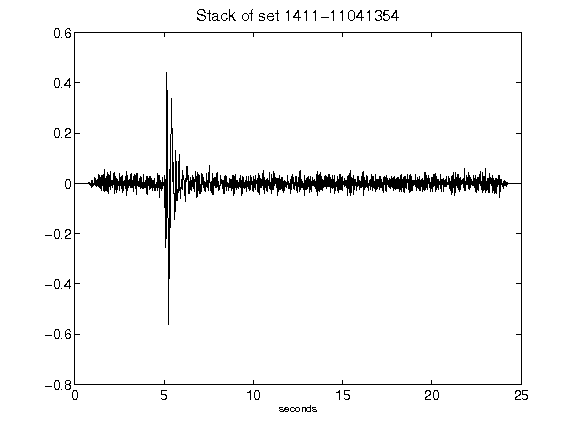](figures/1411-11041354_Stack.png)[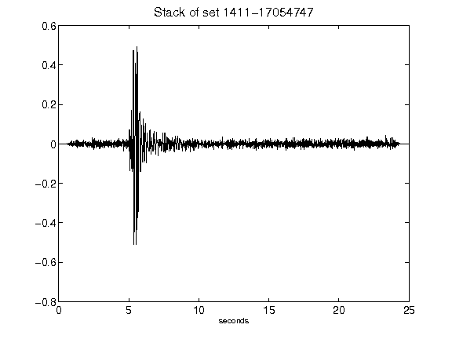](figures/1411-17054747_Stack.png)[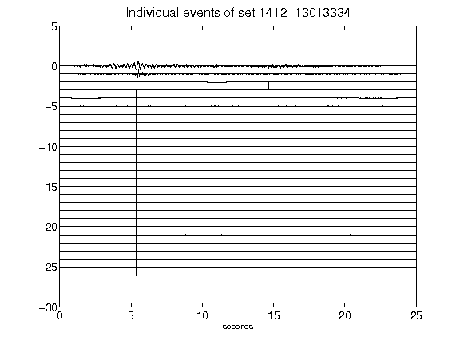](figures/1412-13013334_AllEv.png)[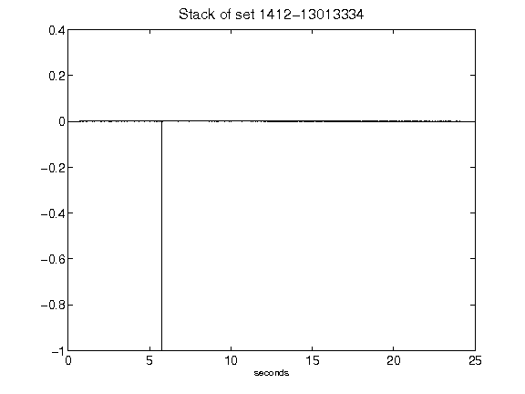](figures/1412-13013334_Stack.png)