# Repeating Earthquake Activity at STAR

## Waveforms
[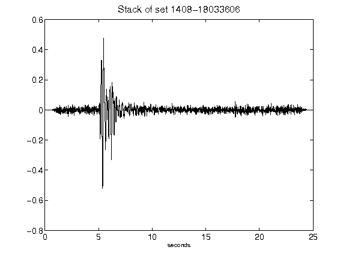](figures/1408-18033606_Stack.png)[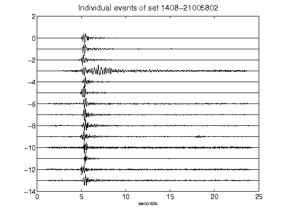](figures/1408-21005802_AllEv.png)[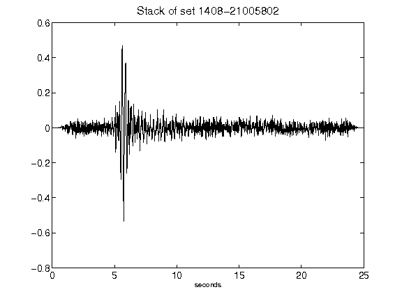](figures/1408-21005802_Stack.png)[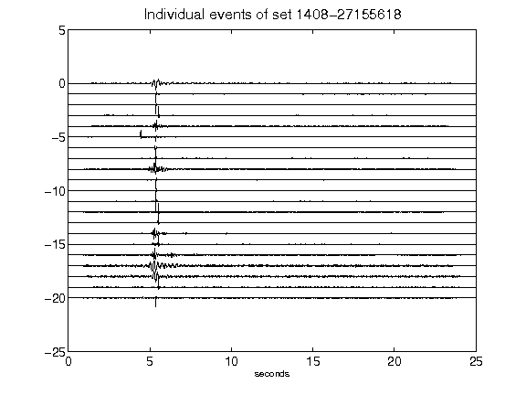](figures/1408-27155618_AllEv.png)[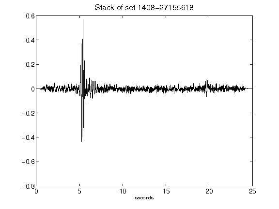](figures/1408-27155618_Stack.png)[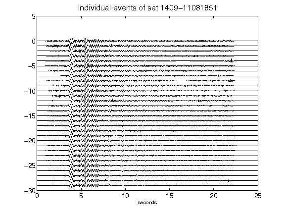](figures/1409-11081851_AllEv.png)[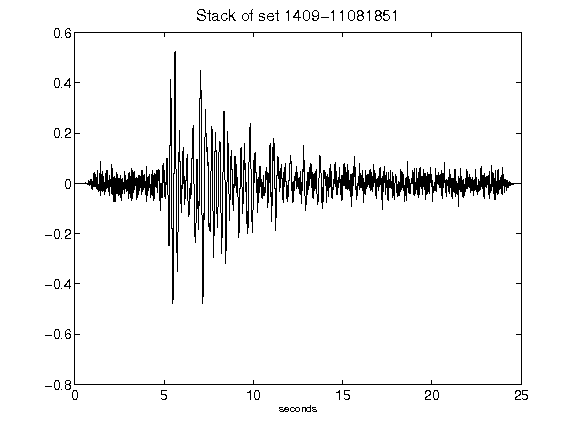](figures/1409-11081851_Stack.png)[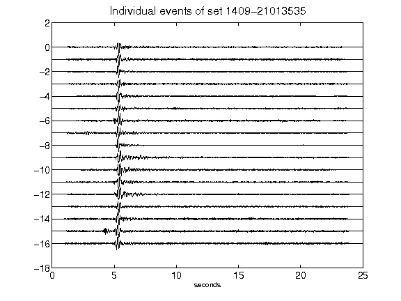](figures/1409-21013535_AllEv.png)[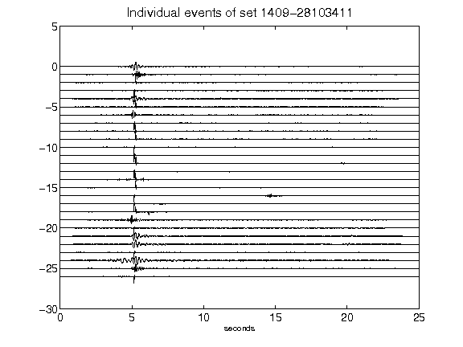](figures/1409-28103411_AllEv.png)[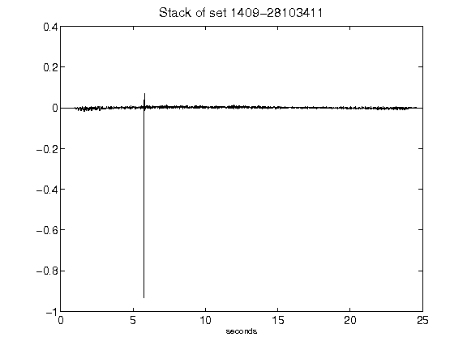](figures/1409-28103411_Stack.png)[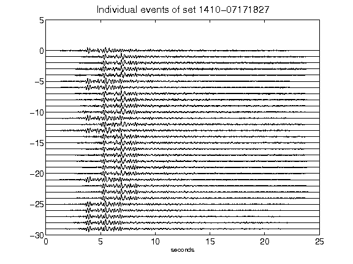](figures/1410-07171827_AllEv.png)[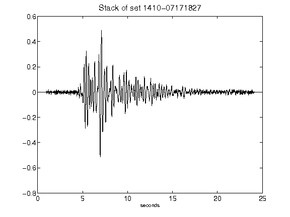](figures/1410-07171827_Stack.png)[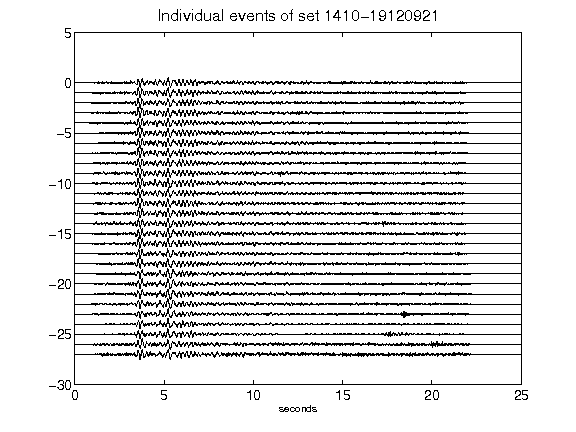](figures/1410-19120921_AllEv.png)[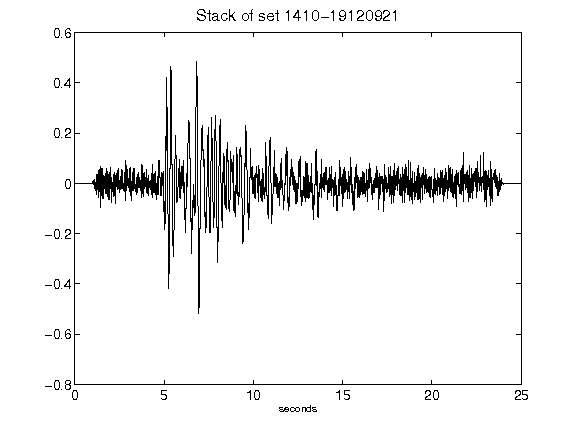](figures/1410-19120921_Stack.png)[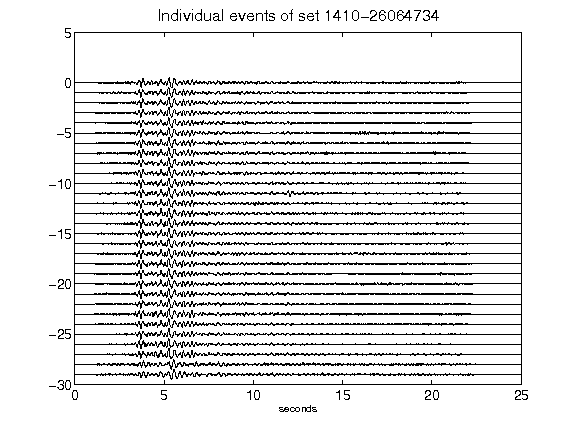](figures/1410-26064734_AllEv.png)[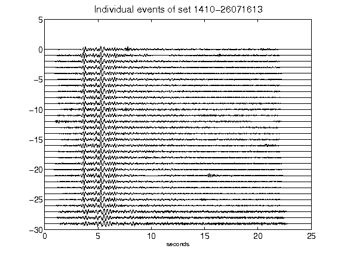](figures/1410-26071613_AllEv.png)[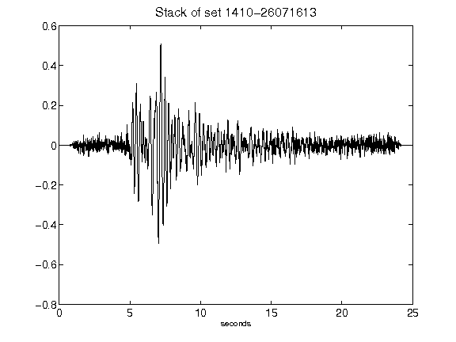](figures/1410-26071613_Stack.png)[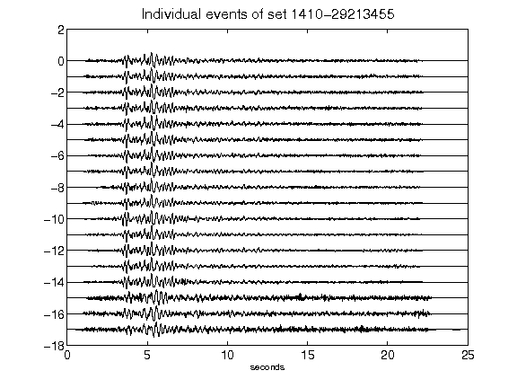](figures/1410-29213455_AllEv.png)[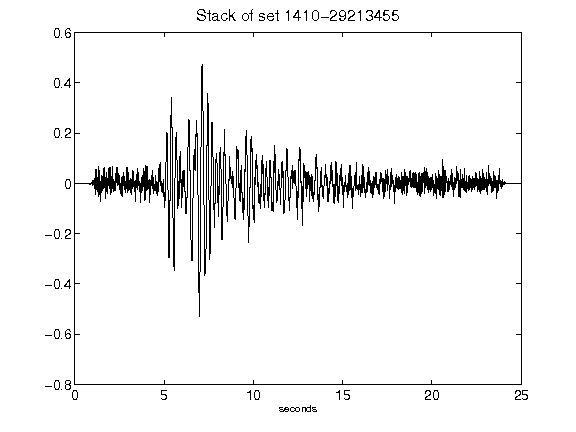](figures/1410-29213455_Stack.png)[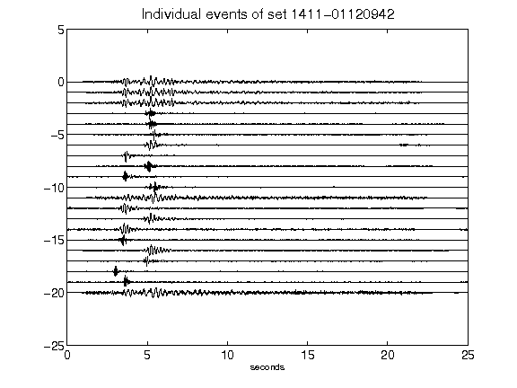](figures/1411-01120942_AllEv.png)[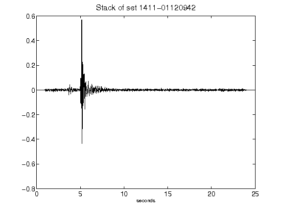](figures/1411-01120942_Stack.png)[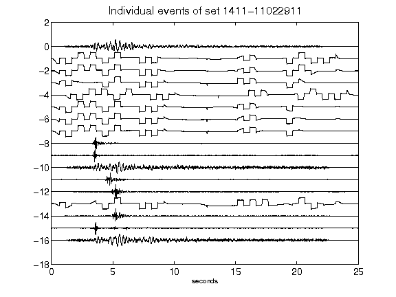](figures/1411-11022911_AllEv.png)[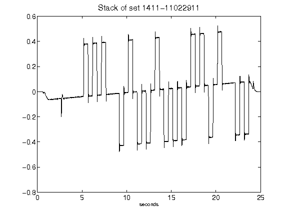](figures/1411-11022911_Stack.png)[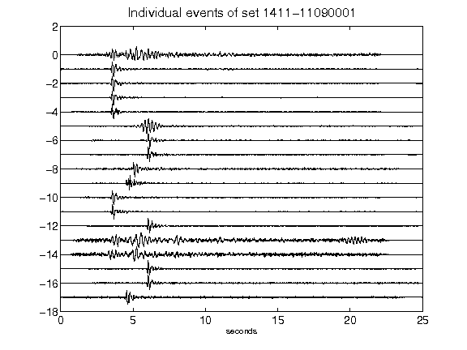](figures/1411-11090001_AllEv.png)[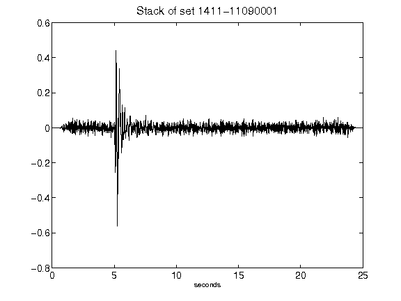](figures/1411-11090001_Stack.png)[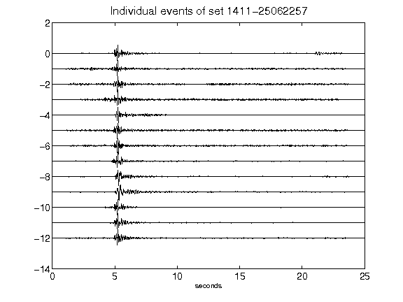](figures/1411-25062257_AllEv.png)[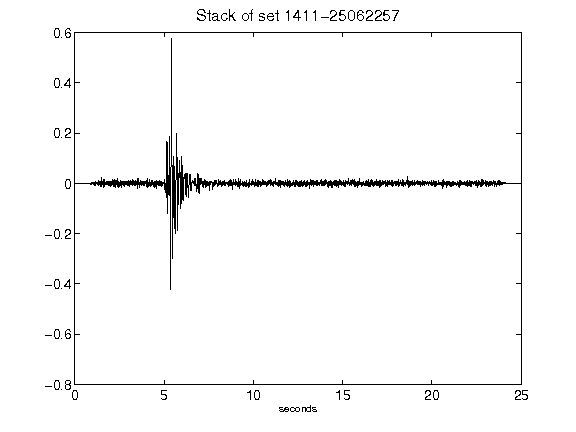](figures/1411-25062257_Stack.png)