# Repeating Earthquake Activity at STAR

## Waveforms
[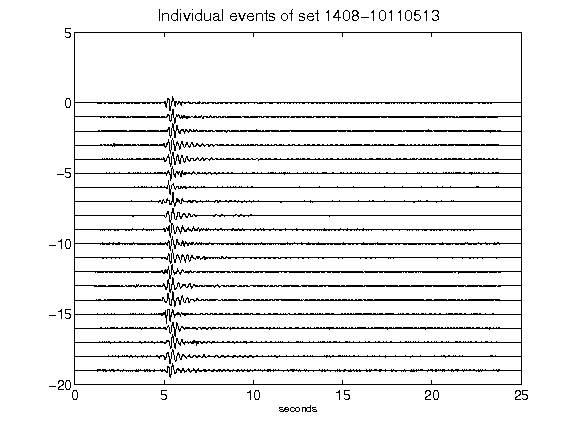](figures/1408-10110513_AllEv.png)[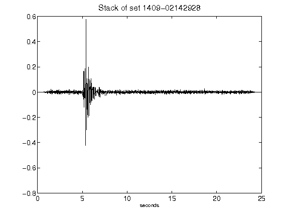](figures/1409-02142928_Stack.png)[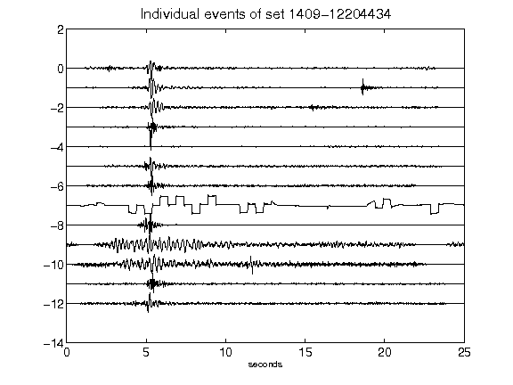](figures/1409-12204434_AllEv.png)[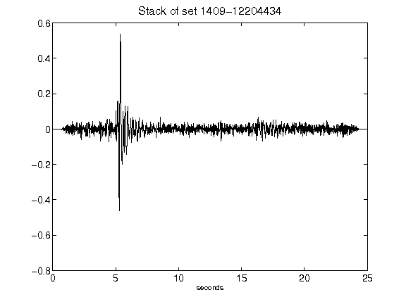](figures/1409-12204434_Stack.png)[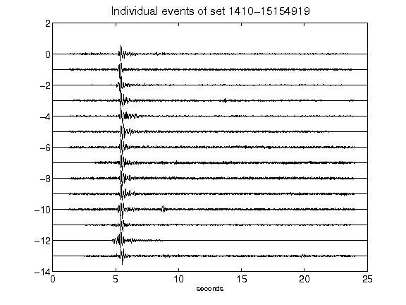](figures/1410-15154919_AllEv.png)[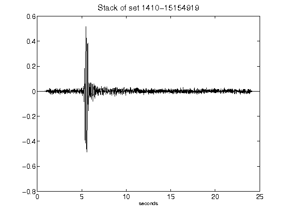](figures/1410-15154919_Stack.png)[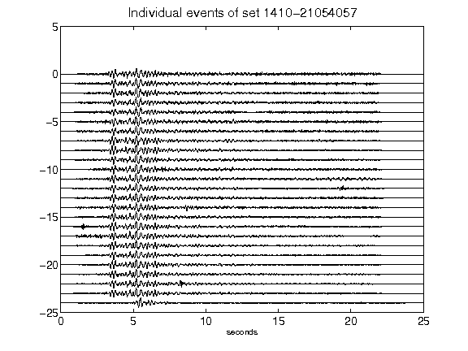](figures/1410-21054057_AllEv.png)[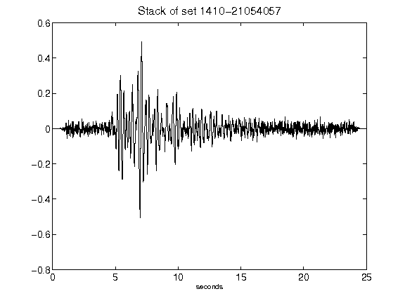](figures/1410-21054057_Stack.png)[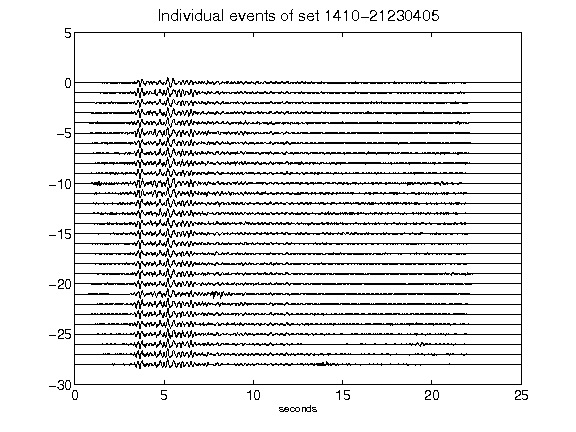](figures/1410-21230405_AllEv.png)[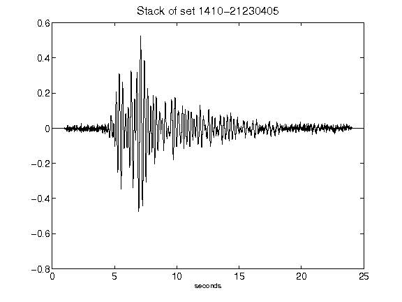](figures/1410-21230405_Stack.png)[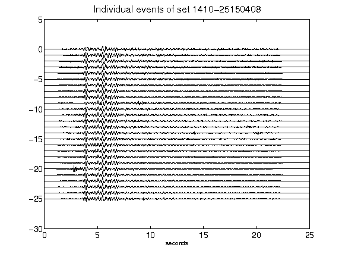](figures/1410-25150408_AllEv.png)[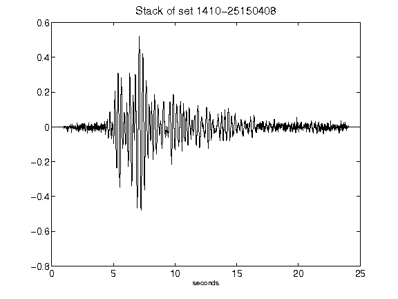](figures/1410-25150408_Stack.png)[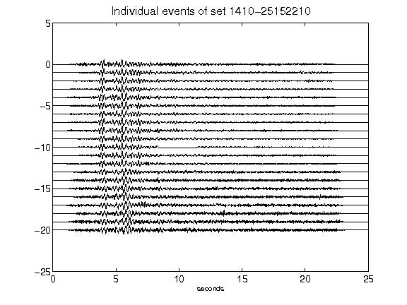](figures/1410-25152210_AllEv.png)[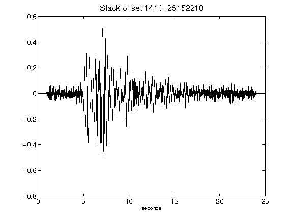](figures/1410-25152210_Stack.png)[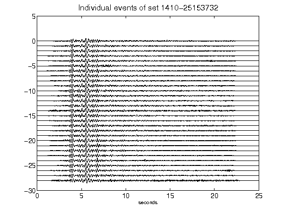](figures/1410-25153732_AllEv.png)[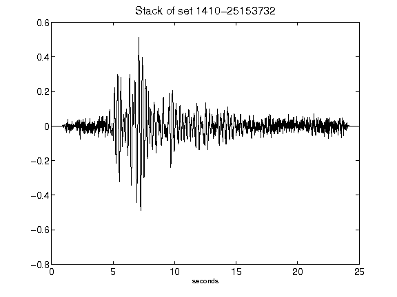](figures/1410-25153732_Stack.png)[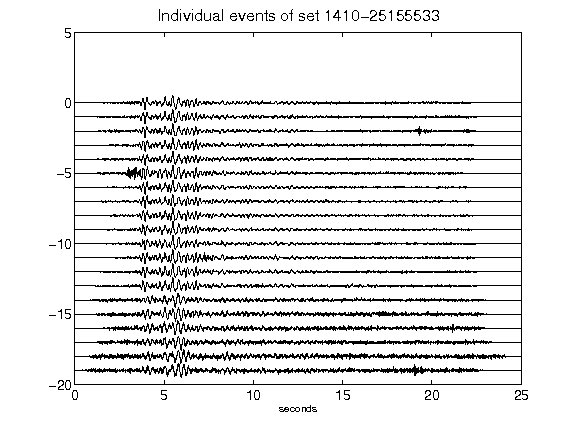](figures/1410-25155533_AllEv.png)[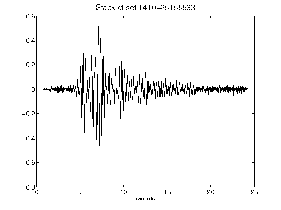](figures/1410-25155533_Stack.png)[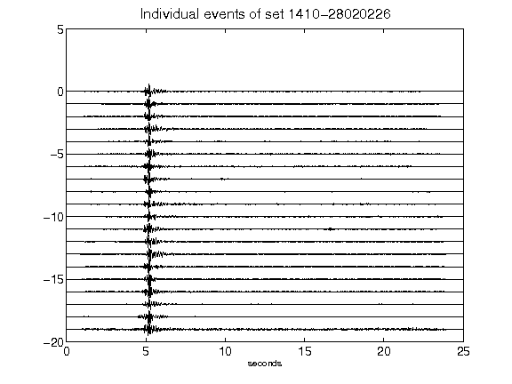](figures/1410-28020226_AllEv.png)[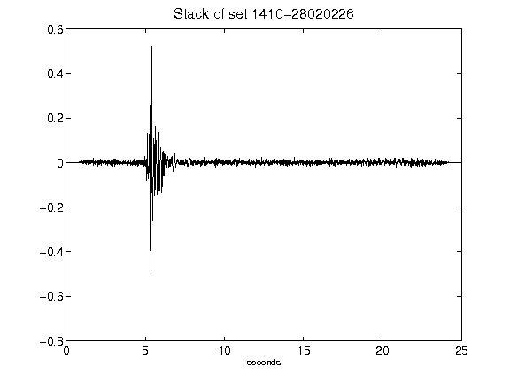](figures/1410-28020226_Stack.png)[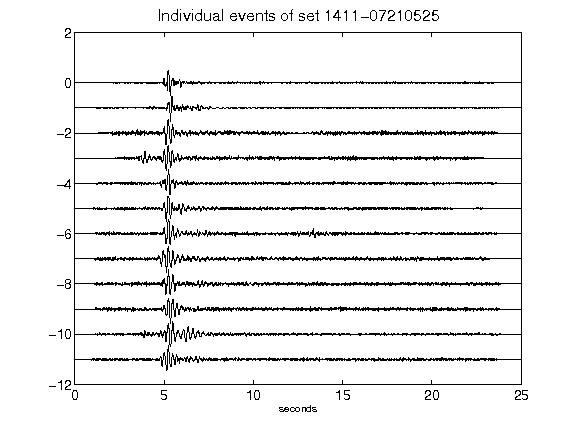](figures/1411-07210525_AllEv.png)[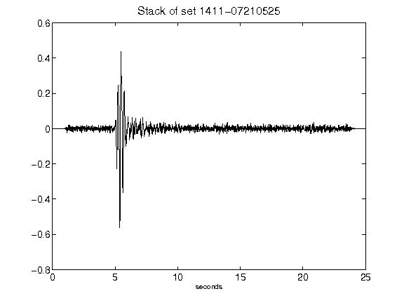](figures/1411-07210525_Stack.png)