# Repeating Earthquake Activity at STAR

## Waveforms
[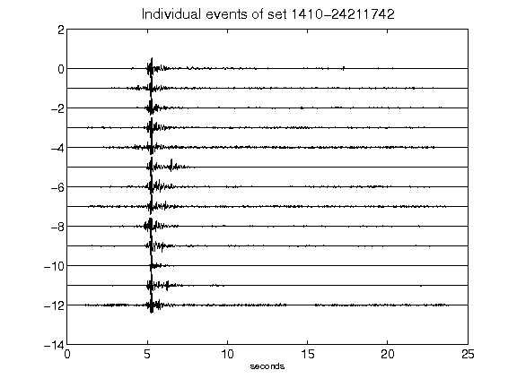](figures/1410-24211742_AllEv.png)[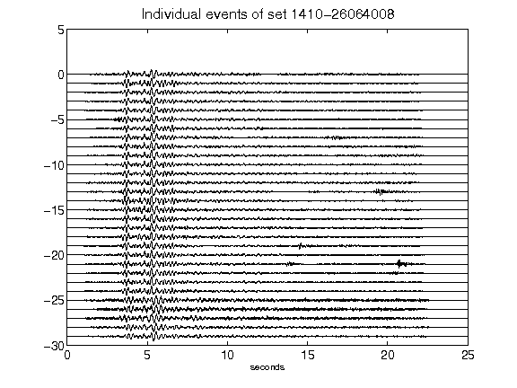](figures/1410-26064008_AllEv.png)[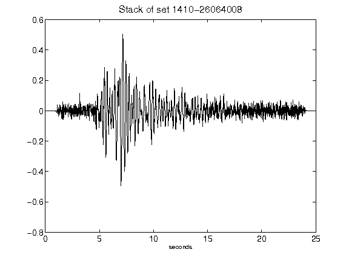](figures/1410-26064008_Stack.png)[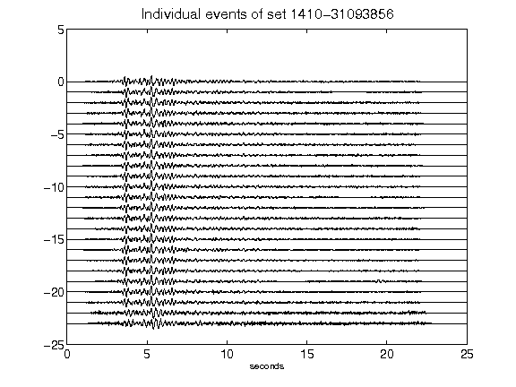](figures/1410-31093856_AllEv.png)[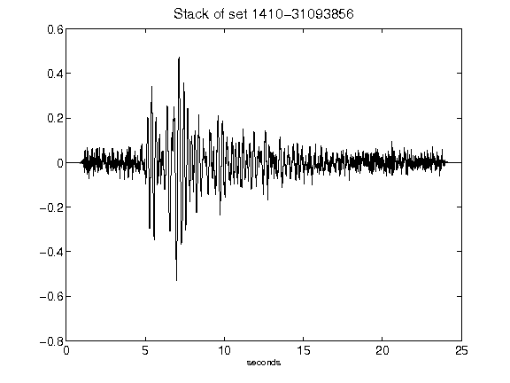](figures/1410-31093856_Stack.png)[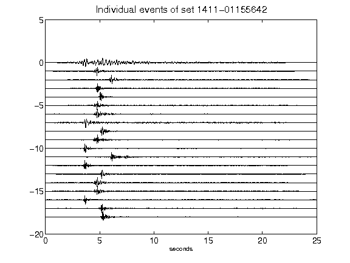](figures/1411-01155642_AllEv.png)[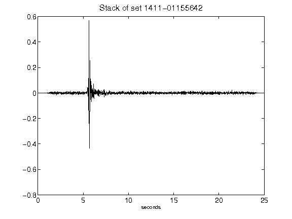](figures/1411-01155642_Stack.png)[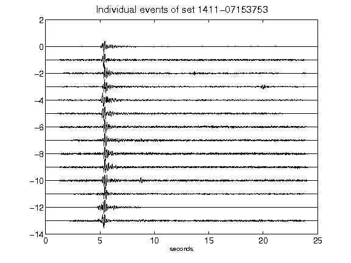](figures/1411-07153753_AllEv.png)[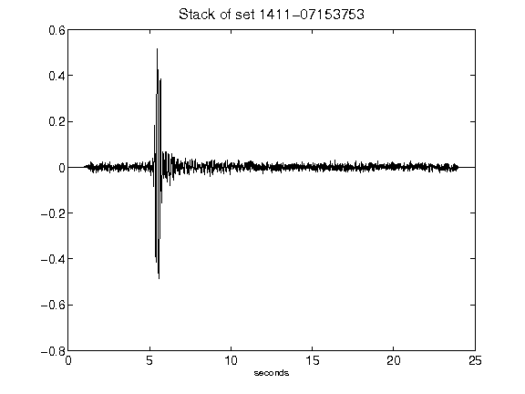](figures/1411-07153753_Stack.png)[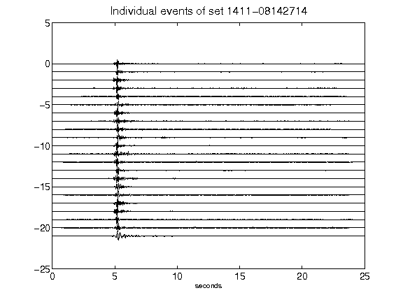](figures/1411-08142714_AllEv.png)[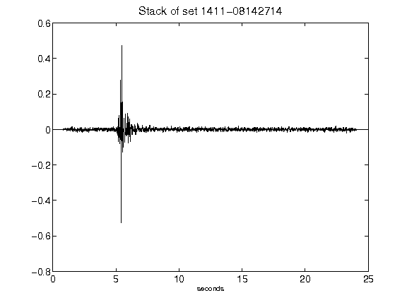](figures/1411-08142714_Stack.png)[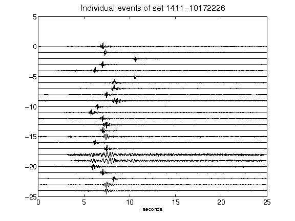](figures/1411-10172226_AllEv.png)[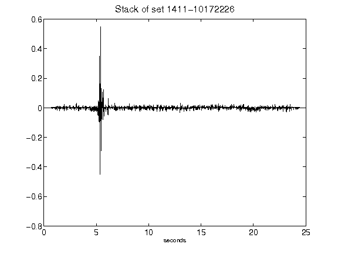](figures/1411-10172226_Stack.png)[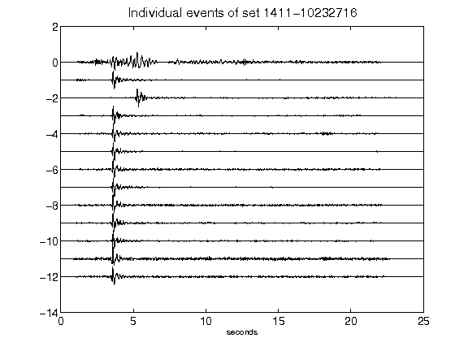](figures/1411-10232716_AllEv.png)[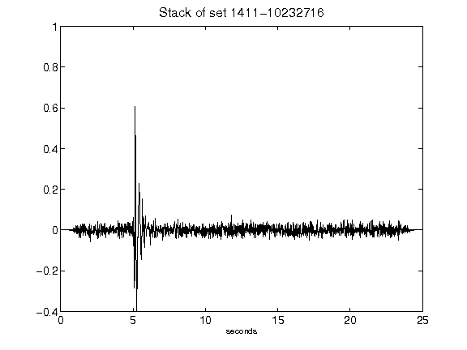](figures/1411-10232716_Stack.png)[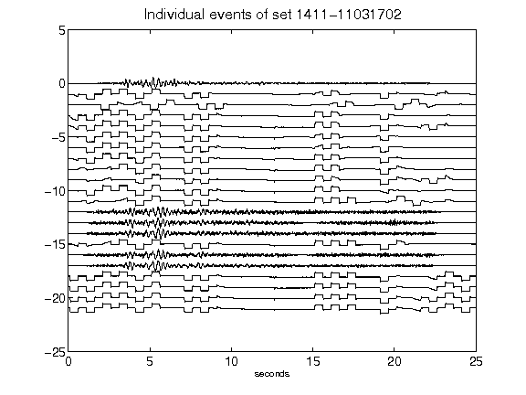](figures/1411-11031702_AllEv.png)[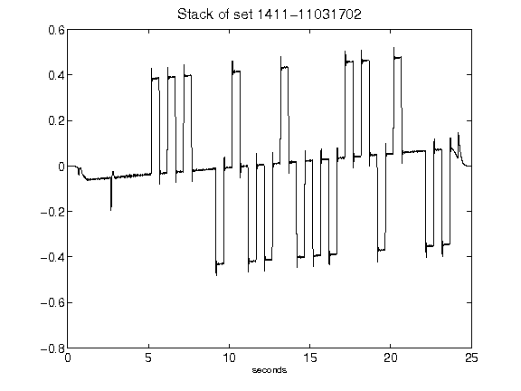](figures/1411-11031702_Stack.png)[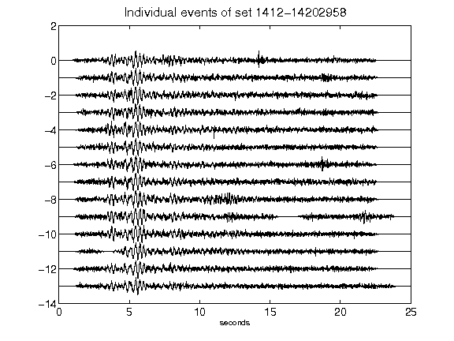](figures/1412-14202958_AllEv.png)[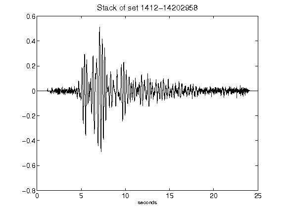](figures/1412-14202958_Stack.png)