# Repeating Earthquake Activity at STAR

## Waveforms
[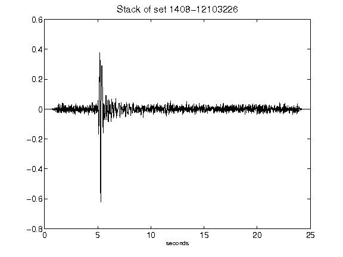](figures/1408-12103226_Stack.png)[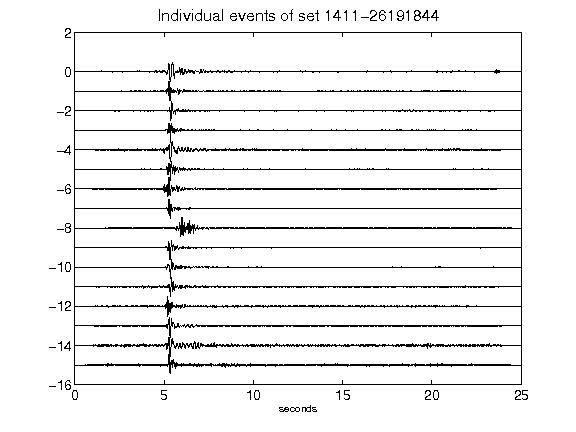](figures/1411-26191844_AllEv.png)[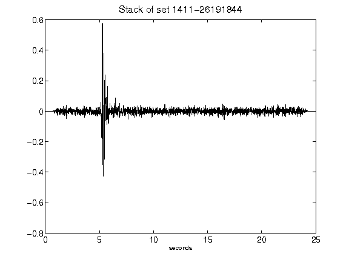](figures/1411-26191844_Stack.png)[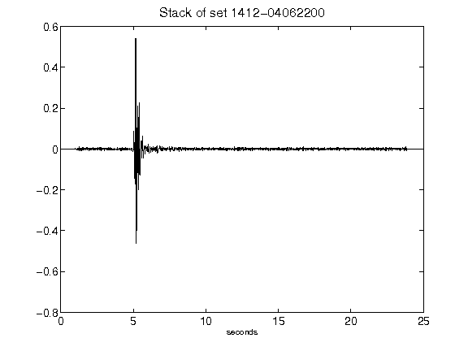](figures/1412-04062200_Stack.png)[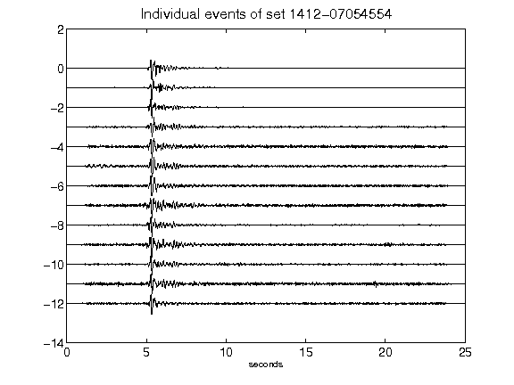](figures/1412-07054554_AllEv.png)[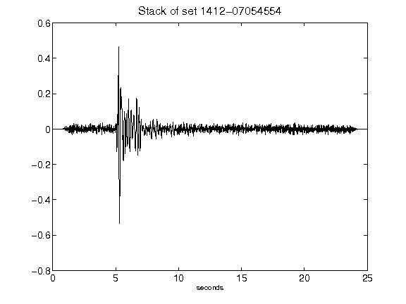](figures/1412-07054554_Stack.png)[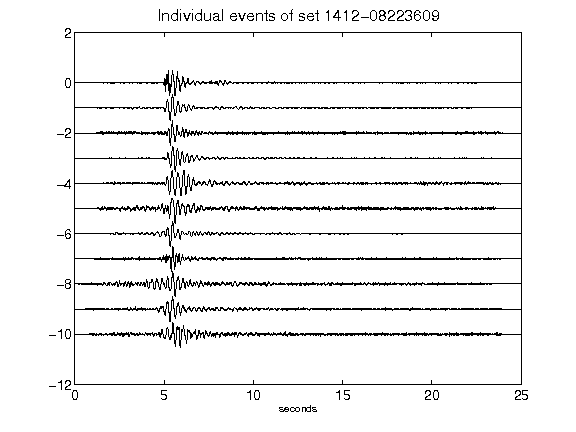](figures/1412-08223609_AllEv.png)[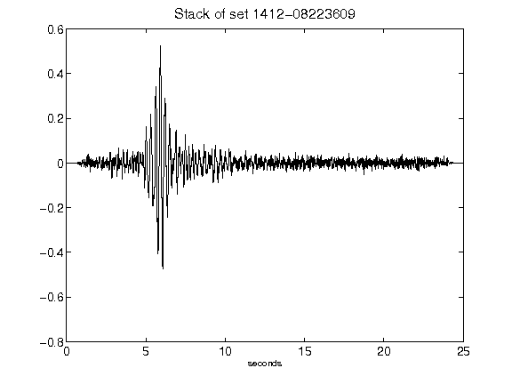](figures/1412-08223609_Stack.png)[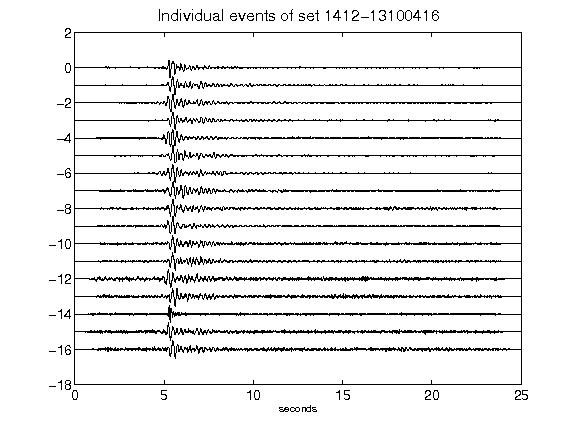](figures/1412-13100416_AllEv.png)[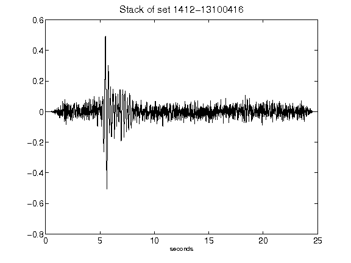](figures/1412-13100416_Stack.png)[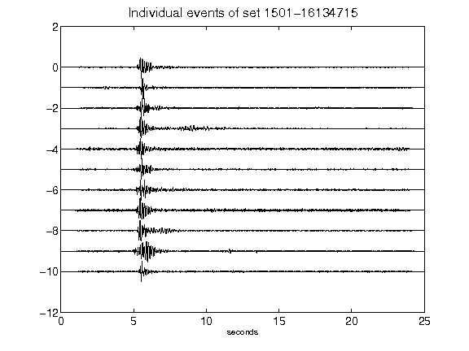](figures/1501-16134715_AllEv.png)[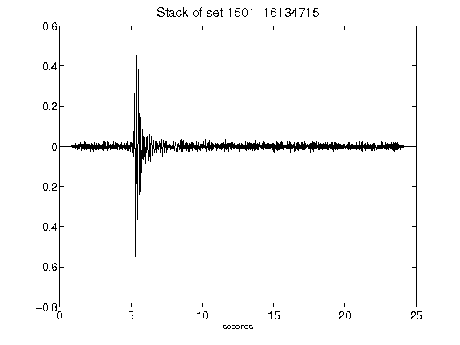](figures/1501-16134715_Stack.png)[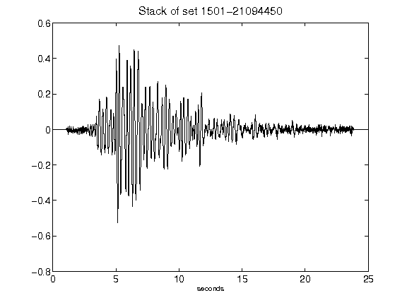](figures/1501-21094450_Stack.png)[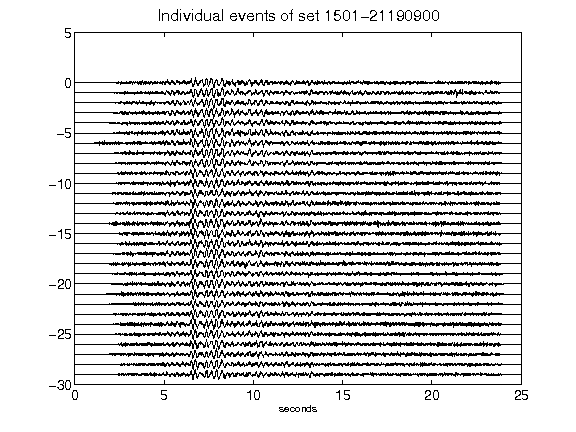](figures/1501-21190900_AllEv.png)[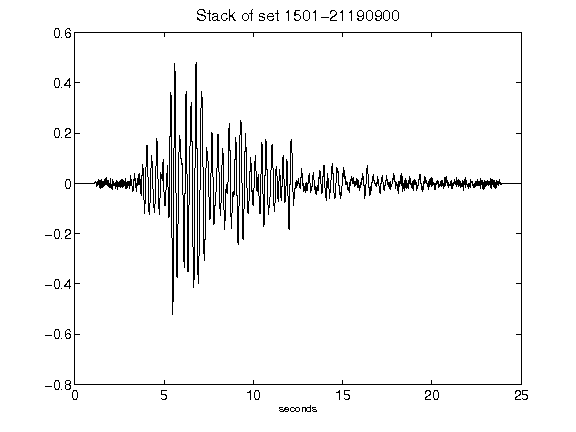](figures/1501-21190900_Stack.png)[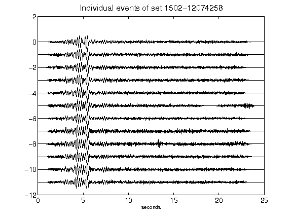](figures/1502-12074258_AllEv.png)[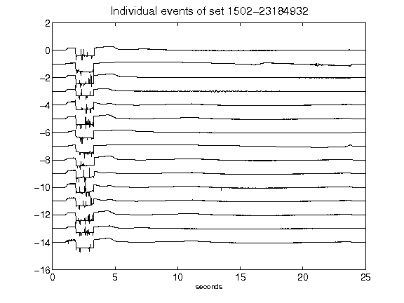](figures/1502-23184932_AllEv.png)