# Repeating Earthquake Activity at STAR

## Waveforms
[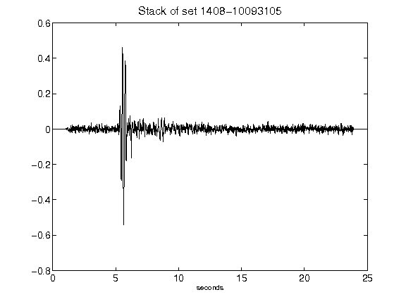](figures/1408-10093105_Stack.png)[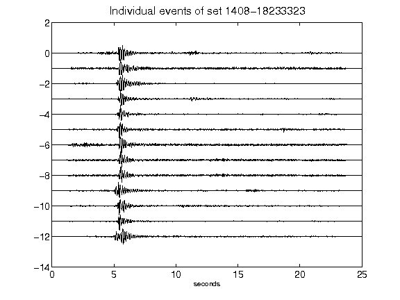](figures/1408-18233323_AllEv.png)[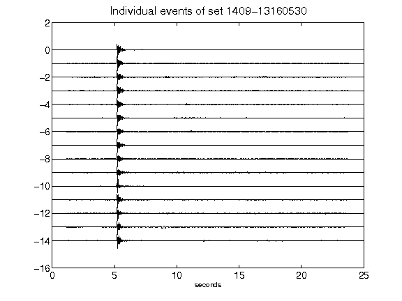](figures/1409-13160530_AllEv.png)[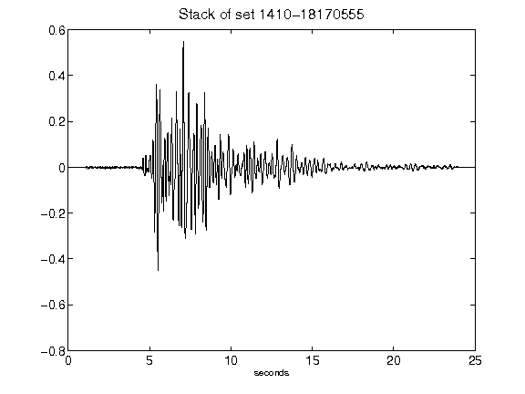](figures/1410-18170555_Stack.png)[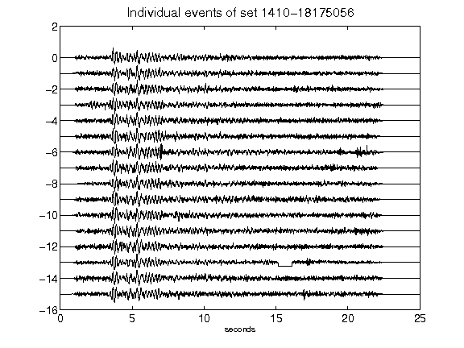](figures/1410-18175056_AllEv.png)[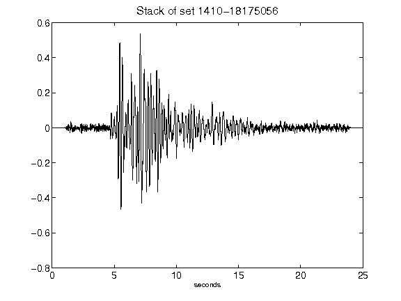](figures/1410-18175056_Stack.png)[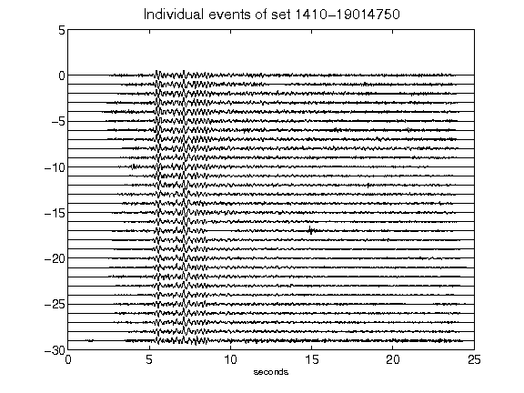](figures/1410-19014750_AllEv.png)[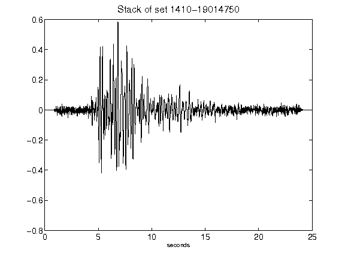](figures/1410-19014750_Stack.png)[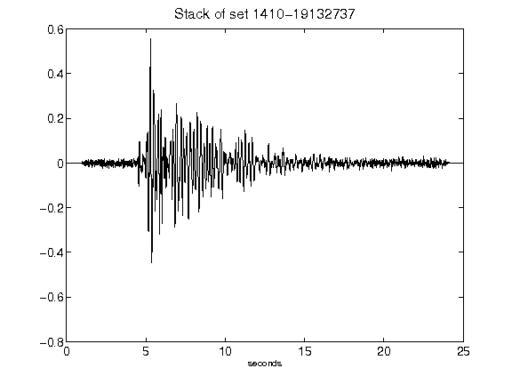](figures/1410-19132737_Stack.png)[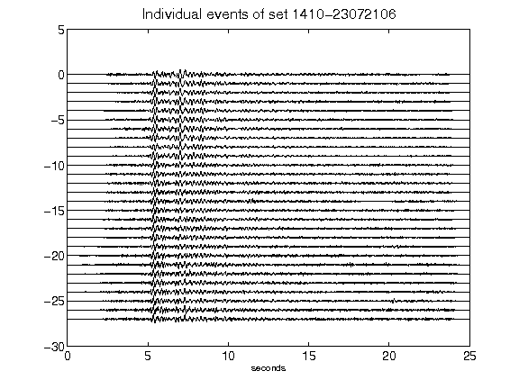](figures/1410-23072106_AllEv.png)[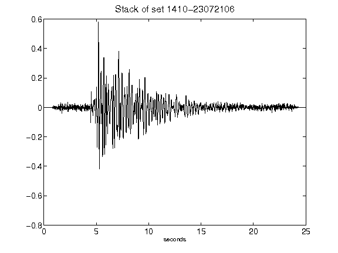](figures/1410-23072106_Stack.png)[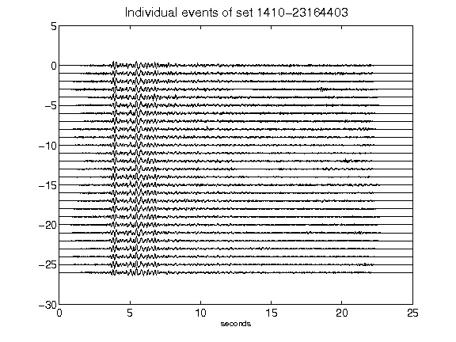](figures/1410-23164403_AllEv.png)[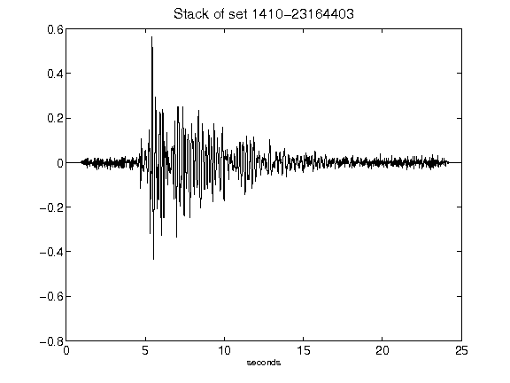](figures/1410-23164403_Stack.png)[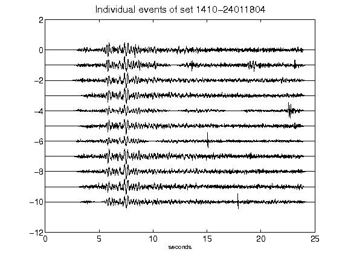](figures/1410-24011804_AllEv.png)[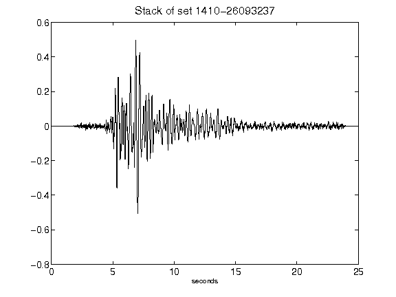](figures/1410-26093237_Stack.png)[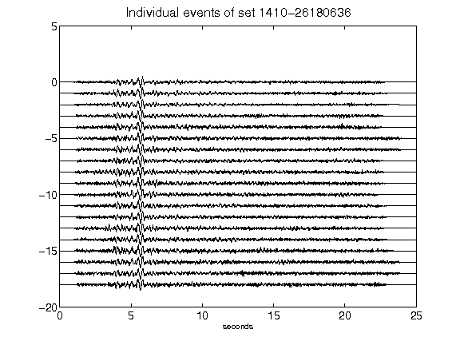](figures/1410-26180636_AllEv.png)[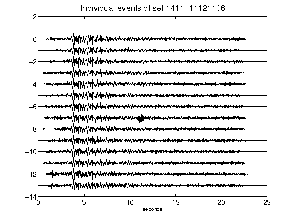](figures/1411-11121106_AllEv.png)