# Repeating Earthquake Activity at STAR

## Waveforms
[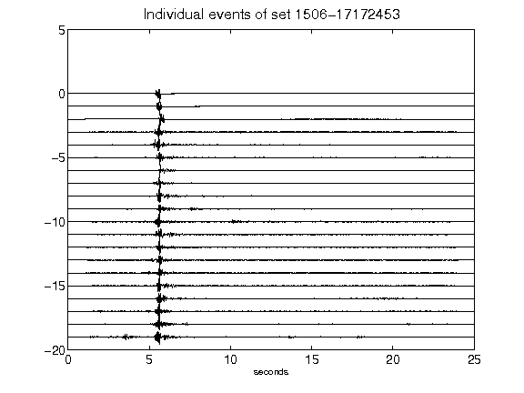](figures/1506-17172453_AllEv.png)[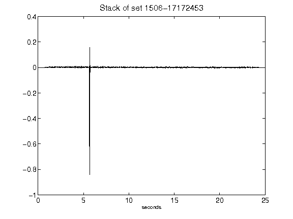](figures/1506-17172453_Stack.png)[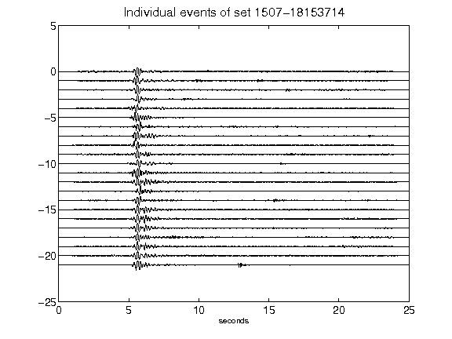](figures/1507-18153714_AllEv.png)[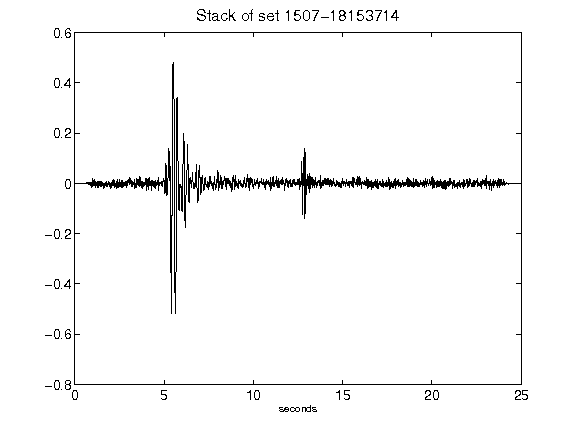](figures/1507-18153714_Stack.png)[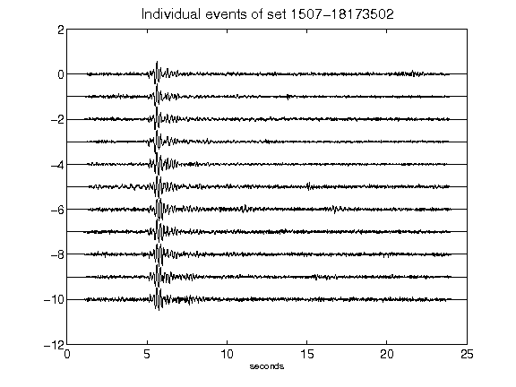](figures/1507-18173502_AllEv.png)[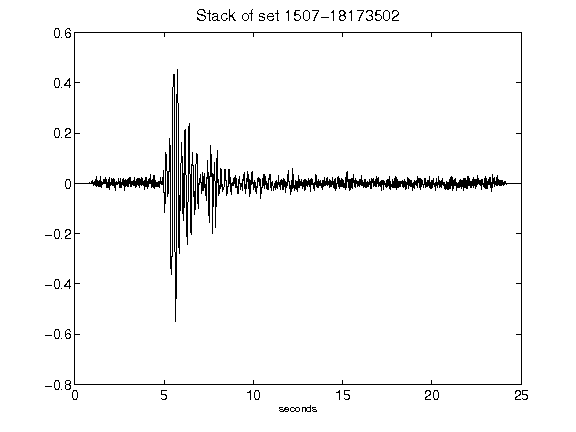](figures/1507-18173502_Stack.png)[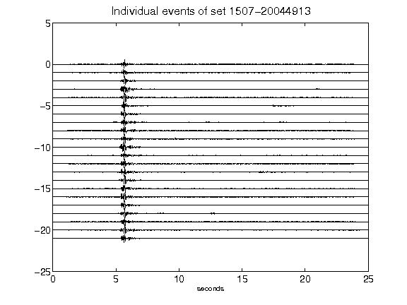](figures/1507-20044913_AllEv.png)[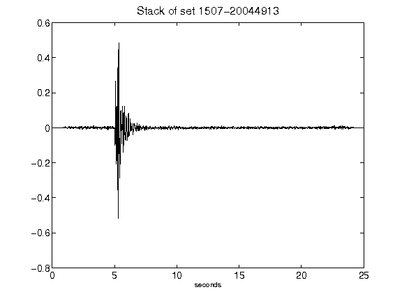](figures/1507-20044913_Stack.png)[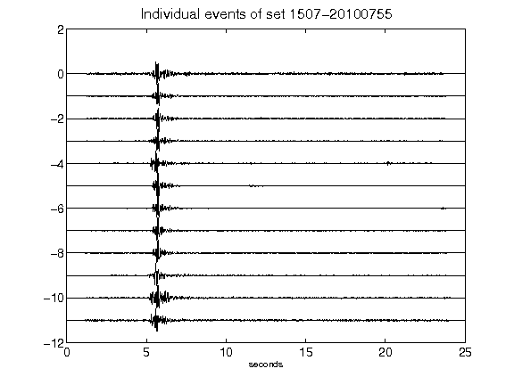](figures/1507-20100755_AllEv.png)[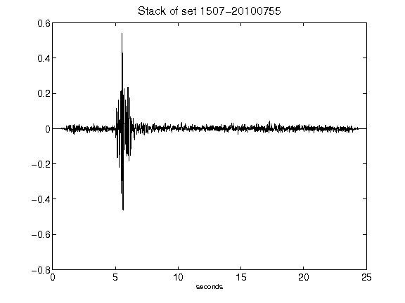](figures/1507-20100755_Stack.png)[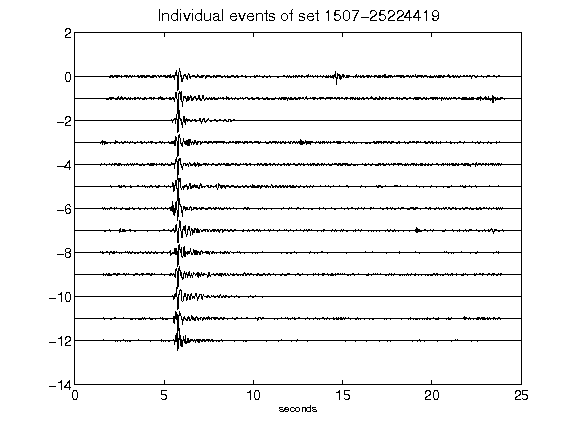](figures/1507-25224419_AllEv.png)[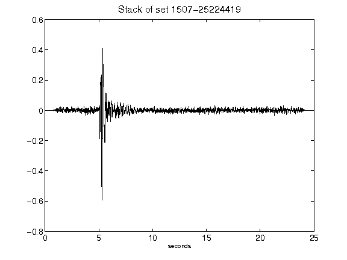](figures/1507-25224419_Stack.png)