# Repeating Earthquake Activity at STAR

## Waveforms
[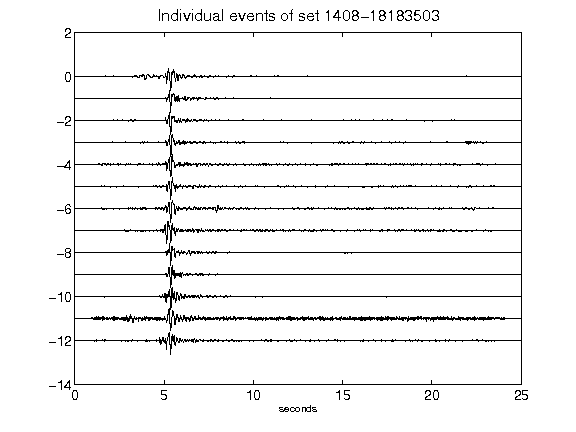](figures/1408-18183503_AllEv.png)[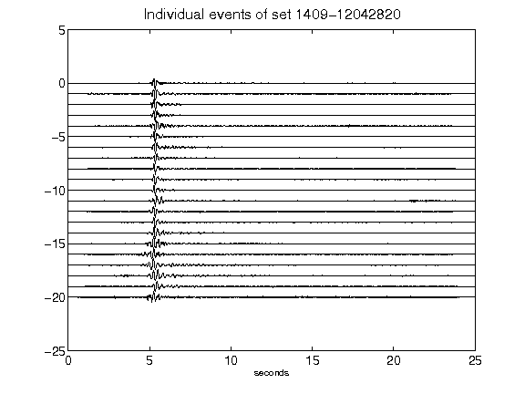](figures/1409-12042820_AllEv.png)[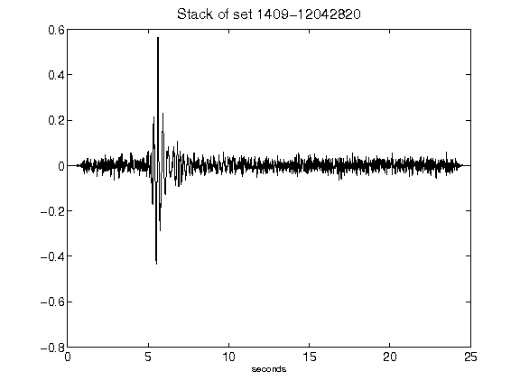](figures/1409-12042820_Stack.png)[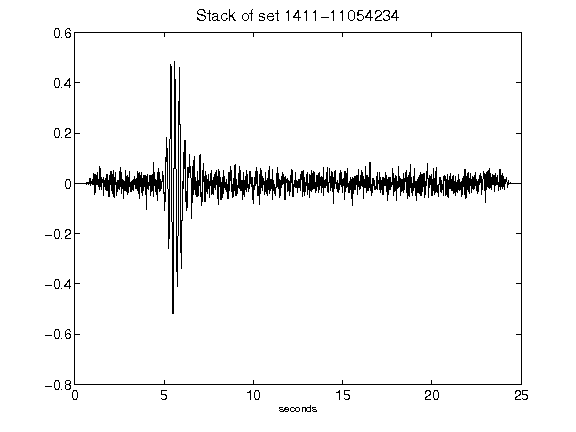](figures/1411-11054234_Stack.png)[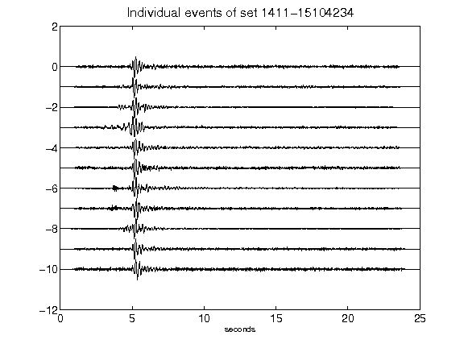](figures/1411-15104234_AllEv.png)[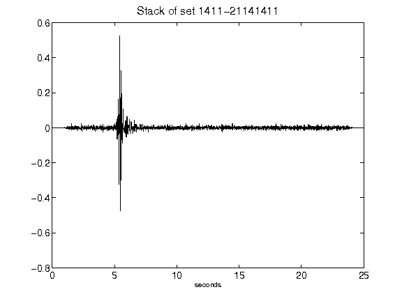](figures/1411-21141411_Stack.png)[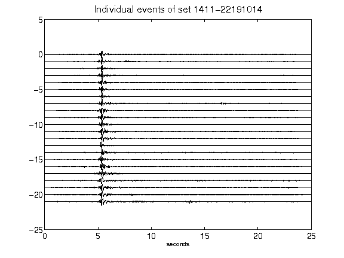](figures/1411-22191014_AllEv.png)[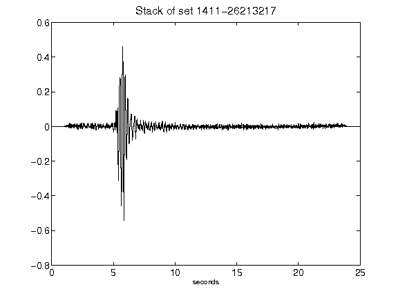](figures/1411-26213217_Stack.png)[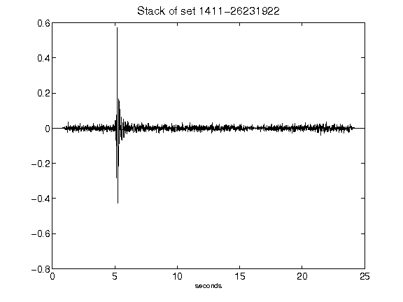](figures/1411-26231922_Stack.png)[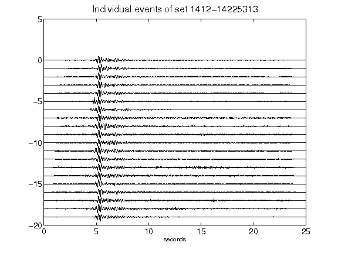](figures/1412-14225313_AllEv.png)[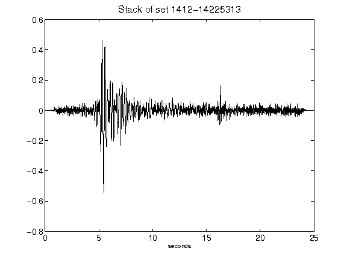](figures/1412-14225313_Stack.png)[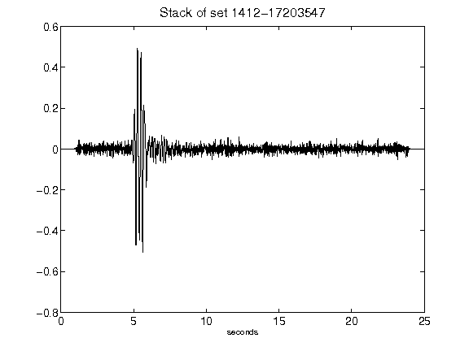](figures/1412-17203547_Stack.png)[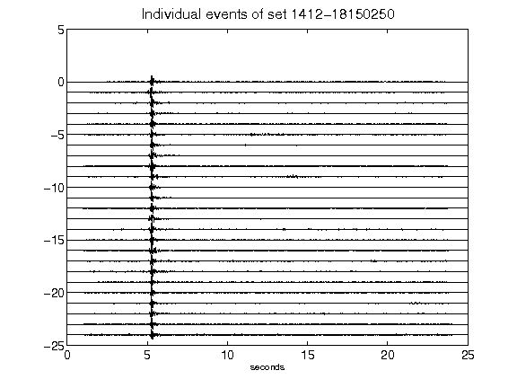](figures/1412-18150250_AllEv.png)[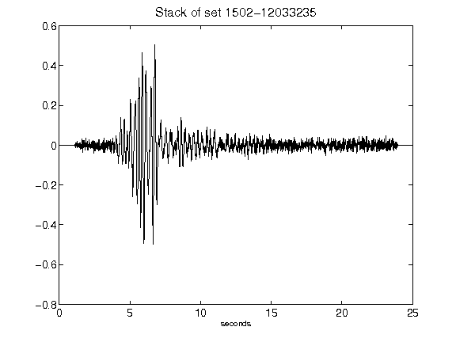](figures/1502-12033235_Stack.png)[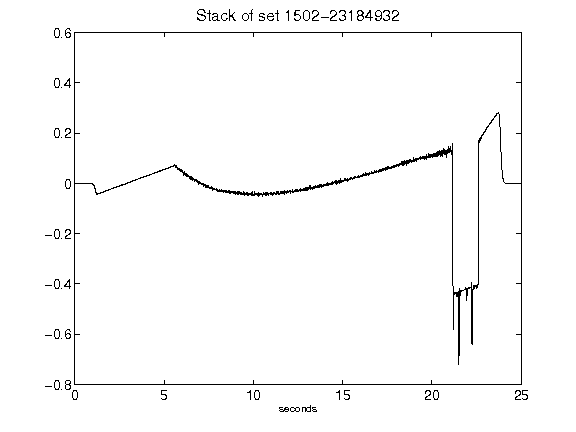](figures/1502-23184932_Stack.png)