# Repeating Earthquake Activity at STAR

## Waveforms
[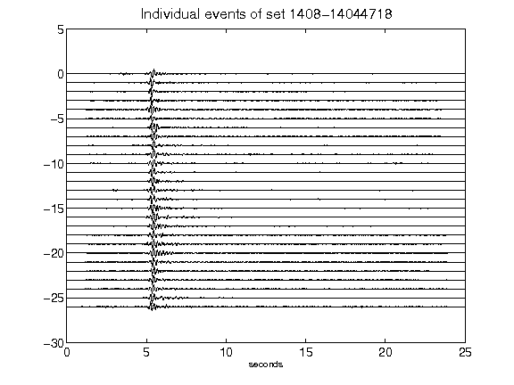](figures/1408-14044718_AllEv.png)[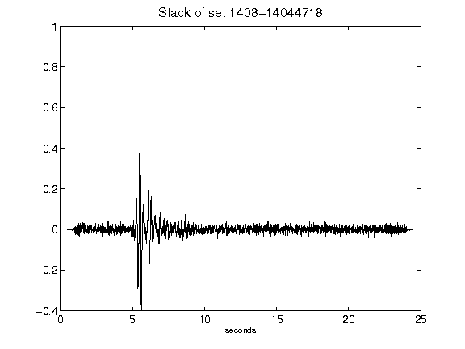](figures/1408-14044718_Stack.png)[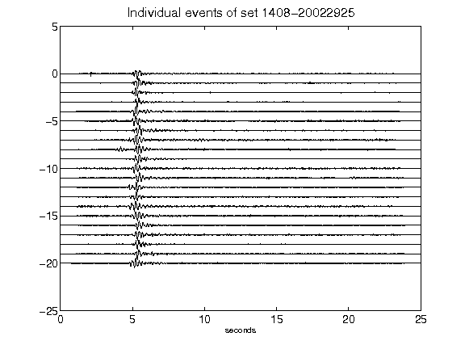](figures/1408-20022925_AllEv.png)[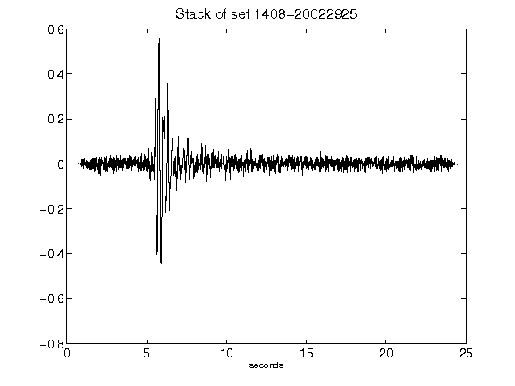](figures/1408-20022925_Stack.png)[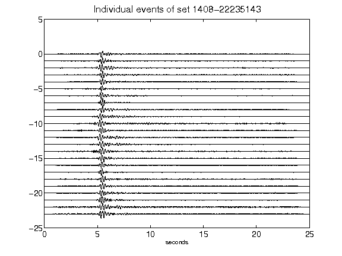](figures/1408-22235143_AllEv.png)[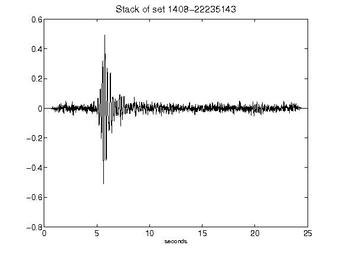](figures/1408-22235143_Stack.png)[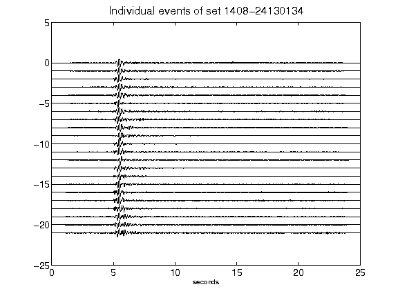](figures/1408-24130134_AllEv.png)[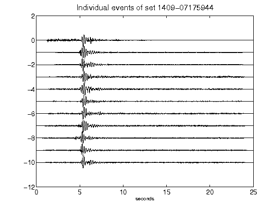](figures/1409-07175944_AllEv.png)[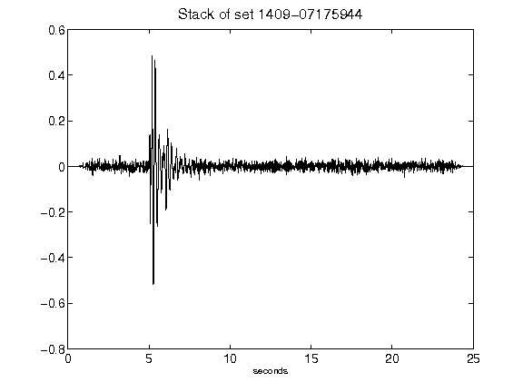](figures/1409-07175944_Stack.png)[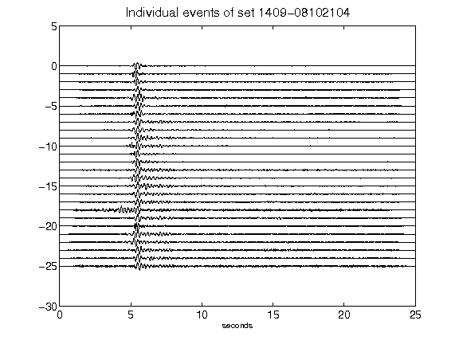](figures/1409-08102104_AllEv.png)[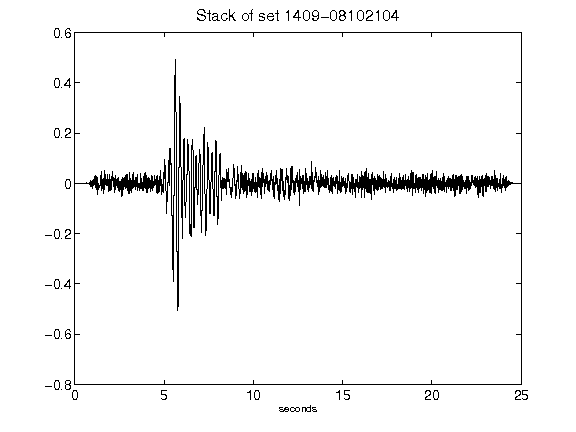](figures/1409-08102104_Stack.png)[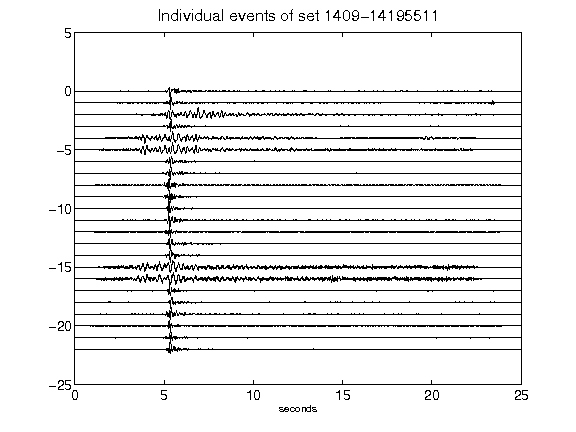](figures/1409-14195511_AllEv.png)[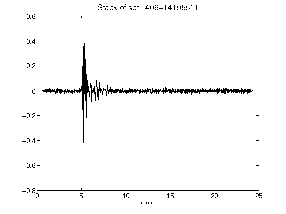](figures/1409-14195511_Stack.png)[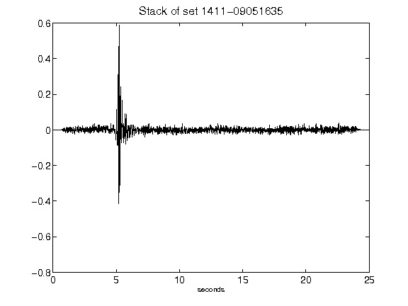](figures/1411-09051635_Stack.png)[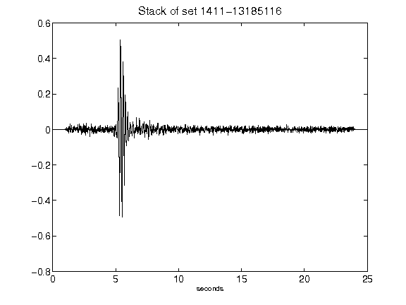](figures/1411-13185116_Stack.png)[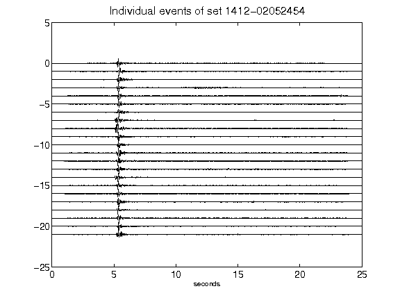](figures/1412-02052454_AllEv.png)[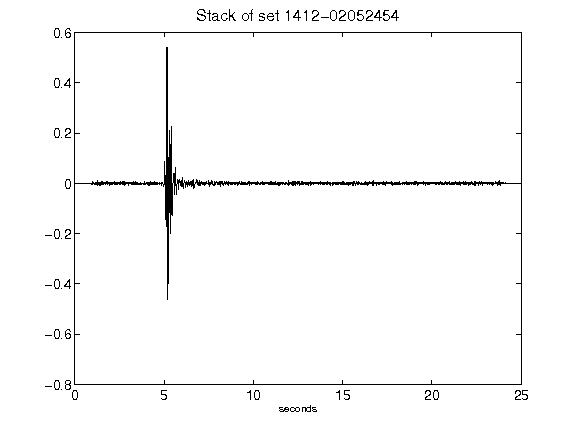](figures/1412-02052454_Stack.png)[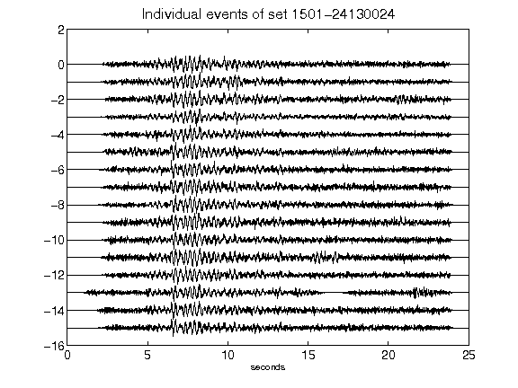](figures/1501-24130024_AllEv.png)[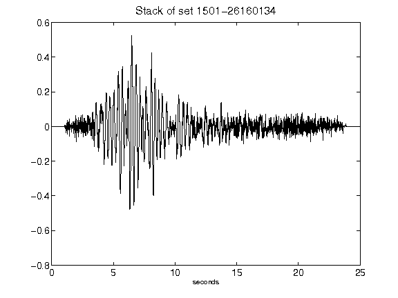](figures/1501-26160134_Stack.png)[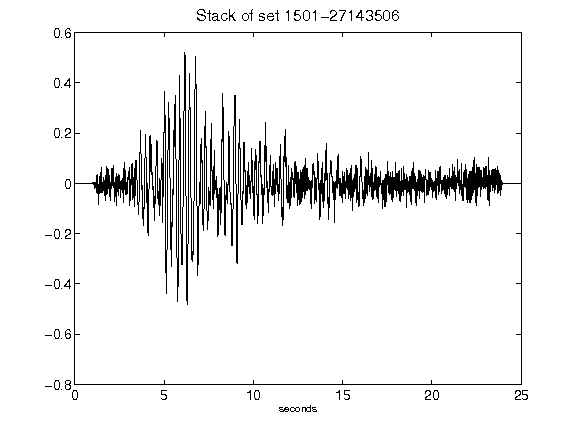](figures/1501-27143506_Stack.png)