# Repeating Earthquake Activity at STAR

## Waveforms
[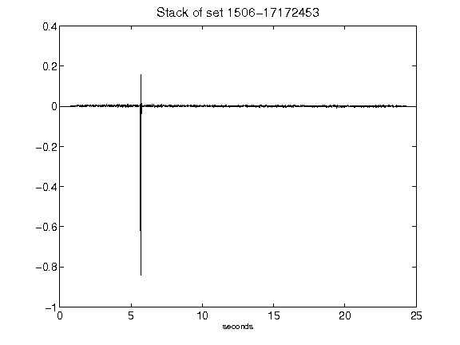](figures/1506-17172453_Stack.png)[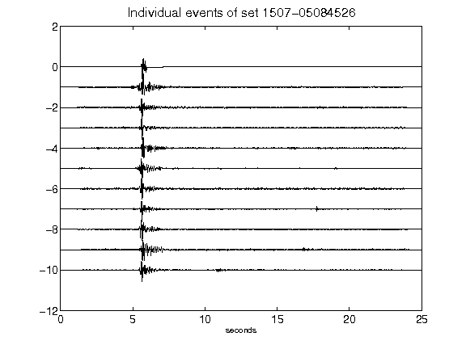](figures/1507-05084526_AllEv.png)[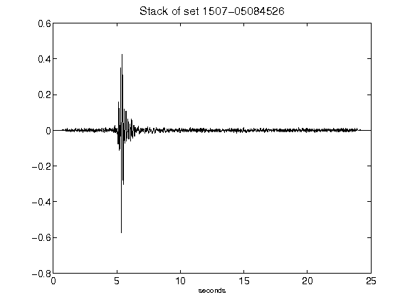](figures/1507-05084526_Stack.png)[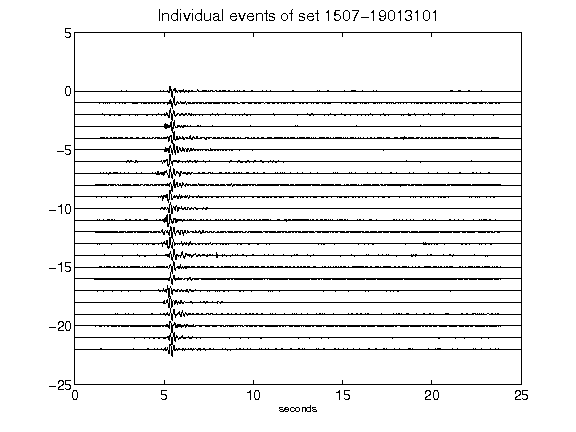](figures/1507-19013101_AllEv.png)[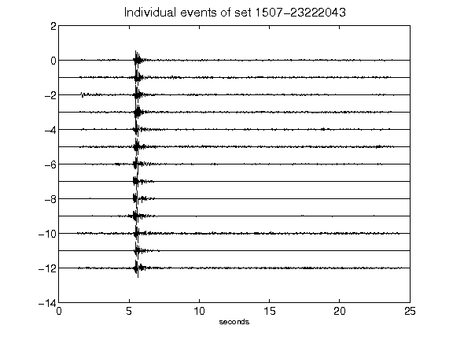](figures/1507-23222043_AllEv.png)[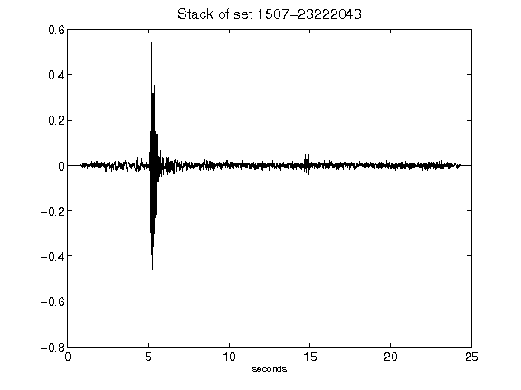](figures/1507-23222043_Stack.png)[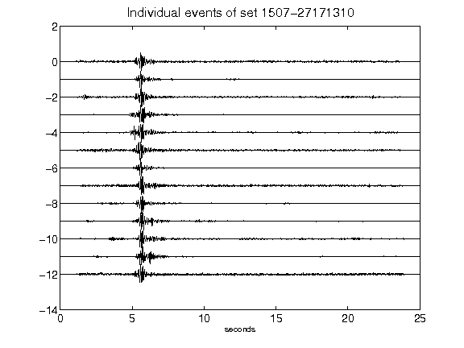](figures/1507-27171310_AllEv.png)[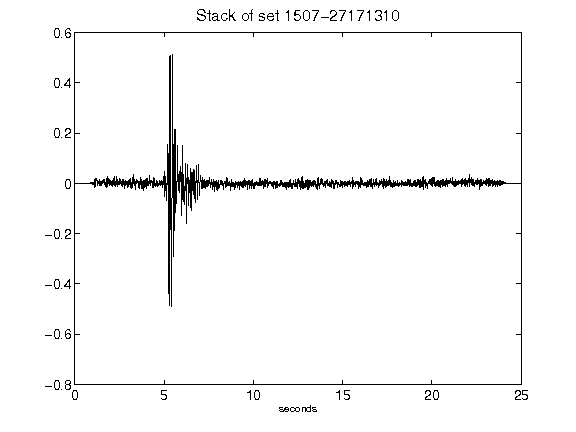](figures/1507-27171310_Stack.png)[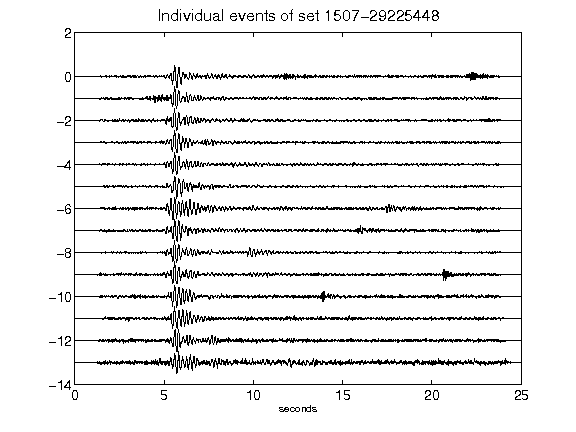](figures/1507-29225448_AllEv.png)[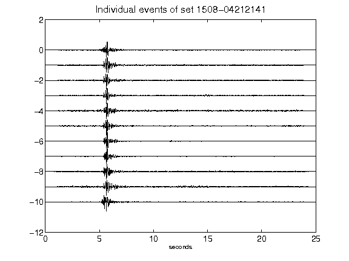](figures/1508-04212141_AllEv.png)[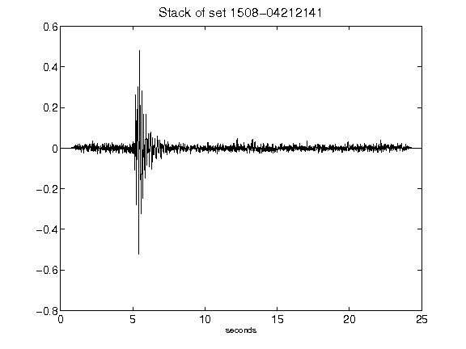](figures/1508-04212141_Stack.png)[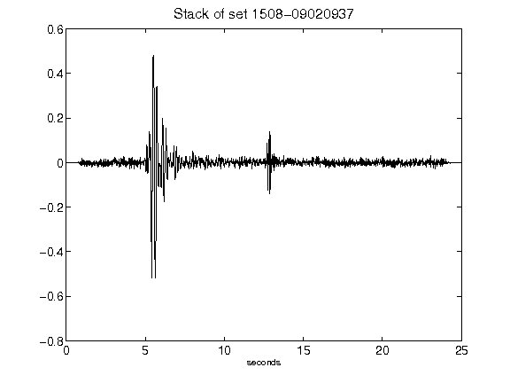](figures/1508-09020937_Stack.png)[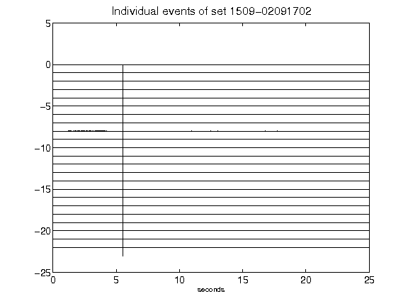](figures/1509-02091702_AllEv.png)[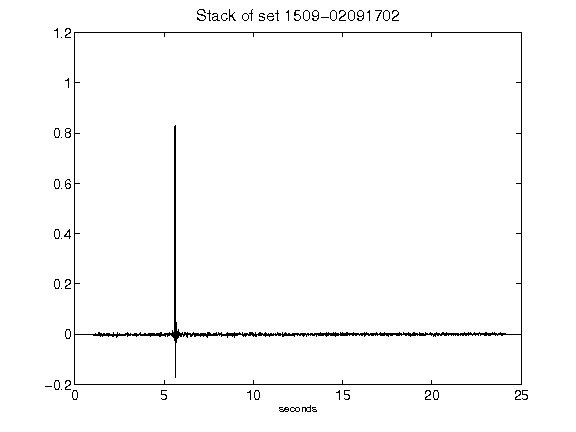](figures/1509-02091702_Stack.png)