# Repeating Earthquake Activity at STAR
  
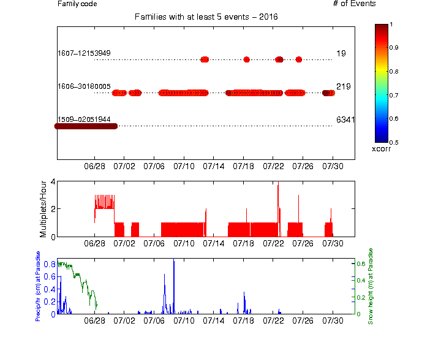  

## Waveforms
[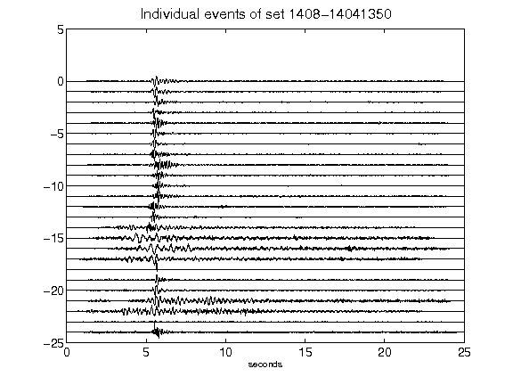](figures/1408-14041350_AllEv.png)[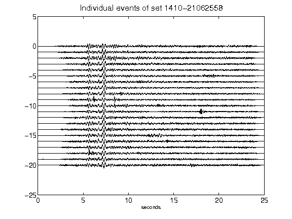](figures/1410-21062558_AllEv.png)[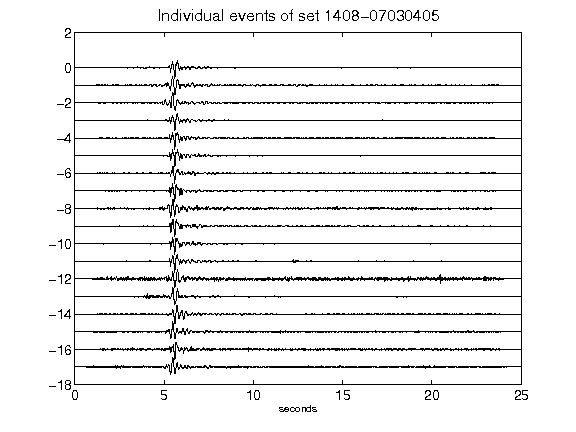](figures/1408-07030405_AllEv.png)[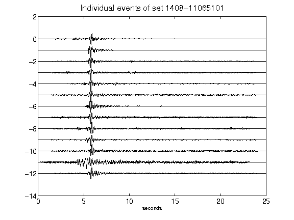](figures/1408-11065101_AllEv.png)[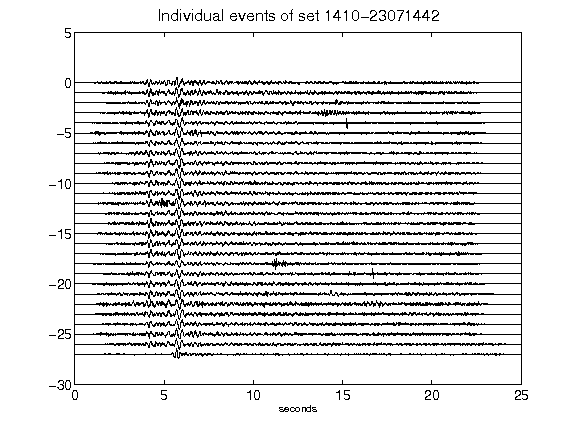](figures/1410-23071442_AllEv.png)[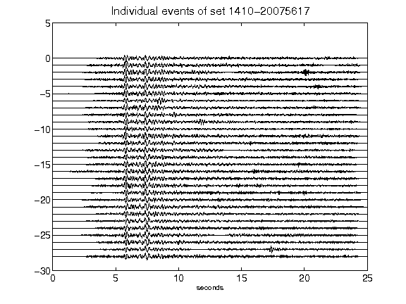](figures/1410-20075617_AllEv.png)[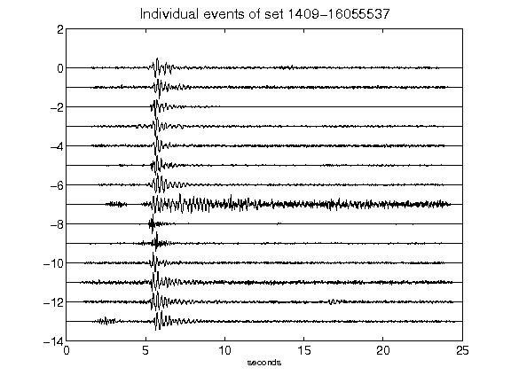](figures/1409-16055537_AllEv.png)[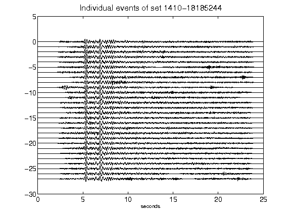](figures/1410-18185244_AllEv.png)[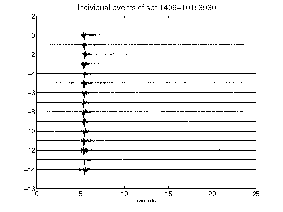](figures/1409-10153930_AllEv.png)[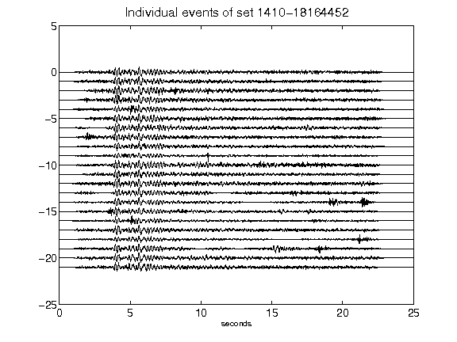](figures/1410-18164452_AllEv.png)[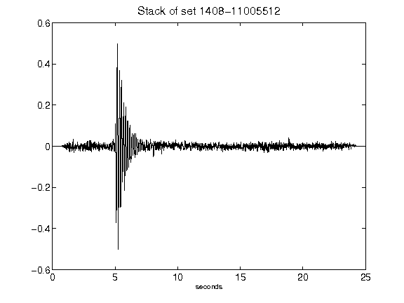](figures/1408-11005512_Stack.png)