# Repeating Earthquake Activity at STAR

## Waveforms
[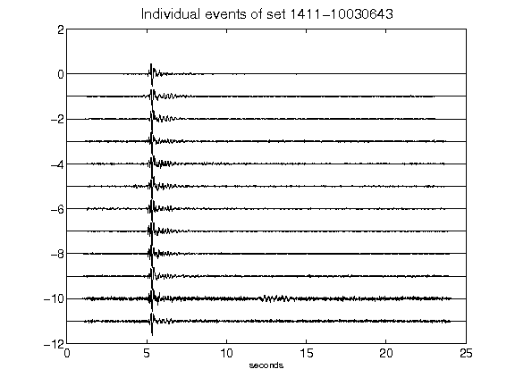](figures/1411-10030643_AllEv.png)[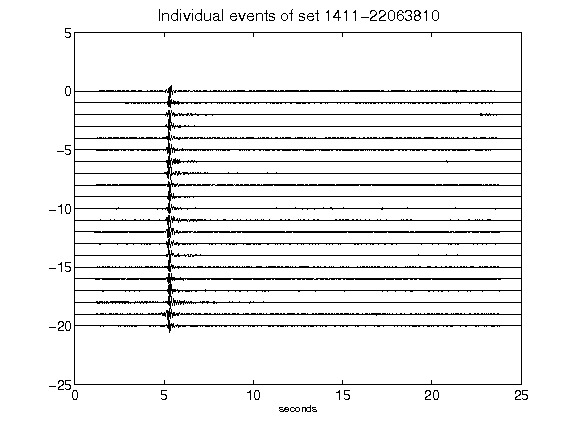](figures/1411-22063810_AllEv.png)[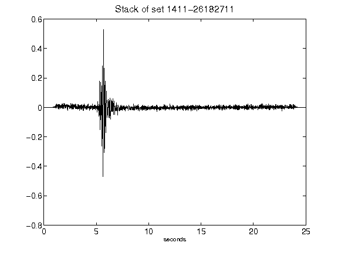](figures/1411-26182711_Stack.png)[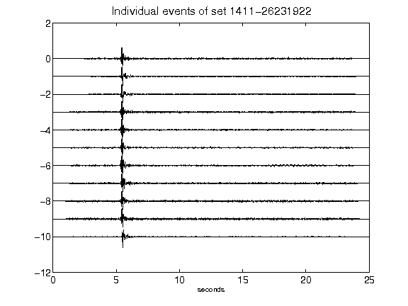](figures/1411-26231922_AllEv.png)[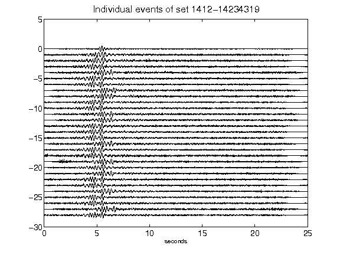](figures/1412-14234319_AllEv.png)[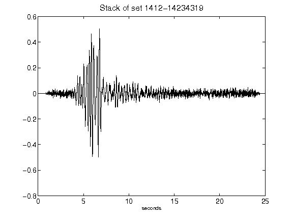](figures/1412-14234319_Stack.png)[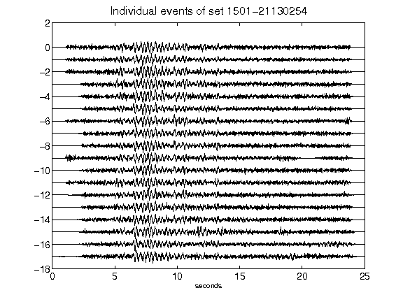](figures/1501-21130254_AllEv.png)[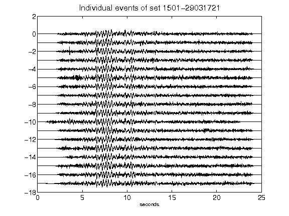](figures/1501-29031721_AllEv.png)[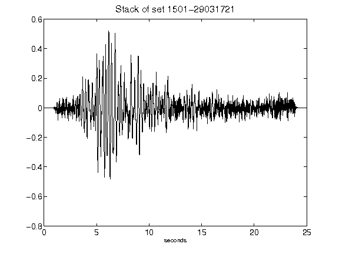](figures/1501-29031721_Stack.png)[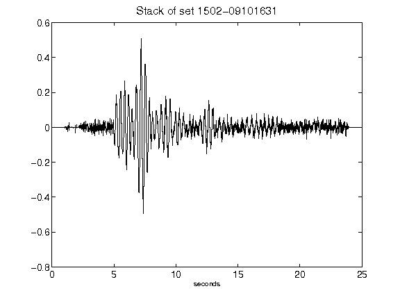](figures/1502-09101631_Stack.png)[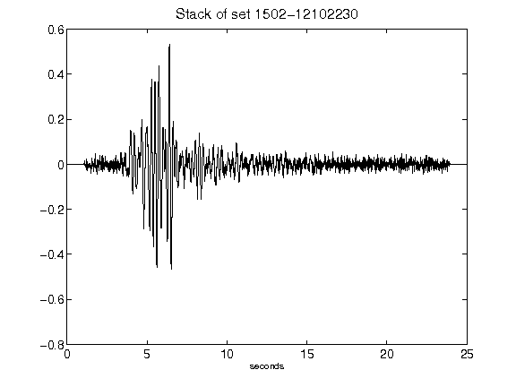](figures/1502-12102230_Stack.png)