# Repeating Earthquake Activity at STAR

## Waveforms
[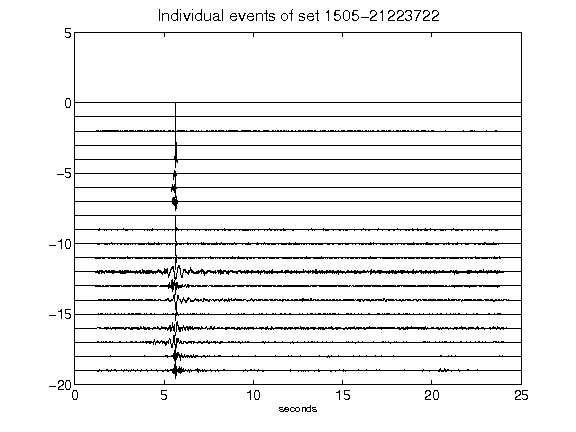](figures/1505-21223722_AllEv.png)[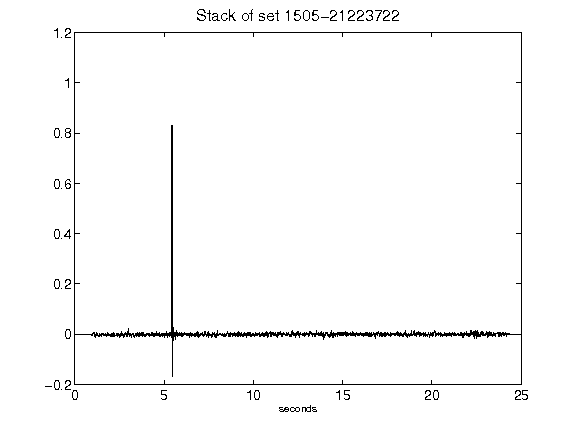](figures/1505-21223722_Stack.png)[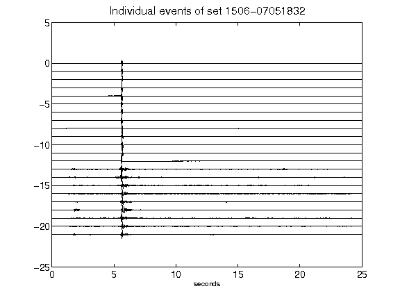](figures/1506-07051832_AllEv.png)[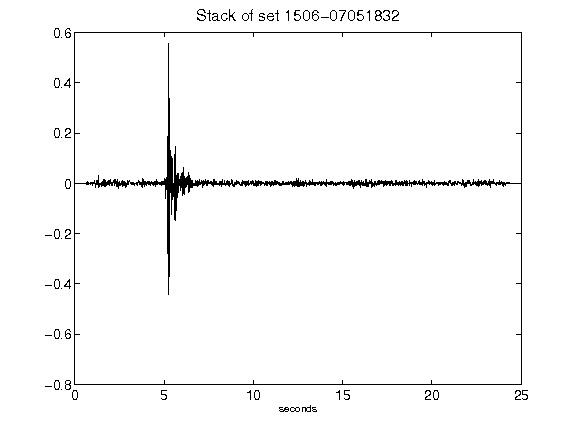](figures/1506-07051832_Stack.png)[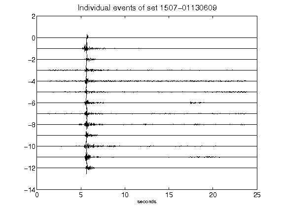](figures/1507-01130609_AllEv.png)[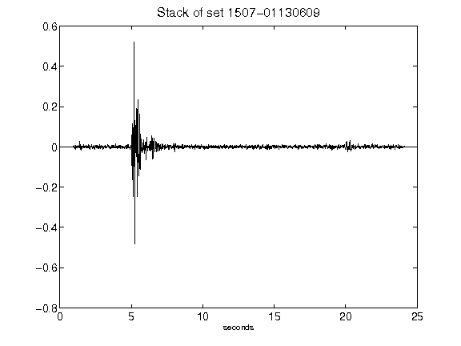](figures/1507-01130609_Stack.png)[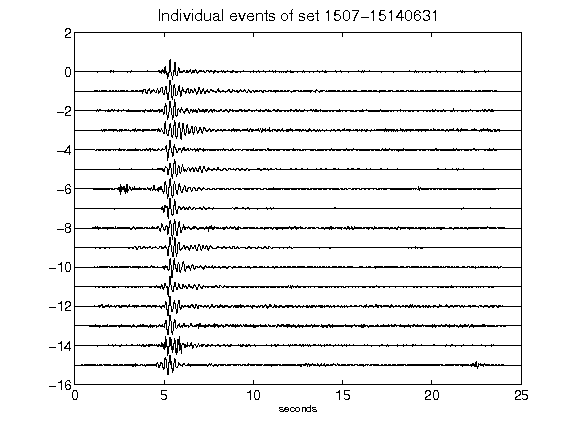](figures/1507-15140631_AllEv.png)[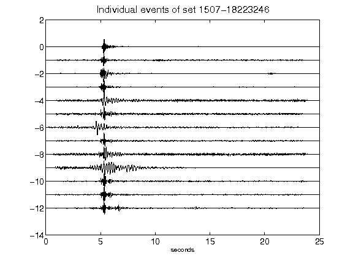](figures/1507-18223246_AllEv.png)[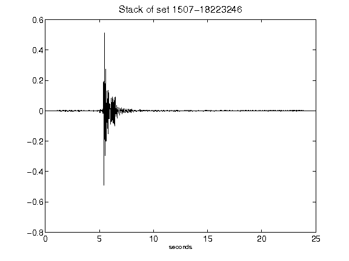](figures/1507-18223246_Stack.png)[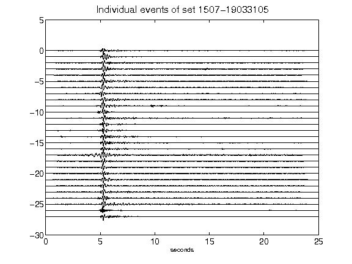](figures/1507-19033105_AllEv.png)[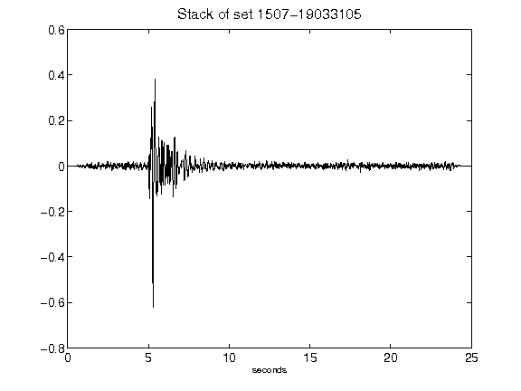](figures/1507-19033105_Stack.png)[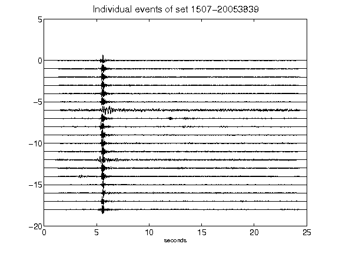](figures/1507-20053839_AllEv.png)[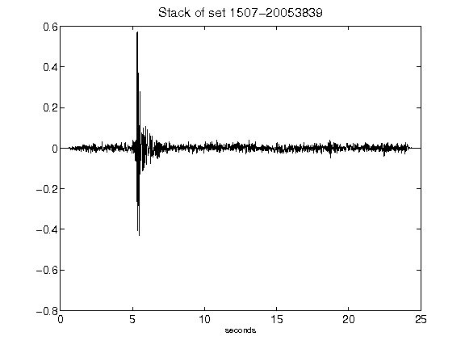](figures/1507-20053839_Stack.png)[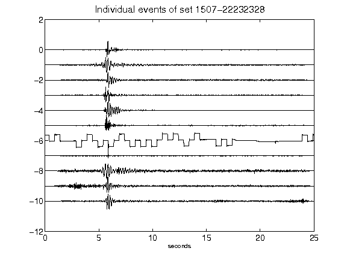](figures/1507-22232328_AllEv.png)[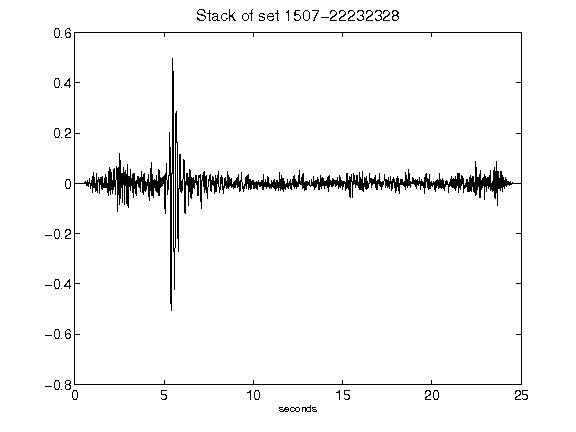](figures/1507-22232328_Stack.png)