# Repeating Earthquake Activity at STAR

## Waveforms
[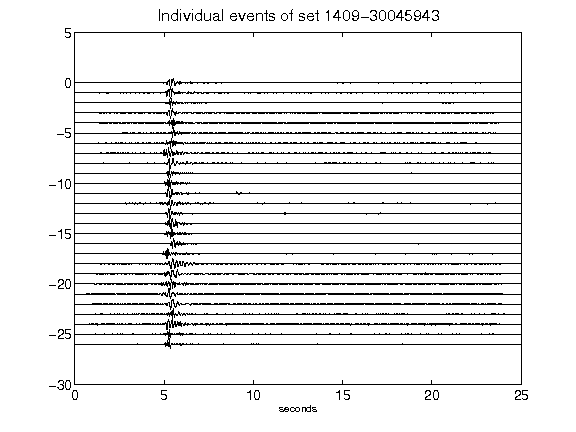](figures/1409-30045943_AllEv.png)[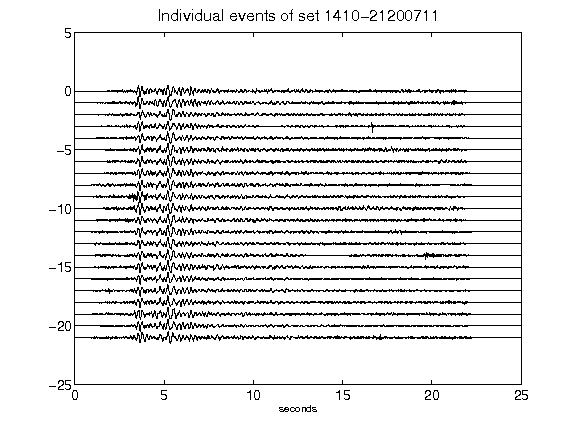](figures/1410-21200711_AllEv.png)[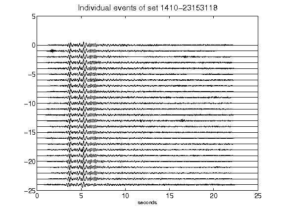](figures/1410-23153118_AllEv.png)[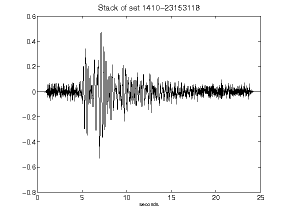](figures/1410-23153118_Stack.png)[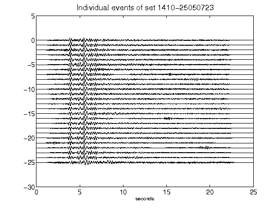](figures/1410-25050723_AllEv.png)[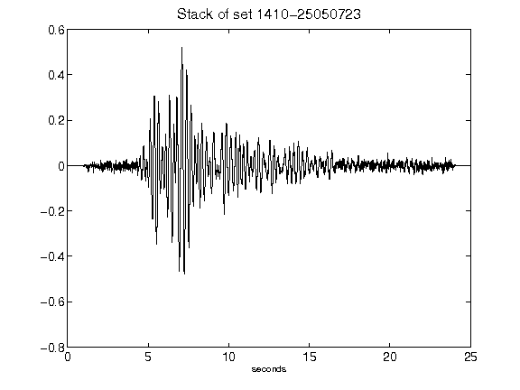](figures/1410-25050723_Stack.png)[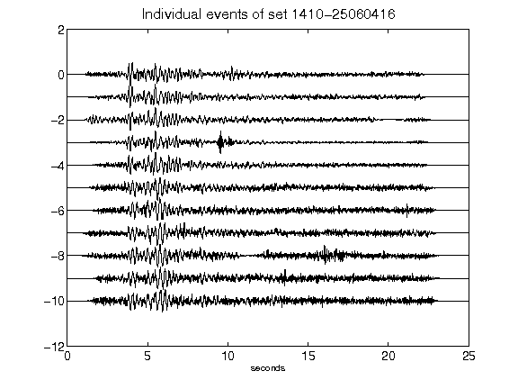](figures/1410-25060416_AllEv.png)[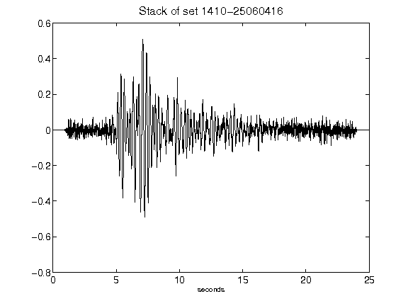](figures/1410-25060416_Stack.png)[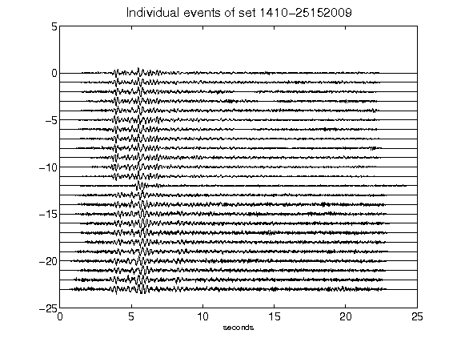](figures/1410-25152009_AllEv.png)[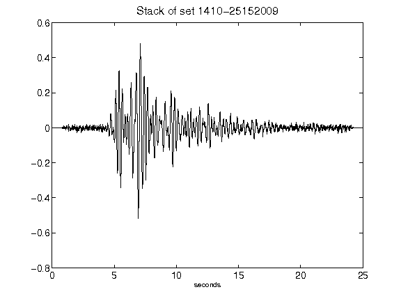](figures/1410-25152009_Stack.png)[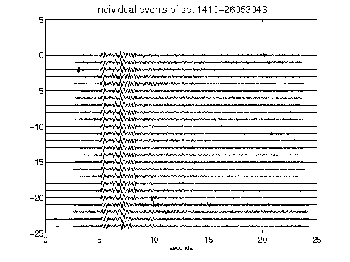](figures/1410-26053043_AllEv.png)[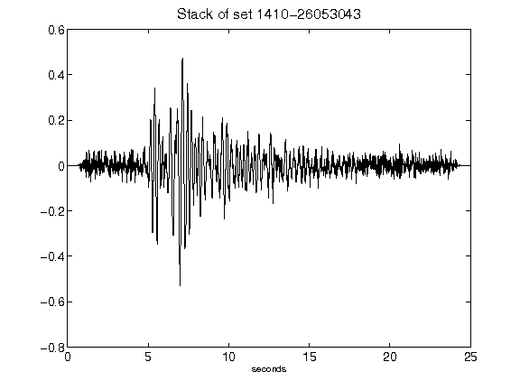](figures/1410-26053043_Stack.png)[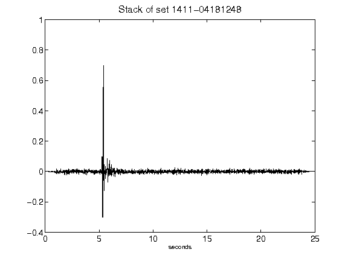](figures/1411-04181248_Stack.png)[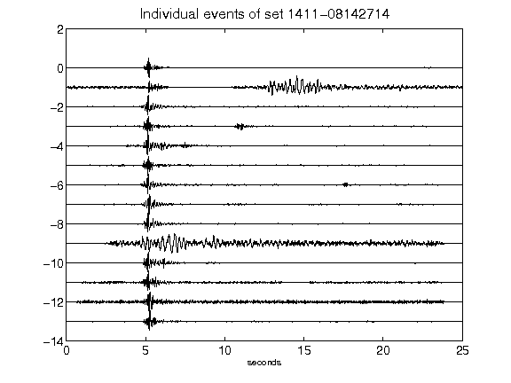](figures/1411-08142714_AllEv.png)[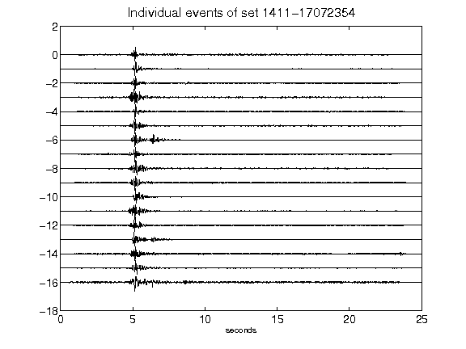](figures/1411-17072354_AllEv.png)[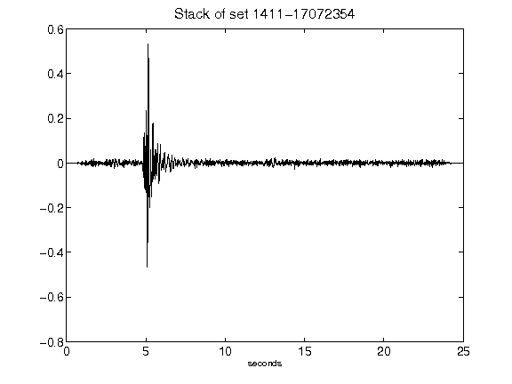](figures/1411-17072354_Stack.png)[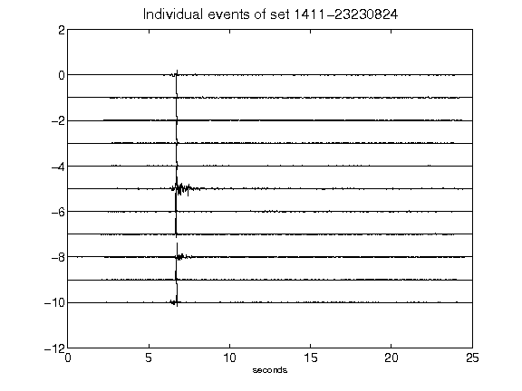](figures/1411-23230824_AllEv.png)[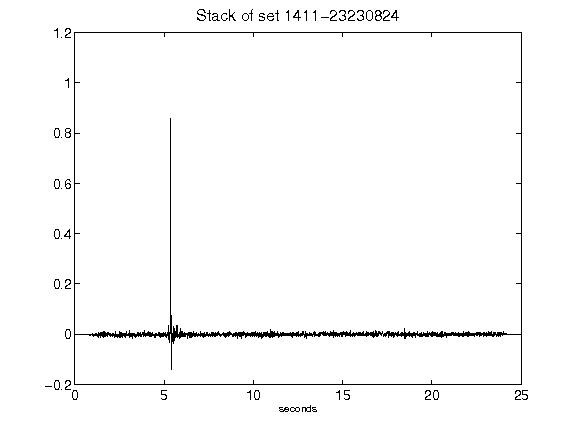](figures/1411-23230824_Stack.png)[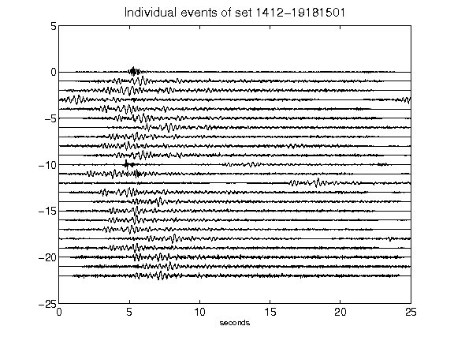](figures/1412-19181501_AllEv.png)[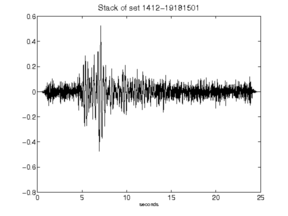](figures/1412-19181501_Stack.png)