# Repeating Earthquake Activity at STAR

## Waveforms
[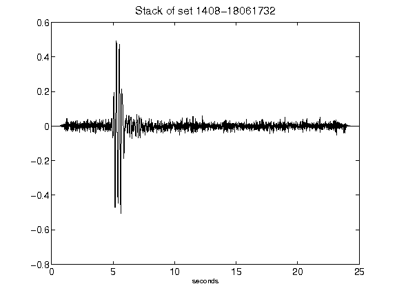](figures/1408-18061732_Stack.png)[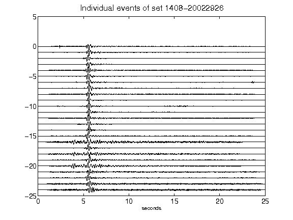](figures/1408-20022926_AllEv.png)[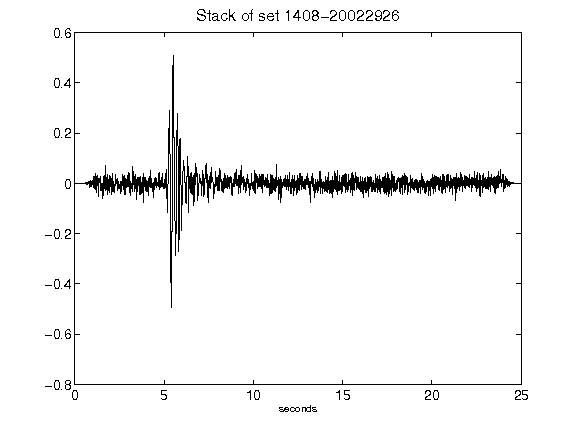](figures/1408-20022926_Stack.png)[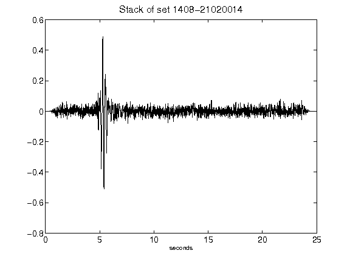](figures/1408-21020014_Stack.png)[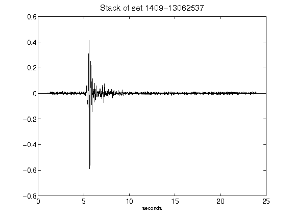](figures/1409-13062537_Stack.png)[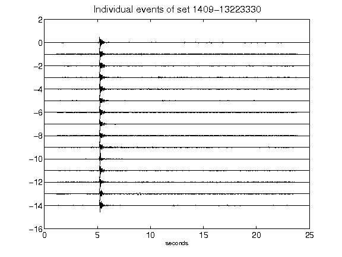](figures/1409-13223330_AllEv.png)[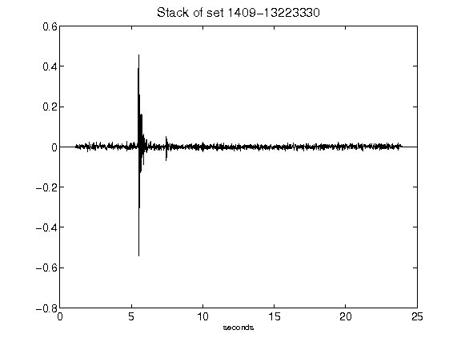](figures/1409-13223330_Stack.png)[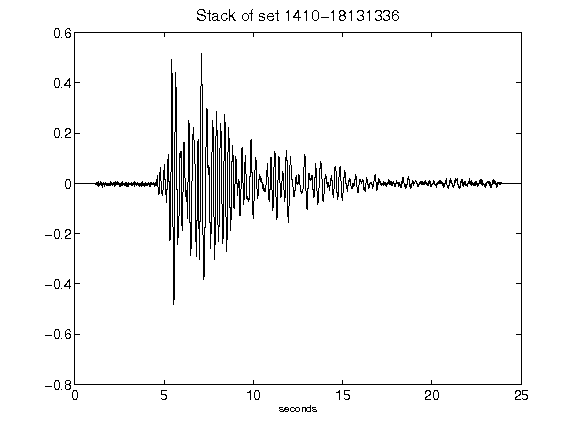](figures/1410-18131336_Stack.png)[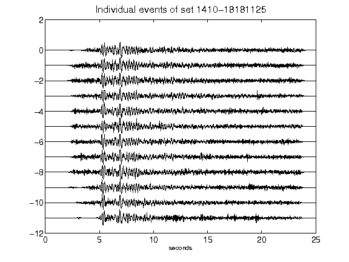](figures/1410-18181125_AllEv.png)[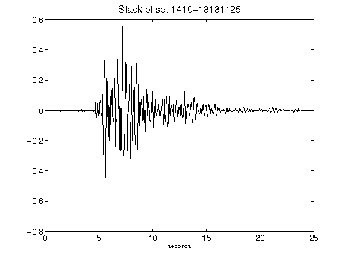](figures/1410-18181125_Stack.png)[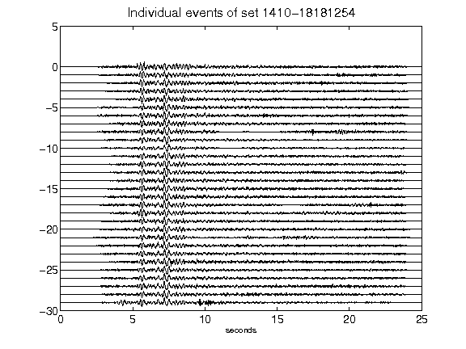](figures/1410-18181254_AllEv.png)[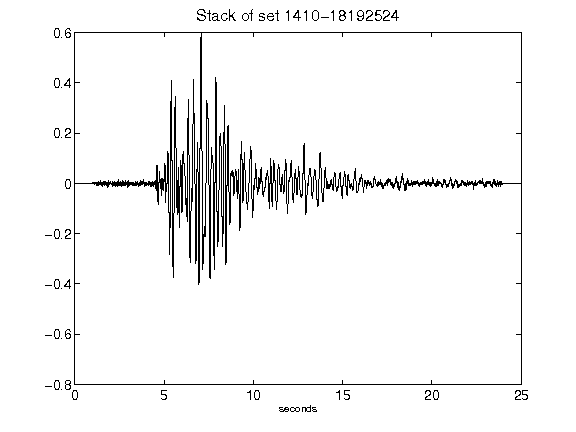](figures/1410-18192524_Stack.png)[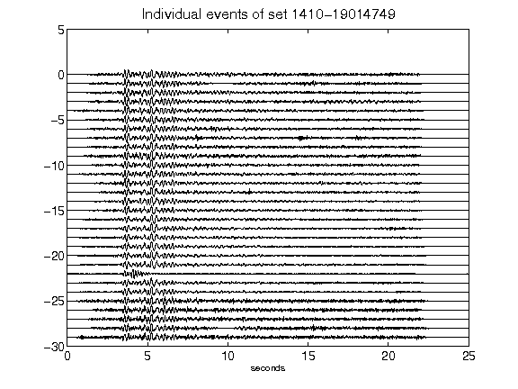](figures/1410-19014749_AllEv.png)[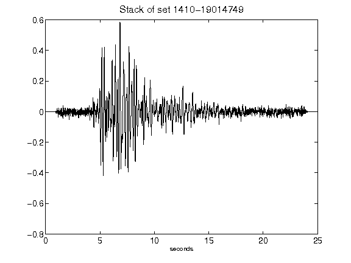](figures/1410-19014749_Stack.png)[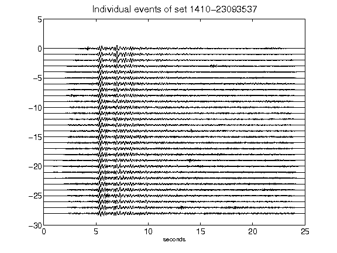](figures/1410-23093537_AllEv.png)[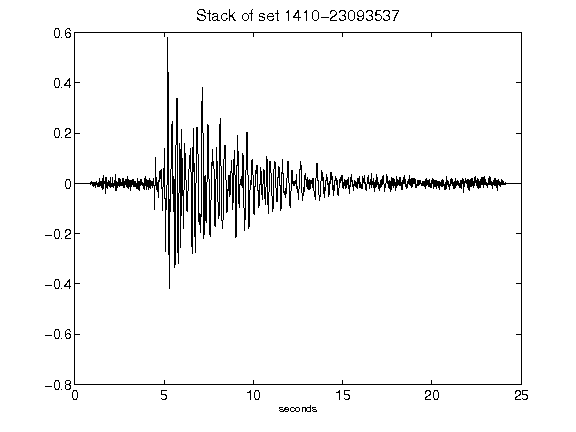](figures/1410-23093537_Stack.png)[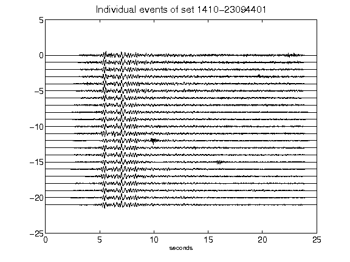](figures/1410-23094401_AllEv.png)[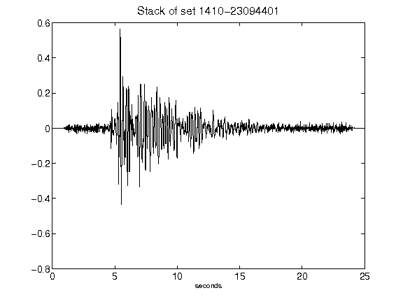](figures/1410-23094401_Stack.png)[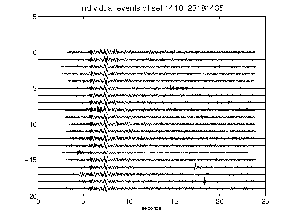](figures/1410-23181435_AllEv.png)[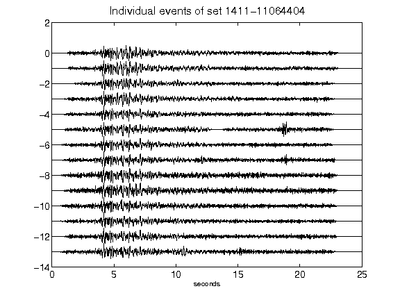](figures/1411-11064404_AllEv.png)