# Repeating Earthquake Activity at STAR

## Waveforms
[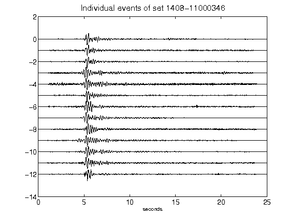](figures/1408-11000346_AllEv.png)[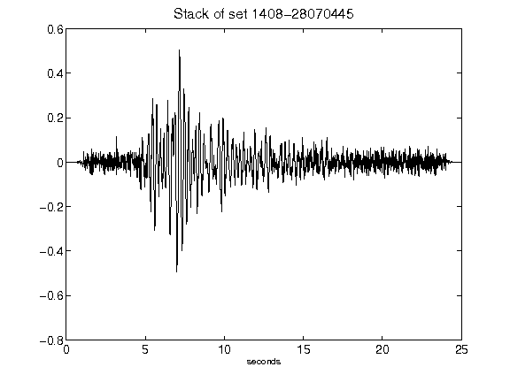](figures/1408-28070445_Stack.png)[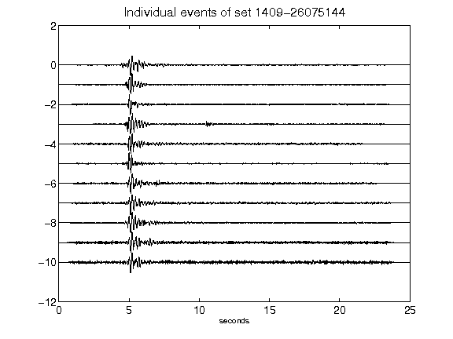](figures/1409-26075144_AllEv.png)[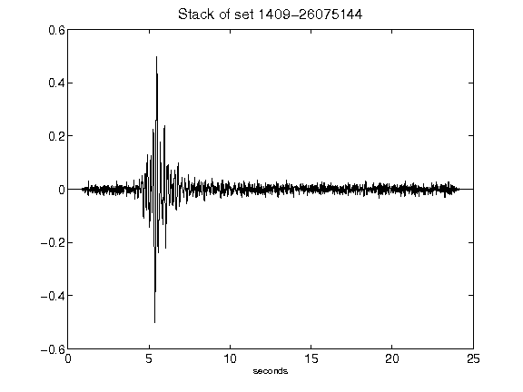](figures/1409-26075144_Stack.png)[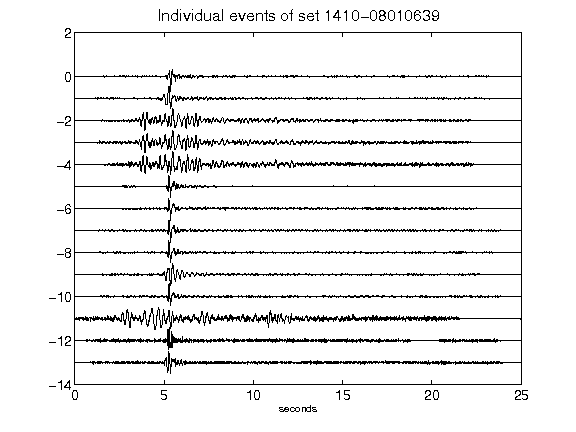](figures/1410-08010639_AllEv.png)[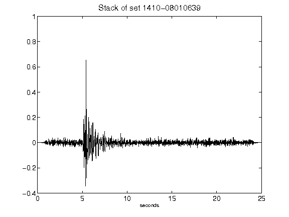](figures/1410-08010639_Stack.png)[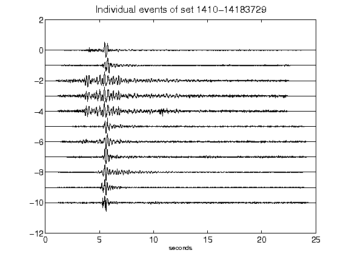](figures/1410-14183729_AllEv.png)[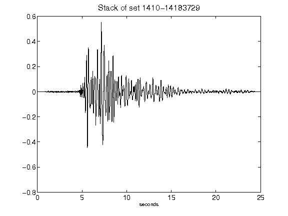](figures/1410-14183729_Stack.png)[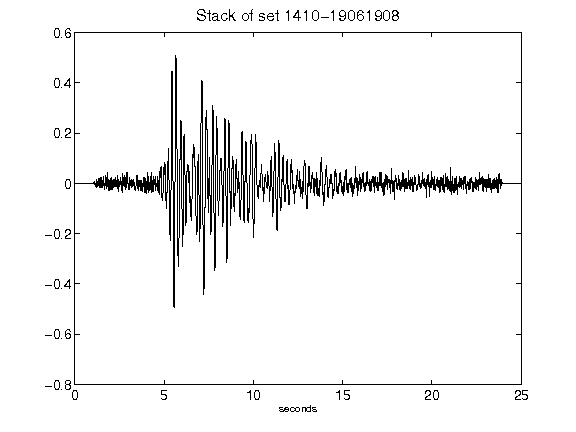](figures/1410-19061908_Stack.png)[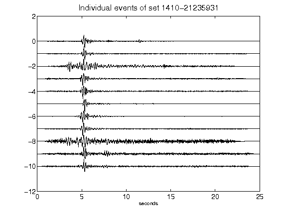](figures/1410-21235931_AllEv.png)[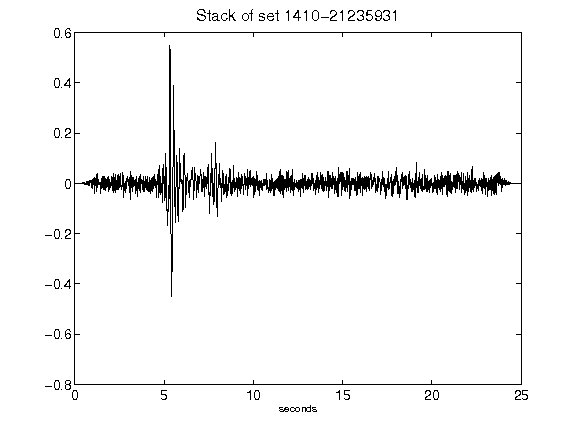](figures/1410-21235931_Stack.png)[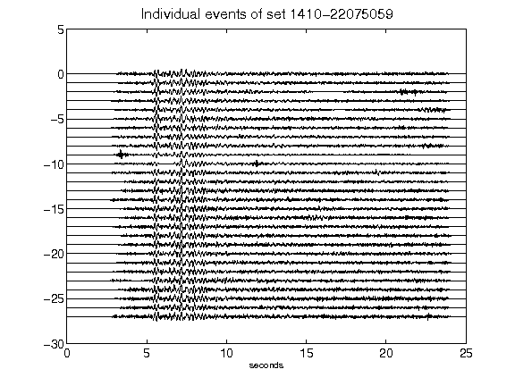](figures/1410-22075059_AllEv.png)[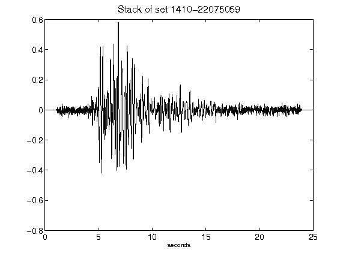](figures/1410-22075059_Stack.png)[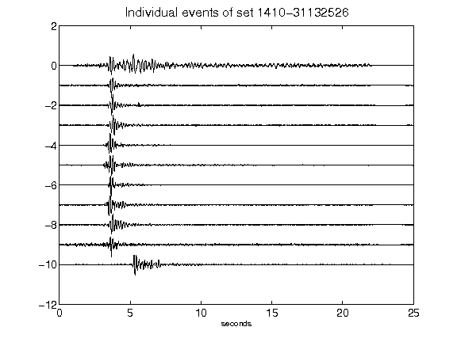](figures/1410-31132526_AllEv.png)[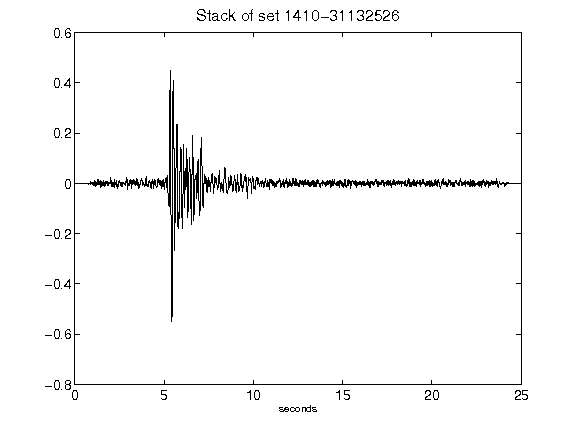](figures/1410-31132526_Stack.png)[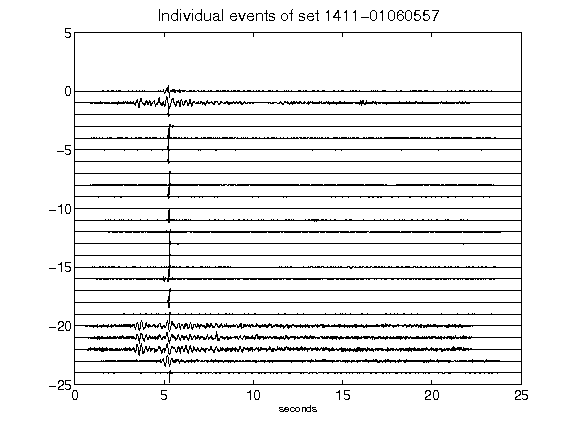](figures/1411-01060557_AllEv.png)[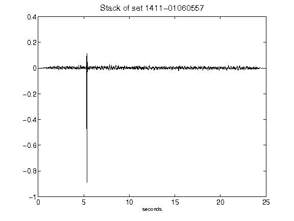](figures/1411-01060557_Stack.png)[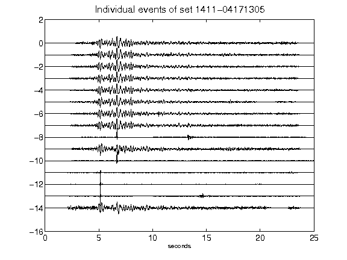](figures/1411-04171305_AllEv.png)[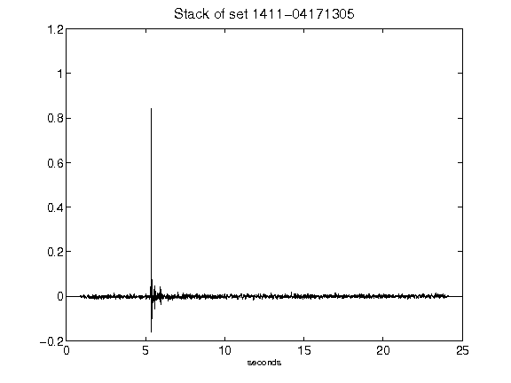](figures/1411-04171305_Stack.png)[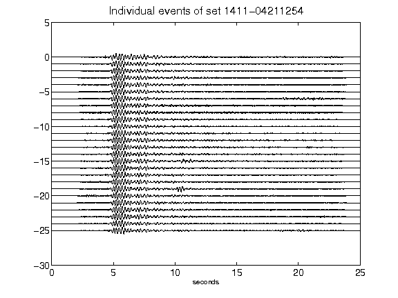](figures/1411-04211254_AllEv.png)[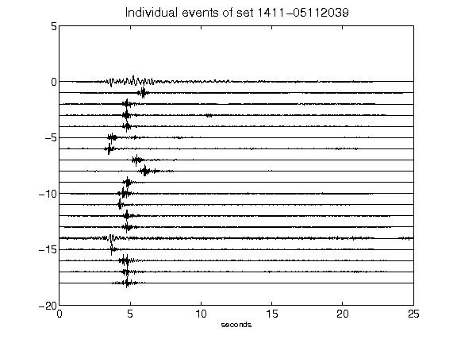](figures/1411-05112039_AllEv.png)[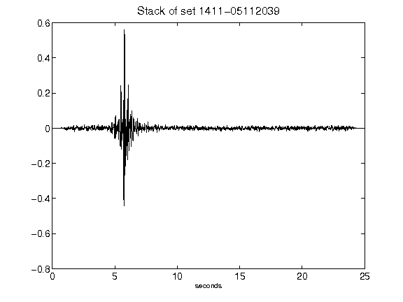](figures/1411-05112039_Stack.png)[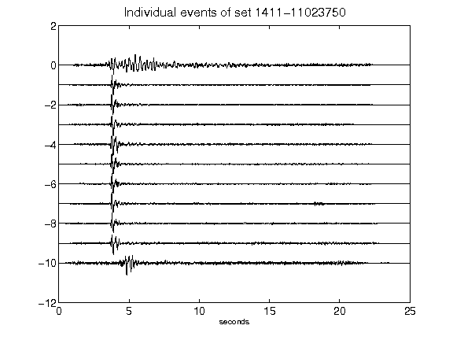](figures/1411-11023750_AllEv.png)[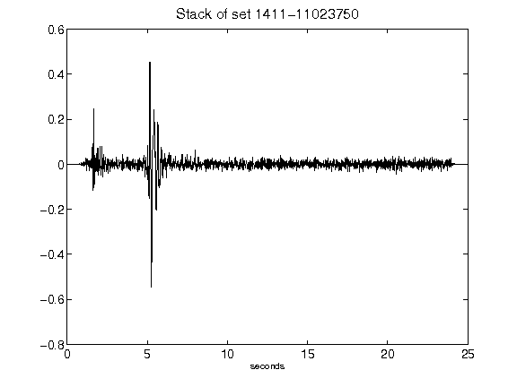](figures/1411-11023750_Stack.png)[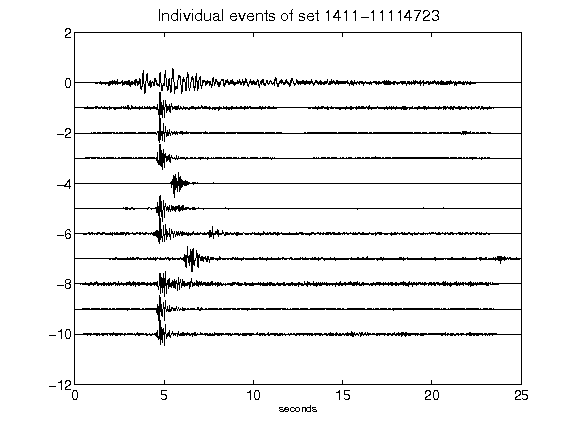](figures/1411-11114723_AllEv.png)[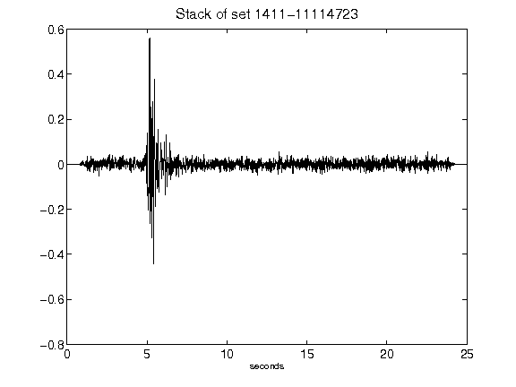](figures/1411-11114723_Stack.png)[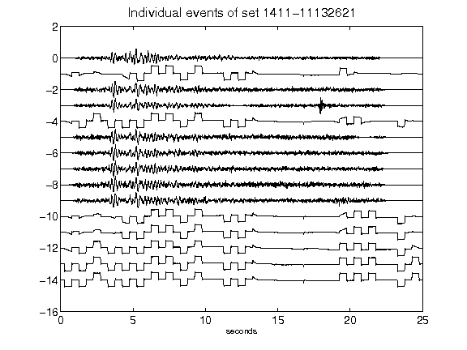](figures/1411-11132621_AllEv.png)[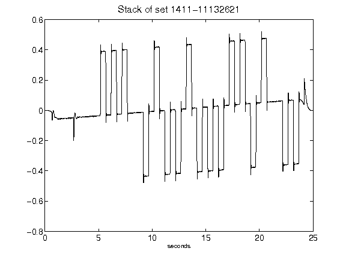](figures/1411-11132621_Stack.png)