# Repeating Earthquake Activity at STAR

## Waveforms
[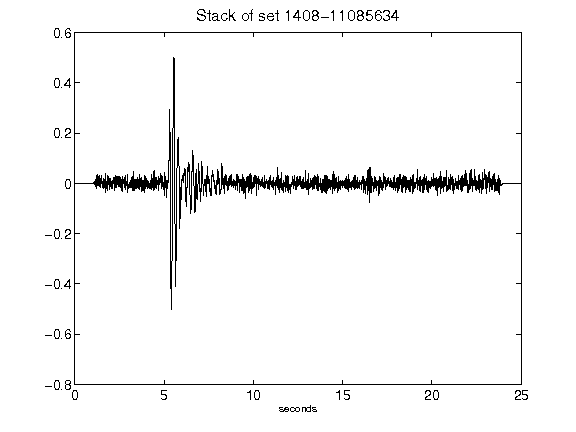](figures/1408-11085634_Stack.png)[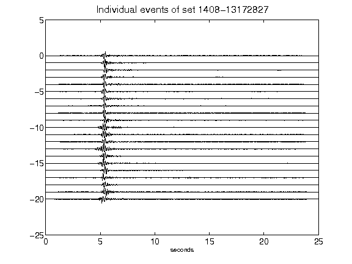](figures/1408-13172827_AllEv.png)[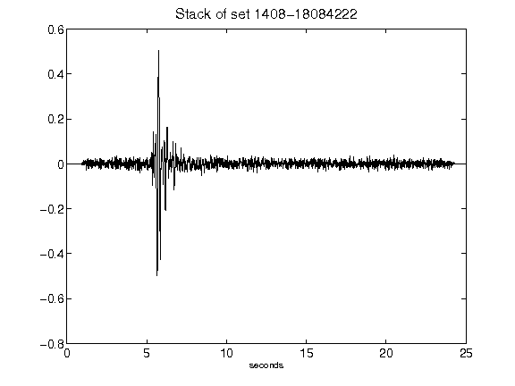](figures/1408-18084222_Stack.png)[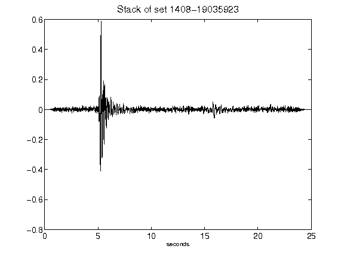](figures/1408-19035923_Stack.png)[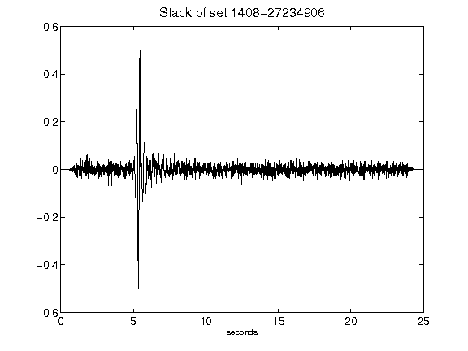](figures/1408-27234906_Stack.png)[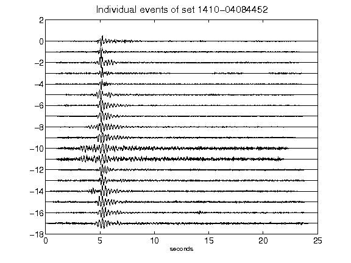](figures/1410-04084452_AllEv.png)[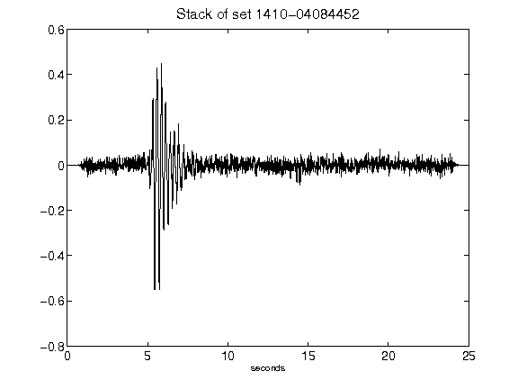](figures/1410-04084452_Stack.png)[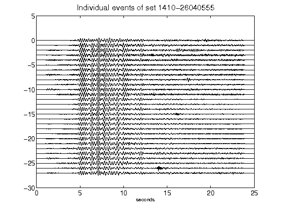](figures/1410-26040555_AllEv.png)[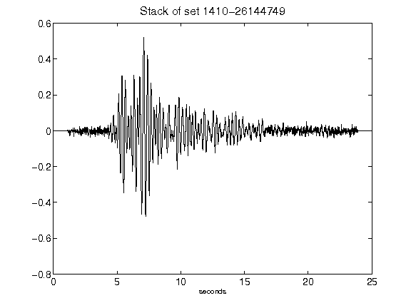](figures/1410-26144749_Stack.png)[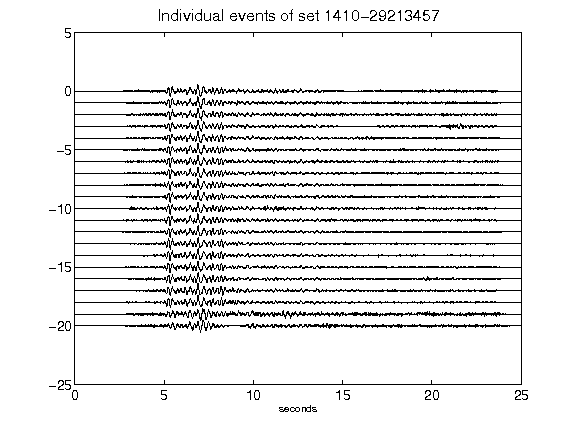](figures/1410-29213457_AllEv.png)[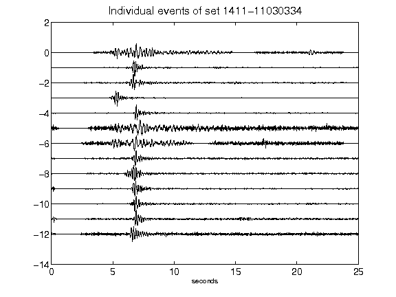](figures/1411-11030334_AllEv.png)[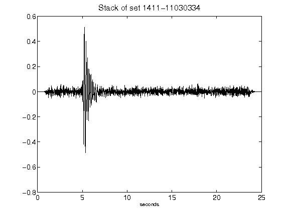](figures/1411-11030334_Stack.png)[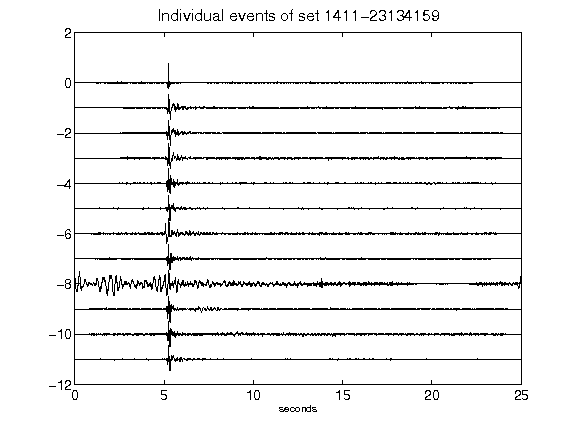](figures/1411-23134159_AllEv.png)[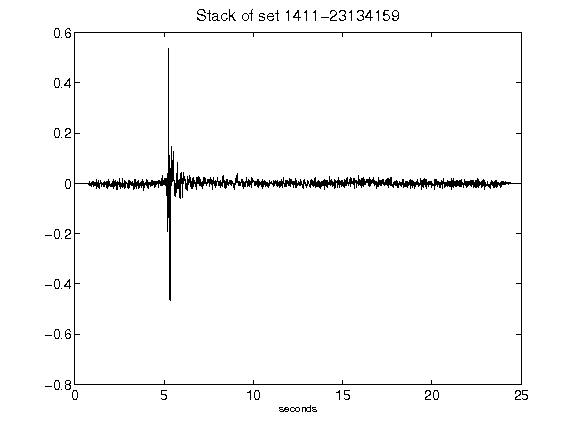](figures/1411-23134159_Stack.png)[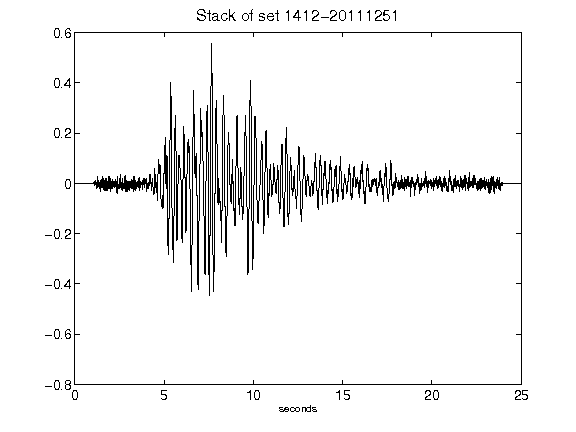](figures/1412-20111251_Stack.png)