# Repeating Earthquake Activity at STAR

## Waveforms
[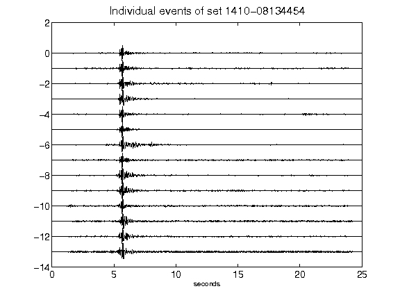](figures/1410-08134454_AllEv.png)[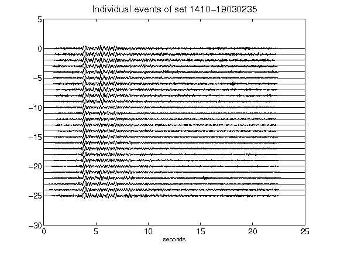](figures/1410-19030235_AllEv.png)[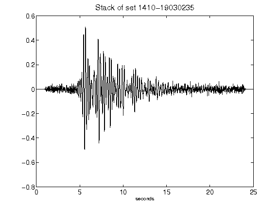](figures/1410-19030235_Stack.png)[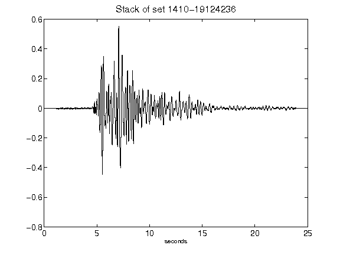](figures/1410-19124236_Stack.png)[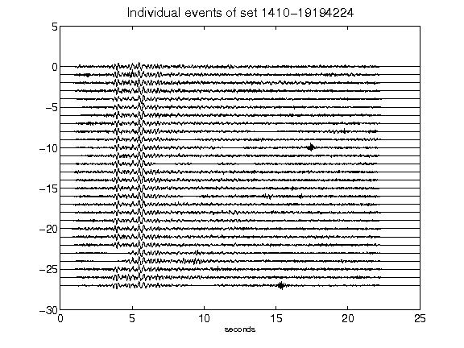](figures/1410-19194224_AllEv.png)[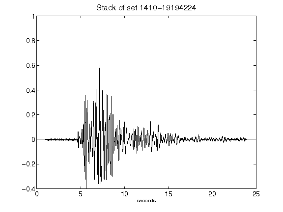](figures/1410-19194224_Stack.png)[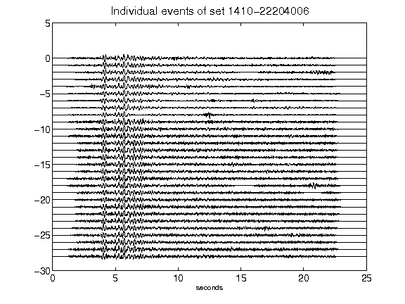](figures/1410-22204006_AllEv.png)[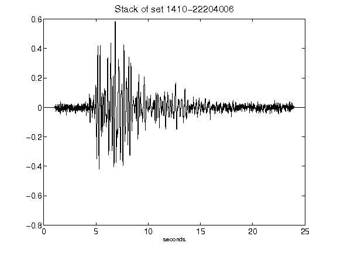](figures/1410-22204006_Stack.png)[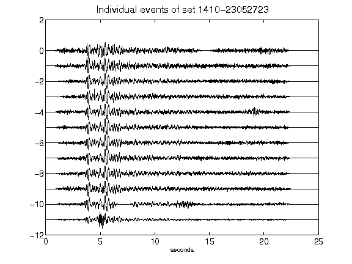](figures/1410-23052723_AllEv.png)[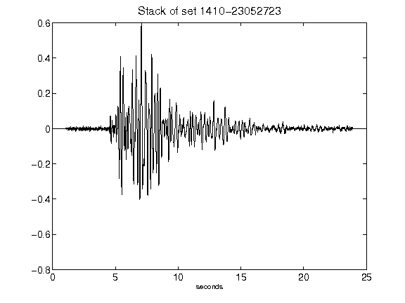](figures/1410-23052723_Stack.png)[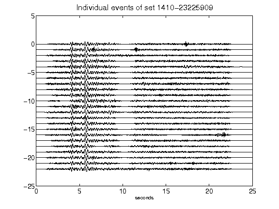](figures/1410-23225909_AllEv.png)[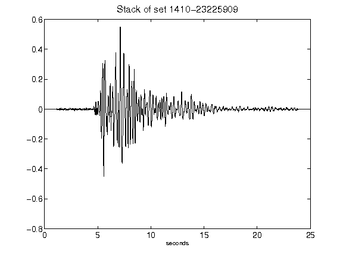](figures/1410-23225909_Stack.png)[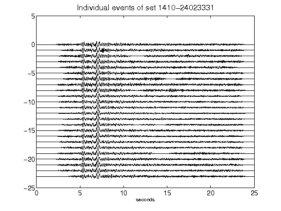](figures/1410-24023331_AllEv.png)[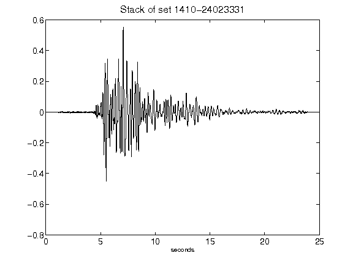](figures/1410-24023331_Stack.png)[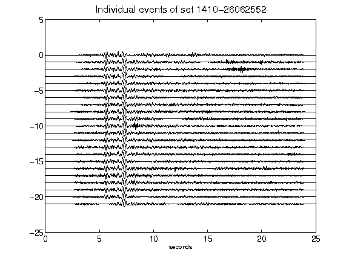](figures/1410-26062552_AllEv.png)[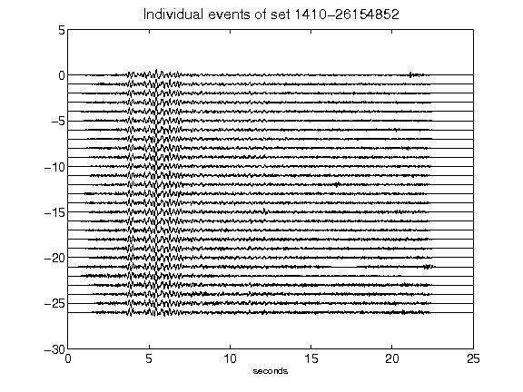](figures/1410-26154852_AllEv.png)[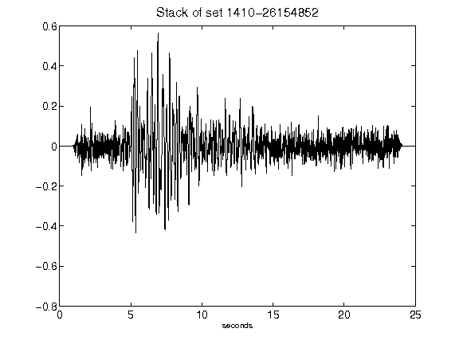](figures/1410-26154852_Stack.png)