# Repeating Earthquake Activity at STAR

## Waveforms
[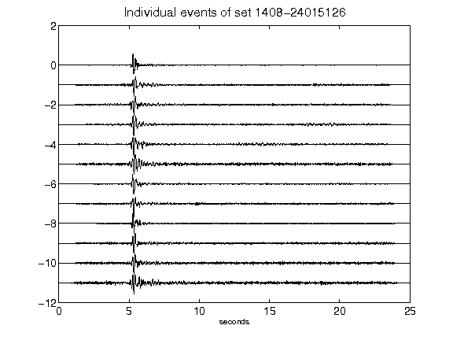](figures/1408-24015126_AllEv.png)[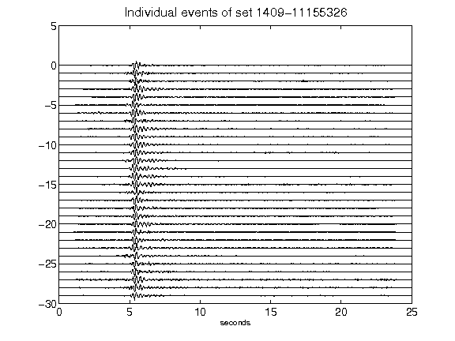](figures/1409-11155326_AllEv.png)[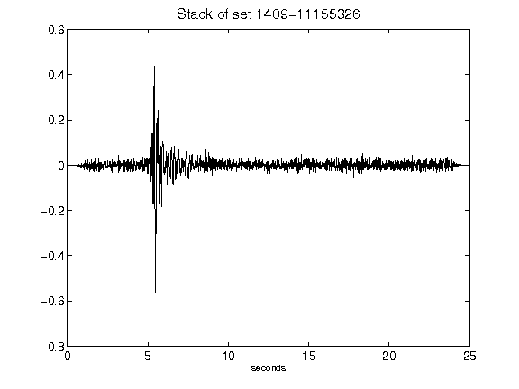](figures/1409-11155326_Stack.png)[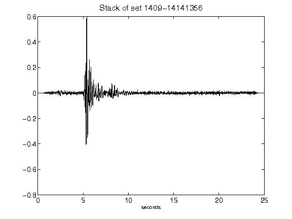](figures/1409-14141356_Stack.png)[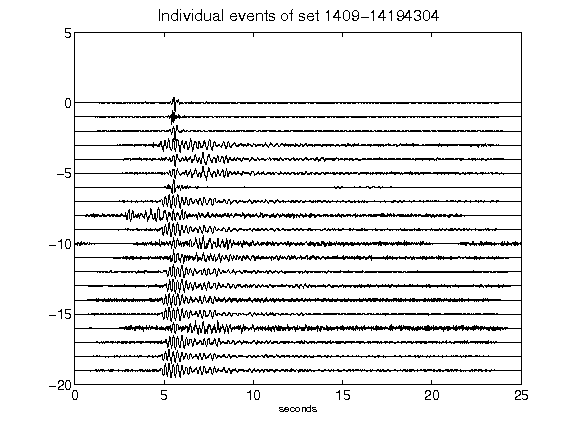](figures/1409-14194304_AllEv.png)[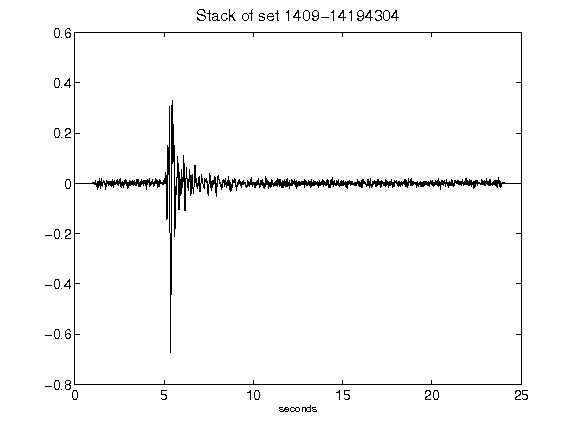](figures/1409-14194304_Stack.png)[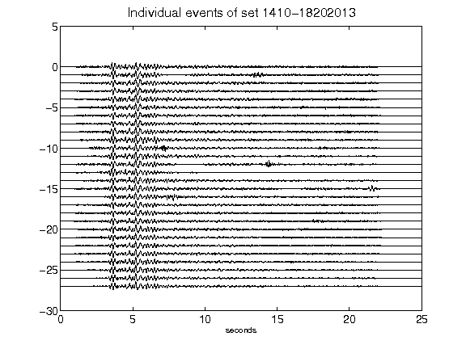](figures/1410-18202013_AllEv.png)[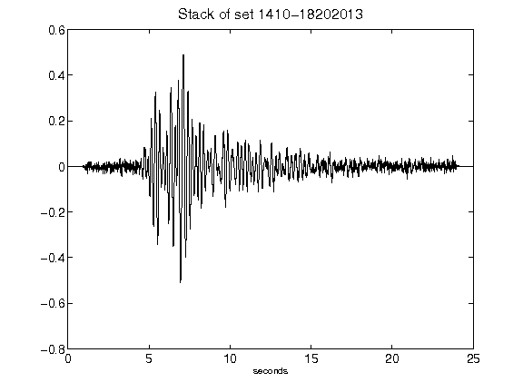](figures/1410-18202013_Stack.png)[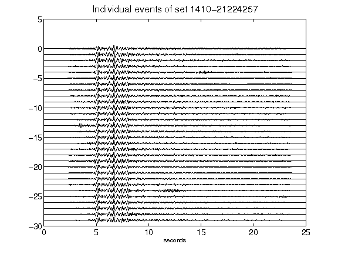](figures/1410-21224257_AllEv.png)[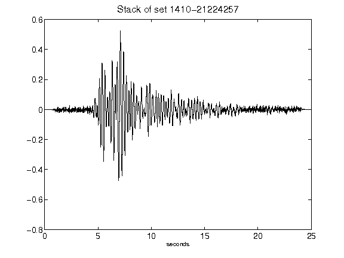](figures/1410-21224257_Stack.png)[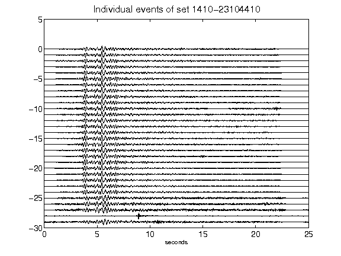](figures/1410-23104410_AllEv.png)[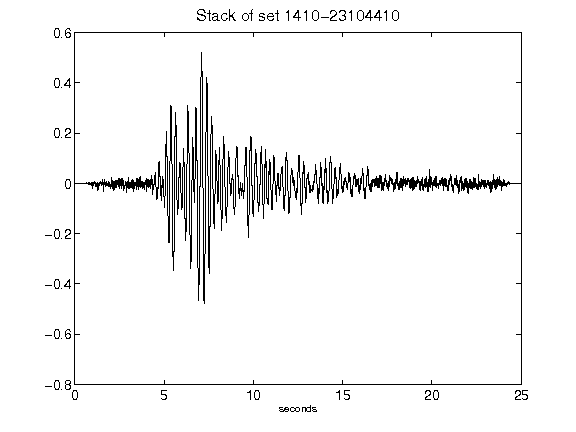](figures/1410-23104410_Stack.png)[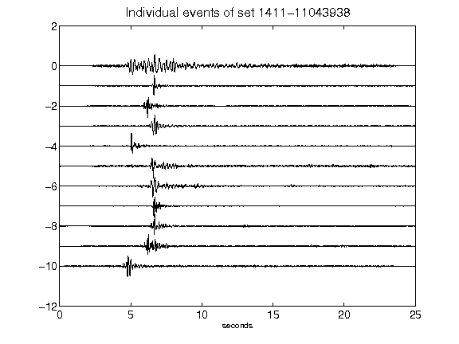](figures/1411-11043938_AllEv.png)[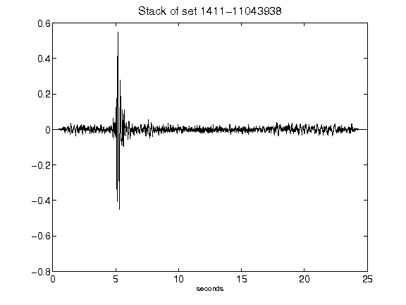](figures/1411-11043938_Stack.png)[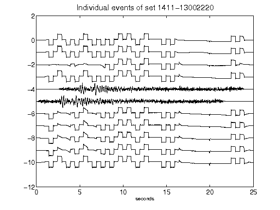](figures/1411-13002220_AllEv.png)