# Repeating Earthquake Activity at STAR

## Waveforms
[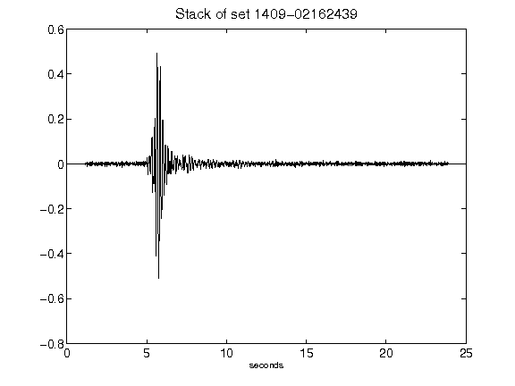](figures/1409-02162439_Stack.png)[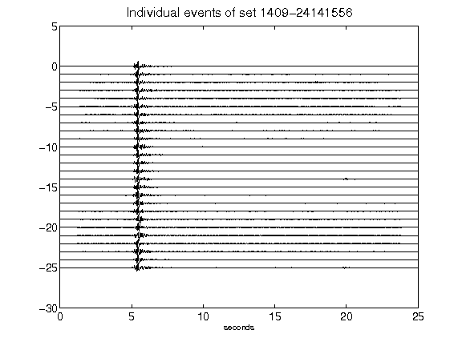](figures/1409-24141556_AllEv.png)[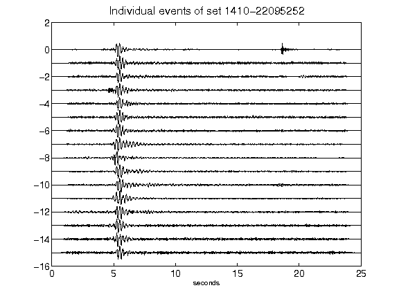](figures/1410-22095252_AllEv.png)[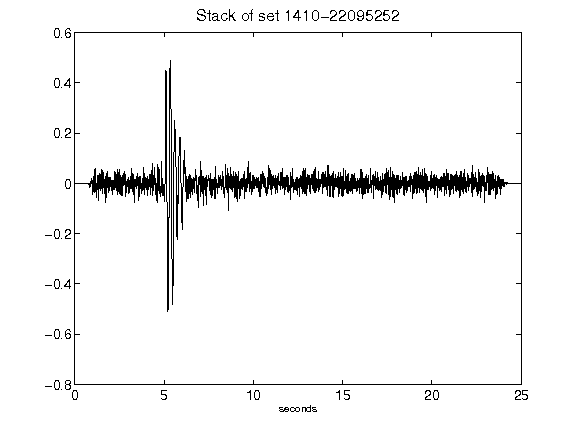](figures/1410-22095252_Stack.png)[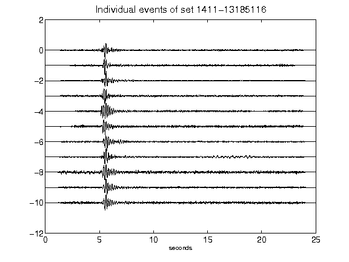](figures/1411-13185116_AllEv.png)[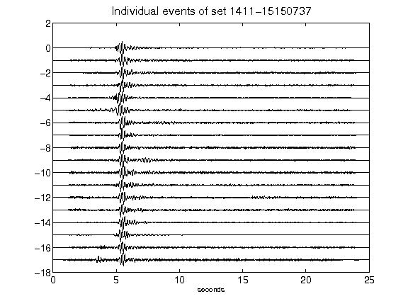](figures/1411-15150737_AllEv.png)[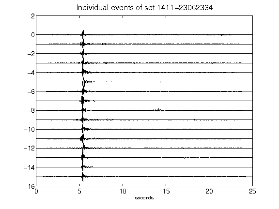](figures/1411-23062334_AllEv.png)[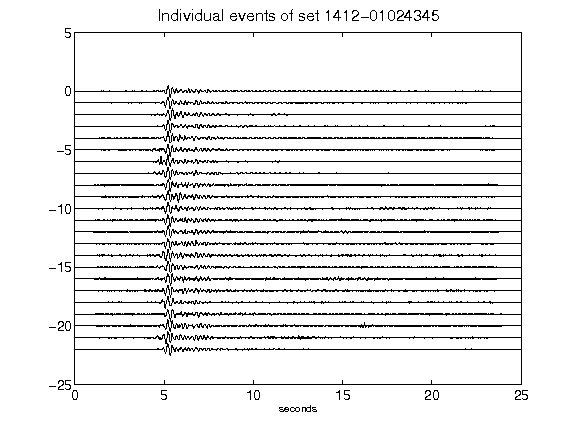](figures/1412-01024345_AllEv.png)[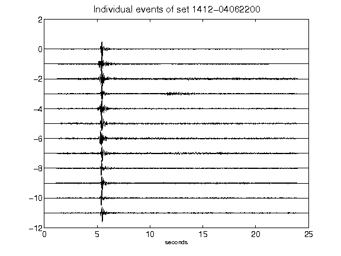](figures/1412-04062200_AllEv.png)[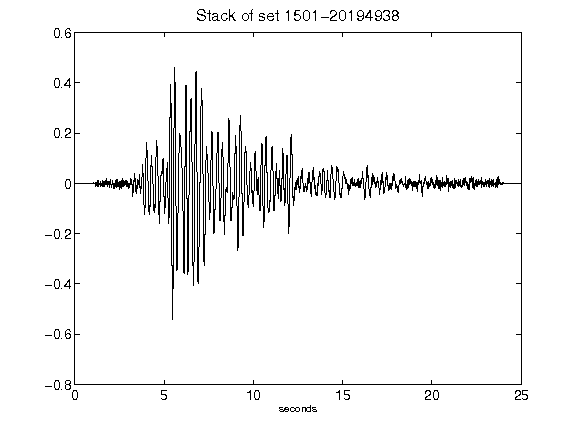](figures/1501-20194938_Stack.png)[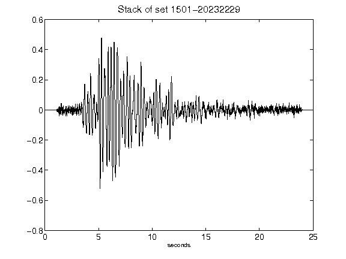](figures/1501-20232229_Stack.png)[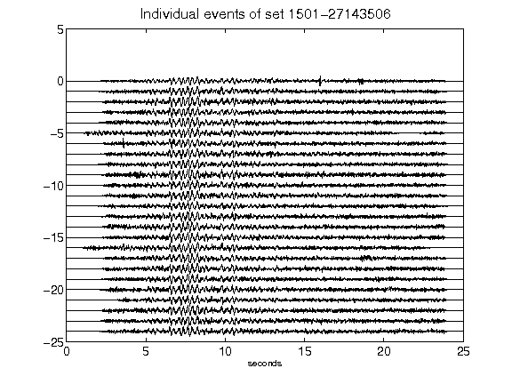](figures/1501-27143506_AllEv.png)