# Repeating Earthquake Activity at STAR

## Waveforms
[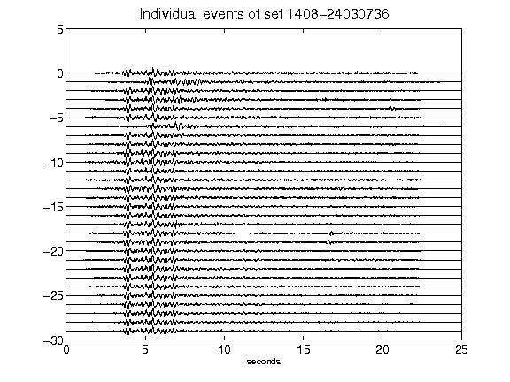](figures/1408-24030736_AllEv.png)[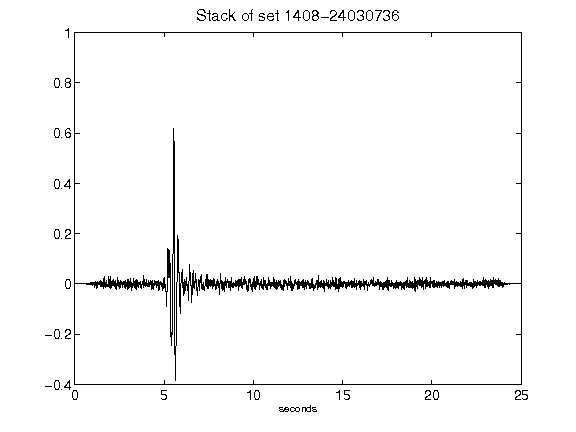](figures/1408-24030736_Stack.png)[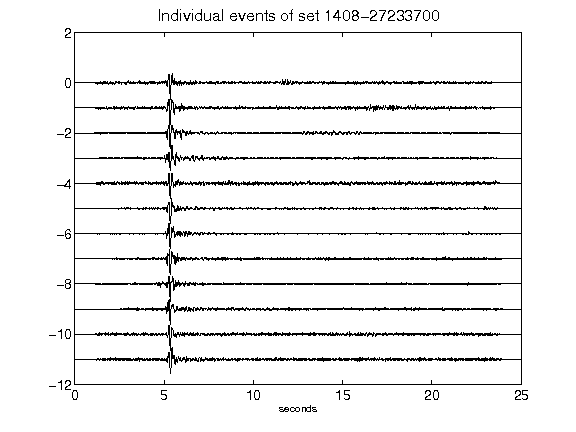](figures/1408-27233700_AllEv.png)[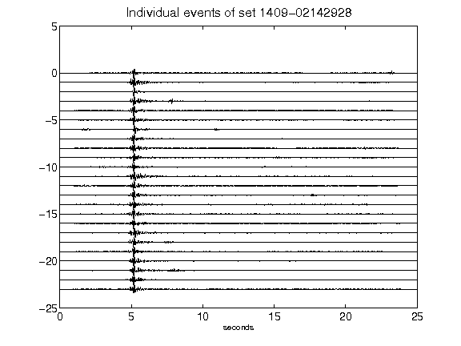](figures/1409-02142928_AllEv.png)[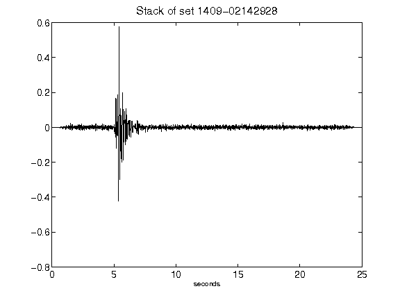](figures/1409-02142928_Stack.png)[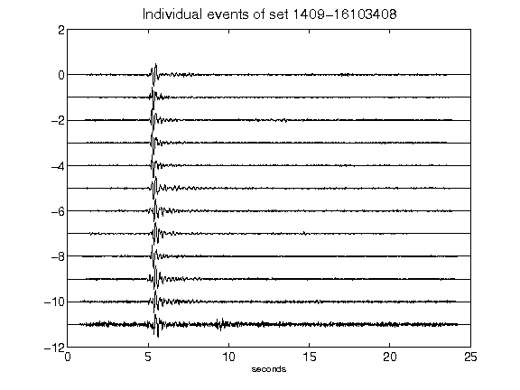](figures/1409-16103408_AllEv.png)[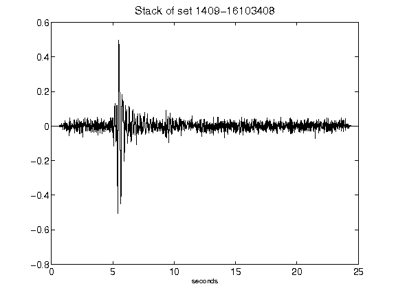](figures/1409-16103408_Stack.png)[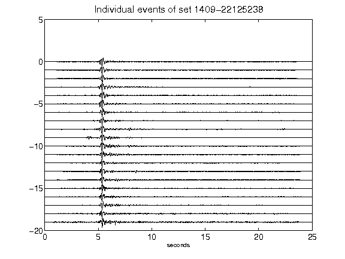](figures/1409-22125238_AllEv.png)[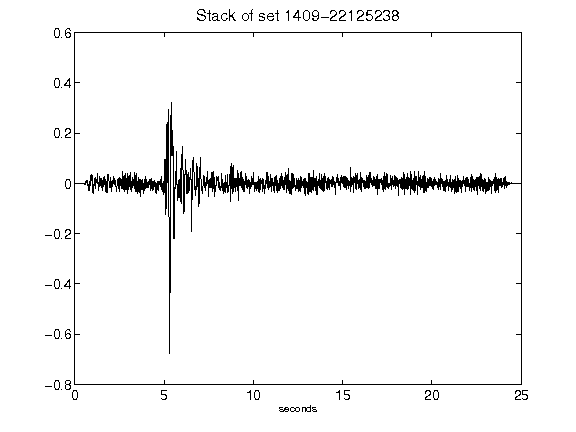](figures/1409-22125238_Stack.png)[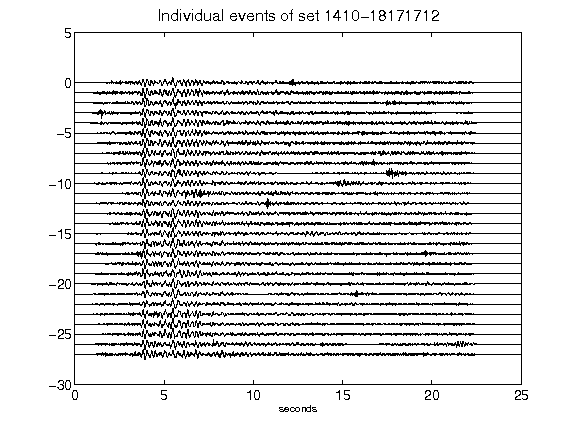](figures/1410-18171712_AllEv.png)[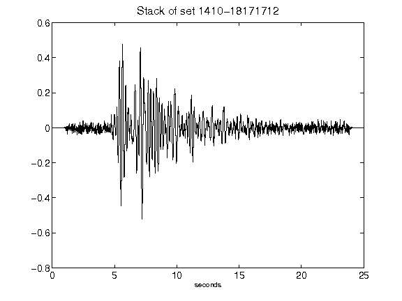](figures/1410-18171712_Stack.png)[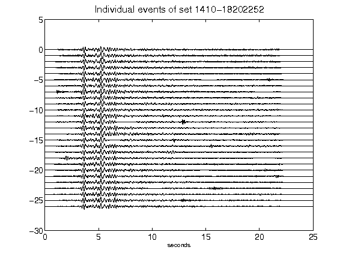](figures/1410-18202252_AllEv.png)[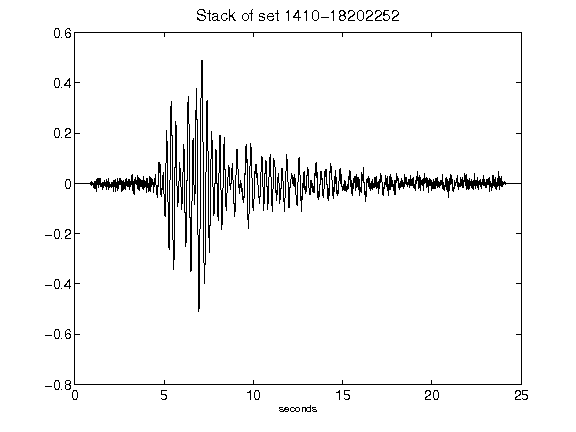](figures/1410-18202252_Stack.png)[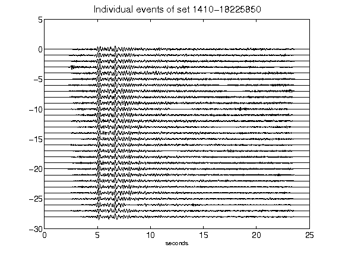](figures/1410-18225850_AllEv.png)[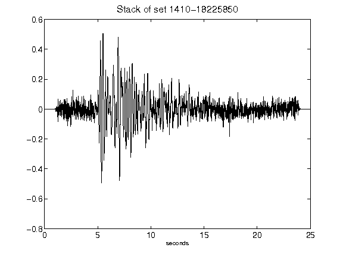](figures/1410-18225850_Stack.png)[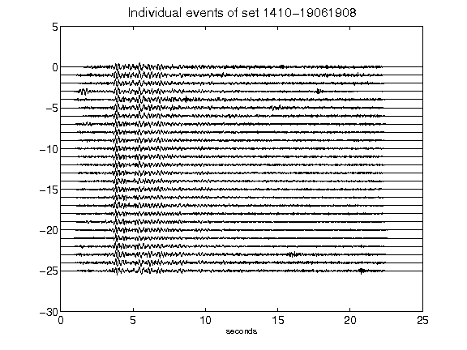](figures/1410-19061908_AllEv.png)[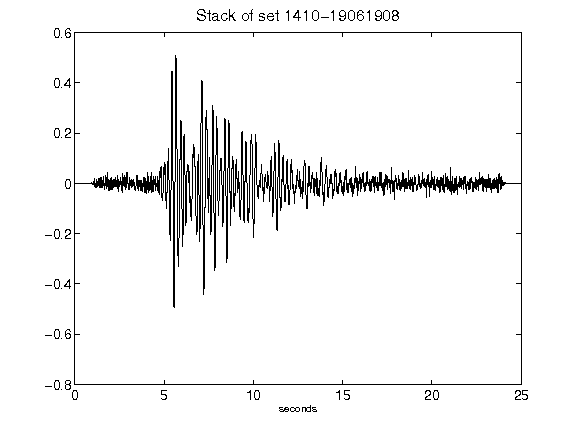](figures/1410-19061908_Stack.png)[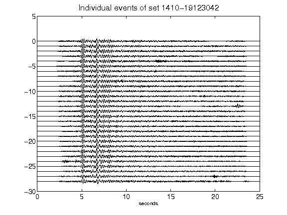](figures/1410-19123042_AllEv.png)[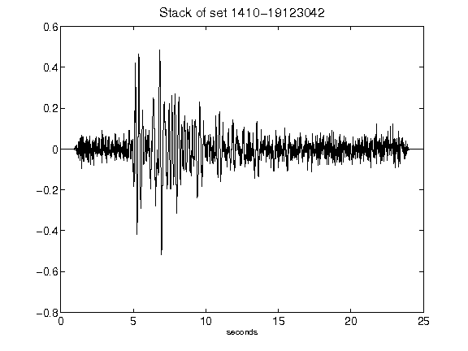](figures/1410-19123042_Stack.png)[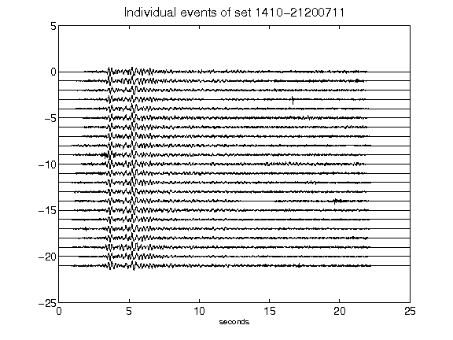](figures/1410-21200711_AllEv.png)[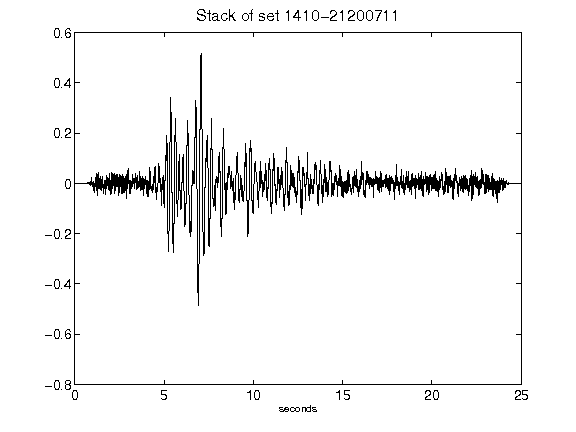](figures/1410-21200711_Stack.png)[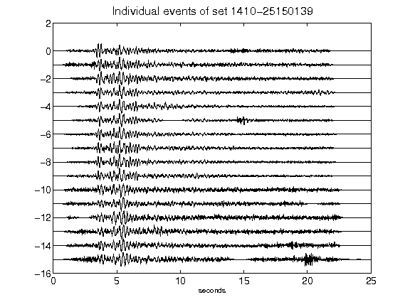](figures/1410-25150139_AllEv.png)[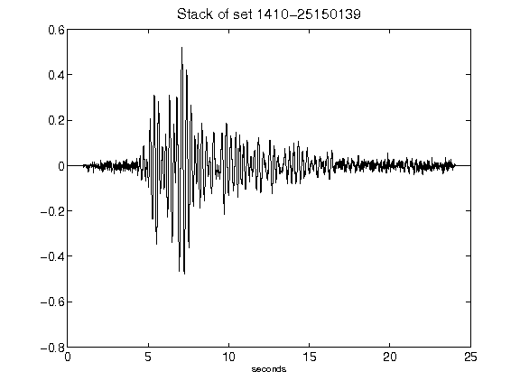](figures/1410-25150139_Stack.png)[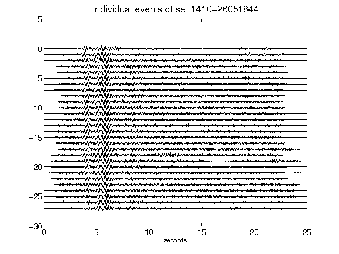](figures/1410-26051844_AllEv.png)[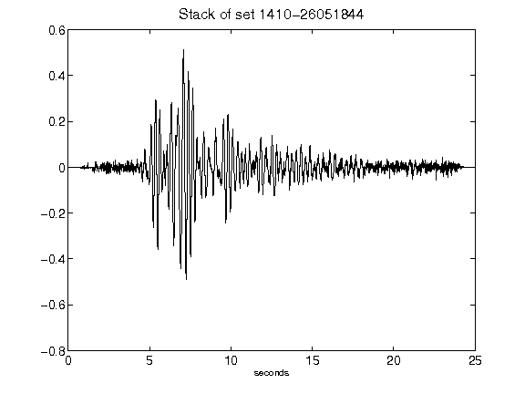](figures/1410-26051844_Stack.png)[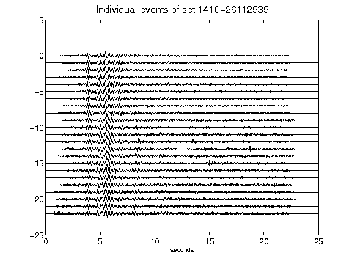](figures/1410-26112535_AllEv.png)[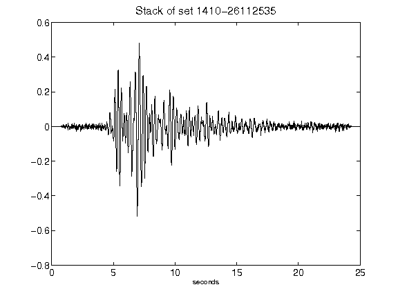](figures/1410-26112535_Stack.png)[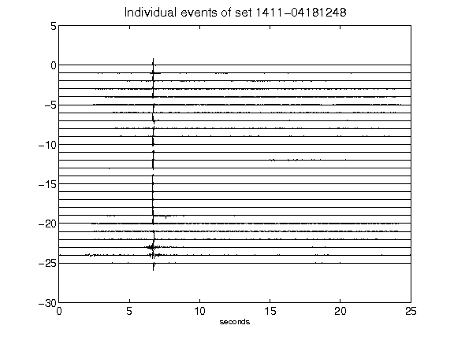](figures/1411-04181248_AllEv.png)[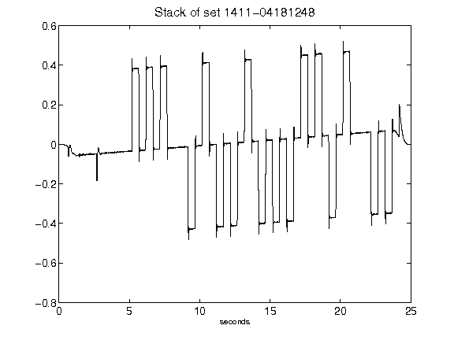](figures/1411-04181248_Stack.png)[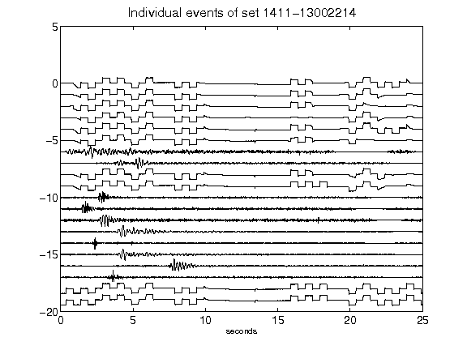](figures/1411-13002214_AllEv.png)[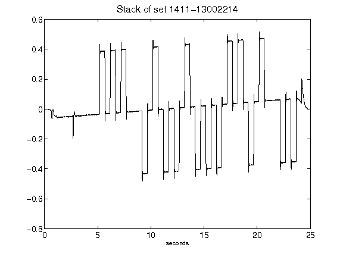](figures/1411-13002214_Stack.png)[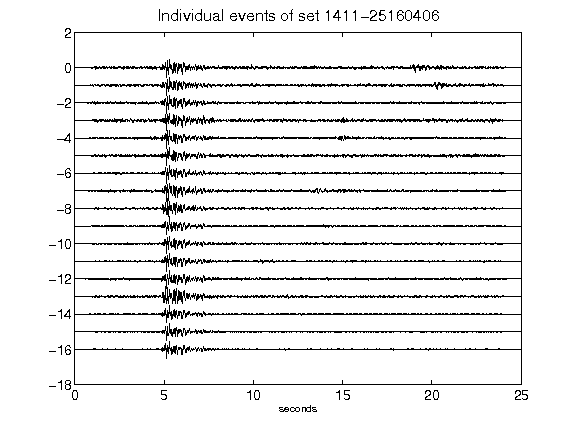](figures/1411-25160406_AllEv.png)[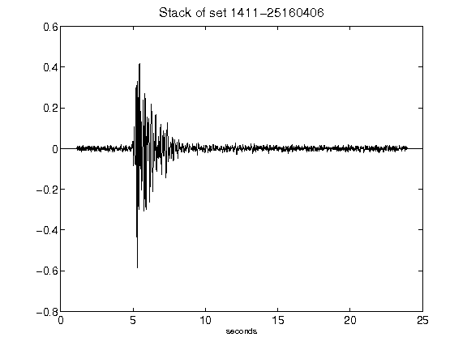](figures/1411-25160406_Stack.png)