# Repeating Earthquake Activity at STAR

## Waveforms
[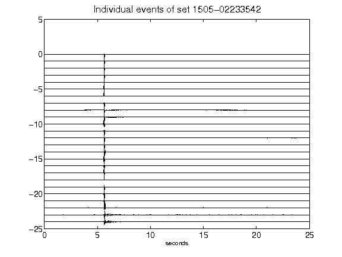](figures/1505-02233542_AllEv.png)[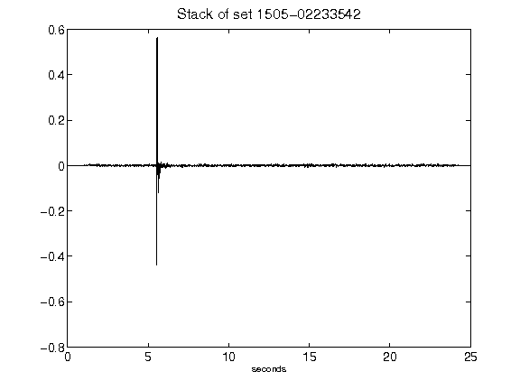](figures/1505-02233542_Stack.png)[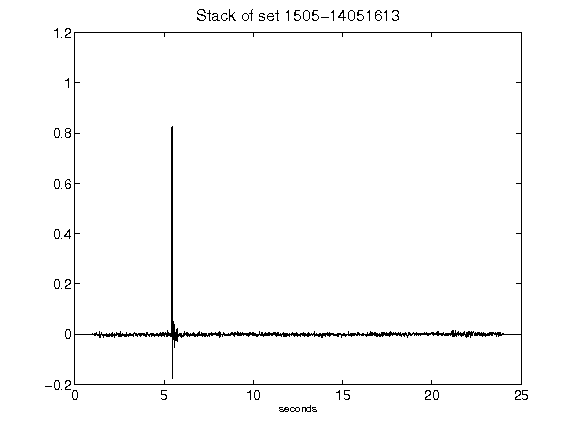](figures/1505-14051613_Stack.png)[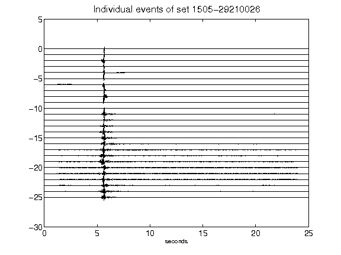](figures/1505-29210026_AllEv.png)[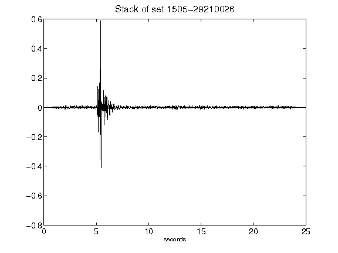](figures/1505-29210026_Stack.png)[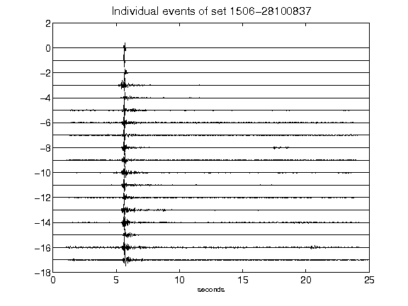](figures/1506-28100837_AllEv.png)[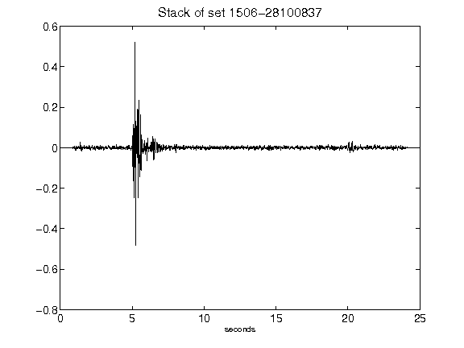](figures/1506-28100837_Stack.png)[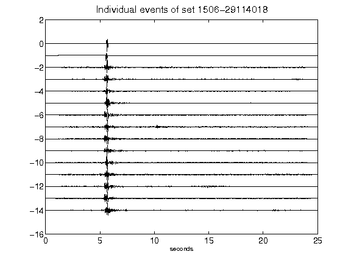](figures/1506-29114018_AllEv.png)[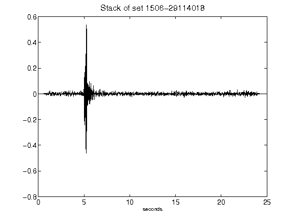](figures/1506-29114018_Stack.png)[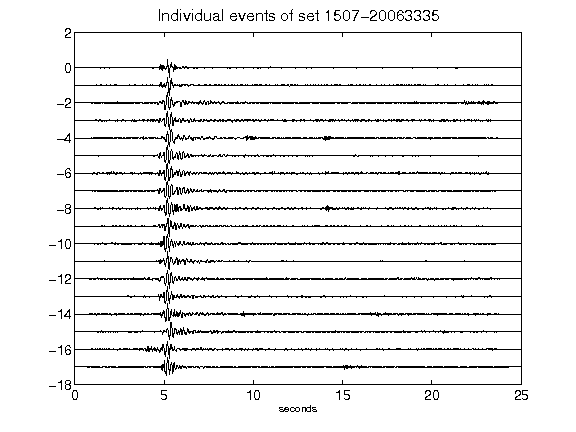](figures/1507-20063335_AllEv.png)[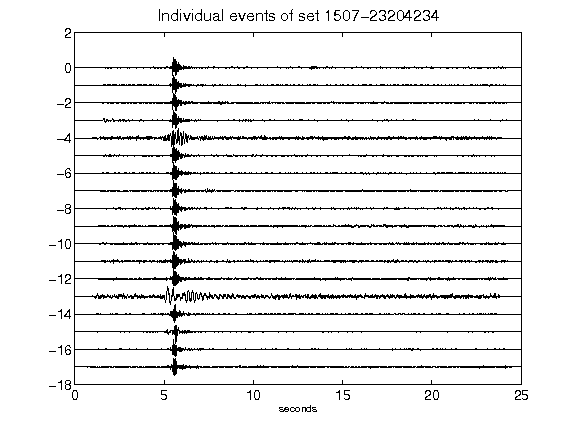](figures/1507-23204234_AllEv.png)