# Repeating Earthquake Activity at STAR

## Waveforms
[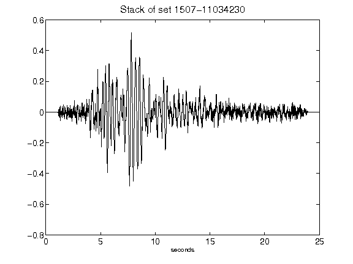](figures/1507-11034230_Stack.png)[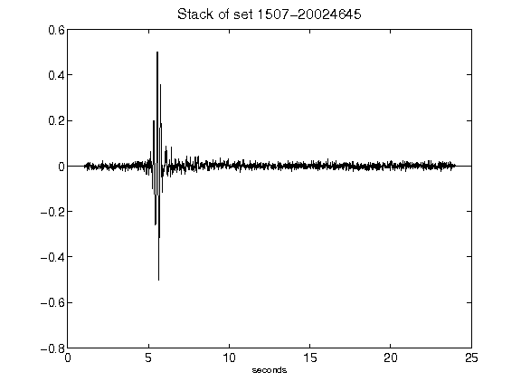](figures/1507-20024645_Stack.png)[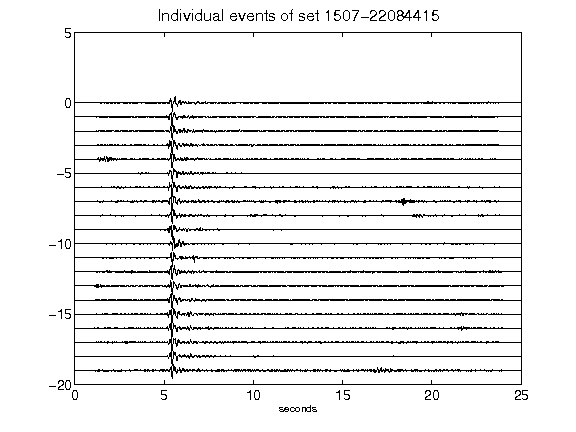](figures/1507-22084415_AllEv.png)[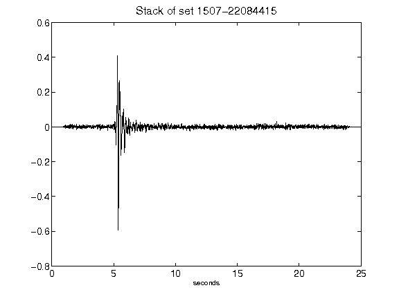](figures/1507-22084415_Stack.png)[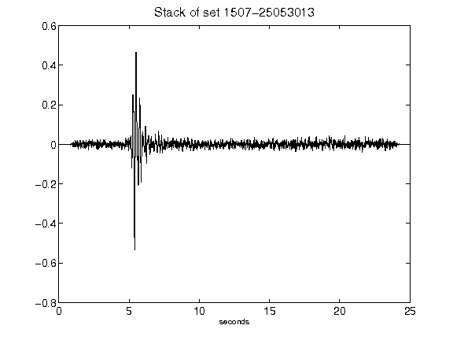](figures/1507-25053013_Stack.png)[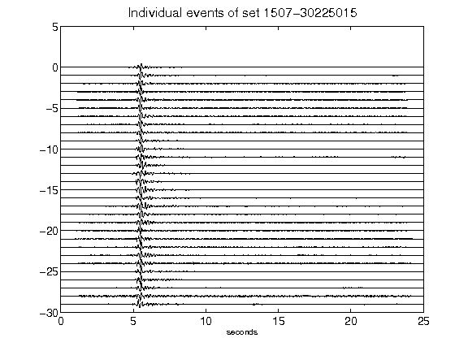](figures/1507-30225015_AllEv.png)[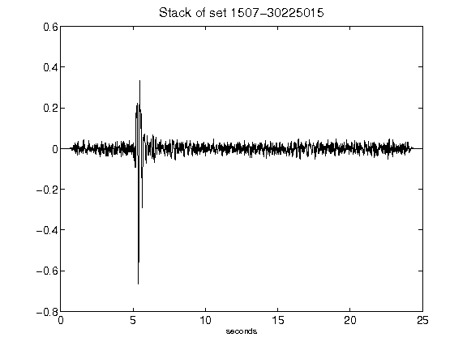](figures/1507-30225015_Stack.png)[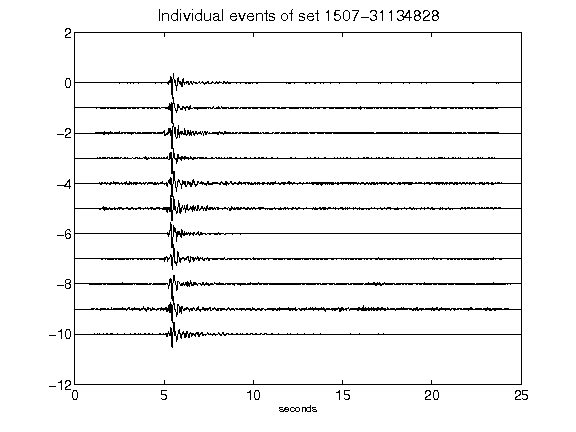](figures/1507-31134828_AllEv.png)[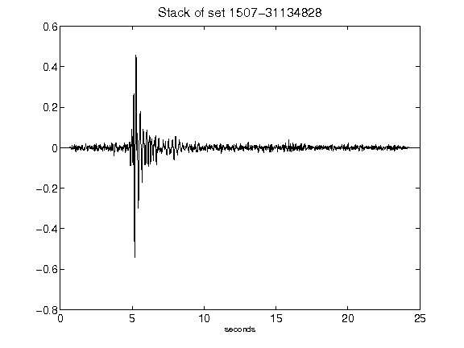](figures/1507-31134828_Stack.png)[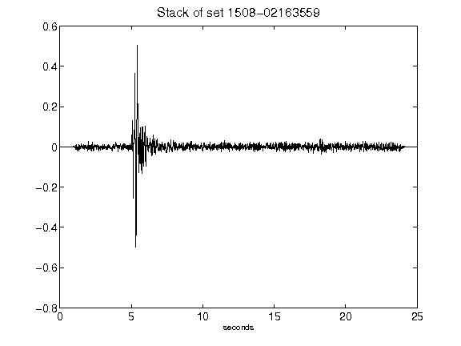](figures/1508-02163559_Stack.png)[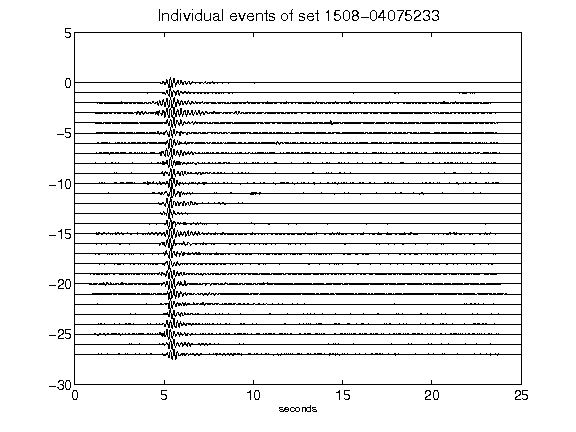](figures/1508-04075233_AllEv.png)[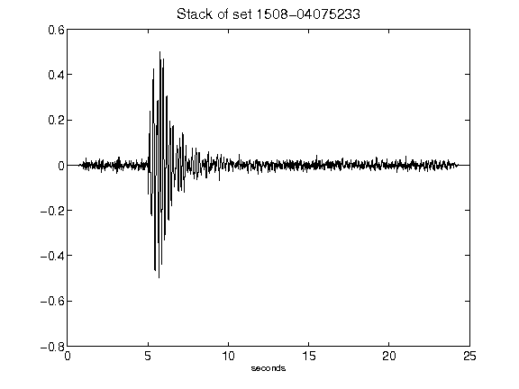](figures/1508-04075233_Stack.png)[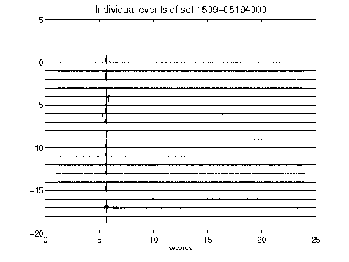](figures/1509-05194000_AllEv.png)[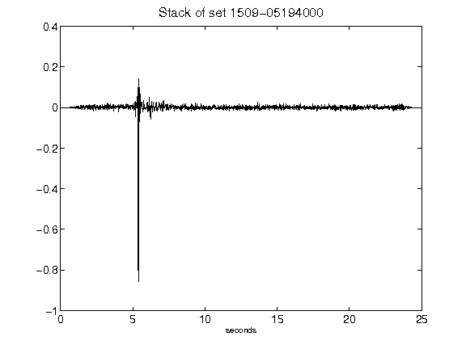](figures/1509-05194000_Stack.png)[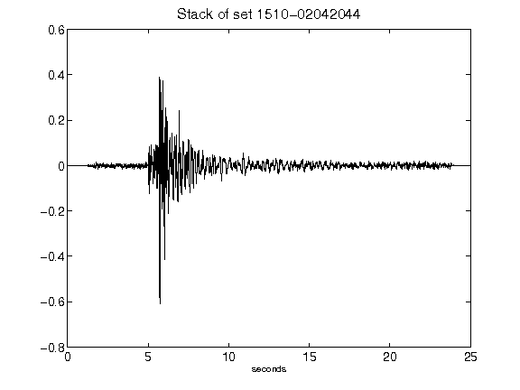](figures/1510-02042044_Stack.png)